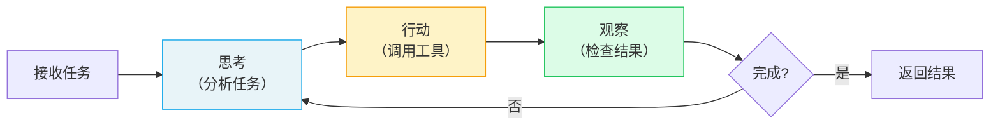

# 🔥 Agents 智能体

> Agent 是 CrewAI 的**核心执行单元**——一个具有角色、目标和背景故事的自主 AI 实体，能够使用工具、记忆和推理来完成任务。

## 1. Agent 是什么

### 1.1 核心概念

每个 Agent 就像公司里的一个**专业员工**——有明确的角色定位、工作目标和专业背景。

| 核心属性 | 作用 | 前端类比 |
|----------|------|----------|
| `role` | 角色定义（如"高级研究员"） | React 组件名（`<SearchBar />`） |
| `goal` | 工作目标（指导决策方向） | 组件的 `purpose` prop |
| `backstory` | 背景故事（塑造行为风格） | 组件的默认配置和主题 |

> **前端类比**：Agent 类似一个 React 组件——有自己的 props（配置）、state（记忆）、methods（工具），以及明确的职责边界。不同的组件组合在一起构成完整的页面，不同的 Agent 组合在一起构成完整的 Crew。
>
> **CrewAI 原生语义**：Agent 在底层使用 ReAct（Reasoning + Acting）循环——先思考该做什么，再调用工具执行，然后观察结果决定下一步。

## 2. Agent 完整属性表

| 属性 | 类型 | 默认值 | 说明 |
|------|------|--------|------|
| `role` | `str` | **必填** | 角色定义 |
| `goal` | `str` | **必填** | 工作目标 |
| `backstory` | `str` | **必填** | 背景故事 |
| `llm` | `str \| LLM` | `"gpt-4"` | 使用的语言模型 |
| `tools` | `List[BaseTool]` | `[]` | 可用工具列表 |
| `verbose` | `bool` | `False` | 详细日志 |
| `memory` | `bool` | `False` | 启用记忆 |
| `allow_delegation` | `bool` | `False` | 允许委托任务给其他 Agent |
| `max_iter` | `int` | `20` | 最大迭代次数 |
| `max_rpm` | `int \| None` | `None` | 每分钟最大请求数 |
| `max_execution_time` | `int \| None` | `None` | 最大执行时间（秒） |
| `reasoning` | `bool` | `False` | 启用推理能力 |
| `knowledge_sources` | `List` | `None` | 知识源列表 |
| `cache` | `bool` | `True` | 启用工具缓存 |
| `max_retry_limit` | `int` | `2` | 错误重试次数 |
| `allow_code_execution` | `bool` | `False` | 允许执行代码 |
| `multimodal` | `bool` | `False` | 多模态支持 |

## 3. 定义方式

### 3.1 YAML 配置（推荐）

```yaml
# config/agents.yaml
researcher:
  role: >
    {topic} 高级研究员
  goal: >
    搜集关于 {topic} 的最新、最准确的信息
  backstory: >
    你是一位经验丰富的研究员，擅长从海量信息中筛选出最有价值的内容。
    你注重数据的准确性和来源的可靠性。

analyst:
  role: >
    {topic} 数据分析师
  goal: >
    分析研究数据并提炼关键洞察
  backstory: >
    你是一位严谨的数据分析师，善于发现数据背后的规律，
    能将复杂数据转化为可执行的建议。
```

在 `crew.py` 中加载：

```python
from crewai import Agent
from crewai.project import CrewBase, agent

@CrewBase
class ResearchCrew:
    agents_config = 'config/agents.yaml'

    @agent
    def researcher(self) -> Agent:
        return Agent(
            config=self.agents_config['researcher'],
            verbose=True,
            tools=[SerperDevTool()]  # 代码中补充工具
        )

    @agent
    def analyst(self) -> Agent:
        return Agent(
            config=self.agents_config['analyst'],
            verbose=True
        )
```

> `{topic}` 是变量占位符，在 `kickoff(inputs={"topic": "AI"})` 时替换。

### 3.2 代码直接定义

```python
from crewai import Agent

researcher = Agent(
    role="高级研究员",
    goal="搜集关于 AI Agent 的最新资料",
    backstory="你是一位资深 AI 技术研究员，擅长发现前沿趋势。",
    llm="openai/gpt-4o",
    tools=[SerperDevTool()],
    verbose=True,
    memory=True,
    max_iter=15,
    allow_delegation=False
)
```

### 3.3 如何选择

| 场景 | 推荐方式 |
|------|----------|
| 正式项目、多人协作 | YAML 配置 |
| 快速原型、实验 | 代码定义 |
| 需要动态创建 Agent | 代码定义 |
| 角色固定、只变输入 | YAML 配置 |

## 4. Agent 执行机制

Agent 内部使用 **ReAct 循环**执行任务：



每次迭代：
1. **思考**：分析当前状态，决定下一步行动
2. **行动**：调用工具或生成内容
3. **观察**：检查结果是否满足目标
4. 重复直到完成或达到 `max_iter` 上限

## 5. Agent 直接调用

Agent 不仅可以在 Crew 中使用，也支持独立调用：

```python
# 直接调用（不需要 Crew）
result = researcher.kickoff("搜集 AI Agent 最新趋势")
print(result.raw)

# 带结构化输出
from pydantic import BaseModel

class ResearchFindings(BaseModel):
    trends: list[str]
    summary: str

result = researcher.kickoff(
    "搜集 AI Agent 最新趋势",
    response_format=ResearchFindings
)
print(result.pydantic)  # ResearchFindings 对象
```

## 6. 自定义提示模板

```python
agent = Agent(
    role="分析师",
    goal="分析数据",
    backstory="资深数据分析师",
    system_template="你是一个 {role}，你的目标是 {goal}。请用中文回答。",
    prompt_template="基于以下信息完成任务：{task}",
    response_template="分析结果：{response}"
)
```

---

**先修**：[快速上手：第一个 Crew](/ai/crewai/guide/quickstart-crew)

**下一步**：
- [Tasks 任务](/ai/crewai/guide/tasks) — 了解如何定义和配置任务
- [Tools 工具系统](/ai/crewai/guide/tools) — 为 Agent 配备工具

**参考**：
- [🔗 CrewAI Agents (Official)](https://docs.crewai.com/en/concepts/agents){target="_blank" rel="noopener"}
