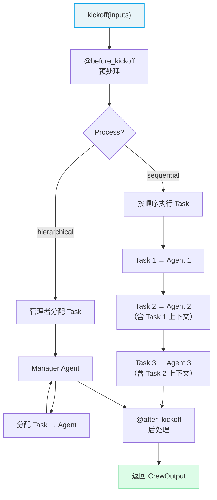

# 🔥 Crews 团队编排

> Crew 是 Agent 的**协作团队**——将多个 Agent 和 Task 组装在一起，定义执行流程，共同完成复杂任务。

## 1. Crew 核心属性

| 属性 | 类型 | 默认值 | 说明 |
|------|------|--------|------|
| `agents` | `List[Agent]` | **必填** | Agent 列表 |
| `tasks` | `List[Task]` | **必填** | Task 列表 |
| `process` | `Process` | `sequential` | 执行流程（顺序/层级） |
| `verbose` | `bool` | `False` | 详细日志 |
| `memory` | `bool` | `None` | 启用记忆系统 |
| `cache` | `bool` | `True` | 缓存工具结果 |
| `planning` | `bool` | `None` | 启用规划能力 |
| `planning_llm` | `str` | `None` | 规划专用 LLM |
| `manager_llm` | `str` | `None` | 层级流程管理者 LLM |
| `manager_agent` | `Agent` | `None` | 自定义管理者 Agent |
| `knowledge_sources` | `List` | `None` | 知识源 |
| `embedder` | `Dict` | `{"provider":"openai"}` | 嵌入模型配置 |
| `stream` | `bool` | `False` | 流式输出 |

## 2. 创建 Crew

### 2.1 基础方式

```python
from crewai import Agent, Task, Crew, Process

crew = Crew(
    agents=[researcher, analyst, writer],
    tasks=[research_task, analysis_task, writing_task],
    process=Process.sequential,
    verbose=True
)

result = crew.kickoff(inputs={"topic": "AI Agent"})
```

### 2.2 装饰器模式（推荐用于正式项目）

```python
from crewai import Agent, Crew, Task, Process
from crewai.project import CrewBase, agent, task, crew
from crewai.project import before_kickoff, after_kickoff

@CrewBase
class ResearchCrew:
    """研究分析团队"""
    agents_config = 'config/agents.yaml'
    tasks_config = 'config/tasks.yaml'

    @before_kickoff
    def prepare(self, inputs):
        """启动前预处理"""
        inputs['timestamp'] = '2025-01-01'
        return inputs

    @after_kickoff
    def process(self, output):
        """完成后后处理"""
        print(f"总 Token: {output.token_usage}")
        return output

    @agent
    def researcher(self) -> Agent:
        return Agent(
            config=self.agents_config['researcher'],
            verbose=True
        )

    @agent
    def analyst(self) -> Agent:
        return Agent(
            config=self.agents_config['analyst'],
            verbose=True
        )

    @task
    def research_task(self) -> Task:
        return Task(config=self.tasks_config['research_task'])

    @task
    def analysis_task(self) -> Task:
        return Task(config=self.tasks_config['analysis_task'])

    @crew
    def crew(self) -> Crew:
        return Crew(
            agents=self.agents,   # @agent 自动收集
            tasks=self.tasks,     # @task 自动收集
            process=Process.sequential,
            verbose=True
        )
```

> `@agent` 和 `@task` 装饰的方法会被自动收集到 `self.agents` 和 `self.tasks` 中。

## 3. Crew 执行流程



## 4. 输出处理

### 4.1 CrewOutput 属性

| 属性 | 类型 | 说明 |
|------|------|------|
| `raw` | `str` | 最终 Task 的原始文本输出 |
| `pydantic` | `BaseModel \| None` | 结构化对象（需最终 Task 配置） |
| `json_dict` | `dict \| None` | JSON 字典 |
| `tasks_output` | `List[TaskOutput]` | 每个 Task 的输出列表 |
| `token_usage` | `Dict` | Token 使用统计 |

```python
result = crew.kickoff(inputs={"topic": "AI"})

# 访问最终结果
print(result.raw)

# 访问每个任务的输出
for i, task_out in enumerate(result.tasks_output):
    print(f"任务 {i+1}: {task_out.raw[:100]}...")

# Token 统计
print(f"总 Token: {result.token_usage}")
```

### 4.2 流式输出

```python
crew = Crew(
    agents=[researcher],
    tasks=[research_task],
    stream=True  # 启用流式
)

streaming = crew.kickoff(inputs={"topic": "AI"})
for chunk in streaming:
    print(chunk.content, end="", flush=True)

# 获取最终结果
final_result = streaming.result
```

## 5. 启动方式

| 方法 | 类型 | 说明 |
|------|------|------|
| `kickoff()` | 同步 | 标准启动，阻塞等待结果 |
| `kickoff_for_each()` | 同步批量 | 对输入列表逐一执行 |
| `akickoff()` | 原生异步 | 全链路 async/await |
| `akickoff_for_each()` | 异步批量 | 列表输入原生异步 |

### 5.1 批量执行

```python
inputs = [
    {"topic": "AI Agent"},
    {"topic": "RAG 技术"},
    {"topic": "多模态 AI"}
]

results = crew.kickoff_for_each(inputs=inputs)
for result in results:
    print(result.raw[:100])
```

### 5.2 异步执行

```python
import asyncio

async def main():
    result = await crew.akickoff(inputs={"topic": "AI"})
    print(result.raw)

asyncio.run(main())
```

## 6. 启用高级功能

```python
crew = Crew(
    agents=[researcher, analyst],
    tasks=[research_task, analysis_task],
    process=Process.sequential,
    memory=True,         # 启用记忆
    planning=True,       # 启用规划
    planning_llm="openai/gpt-4o",  # 规划用 LLM
    verbose=True
)
```

---

**先修**：[Tasks 任务](/ai/crewai/guide/tasks)

**下一步**：
- [Flows 工作流](/ai/crewai/guide/flows) — 用 Flow 编排多个 Crew
- [Processes 执行流程](/ai/crewai/guide/processes) — 深入理解顺序与层级流程

**参考**：
- [🔗 CrewAI Crews (Official)](https://docs.crewai.com/en/concepts/crews){target="_blank" rel="noopener"}
