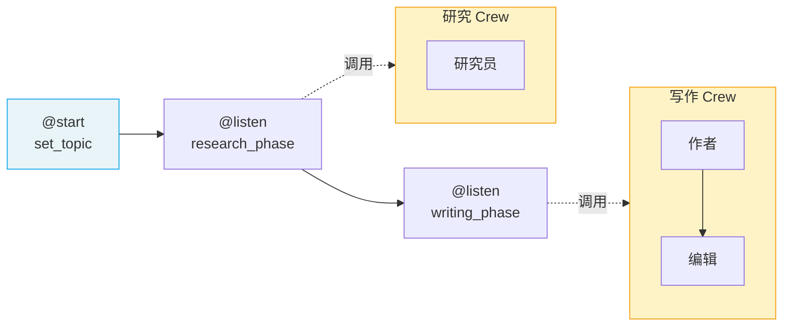

# ⭐ Flows 工作流

> Flow 是 CrewAI 的**事件驱动工作流编排系统**，在 Crew 之上提供结构化的流程控制、状态管理和条件路由。生产环境下推荐**始终从 Flow 开始**。

## 1. 为什么需要 Flow

| 没有 Flow | 有 Flow |
|-----------|---------|
| 手动管理多个 Crew 的调用顺序 | 装饰器自动编排执行顺序 |
| 状态在函数间手动传递 | Pydantic State 统一管理 |
| 条件分支靠 if/else 手写 | `@router` 声明式路由 |
| 难以持久化和恢复 | `@persist` 自动持久化 |

## 2. 核心装饰器

| 装饰器 | 作用 | 示例 |
|--------|------|------|
| `@start()` | 标记入口方法 | `@start()` |
| `@listen(method)` | 监听方法输出 | `@listen(begin)` |
| `@router(method)` | 条件路由 | `@router(check)` |
| `@persist` | 状态持久化 | 类级别或方法级别 |
| `@human_feedback(...)` | 人工反馈节点 | v1.8.0+ |

## 3. 状态管理

### 3.1 结构化 State（推荐）

```python
from crewai.flow.flow import Flow, listen, start
from pydantic import BaseModel

class ProjectState(BaseModel):
    topic: str = ""
    research: str = ""
    analysis: str = ""
    report: str = ""
    quality_score: int = 0

class ProjectFlow(Flow[ProjectState]):
    @start()
    def initialize(self):
        self.state.topic = "AI Agent 技术趋势"
        return self.state.topic

    @listen(initialize)
    def research(self, topic):
        self.state.research = f"关于 {topic} 的研究..."
        return self.state.research

    @listen(research)
    def analyze(self, data):
        self.state.analysis = f"分析结果: {data}"
        self.state.quality_score = 85
        return self.state.analysis
```

### 3.2 非结构化 State

```python
class QuickFlow(Flow):
    @start()
    def begin(self):
        self.state["items"] = []
        self.state["count"] = 0
```

> 正式项目始终使用结构化 State——获得类型安全、IDE 自动补全和 Pydantic 验证。

## 4. 控制流

### 4.1 条件路由 @router

```python
from crewai.flow.flow import Flow, listen, start, router

class QualityFlow(Flow[ProjectState]):
    @start()
    def generate(self):
        self.state.quality_score = 75
        return "内容已生成"

    @router(generate)
    def check_quality(self, _):
        if self.state.quality_score >= 80:
            return "publish"
        else:
            return "revise"

    @listen("publish")
    def publish(self, _):
        print("发布内容")

    @listen("revise")
    def revise(self, _):
        print("修改内容")
        self.state.quality_score += 15
```

### 4.2 并行控制

```python
from crewai.flow.flow import Flow, start, listen, or_, and_

class ParallelFlow(Flow):
    @start()
    def fetch_data(self):
        return "数据 A"

    @start()
    def fetch_config(self):
        return "配置 B"

    # 任一完成即触发（Promise.race）
    @listen(or_(fetch_data, fetch_config))
    def on_first(self, result):
        print(f"最先完成: {result}")

    # 全部完成后触发（Promise.all）
    @listen(and_(fetch_data, fetch_config))
    def on_all(self, results):
        print(f"全部完成: {results}")
```

## 5. 集成 Crew

```python
from crewai import Agent, Task, Crew, Process
from crewai.flow.flow import Flow, listen, start, router
from pydantic import BaseModel

class ContentState(BaseModel):
    topic: str = ""
    research: str = ""
    draft: str = ""
    final: str = ""

class ContentPipeline(Flow[ContentState]):
    @start()
    def set_topic(self):
        self.state.topic = "CrewAI 实战指南"
        return self.state.topic

    @listen(set_topic)
    def research_phase(self, topic):
        """研究阶段：使用 Crew 完成"""
        researcher = Agent(
            role="研究员", goal=f"研究 {topic}",
            backstory="资深技术研究员"
        )
        task = Task(
            description=f"全面研究 {topic}",
            expected_output="详细研究报告",
            agent=researcher
        )
        crew = Crew(agents=[researcher], tasks=[task])
        result = crew.kickoff()
        self.state.research = result.raw
        return result.raw

    @listen(research_phase)
    def writing_phase(self, research):
        """写作阶段：使用另一个 Crew"""
        writer = Agent(
            role="作者", goal="撰写技术文章",
            backstory="资深技术作者"
        )
        editor = Agent(
            role="编辑", goal="审校和润色文章",
            backstory="严谨的技术编辑"
        )
        write_task = Task(
            description=f"基于以下研究撰写文章:\n{research}",
            expected_output="技术文章草稿",
            agent=writer
        )
        edit_task = Task(
            description="审校润色文章",
            expected_output="最终版文章",
            agent=editor,
            context=[write_task]
        )
        crew = Crew(
            agents=[writer, editor],
            tasks=[write_task, edit_task],
            process=Process.sequential
        )
        result = crew.kickoff()
        self.state.final = result.raw
        return result.raw

# 运行
flow = ContentPipeline()
flow.kickoff()
```



## 6. 持久化

```python
from crewai.flow.flow import Flow, start, listen, persist

@persist  # 类级别：所有状态自动持久化到 SQLite
class DurableFlow(Flow[ProjectState]):
    @start()
    def step_one(self):
        self.state.topic = "持久化测试"
        return "step_one done"

    @listen(step_one)
    def step_two(self, _):
        # 即使进程中断，重启后可从 step_one 的状态恢复
        print(f"topic: {self.state.topic}")
```

## 7. Flow 内存

```python
class MemoryFlow(Flow):
    @start()
    def collect_info(self):
        # 存储记忆
        self.remember(
            "用户偏好中文回复",
            scope="user_preferences",
            importance=0.9
        )
        return "信息已收集"

    @listen(collect_info)
    def use_info(self, _):
        # 检索记忆
        memories = self.recall(
            "用户语言偏好",
            scope="user_preferences",
            limit=5
        )
        print(f"检索到: {memories}")
```

## 8. 可视化

```python
flow = ContentPipeline()
flow.plot()  # 生成 flow.html 可视化文件
```

---

**先修**：[Crews 团队编排](/ai/crewai/guide/crews)

**下一步**：
- [Processes 执行流程](/ai/crewai/guide/processes) — 顺序与层级流程详解
- [生产架构](/ai/crewai/guide/production-architecture) — Flow-First 生产最佳实践

**参考**：
- [🔗 CrewAI Flows (Official)](https://docs.crewai.com/en/concepts/flows){target="_blank" rel="noopener"}
