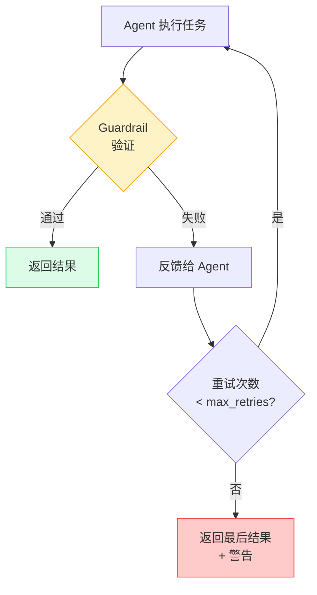

# Guardrails 任务守卫

> Guardrail 是 Task 的**输出质量验证机制**——在任务完成后自动检查输出是否符合要求，不合格则重试。

## 1. 为什么需要 Guardrails

LLM 输出天然具有不确定性。Guardrail 确保：
- 输出符合预期格式（字数、结构等）
- 内容质量达标（无幻觉、无敏感词等）
- 业务规则被遵守（价格范围、日期格式等）

> **前端类比**：Guardrail 类似表单验证（Form Validation）——用户提交前检查输入是否合规，不合规则阻止提交并提示修改。区别是 CrewAI 的 Guardrail 不仅拦截，还会**自动让 Agent 重试**。

## 2. Guardrail 类型

### 2.1 函数式 Guardrail

```python
from crewai import Task
from crewai.tasks.task_output import TaskOutput
from typing import Tuple, Any

def validate_length(result: TaskOutput) -> Tuple[bool, Any]:
    """验证输出不超过 500 字"""
    words = len(result.raw.split())
    if words > 500:
        return (False, f"输出 {words} 字，超过 500 字限制，请精简")
    return (True, result.raw)

def validate_format(result: TaskOutput) -> Tuple[bool, Any]:
    """验证输出包含必要的章节"""
    required = ["## 概述", "## 分析", "## 结论"]
    missing = [s for s in required if s not in result.raw]
    if missing:
        return (False, f"缺少必要章节: {missing}")
    return (True, result.raw)

task = Task(
    description="撰写分析报告",
    expected_output="结构化分析报告（500 字以内）",
    agent=analyst,
    guardrail=validate_length
)
```

**返回值规则**：
- `(True, result)` — 验证通过，返回（可修改的）结果
- `(False, feedback)` — 验证失败，返回反馈信息给 Agent 重试

### 2.2 LLM 式 Guardrail

用自然语言描述验证规则，CrewAI 自动用 LLM 评估：

```python
task = Task(
    description="撰写产品介绍",
    expected_output="吸引人的产品介绍",
    agent=writer,
    guardrail="内容必须 200 字以内，不能包含技术术语，语气要友好亲切"
)
```

### 2.3 混合多个 Guardrails

```python
task = Task(
    description="撰写技术博客",
    expected_output="高质量技术博客文章",
    agent=writer,
    guardrails=[
        validate_length,                    # 函数式：字数检查
        validate_format,                    # 函数式：格式检查
        "内容必须引人入胜且易于理解",          # LLM 式：质量检查
    ],
    guardrail_max_retries=3  # 最多重试 3 次
)
```

多个 Guardrails 按顺序执行，**任一失败**即触发重试。

## 3. 验证-重试循环



## 4. 实用 Guardrail 示例

### 4.1 JSON 格式验证

```python
import json

def validate_json(result: TaskOutput) -> Tuple[bool, Any]:
    """确保输出是合法 JSON"""
    try:
        json.loads(result.raw)
        return (True, result.raw)
    except json.JSONDecodeError as e:
        return (False, f"输出不是合法 JSON: {e}")
```

### 4.2 敏感词过滤

```python
BLOCKED_WORDS = ["机密", "内部", "保密"]

def filter_sensitive(result: TaskOutput) -> Tuple[bool, Any]:
    """过滤敏感词"""
    for word in BLOCKED_WORDS:
        if word in result.raw:
            return (False, f"输出包含敏感词 '{word}'，请移除")
    return (True, result.raw)
```

### 4.3 结合 Pydantic 验证

```python
from pydantic import BaseModel, validator

class Report(BaseModel):
    title: str
    sections: list[str]
    word_count: int

    @validator('word_count')
    def check_length(cls, v):
        if v > 1000:
            raise ValueError("报告超过 1000 字")
        return v

def validate_structure(result: TaskOutput) -> Tuple[bool, Any]:
    try:
        Report.model_validate_json(result.raw)
        return (True, result.raw)
    except Exception as e:
        return (False, f"输出结构不符合要求: {e}")
```

## 5. 最佳实践

- **函数式优先**：明确的规则用函数，模糊的质量评估用 LLM
- **合理设置重试**：`guardrail_max_retries=3` 通常足够
- **提供清晰反馈**：失败消息要具体，帮助 Agent 理解如何修正
- **避免过度验证**：太多 Guardrails 会显著增加 Token 消耗和执行时间

---

**先修**：[Tasks 任务](/ai/crewai/guide/tasks)

**下一步**：
- [生产架构](/ai/crewai/guide/production-architecture) — 在生产环境中使用 Guardrails
- [可观测性](/ai/crewai/guide/observability) — 监控 Guardrail 命中率

**参考**：
- [🔗 CrewAI Tasks - Guardrails (Official)](https://docs.crewai.com/en/concepts/tasks){target="_blank" rel="noopener"}
