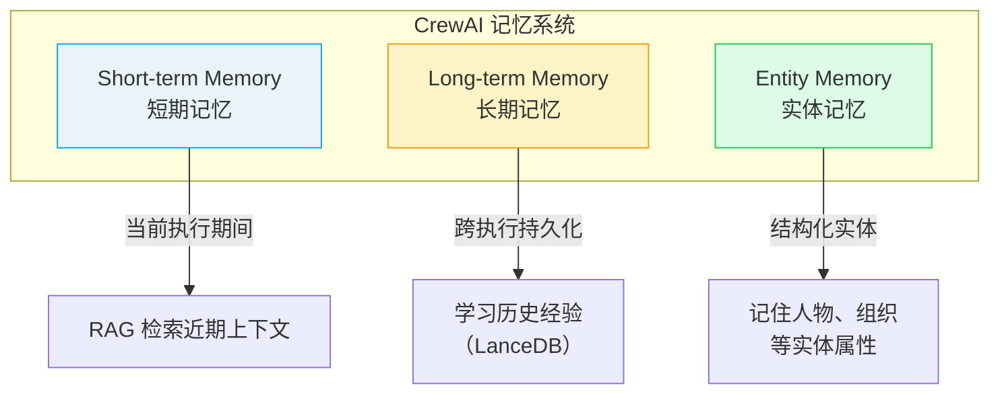

# ⭐ Memory 记忆系统

> Memory 让 Agent 能够**跨任务和跨执行保留信息**，从经验中学习，做出更连贯、更有上下文感的决策。

## 1. 三种记忆类型



| 类型 | 生命周期 | 存储 | 用途 |
|------|----------|------|------|
| **Short-term** | 当前执行 | 内存 | 跨任务共享近期上下文 |
| **Long-term** | 跨执行持久化 | LanceDB | 从历史经验中学习 |
| **Entity** | 跨执行持久化 | LanceDB | 结构化记忆（人物、概念等） |

> **前端类比**：Short-term Memory 类似 `sessionStorage`（页面关闭即消失）；Long-term Memory 类似 `localStorage`（跨会话持久化）；Entity Memory 类似 IndexedDB（结构化存储，可按实体查询）。
>
> **CrewAI 原生语义**：记忆系统基于向量嵌入（Embeddings）实现语义检索，Agent 在执行任务时会自动从记忆中检索相关信息，注入到上下文中增强决策。

## 2. Crew 级别记忆

### 2.1 基础启用

```python
from crewai import Crew

crew = Crew(
    agents=[researcher, analyst],
    tasks=[research_task, analysis_task],
    memory=True,  # 启用所有记忆类型
    verbose=True
)
```

### 2.2 自定义 Embedder

```python
crew = Crew(
    agents=[researcher, analyst],
    tasks=[research_task, analysis_task],
    memory=True,
    embedder={
        "provider": "openai",
        "config": {
            "model": "text-embedding-3-small"
            # API key 自动从环境变量加载
        }
    }
)
```

支持的 Embedder 提供商：

| 提供商 | provider | 配置 |
|--------|----------|------|
| OpenAI | `"openai"` | `model: "text-embedding-3-small"` |
| Google | `"google"` | `model: "models/text-embedding-004"` |
| Cohere | `"cohere"` | `model: "embed-english-v3.0"` |
| Ollama | `"ollama"` | `model: "nomic-embed-text"`, `url: "http://localhost:11434"` |

### 2.3 使用 Google / Ollama Embedder 示例

```python
# Google
crew = Crew(
    memory=True,
    embedder={
        "provider": "google",
        "config": {
            "model": "models/text-embedding-004"
        }
    }
)

# Ollama（本地）
crew = Crew(
    memory=True,
    embedder={
        "provider": "ollama",
        "config": {
            "model": "nomic-embed-text",
            "url": "http://localhost:11434"
        }
    }
)
```

## 3. Flow 级别记忆

Flow 提供了更便捷的记忆 API：

```python
from crewai.flow.flow import Flow, start, listen

class SmartFlow(Flow):
    @start()
    def collect_preferences(self):
        # 存储记忆
        self.remember(
            "用户偏好使用中文回复",
            scope="user_preferences",
            categories=["language"],
            importance=0.9
        )

        self.remember(
            "用户对 AI Agent 技术感兴趣",
            scope="user_interests",
            categories=["tech"],
            importance=0.8
        )
        return "偏好已记录"

    @listen(collect_preferences)
    def use_preferences(self, _):
        # 检索记忆
        prefs = self.recall(
            "用户的语言偏好是什么？",
            scope="user_preferences",
            limit=3
        )
        print(f"检索到的偏好: {prefs}")

        # 提取记忆：将长文本拆解为独立记忆片段
        long_text = "用户是前端开发者，使用 React 和 TypeScript，对 Python AI 工具链感兴趣。"
        memories = self.extract_memories(long_text)
        for mem in memories:
            self.remember(mem, scope="user_profile")
```

### 3.1 Flow 记忆 API

| 方法 | 参数 | 说明 |
|------|------|------|
| `self.remember(content, **kwargs)` | `scope`, `categories`, `metadata`, `importance` | 存储记忆 |
| `self.recall(query, **kwargs)` | `scope`, `categories`, `limit`, `depth` | 语义检索记忆 |
| `self.extract_memories(content)` | — | 将文本拆解为离散记忆语句 |

## 4. 记忆的工作原理

1. **任务执行时**：Agent 完成任务后，CrewAI 自动将执行上下文存储到短期记忆
2. **下个任务开始时**：Agent 从短期记忆中检索相关信息，注入上下文
3. **Crew 执行结束后**：关键信息被持久化到长期记忆
4. **下次执行时**：Agent 能从长期记忆中检索历史经验

## 5. 最佳实践

- **原型阶段**：`memory=True` 即可，使用默认 OpenAI embedder
- **生产环境**：指定 embedder provider 和模型，确保一致性
- **本地开发**：使用 Ollama embedder 避免 API 成本
- **敏感数据**：注意记忆会持久化到磁盘，需考虑数据安全

---

**先修**：[Crews 团队编排](/ai/crewai/guide/crews) | [Flows 工作流](/ai/crewai/guide/flows)

**下一步**：
- [Knowledge 知识库](/ai/crewai/guide/knowledge) — 为 Agent 注入领域知识
- [Collaboration 协作与委托](/ai/crewai/guide/collaboration) — Agent 间的协作机制

**参考**：
- [🔗 CrewAI Memory (Official)](https://docs.crewai.com/en/concepts/memory){target="_blank" rel="noopener"}
