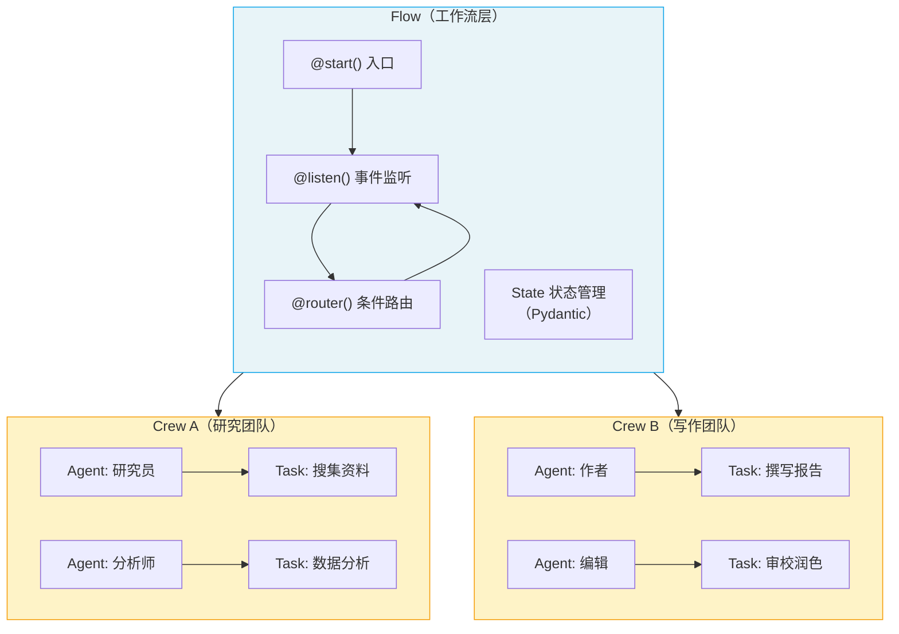

# ⭐ CrewAI 概览

> CrewAI 是一个**领先的开源多 AI Agent 编排框架**，让你可以像组建一支真实团队一样，让多个 AI Agent 分工协作、共同完成复杂任务。

## 1. CrewAI 是什么

### 1.1 一句话定义

CrewAI 是一个 Python 框架，让你定义**多个专业化 AI Agent**，为它们分配**任务**，然后组成**团队（Crew）** 协同工作——就像一家公司里不同角色的员工各司其职、协作完成项目。

### 1.2 核心架构：Flow + Crew

CrewAI 的生产级架构由两个支柱组成：



| 层级 | 角色 | 职责 |
|------|------|------|
| **Flow** | "经理" | 定义整体流程、管理状态、控制数据流转、条件路由 |
| **Crew** | "团队" | 由多个 Agent 组成，负责具体的工作单元 |

> **前端类比**：Flow 类似 Express.js 的中间件管道（定义请求处理流程、路由分发），Crew 类似一组微服务（各自独立完成专项工作后汇总结果）。
>
> **CrewAI 原生语义**：Flow 是事件驱动的工作流编排层，通过装饰器（`@start`、`@listen`、`@router`）定义执行拓扑；Crew 是 Agent 协作的执行单元，通过 Process（顺序/层级）定义 Agent 间的任务调度方式。

### 1.3 与其他框架的定位对比

| 维度 | LangChain | LangGraph | CrewAI | Instructor |
|------|-----------|-----------|--------|------------|
| **抽象层级** | 高层组件库 | 低层图编排 | 高层团队编排 | 结构化输出 |
| **核心关注** | 模型调用、工具链、RAG | 状态图、中断恢复、持久化 | 多 Agent 协作、工作流 | Pydantic 提取、验证 |
| **编排模式** | Chain / Agent | 有向图 + 状态机 | Crew（团队） + Flow（工作流） | 单次调用 |
| **适用场景** | 快速原型、工具链 | 复杂状态流、生产控制 | 多角色协作、业务流程 | 结构化数据提取 |
| **学习曲线** | 中等 | 较高 | 较低 | 低 |

> CrewAI 的独特价值在于**"团队隐喻"**——你不需要思考图的节点和边，而是定义角色、任务和团队，框架自动完成编排。

## 2. 核心概念速览

| 概念 | 说明 | 前端类比 |
|------|------|----------|
| **Agent** | 具有角色（role）、目标（goal）、背景故事（backstory）的自主实体 | React 组件（各自有 props 和行为） |
| **Task** | Agent 需完成的具体工作，有描述和期望输出 | 组件的 render 任务 |
| **Crew** | Agent 的协作团队，定义执行流程 | 组件树（父组件编排子组件） |
| **Flow** | 事件驱动的工作流编排 | Express 中间件管道 |
| **Process** | Crew 内的任务调度方式（顺序/层级） | 路由策略（按顺序 vs 负载均衡） |
| **Tool** | Agent 可调用的外部能力（搜索、文件读写等） | API 接口 / SDK |

## 3. 最小可运行示例

```python
from crewai import Agent, Task, Crew, Process

# 1. 定义 Agent（角色）
researcher = Agent(
    role="研究员",
    goal="搜集关于 AI Agent 的最新资料",
    backstory="你是一位资深的 AI 技术研究员，擅长发现前沿趋势。"
)

writer = Agent(
    role="技术作者",
    goal="将研究成果整理成清晰易懂的文章",
    backstory="你是一位经验丰富的技术写作者，擅长把复杂概念讲简单。"
)

# 2. 定义 Task（任务）
research_task = Task(
    description="搜集 2024-2025 年 AI Agent 领域的 5 个关键趋势",
    expected_output="包含 5 个趋势的详细报告，每个趋势附带来源",
    agent=researcher
)

writing_task = Task(
    description="基于研究报告撰写一篇 500 字的技术博客",
    expected_output="一篇结构清晰、面向开发者的技术博客文章",
    agent=writer,
    context=[research_task]  # 接收研究任务的输出作为上下文
)

# 3. 组装 Crew（团队）并执行
crew = Crew(
    agents=[researcher, writer],
    tasks=[research_task, writing_task],
    process=Process.sequential,  # 顺序执行
    verbose=True
)

result = crew.kickoff()
print(result.raw)
```

上面这个例子展示了 CrewAI 的核心模式：**定义角色 → 分配任务 → 组建团队 → 启动执行**。

## 4. 什么时候该用 CrewAI

| 场景 | 是否推荐 | 原因 |
|------|----------|------|
| 多角色协作（研究 → 分析 → 写作） | ✅ 强烈推荐 | CrewAI 的核心优势 |
| 复杂业务流程（审批、多步骤处理） | ✅ 推荐 | Flow 提供完整的工作流支持 |
| 简单的单次问答 | ❌ 不推荐 | 直接调用 LLM 即可 |
| 需要精细的图状态控制 | ⚠️ 视情况 | 考虑 LangGraph |
| 仅需结构化输出提取 | ❌ 不推荐 | 考虑 Instructor |

---

**先修**：无（本页是入门第一站）

**下一步**：
- [安装与环境配置](/ai/crewai/guide/install) — 搭建开发环境
- [快速上手：第一个 Crew](/ai/crewai/guide/quickstart-crew) — 动手创建你的第一个团队

**参考**：
- [🔗 CrewAI Introduction (Official)](https://docs.crewai.com/en/introduction){target="_blank" rel="noopener"}
