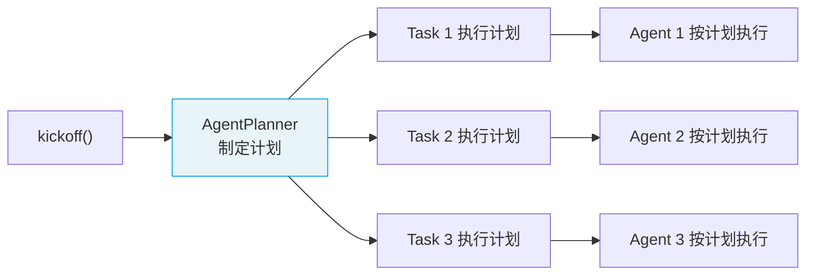
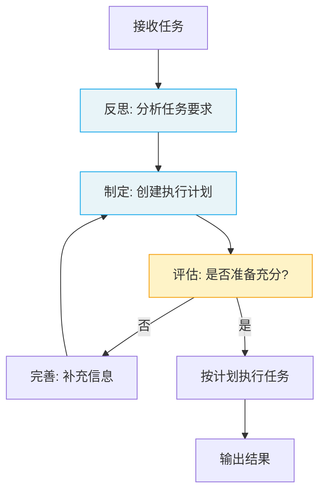

# Planning & Reasoning 规划与推理

> Planning 让 Crew 在执行前**制定详细计划**；Reasoning 让 Agent 在执行任务时**深度思考和反复推敲**。

## 1. Planning 规划

### 1.1 什么是 Planning

启用 Planning 后，Crew 在执行任何 Task 之前，会先用一个专门的 **AgentPlanner** 为每个任务制定详细的执行计划。

```python
from crewai import Crew, Process

crew = Crew(
    agents=[researcher, analyst, writer],
    tasks=[research_task, analysis_task, writing_task],
    process=Process.sequential,
    planning=True,                    # 启用规划
    planning_llm="openai/gpt-4o"     # 规划专用 LLM
)
```

### 1.2 Planning 工作流程



AgentPlanner 会分析：
- 每个 Task 的描述和期望输出
- Agent 的能力和工具
- 任务间的依赖关系

然后为每个任务生成详细的步骤清单。

### 1.3 何时使用 Planning

| 场景 | 是否启用 |
|------|----------|
| 任务复杂、多步骤 | ✅ 启用 |
| 简单直接的任务 | ❌ 不需要（增加成本） |
| 需要可预测的执行 | ✅ 启用 |
| 实验性快速原型 | ❌ 不需要 |

## 2. Reasoning 推理

### 2.1 什么是 Reasoning

启用 Reasoning 后，Agent 在执行每个任务前会进入**深度推理模式**：

1. **反思任务**：分析任务要求和上下文
2. **制定计划**：创建详细的执行步骤
3. **评估准备**：判断是否具备完成任务的条件
4. **迭代完善**：反复推敲直到计划满意
5. **注入执行**：将推理计划注入任务描述

```python
from crewai import Agent

deep_thinker = Agent(
    role="战略分析师",
    goal="提供深度、全面的战略分析",
    backstory="你是一位思维缜密的战略分析师",
    reasoning=True,                  # 启用推理
    max_reasoning_attempts=3         # 最多推理 3 轮
)
```

### 2.2 Reasoning 工作流程



### 2.3 注意事项

- Reasoning 会**增加 Token 消耗**（每个任务多出 1-3 轮 LLM 调用）
- 适合**复杂决策类任务**，不适合简单执行类任务
- `max_reasoning_attempts` 控制最大推理轮数，防止无限循环

## 3. Planning vs Reasoning

| 维度 | Planning | Reasoning |
|------|----------|-----------|
| **作用层级** | Crew 层面 | Agent 层面 |
| **触发时机** | Crew 启动前 | 每个任务执行前 |
| **规划对象** | 所有任务的执行顺序 | 单个任务的执行步骤 |
| **配置方式** | `Crew(planning=True)` | `Agent(reasoning=True)` |
| **Token 成本** | 中等（一次性） | 较高（每个任务） |

### 3.1 组合使用

```python
# Crew 级别规划 + Agent 级别推理 = 最深度的思考
crew = Crew(
    agents=[
        Agent(role="分析师", ..., reasoning=True),
        Agent(role="研究员", ..., reasoning=False),  # 简单任务不需要
    ],
    tasks=[analysis_task, research_task],
    planning=True,
    planning_llm="openai/gpt-4o"
)
```

---

**先修**：[Crews 团队编排](/ai/crewai/guide/crews) | [Agents 智能体](/ai/crewai/guide/agents)

**下一步**：
- [Guardrails 任务守卫](/ai/crewai/guide/guardrails) — 验证输出质量
- [生产架构](/ai/crewai/guide/production-architecture) — 生产最佳实践

**参考**：
- [🔗 CrewAI Planning (Official)](https://docs.crewai.com/en/concepts/planning){target="_blank" rel="noopener"}
- [🔗 CrewAI Reasoning (Official)](https://docs.crewai.com/en/concepts/reasoning){target="_blank" rel="noopener"}
