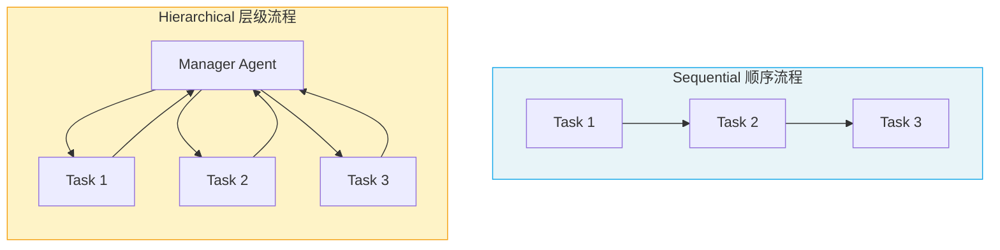

# Processes 执行流程

> Process 定义了 Crew 内部 **Task 的调度方式**——是按顺序逐个执行，还是由管理者动态分配。

## 1. 两种执行流程



| 维度 | Sequential 顺序 | Hierarchical 层级 |
|------|-----------------|-------------------|
| **执行方式** | 按 tasks 列表顺序依次执行 | Manager Agent 动态分配 |
| **上下文传递** | 前一个 Task 输出自动传给下一个 | Manager 汇总后分发 |
| **灵活度** | 固定顺序 | 动态调度 |
| **适用场景** | 流程明确的管道式任务 | 需要动态决策的复杂任务 |
| **配置复杂度** | 低 | 中（需配置 Manager） |

> **前端类比**：Sequential 类似 Express 中间件链（`app.use(a).use(b).use(c)` 按顺序执行）；Hierarchical 类似微服务的 API Gateway（网关根据请求内容分发到不同服务）。

## 2. Sequential 顺序流程

```python
from crewai import Crew, Process

crew = Crew(
    agents=[researcher, analyst, writer],
    tasks=[research_task, analysis_task, writing_task],
    process=Process.sequential  # 默认值
)

result = crew.kickoff(inputs={"topic": "AI"})
```

执行顺序：`research_task` → `analysis_task` → `writing_task`

**关键行为**：
- Task 按列表顺序依次执行
- 每个 Task 的输出**自动作为下一个 Task 的上下文**
- 如果 Task 指定了 `context`，会额外包含指定任务的输出

## 3. Hierarchical 层级流程

```python
crew = Crew(
    agents=[researcher, analyst, writer],
    tasks=[research_task, analysis_task, writing_task],
    process=Process.hierarchical,
    manager_llm="openai/gpt-4o"  # 使用 LLM 自动生成 Manager
)

result = crew.kickoff(inputs={"topic": "AI"})
```

**Manager Agent** 会：
1. 分析所有待执行的 Task
2. 决定分配给哪个 Agent
3. 审查执行结果
4. 必要时重新分配或要求修改

### 3.1 自定义 Manager Agent

```python
from crewai import Agent

manager = Agent(
    role="项目经理",
    goal="高效协调团队完成任务，确保输出质量",
    backstory="你是一位经验丰富的项目经理，擅长任务分配和质量把控。",
    allow_delegation=True
)

crew = Crew(
    agents=[researcher, analyst, writer],
    tasks=[research_task, analysis_task, writing_task],
    process=Process.hierarchical,
    manager_agent=manager  # 使用自定义 Manager
)
```

## 4. 如何选择

| 场景 | 推荐 |
|------|------|
| 任务有明确的先后顺序（研究→分析→报告） | Sequential |
| 任务可并行、需动态调度 | Hierarchical |
| 需要质量把控和审查 | Hierarchical |
| 简单的多步骤管道 | Sequential |
| 任务间依赖关系复杂 | Hierarchical |

## 5. 启用记忆增强

```python
crew = Crew(
    agents=[researcher, analyst],
    tasks=[research_task, analysis_task],
    process=Process.sequential,
    memory=True,  # 启用记忆，Agent 跨任务保留上下文
    verbose=True
)
```

---

**先修**：[Crews 团队编排](/ai/crewai/guide/crews)

**下一步**：
- [Tools 工具系统](/ai/crewai/guide/tools) — 为 Agent 配备工具
- [Collaboration 协作与委托](/ai/crewai/guide/collaboration) — 层级流程中的委托机制

**参考**：
- [🔗 CrewAI Processes (Official)](https://docs.crewai.com/en/concepts/processes){target="_blank" rel="noopener"}
