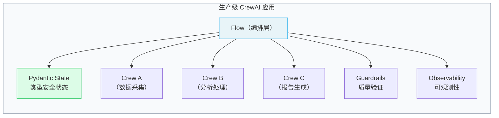

# ⭐ 生产架构最佳实践

> 从原型到生产，CrewAI 推荐 **Flow-First** 架构——始终从 Flow 开始，Crew 作为其中的工作单元。

## 1. Flow-First 架构



### 1.1 核心原则

| 原则 | 说明 |
|------|------|
| **始终从 Flow 开始** | Flow 提供状态管理、错误处理和可观测性 |
| **Pydantic State** | 用 BaseModel 定义状态，获得类型安全 |
| **Crew 作为工作单元** | 每个 Crew 专注于一个目标 |
| **结构化输出** | 使用 `output_pydantic` 确保数据格式 |
| **Guardrails 把关** | 关键任务配置质量验证 |

### 1.2 生产级 Flow 示例

```python
from crewai import Agent, Task, Crew, Process
from crewai.flow.flow import Flow, listen, start, router
from pydantic import BaseModel
from typing import Optional

class PipelineState(BaseModel):
    query: str = ""
    research_data: str = ""
    analysis: str = ""
    report: str = ""
    quality_score: int = 0
    error: Optional[str] = None

class ProductionPipeline(Flow[PipelineState]):

    @start()
    def receive_query(self):
        # 生产环境：从 API/消息队列接收输入
        self.state.query = "分析 2025 年 AI Agent 市场"
        return self.state.query

    @listen(receive_query)
    def research_phase(self, query):
        try:
            crew = self._build_research_crew()
            result = crew.kickoff(inputs={"topic": query})
            self.state.research_data = result.raw
        except Exception as e:
            self.state.error = f"研究阶段失败: {e}"
        return self.state.research_data

    @router(research_phase)
    def check_research(self, _):
        if self.state.error:
            return "error"
        return "continue"

    @listen("continue")
    def analysis_phase(self, _):
        crew = self._build_analysis_crew()
        result = crew.kickoff(
            inputs={"data": self.state.research_data}
        )
        self.state.analysis = result.raw
        self.state.quality_score = 85
        return self.state.analysis

    @listen("error")
    def handle_error(self, _):
        print(f"错误: {self.state.error}")
        # 发送告警、记录日志等

    def _build_research_crew(self) -> Crew:
        """构建研究 Crew"""
        researcher = Agent(
            role="研究员", goal="深度研究",
            backstory="资深研究员", llm="openai/gpt-4o"
        )
        task = Task(
            description=f"研究 {self.state.query}",
            expected_output="详细研究报告",
            agent=researcher
        )
        return Crew(agents=[researcher], tasks=[task])

    def _build_analysis_crew(self) -> Crew:
        """构建分析 Crew"""
        analyst = Agent(
            role="分析师", goal="数据分析",
            backstory="资深分析师", llm="openai/gpt-4o"
        )
        task = Task(
            description="分析研究数据",
            expected_output="分析报告",
            agent=analyst
        )
        return Crew(agents=[analyst], tasks=[task])
```

## 2. 错误处理策略

```python
class RobustFlow(Flow[PipelineState]):
    @start()
    def step_one(self):
        try:
            # 业务逻辑
            return "success"
        except Exception as e:
            self.state.error = str(e)
            return "error"

    @router(step_one)
    def route(self, result):
        if result == "error":
            return "retry"
        return "next"

    @listen("retry")
    def retry_step(self, _):
        # 重试逻辑、降级策略
        pass
```

## 3. 异步执行

```python
import asyncio

async def main():
    flow = ProductionPipeline()
    result = await flow.akickoff()  # 异步启动
    print(result)

asyncio.run(main())
```

## 4. 持久化与恢复

```python
from crewai.flow.flow import Flow, persist

@persist  # 自动持久化状态到 SQLite
class DurablePipeline(Flow[PipelineState]):
    @start()
    def step_one(self):
        self.state.query = "测试查询"
        return "done"

    # 进程中断后重启，会从最近的状态恢复
```

## 5. 部署建议

| 方案 | 适用场景 |
|------|----------|
| **FastAPI + CrewAI** | API 服务，异步处理 |
| **Celery + CrewAI** | 后台任务队列 |
| **CrewAI Enterprise** | 企业级托管（官方云服务） |

```python
# FastAPI 集成示例
from fastapi import FastAPI
import asyncio

app = FastAPI()

@app.post("/analyze")
async def analyze(topic: str):
    flow = ProductionPipeline()
    flow.state.query = topic
    await flow.akickoff()
    return {"report": flow.state.report}
```

---

**先修**：[Flows 工作流](/ai/crewai/guide/flows) | [Guardrails 任务守卫](/ai/crewai/guide/guardrails)

**下一步**：
- [MCP 集成](/ai/crewai/guide/mcp-integration) — 通过 MCP 扩展工具
- [可观测性](/ai/crewai/guide/observability) — 监控和调试

**参考**：
- [🔗 CrewAI Production Architecture (Official)](https://docs.crewai.com/en/concepts/production-architecture){target="_blank" rel="noopener"}
