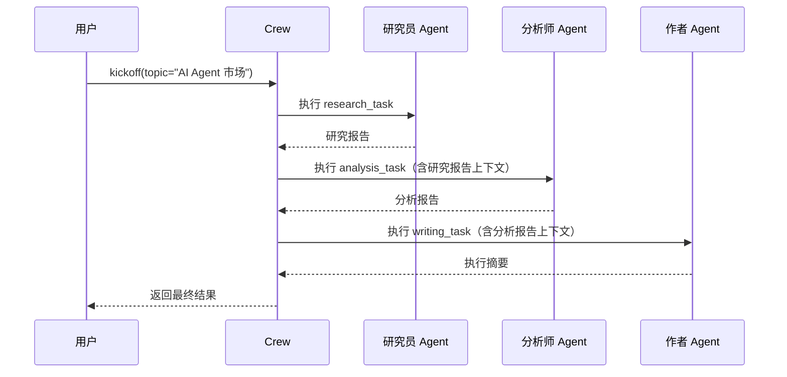

# ⭐ 快速上手：第一个 Crew

> 本页将带你用 CrewAI 创建一个由"研究员 + 分析师 + 作者"组成的三人团队，完成一次完整的研究报告任务。

## 1. 两种定义方式

CrewAI 支持两种方式定义 Agent 和 Task：

| 方式 | 特点 | 适用场景 |
|------|------|----------|
| **YAML 配置**（推荐） | 声明式、可复用、易维护 | 正式项目 |
| **代码直接定义** | 灵活、动态、适合快速实验 | 原型验证 |

本页以**代码方式**为主演示，YAML 方式见 [CLI 与项目管理](/ai/crewai/guide/cli)。

## 2. 完整示例：研究报告 Crew

### 2.1 定义 Agent

```python
from crewai import Agent, Task, Crew, Process

# 研究员：负责搜集资料
researcher = Agent(
    role="高级研究员",
    goal="搜集关于 {topic} 的全面准确的信息",
    backstory=(
        "你是一位经验丰富的研究员，擅长从海量信息中"
        "筛选出最有价值的内容。你注重数据准确性和来源可靠性。"
    ),
    verbose=True  # 输出详细执行日志
)

# 分析师：负责数据分析
analyst = Agent(
    role="数据分析师",
    goal="分析研究数据并提炼出关键洞察",
    backstory=(
        "你是一位严谨的分析师，善于发现数据背后的规律"
        "和趋势，能将复杂数据转化为可执行的建议。"
    ),
    verbose=True
)

# 作者：负责撰写报告
writer = Agent(
    role="技术作者",
    goal="将分析结果整理成结构清晰、通俗易懂的报告",
    backstory=(
        "你是一位资深技术写作者，擅长把复杂的技术概念"
        "用简洁明了的语言呈现给目标读者。"
    ),
    verbose=True
)
```

每个 Agent 的三大核心属性：

| 属性 | 作用 | 前端类比 |
|------|------|----------|
| `role` | 角色定义，影响 Agent 的行为模式 | 组件的 `displayName` |
| `goal` | 目标，指导 Agent 的决策方向 | 组件的 `props` 意图 |
| `backstory` | 背景故事，塑造 Agent 的专业性和行为风格 | 组件的默认配置 |

> `{topic}` 是一个**输入变量**，在 `kickoff()` 时传入。

### 2.2 定义 Task

```python
# 研究任务
research_task = Task(
    description=(
        "对 {topic} 进行全面研究，包括：\n"
        "1. 当前市场规模和增长趋势\n"
        "2. 主要参与者和竞争格局\n"
        "3. 技术发展方向\n"
        "4. 潜在风险和挑战"
    ),
    expected_output="一份包含以上四个维度的详细研究报告",
    agent=researcher
)

# 分析任务（依赖研究任务的输出）
analysis_task = Task(
    description=(
        "基于研究报告，分析以下内容：\n"
        "1. 识别 3 个最有前景的机会\n"
        "2. 评估每个机会的风险等级\n"
        "3. 给出优先级排序建议"
    ),
    expected_output="包含 3 个机会分析的结构化报告，含风险评估和优先级",
    agent=analyst,
    context=[research_task]  # 接收研究任务的输出
)

# 写作任务（依赖分析任务的输出）
writing_task = Task(
    description=(
        "基于分析报告，撰写一篇面向技术决策者的执行摘要，"
        "要求简洁、有数据支撑、包含明确的行动建议。"
    ),
    expected_output="一篇 500 字以内的执行摘要，含关键数据和行动建议",
    agent=writer,
    context=[analysis_task]  # 接收分析任务的输出
)
```

关键点：
- `context` 参数建立了**任务间的依赖关系**——前一个任务的输出会作为下一个任务的上下文输入
- `expected_output` 明确了期望产出格式，这能有效提升 Agent 的输出质量

> **前端类比**：`context` 类似 React 中的 `useContext()` 或 props 传递——上游组件的计算结果传递给下游组件消费。

### 2.3 组装 Crew 并执行

```python
# 组装团队
crew = Crew(
    agents=[researcher, analyst, writer],
    tasks=[research_task, analysis_task, writing_task],
    process=Process.sequential,  # 顺序执行：研究 → 分析 → 写作
    verbose=True
)

# 启动执行，传入输入变量
result = crew.kickoff(inputs={"topic": "2025 年 AI Agent 市场"})

# 获取结果
print(result.raw)           # 原始文本输出
print(result.token_usage)   # Token 消耗统计
```

### 2.4 执行流程



## 3. 理解输出

`crew.kickoff()` 返回一个 `CrewOutput` 对象：

```python
result = crew.kickoff(inputs={"topic": "AI Agent"})

# 三种访问方式
print(result.raw)            # 原始字符串
print(result.json_dict)      # 如果指定了 JSON 输出
print(result.pydantic)       # 如果指定了 Pydantic 模型

# 任务级别输出
for task_output in result.tasks_output:
    print(task_output.raw)
```

## 4. 使用结构化输出

通过 Pydantic 模型定义输出格式，确保类型安全：

```python
from pydantic import BaseModel
from typing import List

class OpportunityAnalysis(BaseModel):
    opportunity: str
    risk_level: str
    priority: int
    rationale: str

class AnalysisReport(BaseModel):
    opportunities: List[OpportunityAnalysis]
    summary: str

# 在 Task 中指定结构化输出
analysis_task = Task(
    description="分析研究数据并识别 3 个关键机会",
    expected_output="结构化的机会分析报告",
    agent=analyst,
    context=[research_task],
    output_pydantic=AnalysisReport  # 指定输出模型
)
```

> **前端类比**：`output_pydantic` 类似 TypeScript 的接口定义——确保返回数据符合预期结构，在编译时（运行前）就能捕获类型错误。

## 5. 常见问题

**Q: Agent 的 `verbose=True` 有什么作用？**
A: 开启后会在终端输出 Agent 的思考过程、工具调用和中间结果，方便调试。生产环境建议关闭。

**Q: 任务执行顺序由什么决定？**
A: 在 `Process.sequential` 模式下，由 `tasks` 列表的顺序决定。如果使用 `Process.hierarchical`，则由管理者 Agent 动态分配。

**Q: 如何让 Agent 使用外部工具？**
A: 在创建 Agent 时传入 `tools` 参数，详见 [Tools 工具系统](/ai/crewai/guide/tools)。

---

**先修**：[安装与环境配置](/ai/crewai/guide/install)

**下一步**：
- [快速上手：第一个 Flow](/ai/crewai/guide/quickstart-flow) — 学习工作流编排
- [Agents 智能体](/ai/crewai/guide/agents) — 深入理解 Agent 配置

**参考**：
- [🔗 CrewAI Quickstart (Official)](https://docs.crewai.com/en/quickstart){target="_blank" rel="noopener"}
- [🔗 CrewAI First Crew Guide (Official)](https://docs.crewai.com/en/guides/crews/first-crew){target="_blank" rel="noopener"}
