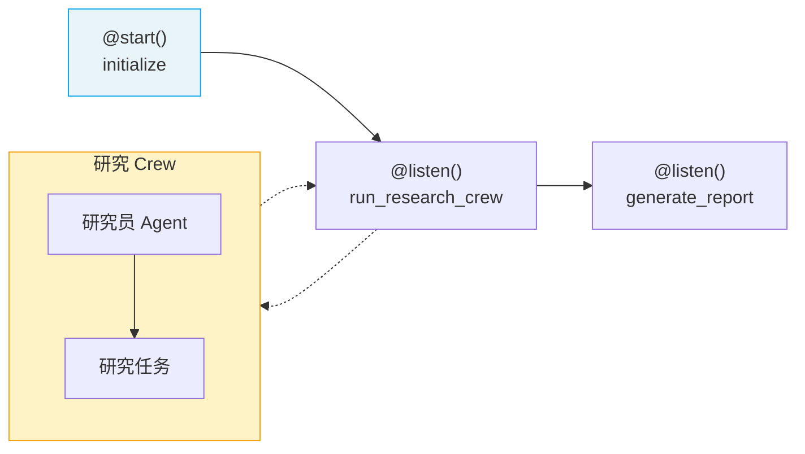

# ⭐ 快速上手：第一个 Flow

> Flow 是 CrewAI 的**事件驱动工作流编排系统**，用于控制多个步骤之间的数据流转和执行顺序。本页带你从零构建一个包含状态管理和 Crew 集成的完整 Flow。

## 1. Flow 是什么

如果说 Crew 是"一支工作团队"，那 Flow 就是"项目经理"——它决定**先做什么、后做什么、在什么条件下走哪条路径**。

| 对比 | Crew | Flow |
|------|------|------|
| 职责 | 执行具体任务 | 编排整体流程 |
| 粒度 | 一组 Agent 协作 | 多个步骤/Crew 串联 |
| 控制 | Agent 间的任务调度 | 步骤间的数据流和条件路由 |

> **前端类比**：Flow 类似 Express.js 的中间件链——每个中间件处理请求后传递给下一个，可以有条件分支（路由），还有全局状态（`req` 对象）。
>
> **CrewAI 原生语义**：Flow 通过 Python 装饰器（`@start`、`@listen`、`@router`）构建执行拓扑，状态通过 Pydantic BaseModel 管理，支持事件驱动的异步执行。

## 2. 核心装饰器

| 装饰器 | 作用 | 触发时机 |
|--------|------|----------|
| `@start()` | 标记 Flow 入口方法 | Flow 启动时自动执行 |
| `@listen(method)` | 监听某方法的输出 | 被监听的方法执行完后触发 |
| `@router(method)` | 条件路由 | 根据返回值分支到不同方法 |

## 3. 最小 Flow 示例

```python
from crewai.flow.flow import Flow, listen, start

class SimpleFlow(Flow):
    @start()
    def begin(self):
        print("Flow 开始")
        return "Hello from start"

    @listen(begin)
    def process(self, data):
        print(f"收到数据: {data}")
        return f"处理完成: {data}"

    @listen(process)
    def finish(self, data):
        print(f"最终结果: {data}")

# 运行 Flow
flow = SimpleFlow()
flow.kickoff()
```

输出：
```
Flow 开始
收到数据: Hello from start
处理完成: Hello from start
最终结果: 处理完成: Hello from start
```

## 4. 使用 State 管理状态

### 4.1 结构化 State（推荐）

```python
from crewai.flow.flow import Flow, listen, start
from pydantic import BaseModel

class ArticleState(BaseModel):
    topic: str = ""
    research: str = ""
    outline: list[str] = []
    draft: str = ""
    final: str = ""

class ArticleFlow(Flow[ArticleState]):
    @start()
    def set_topic(self):
        self.state.topic = "AI Agent 技术趋势"
        return self.state.topic

    @listen(set_topic)
    def do_research(self, topic):
        # 模拟研究
        self.state.research = f"关于 {topic} 的研究成果..."
        return self.state.research

    @listen(do_research)
    def create_outline(self, research):
        self.state.outline = ["引言", "核心技术", "应用场景", "总结"]
        return self.state.outline

    @listen(create_outline)
    def write_draft(self, outline):
        self.state.draft = f"基于大纲 {outline} 撰写的草稿..."
        return self.state.draft

flow = ArticleFlow()
flow.kickoff()
print(f"最终状态: {flow.state}")
```

> **前端类比**：`ArticleState` 类似 Redux 的 State 定义——用 TypeScript 接口（这里是 Pydantic）约束状态结构，每个方法是一个 reducer 更新状态的一部分。

### 4.2 非结构化 State

```python
class QuickFlow(Flow):
    @start()
    def begin(self):
        # 使用字典方式访问状态
        self.state["counter"] = 0
        return "started"

    @listen(begin)
    def increment(self, _):
        self.state["counter"] += 1
        print(f"计数器: {self.state['counter']}")
```

正式项目建议使用结构化 State（Pydantic），获得类型安全和自动补全支持。

## 5. 条件路由

使用 `@router()` 根据条件执行不同分支：

```python
from crewai.flow.flow import Flow, listen, router, start

class ReviewFlow(Flow):
    @start()
    def generate_content(self):
        return {"content": "生成的文章内容...", "score": 85}

    @router(generate_content)
    def check_quality(self, result):
        if result["score"] >= 80:
            return "publish"     # 走发布分支
        else:
            return "revise"      # 走修改分支

    @listen("publish")
    def publish_content(self, result):
        print(f"发布内容: {result['content']}")

    @listen("revise")
    def revise_content(self, result):
        print("内容质量不达标，需要修改")

flow = ReviewFlow()
flow.kickoff()
```

> **前端类比**：`@router` 类似 React Router 的条件渲染——根据路径（条件）显示不同组件（执行不同分支）。

## 6. 在 Flow 中集成 Crew

Flow 的真正威力在于将 Crew 作为工作单元集成进来：

```python
from crewai import Agent, Task, Crew, Process
from crewai.flow.flow import Flow, listen, start
from pydantic import BaseModel

class ProjectState(BaseModel):
    topic: str = ""
    research_result: str = ""
    final_report: str = ""

class ProjectFlow(Flow[ProjectState]):
    @start()
    def initialize(self):
        self.state.topic = "CrewAI 框架分析"
        return self.state.topic

    @listen(initialize)
    def run_research_crew(self, topic):
        """使用 Crew 完成研究工作"""
        researcher = Agent(
            role="研究员",
            goal=f"搜集关于 {topic} 的资料",
            backstory="资深 AI 技术研究员"
        )
        task = Task(
            description=f"研究 {topic} 的技术架构和应用场景",
            expected_output="详细的技术研究报告",
            agent=researcher
        )
        crew = Crew(
            agents=[researcher],
            tasks=[task],
            process=Process.sequential
        )

        result = crew.kickoff()
        self.state.research_result = result.raw
        return result.raw

    @listen(run_research_crew)
    def generate_report(self, research):
        """基于研究结果生成最终报告"""
        self.state.final_report = f"项目报告：\n{research}"
        print(self.state.final_report)

# 运行
flow = ProjectFlow()
flow.kickoff()
```



## 7. 控制流进阶

### 7.1 or_() — 任一完成即触发

```python
from crewai.flow.flow import Flow, listen, start, or_

class ParallelFlow(Flow):
    @start()
    def task_a(self):
        return "A 完成"

    @start()
    def task_b(self):
        return "B 完成"

    @listen(or_(task_a, task_b))
    def on_any_done(self, result):
        print(f"任一任务完成: {result}")
```

### 7.2 and_() — 全部完成后触发

```python
from crewai.flow.flow import Flow, listen, start, and_

class JoinFlow(Flow):
    @start()
    def task_a(self):
        return "A 完成"

    @start()
    def task_b(self):
        return "B 完成"

    @listen(and_(task_a, task_b))
    def on_all_done(self, results):
        print(f"全部完成: {results}")
```

> **前端类比**：`or_()` 类似 `Promise.race()`——任一完成就触发；`and_()` 类似 `Promise.all()`——等全部完成再触发。

---

**先修**：[快速上手：第一个 Crew](/ai/crewai/guide/quickstart-crew)

**下一步**：
- [Agents 智能体](/ai/crewai/guide/agents) — 深入理解 Agent 配置
- [Flows 工作流](/ai/crewai/guide/flows) — 完整的 Flow API 详解

**参考**：
- [🔗 CrewAI Flows (Official)](https://docs.crewai.com/en/concepts/flows){target="_blank" rel="noopener"}
- [🔗 CrewAI First Flow Guide (Official)](https://docs.crewai.com/en/guides/flows/first-flow){target="_blank" rel="noopener"}
