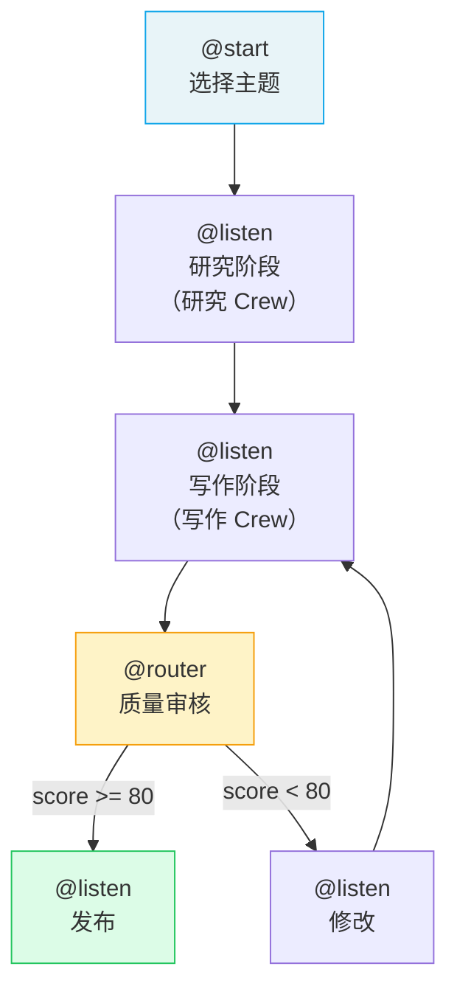

# 实战：构建多步骤 Flow 工作流

> 本教程构建一个**内容生产管线**——从选题到最终发布，经过研究、写作、质量审核和发布四个阶段。

## 1. 工作流设计



## 2. 定义 State

```python
# state.py
from pydantic import BaseModel
from typing import Optional

class ContentState(BaseModel):
    """内容生产管线的状态"""
    topic: str = ""
    target_audience: str = "技术决策者"

    # 阶段产出
    research_data: str = ""
    draft: str = ""
    final_content: str = ""

    # 质量控制
    quality_score: int = 0
    revision_count: int = 0
    max_revisions: int = 3

    # 元信息
    error: Optional[str] = None
    published: bool = False
```

## 3. 构建 Crew 工厂

```python
# crews.py
from crewai import Agent, Task, Crew, Process

def build_research_crew(topic: str) -> Crew:
    """构建研究 Crew"""
    researcher = Agent(
        role="内容研究员",
        goal=f"搜集关于 {topic} 的全面、准确的信息",
        backstory="资深技术研究员，擅长信息搜集与整理",
        llm="openai/gpt-4o",
        verbose=True
    )

    task = Task(
        description=(
            f"对 {topic} 进行全面研究，包括：\n"
            "1. 核心概念与技术细节\n"
            "2. 最新发展动态\n"
            "3. 实际应用案例\n"
            "4. 常见问题与解决方案"
        ),
        expected_output="详细的技术研究报告（约 800 字）",
        agent=researcher
    )

    return Crew(agents=[researcher], tasks=[task])


def build_writing_crew(research: str, audience: str) -> Crew:
    """构建写作 Crew"""
    writer = Agent(
        role="技术作者",
        goal="撰写引人入胜的技术文章",
        backstory="资深技术写作者，擅长将复杂概念讲简单",
        llm="openai/gpt-4o"
    )

    editor = Agent(
        role="内容编辑",
        goal="确保文章质量、准确性和可读性",
        backstory="严谨的技术编辑，注重细节和逻辑",
        llm="openai/gpt-4o"
    )

    write_task = Task(
        description=(
            f"基于以下研究资料，为 {audience} 撰写技术文章：\n\n"
            f"{research[:2000]}\n\n"
            "要求：结构清晰、通俗易懂、有代码示例"
        ),
        expected_output="Markdown 格式的技术文章（600-800 字）",
        agent=writer
    )

    edit_task = Task(
        description="审校润色文章，修正错误，优化表达",
        expected_output="审校后的最终版文章",
        agent=editor,
        context=[write_task]
    )

    return Crew(
        agents=[writer, editor],
        tasks=[write_task, edit_task],
        process=Process.sequential
    )
```

## 4. 构建 Flow

```python
# flow.py
from crewai.flow.flow import Flow, listen, start, router
from state import ContentState
from crews import build_research_crew, build_writing_crew

class ContentPipeline(Flow[ContentState]):

    @start()
    def select_topic(self):
        """阶段 1：选择主题"""
        self.state.topic = "CrewAI 多 Agent 编排实战"
        self.state.target_audience = "前端转 AI 的开发者"
        print(f"📝 选题: {self.state.topic}")
        return self.state.topic

    @listen(select_topic)
    def research_phase(self, topic):
        """阶段 2：研究（使用研究 Crew）"""
        print(f"🔍 开始研究: {topic}")
        crew = build_research_crew(topic)
        result = crew.kickoff()
        self.state.research_data = result.raw
        print(f"✅ 研究完成: {len(result.raw)} 字")
        return self.state.research_data

    @listen(research_phase)
    def writing_phase(self, research):
        """阶段 3：写作（使用写作 Crew）"""
        print(f"✍️ 开始写作（第 {self.state.revision_count + 1} 次）")
        crew = build_writing_crew(research, self.state.target_audience)
        result = crew.kickoff()
        self.state.draft = result.raw
        print(f"✅ 写作完成: {len(result.raw)} 字")
        return self.state.draft

    @router(writing_phase)
    def quality_check(self, draft):
        """阶段 4：质量审核（条件路由）"""
        # 简化的质量评分逻辑
        score = 0
        if len(draft.split()) >= 300:
            score += 30  # 字数达标
        if "## " in draft:
            score += 25  # 有标题结构
        if "```" in draft:
            score += 25  # 有代码示例
        if draft.count("\n") >= 10:
            score += 20  # 段落丰富

        self.state.quality_score = score
        print(f"📊 质量评分: {score}/100")

        if score >= 80:
            return "publish"
        elif self.state.revision_count < self.state.max_revisions:
            self.state.revision_count += 1
            return "revise"
        else:
            return "publish"  # 达到最大修改次数，强制发布

    @listen("publish")
    def publish(self, _):
        """发布内容"""
        self.state.final_content = self.state.draft
        self.state.published = True
        print(f"🚀 发布成功！质量评分: {self.state.quality_score}")

    @listen("revise")
    def revise(self, _):
        """修改并重新进入写作阶段"""
        print(f"🔄 需要修改（第 {self.state.revision_count} 次修改）")
        # 重新触发写作阶段
        crew = build_writing_crew(
            self.state.research_data,
            self.state.target_audience
        )
        result = crew.kickoff()
        self.state.draft = result.raw
        return self.state.draft
```

## 5. 入口文件

```python
# main.py
from flow import ContentPipeline

def run():
    pipeline = ContentPipeline()
    pipeline.kickoff()

    print("\n" + "=" * 60)
    print("管线执行报告")
    print("=" * 60)
    print(f"主题: {pipeline.state.topic}")
    print(f"目标读者: {pipeline.state.target_audience}")
    print(f"质量评分: {pipeline.state.quality_score}/100")
    print(f"修改次数: {pipeline.state.revision_count}")
    print(f"发布状态: {'✅ 已发布' if pipeline.state.published else '❌ 未发布'}")
    print(f"\n最终内容:\n{pipeline.state.final_content[:500]}...")

if __name__ == "__main__":
    run()
```

## 6. 运行

```bash
crewai install
crewai run
```

## 7. 进阶增强

### 7.1 添加持久化

```python
from crewai.flow.flow import persist

@persist  # 自动持久化，支持中断恢复
class ContentPipeline(Flow[ContentState]):
    ...
```

### 7.2 添加人工反馈

```python
from crewai.flow.human_feedback import human_feedback

class ContentPipeline(Flow[ContentState]):
    @listen(writing_phase)
    @human_feedback(
        message="请审核文章质量，是否通过？",
        emit=["publish", "revise"],
        default_outcome="revise"
    )
    def human_review(self, draft):
        return draft
```

### 7.3 异步执行

```python
import asyncio

async def main():
    pipeline = ContentPipeline()
    await pipeline.akickoff()

asyncio.run(main())
```

---

**先修**：[Flows 工作流](/ai/crewai/guide/flows) | [实战：构建研究分析 Crew](/ai/crewai/guide/tutorial-research-crew)

**下一步**：
- 回到 [CrewAI 概览](/ai/crewai/guide/overview) 复习核心概念
- 探索 [生产架构](/ai/crewai/guide/production-architecture) 了解更多生产实践

**参考**：
- [🔗 CrewAI Flows (Official)](https://docs.crewai.com/en/concepts/flows){target="_blank" rel="noopener"}
