# 🔥 实战：构建研究分析 Crew

> 本教程将带你从零开始，构建一个由"研究员 + 分析师 + 报告作者"组成的完整研究分析系统。

## 1. 需求分析

我们要构建的系统：
- 输入一个研究主题
- **研究员** 搜集相关信息
- **分析师** 分析数据并识别关键洞察
- **报告作者** 撰写结构化的最终报告

```mermaid
flowchart LR
    Input["输入主题"] --> R["研究员<br/>搜集资料"]
    R --> A["分析师<br/>分析数据"]
    A --> W["报告作者<br/>撰写报告"]
    W --> Output["结构化报告"]

    style Input fill:#e8f4f8,stroke:#0ea5e9
    style Output fill:#dcfce7,stroke:#22c55e
```



## 2. 项目搭建

```bash
# 创建项目
crewai create crew research_crew
cd research_crew

# 安装搜索工具
uv add crewai-tools
```

配置 `.env`：

```bash
OPENAI_API_KEY=sk-your-openai-key
SERPER_API_KEY=your-serper-key  # 可选，用于网络搜索
```

## 3. 定义 Agent

```yaml
# src/research_crew/config/agents.yaml
researcher:
  role: >
    {topic} 高级研究员
  goal: >
    对 {topic} 进行全面、深入的信息搜集，确保数据准确可靠
  backstory: >
    你是一位拥有 10 年经验的技术研究员。你擅长从各类信息源中
    筛选出最有价值的数据，注重引用来源和数据时效性。
    你的研究报告一直以全面性和准确性著称。
  llm: openai/gpt-4o

analyst:
  role: >
    数据分析师
  goal: >
    基于研究数据识别关键趋势、机会和风险
  backstory: >
    你是一位严谨的数据分析师，善于从大量信息中提炼核心洞察。
    你会用结构化的方式呈现分析结果，确保每个结论都有数据支撑。
  llm: openai/gpt-4o

writer:
  role: >
    技术报告作者
  goal: >
    将分析结果整理成结构清晰、专业且易于理解的报告
  backstory: >
    你是一位资深技术写作者，擅长把复杂的技术分析转化为
    目标读者能轻松理解的报告。你注重逻辑清晰和数据可视化。
  llm: openai/gpt-4o
```

## 4. 定义 Task

```yaml
# src/research_crew/config/tasks.yaml
research_task:
  description: >
    对 {topic} 进行全面研究，具体覆盖以下维度：
    1. 市场规模与增长趋势（含关键数据）
    2. 主要参与者和竞争格局
    3. 核心技术方向与创新
    4. 潜在风险和挑战
    5. 未来 1-3 年展望

    请确保引用数据来源，注明数据时效性。
  expected_output: >
    一份详细的研究报告（约 1000 字），包含以上五个维度的
    数据和分析，每个维度附带数据来源。
  agent: researcher

analysis_task:
  description: >
    基于研究报告，进行深度分析：
    1. 识别 3 个最有前景的机会，并按优先级排序
    2. 对每个机会进行 SWOT 分析（优势/劣势/机遇/威胁）
    3. 评估每个机会的风险等级（低/中/高）
    4. 给出具体的行动建议
  expected_output: >
    结构化的机会分析报告，包含 3 个机会各自的 SWOT 分析、
    风险评估和行动建议。
  agent: analyst
  context:
    - research_task

writing_task:
  description: >
    基于研究和分析结果，撰写一份面向技术决策者的执行摘要：
    1. 开头用 3 句话概述核心发现
    2. 详细展开 3 个关键机会
    3. 包含关键数据点和图表建议
    4. 以明确的行动建议结尾

    格式要求：使用 Markdown，包含标题层级和列表。
  expected_output: >
    一份 800 字以内的执行摘要（Markdown 格式），
    包含核心发现、机会分析和行动建议。
  agent: writer
  context:
    - analysis_task
  output_file: reports/executive_summary.md
```

## 5. 编排 Crew

```python
# src/research_crew/crew.py
from crewai import Agent, Crew, Process, Task
from crewai.project import CrewBase, agent, task, crew
from crewai_tools import SerperDevTool

@CrewBase
class ResearchCrew:
    """研究分析团队"""
    agents_config = 'config/agents.yaml'
    tasks_config = 'config/tasks.yaml'

    @agent
    def researcher(self) -> Agent:
        return Agent(
            config=self.agents_config['researcher'],
            tools=[SerperDevTool()],  # 搜索工具
            verbose=True
        )

    @agent
    def analyst(self) -> Agent:
        return Agent(
            config=self.agents_config['analyst'],
            verbose=True
        )

    @agent
    def writer(self) -> Agent:
        return Agent(
            config=self.agents_config['writer'],
            verbose=True
        )

    @task
    def research_task(self) -> Task:
        return Task(config=self.tasks_config['research_task'])

    @task
    def analysis_task(self) -> Task:
        return Task(config=self.tasks_config['analysis_task'])

    @task
    def writing_task(self) -> Task:
        return Task(config=self.tasks_config['writing_task'])

    @crew
    def crew(self) -> Crew:
        return Crew(
            agents=self.agents,
            tasks=self.tasks,
            process=Process.sequential,
            verbose=True
        )
```

## 6. 编写入口

```python
# src/research_crew/main.py
from research_crew.crew import ResearchCrew

def run():
    crew = ResearchCrew()
    result = crew.crew().kickoff(
        inputs={"topic": "2025 年 AI Agent 技术与市场"}
    )

    print("\n" + "=" * 60)
    print("执行摘要")
    print("=" * 60)
    print(result.raw)
    print(f"\nToken 消耗: {result.token_usage}")

if __name__ == "__main__":
    run()
```

## 7. 运行

```bash
crewai install
crewai run
```

## 8. 进阶优化

### 8.1 添加结构化输出

```python
from pydantic import BaseModel
from typing import List

class Opportunity(BaseModel):
    name: str
    priority: int
    risk: str
    action: str

class AnalysisReport(BaseModel):
    opportunities: List[Opportunity]
    summary: str

# 在 Task 中使用
@task
def analysis_task(self) -> Task:
    return Task(
        config=self.tasks_config['analysis_task'],
        output_pydantic=AnalysisReport
    )
```

### 8.2 添加 Guardrail

```python
from crewai.tasks.task_output import TaskOutput
from typing import Tuple, Any

def validate_report(result: TaskOutput) -> Tuple[bool, Any]:
    if len(result.raw.split()) < 200:
        return (False, "报告太短，请至少 200 字")
    if "## " not in result.raw:
        return (False, "请使用 Markdown 标题格式")
    return (True, result.raw)

@task
def writing_task(self) -> Task:
    return Task(
        config=self.tasks_config['writing_task'],
        guardrail=validate_report
    )
```

### 8.3 启用记忆

```python
@crew
def crew(self) -> Crew:
    return Crew(
        agents=self.agents,
        tasks=self.tasks,
        process=Process.sequential,
        memory=True,  # 跨执行学习
        verbose=True
    )
```

---

**先修**：[Crews 团队编排](/ai/crewai/guide/crews) | [Tasks 任务](/ai/crewai/guide/tasks)

**下一步**：
- [实战：构建多步骤 Flow](/ai/crewai/guide/tutorial-flow-workflow) — 更复杂的工作流实战

**参考**：
- [🔗 CrewAI Quickstart (Official)](https://docs.crewai.com/en/quickstart){target="_blank" rel="noopener"}
