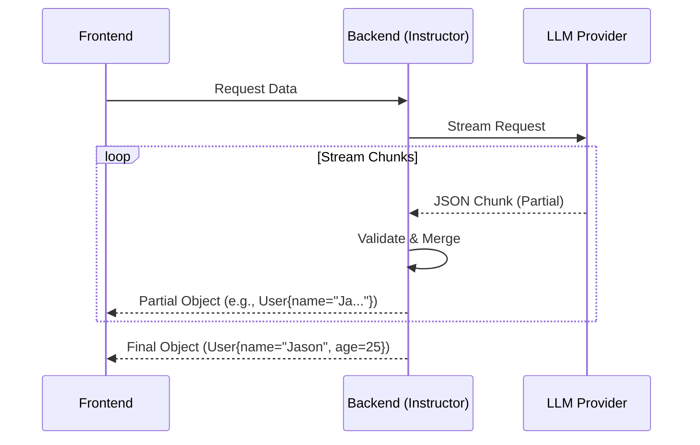

# 进阶指南

本章将介绍 Instructor 的高级用法，包括 Partial Streaming 和 Patching，帮助你构建更高效、更具响应性的应用。

## Partial Streaming

对于长文本或复杂结构的生成任务，用户等待整个响应完成可能会导致体验不佳。Instructor 支持 **Partial Streaming**（部分流式传输），允许你像处理普通文本流一样，实时获取结构化数据的部分更新。

### 为什么需要 Partial Streaming？

在前端开发中，我们习惯于使用 Server-Sent Events (SSE) 或 WebSocket 来流式接收数据。Instructor 将这一概念带到了结构化数据提取中。



### 代码示例

使用 `instructor.Partial[T]` 包装你的模型，即可启用部分流式传输。

```python
import instructor
from openai import OpenAI
from pydantic import BaseModel
from typing import List

client = instructor.from_openai(OpenAI())

class User(BaseModel):
    name: str
    age: int

# 使用 Partial[User]
response_stream = client.chat.completions.create(
    model="gpt-4o",
    response_model=instructor.Partial[User], # 关键点
    messages=[{"role": "user", "content": "Jason is 25 years old"}],
    stream=True,
)

for partial_user in response_stream:
    print(partial_user)
    # Output:
    # name='J' age=None
    # name='Ja' age=None
    # ...
    # name='Jason' age=25
```

这对于构建类似 ChatGPT 的打字机效果非常有用，尤其是当输出是一个复杂的嵌套对象时。

## Patching

Instructor 的魔力主要来自于对 OpenAI 客户端的 "Patch"（修补）。这一过程实际上是为标准的 `chat.completions.create` 方法添加了 `response_model` 参数的处理逻辑。

### Patching 原理

当你调用 `instructor.from_openai(client)` 时，发生了什么？

1. **Schema 生成**：Instructor 将你的 Pydantic 模型转换为 JSON Schema。
2. **Function Calling / Tool Use**：Instructor 配置 LLM 使用 "工具调用" (Tool Use) 模式，并将 Schema 作为工具定义传递给 LLM。
3. **Response Parsing**：拦截 LLM 的响应，解析 JSON 字符串。
4. **Validation**：使用 Pydantic 验证数据。
5. **Retry Logic**：如果验证失败，自动发起重试。

### 模式选择 (Mode)

Instructor 支持多种 Patching 模式，以适应不同的 LLM 能力。

- `instructor.Mode.TOOLS` (默认): 使用 OpenAI 的 Tool Calling API。最推荐。
- `instructor.Mode.JSON`: 使用 JSON Mode。适用于不支持 Tool Calling 的模型。
- `instructor.Mode.MD_JSON`: 从 Markdown 代码块中提取 JSON。适用于通用模型。

```python
# 显式指定模式
client = instructor.from_openai(
    OpenAI(),
    mode=instructor.Mode.JSON
)
```

::: tip
对于大多数现代模型（如 GPT-4o, GPT-3.5-turbo），默认的 `TOOLS` 模式是最佳选择，因为它最稳定且支持流式传输。
:::
