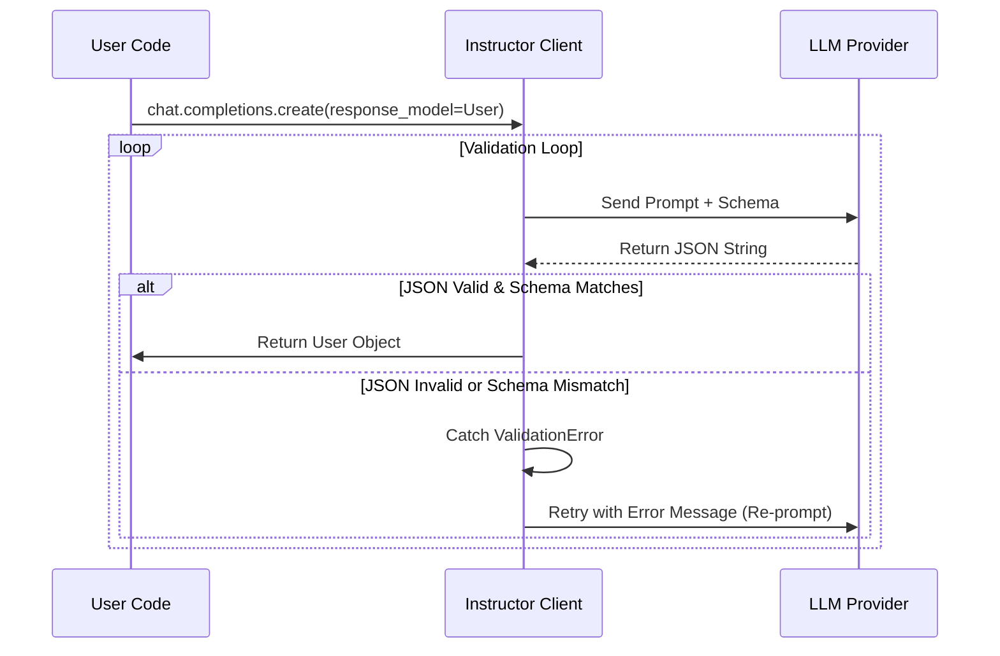

# ⭐ 核心概念

本章将深入探讨 Instructor 的核心工作原理，包括 Pydantic 模型定义、验证机制以及自动重试流程。

## Pydantic 模型与验证

在 Instructor 中，Pydantic 模型扮演着 schema 定义和数据验证的双重角色。对于前端开发者来说，可以将其理解为 **TypeScript Interface + Zod Runtime Validation** 的结合体。

### 对比：Pydantic vs TS/Zod

::: code-group

```python [Pydantic (Python)]
from pydantic import BaseModel, Field

class User(BaseModel):
    name: str = Field(..., description="用户的全名")
    age: int = Field(..., gt=0, description="年龄必须大于0")
    tags: list[str] = Field(default=[], description="用户标签")
```

```typescript [TypeScript Interface]
interface User {
  /** 用户的全名 */
  name: string
  /** 年龄必须大于0 */
  age: number
  /** 用户标签 */
  tags: string[]
}
```

```typescript [Zod Schema]
import { z } from 'zod'

const UserSchema = z.object({
  name: z.string().describe('用户的全名'),
  age: z.number().gt(0).describe('年龄必须大于0'),
  tags: z.array(z.string()).default([]).describe('用户标签'),
})
```

:::

## 验证与重试流程

Instructor 的核心价值在于其自动化的验证与重试循环（Validation Loop）。当 LLM 生成的数据不符合 Pydantic 模型定义的约束时，Instructor 不会直接报错，而是会将错误信息反馈给 LLM，要求其修正。



### 验证示例

假设我们有一个字段验证器，要求用户名必须全大写：

```python
from pydantic import BaseModel, field_validator

class User(BaseModel):
    name: str

    @field_validator('name')
    @classmethod
    def name_must_be_uppercase(cls, v: str) -> str:
        if not v.isupper():
            raise ValueError("Name must be uppercase")
        return v
```

如果 LLM 返回 `{"name": "Jason"}`，Pydantic 会抛出 `ValueError: Name must be uppercase`。Instructor 会自动构建一个新的请求：

> Error: Name must be uppercase.
> Please fix the JSON and try again.

LLM 接收到这个反馈后，通常会修正为 `{"name": "JASON"}`，从而通过验证。

## 上下文感知验证

有时验证需要依赖外部上下文（Context）。Instructor 允许你在验证器中访问这些上下文信息。

```python
from pydantic import ValidationInfo, field_validator

class Citation(BaseModel):
    quote: str

    @field_validator('quote')
    @classmethod
    def verify_quote_exists(cls, v: str, info: ValidationInfo):
        context = info.context
        if context and v not in context.get('source_text', ''):
            raise ValueError("Quote not found in source text")
        return v

client.chat.completions.create(
    response_model=Citation,
    messages=[...],
    # 传入上下文
    context={"source_text": "The quick brown fox..."}
)
```
