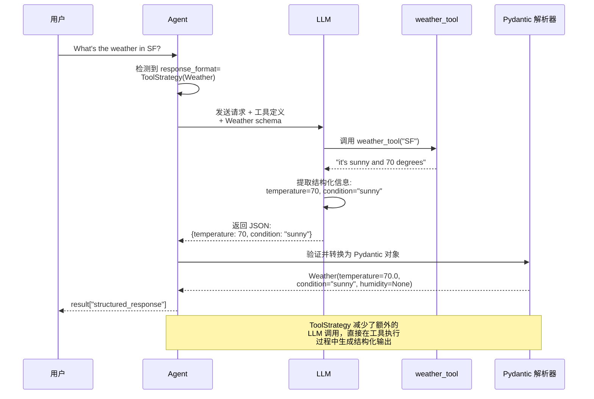
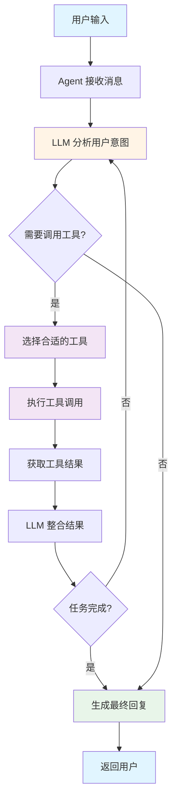
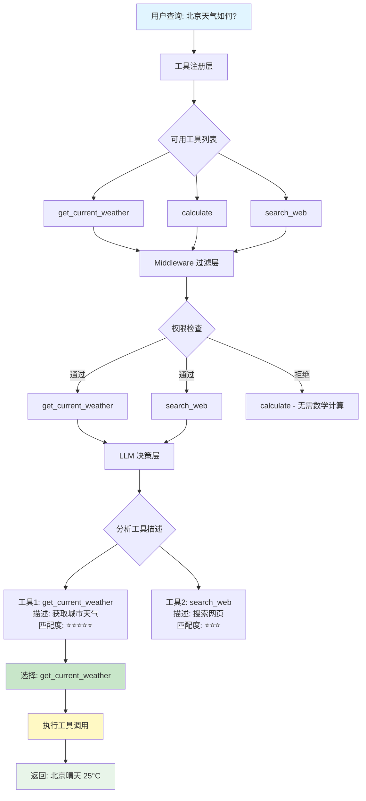

# Agent 架构

## 概述

Agent 是 LangChain 的核心概念之一，它能够根据用户输入动态决定使用哪些工具（Tools）来完成任务。LangChain 1.0 引入了全新的 `create_agent` 接口，大幅简化了 Agent 的创建和定制过程。

## 核心概念

### 什么是 Agent？

Agent 是一个能够：

1. **理解用户意图** - 解析用户的自然语言输入
2. **规划执行步骤** - 决定调用哪些工具以及调用顺序
3. **执行工具调用** - 实际调用工具并获取结果
4. **生成最终回复** - 综合工具结果回复用户

### LangChain 1.0 Agent 架构

```
用户输入 → Agent → 工具选择 → 工具执行 → 结果整合 → 用户回复
              ↑                                      ↓
              └──────── 循环迭代 ──────────────────┘
```

### create_agent 的优势

- **统一接口**: 替代了之前的多个 Agent 构造函数
- **简洁API**: 只需指定 model、tools 和可选的 system_prompt
- **易于扩展**: 通过 middleware 系统轻松增强功能
- **类型安全**: 更好的 TypeScript/Python 类型提示

## 代码示例 1: 创建基础 Agent

最简单的 Agent 只需要指定模型和工具列表：

```python
from langchain.agents import create_agent

# 定义一些示例工具
def search_web(query: str) -> str:
    """搜索网页内容"""
    return f"搜索结果: {query}"

def analyze_data(data: str) -> str:
    """分析数据"""
    return f"数据分析结果: {data}"

def send_email(to: str, subject: str, body: str) -> str:
    """发送电子邮件"""
    return f"邮件已发送至 {to}"

# 创建 Agent
agent = create_agent(
    model="claude-sonnet-4-5-20250929",
    tools=[search_web, analyze_data, send_email],
    system_prompt="You are a helpful research assistant."
)

# 调用 Agent
result = agent.invoke({
    "messages": [
        {"role": "user", "content": "Research AI safety trends"}
    ]
})

print(result)
```

**说明**:

- `model`: 指定使用的 LLM 模型（这里使用 Claude Sonnet）
- `tools`: 提供给 Agent 的工具列表
- `system_prompt`: Agent 的系统提示词，定义其行为和角色
- `invoke`: 执行 Agent，传入用户消息

## 代码示例 2: 使用 @tool 装饰器定义工具

LangChain 提供了 `@tool` 装饰器，让工具定义更加优雅：

```python
from langchain.agents import create_agent
from langchain.tools import tool

@tool
def get_current_weather(city: str) -> str:
    """获取指定城市的当前天气

    Args:
        city: 城市名称，例如 'Beijing', 'Shanghai'

    Returns:
        天气描述字符串
    """
    # 这里是模拟数据，实际应调用天气API
    weather_data = {
        "Beijing": "晴天，温度 25°C",
        "Shanghai": "多云，温度 28°C"
    }
    return weather_data.get(city, "未知城市")

@tool
def calculate(expression: str) -> str:
    """计算数学表达式

    Args:
        expression: 数学表达式，如 '2 + 3 * 4'

    Returns:
        计算结果
    """
    try:
        result = eval(expression)
        return f"{expression} = {result}"
    except Exception as e:
        return f"计算错误: {str(e)}"

# 创建 Agent
agent = create_agent(
    model="claude-sonnet-4-5-20250929",
    tools=[get_current_weather, calculate],
    system_prompt="You are a helpful assistant. Use tools to answer user questions."
)

# 测试
result = agent.invoke({
    "messages": [
        {"role": "user", "content": "北京天气怎么样？顺便帮我算一下 15 * 8"}
    ]
})
```

**说明**:

- `@tool` 装饰器自动从函数签名提取工具元数据
- 文档字符串（docstring）会作为工具描述传递给 LLM
- LLM 会根据描述决定何时调用哪个工具

## 代码示例 3: 结构化输出 Agent

Agent 可以返回结构化数据，而不仅仅是文本：

```python
from langchain.agents import create_agent
from langchain.agents.structured_output import ToolStrategy
from pydantic import BaseModel
from langchain.tools import tool

# 定义输出结构
class Weather(BaseModel):
    temperature: float
    condition: str
    humidity: int

@tool
def weather_tool(city: str) -> str:
    """Get the weather for a city."""
    return f"it's sunny and 70 degrees in {city}"

# 创建返回结构化数据的 Agent
agent = create_agent(
    "gpt-4o-mini",
    tools=[weather_tool],
    response_format=ToolStrategy(Weather)
)

result = agent.invoke({
    "messages": [{"role": "user", "content": "What's the weather in SF?"}]
})

# 访问结构化响应
weather_data = result["structured_response"]
print(f"温度: {weather_data.temperature}°F")
print(f"状况: {weather_data.condition}")
# 输出: Weather(temperature=70.0, condition='sunny')
```

**说明**:

- 使用 `Pydantic BaseModel` 定义输出结构
- `ToolStrategy` 告诉 Agent 使用结构化输出
- LLM 会自动将结果格式化为指定的 Pydantic 模型
- 减少了额外的 LLM 调用开销

### 结构化输出流程图

下图展示了结构化输出的完整处理流程:



**流程优势**:

- **单次 LLM 调用**: 不需要额外调用 LLM 来格式化输出
- **类型安全**: Pydantic 自动验证数据类型
- **降低成本**: 减少 Token 消耗
- **提高性能**: 避免多轮往返

## Agent 工作流程

下图展示了 Agent 的完整执行生命周期:



**工作流程说明**:

1. **用户输入** → Agent 接收消息
2. **意图理解** → LLM 分析用户需求
3. **工具选择** → LLM 决定调用哪个工具
4. **工具执行** → 执行工具并获取结果
5. **结果整合** → LLM 整合工具结果
6. **循环或结束** → 根据需要继续调用工具或返回最终答案

## 最佳实践

1. **清晰的工具描述**: 工具的 docstring 要详细说明功能、参数和返回值

   ```python
   @tool
   def search_database(query: str) -> str:
       """在数据库中搜索信息

       Args:
           query: 搜索关键词

       Returns:
           搜索结果列表
       """
       pass
   ```

2. **合理的工具数量**: 避免一次提供过多工具（建议 5-10 个）
   - 太多工具会增加 LLM 的选择难度
   - 可以使用工具分组或动态工具加载

3. **系统提示词设计**: 明确定义 Agent 的角色和能力边界

   ```python
   system_prompt = """
   你是一个数据分析助手。你可以：
   1. 查询数据库
   2. 分析数据趋势
   3. 生成可视化图表

   你不能：
   - 修改或删除数据
   - 执行数据库管理操作
   """
   ```

4. **错误处理**: 在工具函数中添加适当的错误处理
   ```python
   @tool
   def api_call(endpoint: str) -> str:
       """调用外部 API"""
       try:
           # API 调用逻辑
           pass
       except Exception as e:
           return f"API 调用失败: {str(e)}"
   ```

## 常见问题

**Q: create_agent 与旧版 Agent 构造函数有什么区别？**

A: 主要区别：

- **统一接口**: `create_agent` 替代了 `initialize_agent`、`ZeroShotAgent` 等多个函数
- **简化参数**: 只需 model、tools 和可选的 system_prompt
- **Middleware 支持**: 内置中间件系统，易于扩展
- **更好的类型提示**: 提升了开发体验

**Q: Agent 如何决定使用哪个工具？**

A: Agent 通过以下方式决定：

1. LLM 读取所有工具的描述（从 docstring 提取）
2. 根据用户输入和工具描述，LLM 推理应该使用哪个工具
3. LLM 生成工具调用指令
4. Agent 框架执行相应的工具函数

下图展示了工具选择的三层机制:



**工具选择流程**:

- **第一层 (工具注册)**: 所有已注册的工具
- **第二层 (Middleware 过滤)**: 根据权限、上下文过滤工具
- **第三层 (LLM 决策)**: 根据描述和用户意图选择最合适的工具

**Q: 如何限制 Agent 的工具调用次数？**

A: 可以在创建 Agent 时设置最大迭代次数：

```python
agent = create_agent(
    model="claude-sonnet-4-5-20250929",
    tools=[...],
    max_iterations=5  # 最多迭代5次
)
```

**Q: Agent 性能如何优化？**

A: 几个优化方向：

1. 减少工具数量，只提供必要的工具
2. 使用更快的模型（如 GPT-4o-mini）
3. 优化工具执行时间（缓存、并发等）
4. 使用结构化输出减少 LLM 调用次数

## 下一步

现在你已经掌握了 Agent 的基础架构，接下来可以：

- 学习 [Middleware](/ai/langchain/guide/middleware) - 通过中间件增强 Agent 功能（PII检测、摘要、人工审批等）
- 探索 [Content Blocks](/ai/langchain/guide/content-blocks) - 统一访问不同 Provider 的响应内容
- 查看 [Legacy 迁移指南](/ai/langchain/guide/legacy-migration) - 如何从旧版 Agent API 迁移到 v1.0

## 参考资源

- [LangChain Agent 官方文档](https://python.langchain.com/docs/modules/agents/)
- [create_agent API 参考](https://python.langchain.com/api_reference/langchain/agents.html)
- [工具定义最佳实践](https://python.langchain.com/docs/modules/tools/)
