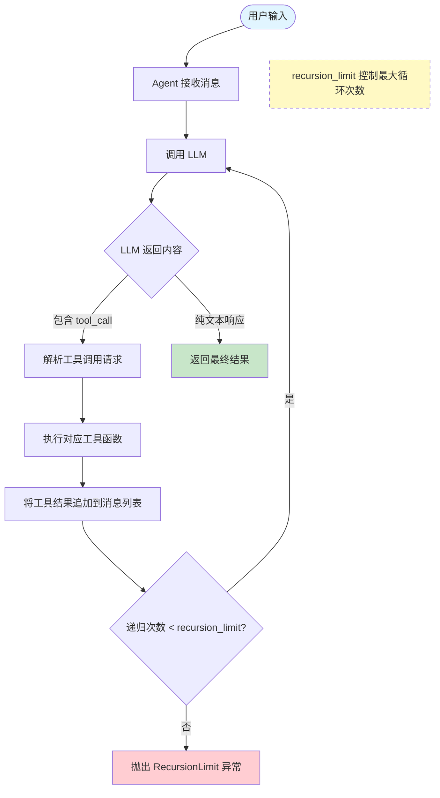
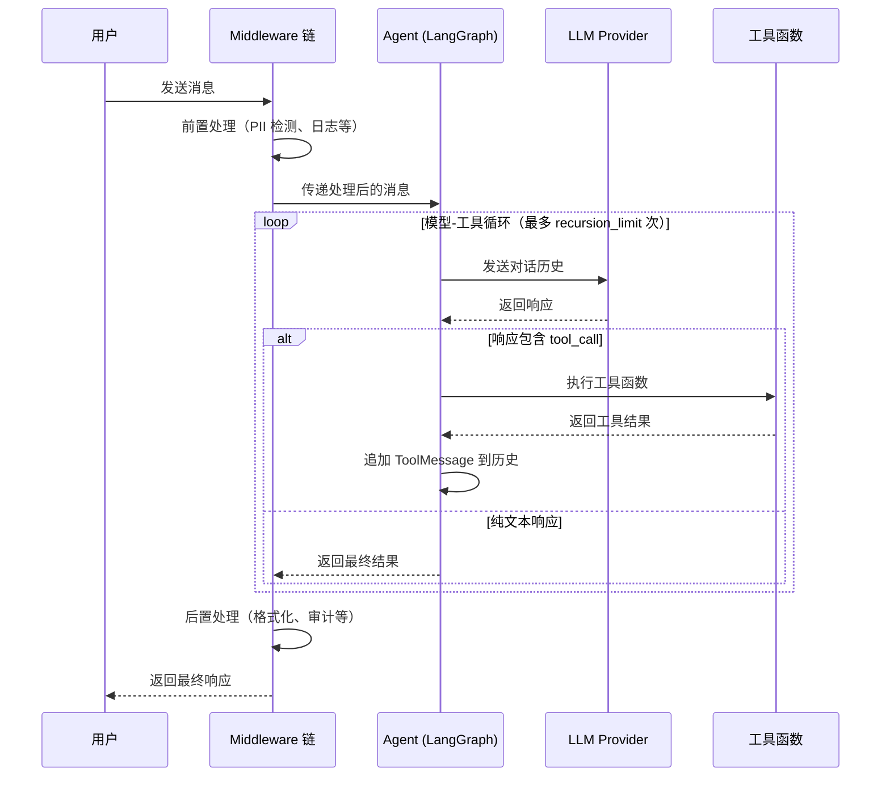

# Agent 实战指南

## 概述

Agent 是 LangChain 最核心的能力——模型不再只是"回答问题"，而是能够**自主决策、调用工具、循环推理**直到完成任务。LangChain 1.0 通过统一的 `create_agent` 接口，将 Agent 创建简化为一个函数调用，同时在底层基于 LangGraph 运行时提供了强大的扩展能力。

[🔗 create_react_agent API 参考](https://langchain-ai.github.io/langgraph/reference/prebuilt/#langgraph.prebuilt.chat_agent_executor.create_react_agent){target="_blank" rel="noopener"}

本章将从 API 签名到实战模式，系统讲解 Agent 的完整用法。

### 先修知识

- 已完成 [环境搭建](/ai/langchain/guide/install)
- 了解 [快速上手](/ai/langchain/guide/quickstart) 中的基本概念

## 核心概念

### create_agent 完整签名

`create_agent` 是 LangChain 1.0 的统一 Agent 构建函数，其核心参数如下：

```python
from langchain.agents import create_agent

agent = create_agent(
    model,              # 必填 — 模型标识符或模型实例
    tools,              # 必填 — 工具列表
    prompt=None,        # 可选 — 系统提示词（字符串或 ChatPromptTemplate）
    middleware=None,     # 可选 — 中间件列表，用于拦截/增强 Agent 行为
    response_format=None,  # 可选 — 结构化输出格式（Pydantic / TypedDict / JSON Schema）
    recursion_limit=25, # 可选 — 最大递归轮次（模型-工具循环的上限）
)
```

**参数详解：**

| 参数 | 类型 | 说明 |
|------|------|------|
| `model` | `str \| BaseChatModel` | 模型标识符，格式为 `"provider:model-name"`，如 `"anthropic:claude-sonnet-4-5-20250929"`；也可传入已初始化的模型实例 |
| `tools` | `list[Tool \| Callable]` | 工具列表，支持 `@tool` 装饰器函数或 Tool 实例 |
| `prompt` | `str \| ChatPromptTemplate` | 系统提示词，定义 Agent 的角色和行为边界 |
| `middleware` | `list[Middleware]` | 中间件链，按顺序执行，详见 [中间件](/ai/langchain/guide/middleware-overview) |
| `response_format` | `type \| ToolStrategy \| ProviderStrategy` | 结构化输出策略，详见 [结构化输出](/ai/langchain/guide/structured-output) |
| `recursion_limit` | `int` | 模型-工具循环的最大次数，防止无限递归，默认 25 |

::: tip 前端类比
`create_agent` 类似于 React 中 `createStore(reducer, middleware)` 的设计思路——传入"处理逻辑"（model + tools）和"增强层"（middleware），返回一个可调用的实例。
:::

需要注意的是，Agent 返回的实例本质上是一个 LangGraph `CompiledGraph`，因此它同时支持 `.invoke()` 同步调用和 `.stream()` 流式调用。

### @tool 装饰器

`@tool` 装饰器是定义工具最简洁的方式。LangChain 会自动从函数签名和文档字符串中推导工具的名称、描述和参数 Schema：

```python
from langchain.tools import tool

@tool
def search_docs(query: str, max_results: int = 5) -> str:
    """在文档库中搜索相关内容

    Args:
        query: 搜索关键词
        max_results: 返回结果数量上限，默认 5

    Returns:
        匹配的文档摘要列表
    """
    # 实际搜索逻辑
    return f"找到 {max_results} 条关于「{query}」的结果"
```

**Schema 自动推导规则：**

- **工具名称**：取函数名（`search_docs`）
- **工具描述**：取 docstring 的第一行（`在文档库中搜索相关内容`）
- **参数 Schema**：从类型注解自动生成 JSON Schema，`int`/`str`/`bool` 等基础类型及 `Optional`、`list` 均可识别
- **默认值**：函数参数的默认值会体现在 Schema 中，LLM 可以选择省略这些参数

::: warning 注意
docstring 的质量直接决定 LLM 能否正确使用工具。描述应清晰说明工具的功能、参数含义和返回内容。模糊的描述会导致工具被误用或完全不被调用。
:::

### Agent 执行流程

Agent 的核心机制是一个**模型-工具循环**：模型决定是否调用工具，调用后将结果反馈给模型，模型再次决策，直到认为任务完成或达到递归上限。



**关键理解：**

1. LLM 通过 function calling 能力返回 `tool_call` 指令，Agent 框架负责执行
2. 每次工具执行的结果都作为 `ToolMessage` 追加到对话历史中
3. LLM 可以在一次响应中请求调用多个工具（并行工具调用）
4. 当 LLM 认为信息充分时，返回纯文本响应，循环终止
5. `recursion_limit` 是安全阀，防止 Agent 陷入无限循环

### 结构化输出策略

当你需要 Agent 返回结构化数据而非自由文本时，`response_format` 参数提供了两种策略：

| 策略 | 说明 | 适用场景 |
|------|------|----------|
| `ToolStrategy(Schema)` | 将输出 Schema 伪装为一个"工具"，让 LLM 通过 tool calling 返回结构化数据 | 所有支持 tool calling 的模型 |
| `ProviderStrategy(Schema)` | 使用模型提供商的原生结构化输出能力（如 OpenAI 的 JSON mode） | 支持原生结构化输出的模型 |

`Schema` 可以是 Pydantic BaseModel、TypedDict、dataclass 或原生 JSON Schema dict。

```python
from pydantic import BaseModel
from langchain.agents.structured_output import ToolStrategy

class Summary(BaseModel):
    title: str
    key_points: list[str]
    sentiment: str

agent = create_agent(
    model="anthropic:claude-sonnet-4-5-20250929",
    tools=[search_docs],
    response_format=ToolStrategy(Summary),
)
```

更多细节请参阅 [结构化输出专题](/ai/langchain/guide/structured-output)。

### LangChain Agent vs LangGraph Agent

`create_agent` 底层运行在 LangGraph 之上，但它隐藏了图编排的复杂性。两者的使用场景如下：

| 维度 | LangChain Agent（create_agent） | LangGraph Agent（自定义图） |
|------|------|------|
| 适用场景 | 标准的工具调用 Agent | 需要条件分支、并行节点、人工审批等复杂流程 |
| 开发速度 | 快，一个函数搞定 | 需要手动定义节点和边 |
| 可控性 | 有限，通过 middleware 增强 | 完全可控，每个节点的输入输出都可定制 |
| 状态管理 | 自动管理消息历史 | 自定义 State，支持持久化和恢复 |
| 学习曲线 | 低 | 中高 |

**经验法则：** 先用 `create_agent`，当你需要在工具调用之间插入审批、条件判断或并行执行时，再迁移到 LangGraph 自定义图。详见 [LangGraph 概览](/ai/langgraph/guide/overview)。

## 代码示例

### 示例 1：基础 Agent

最小可运行的 Agent，只需 model 和 tools：

```python
from langchain.agents import create_agent
from langchain.tools import tool

@tool
def get_weather(city: str) -> str:
    """获取指定城市的当前天气

    Args:
        city: 城市名称，如 "北京"、"上海"
    """
    weather_db = {"北京": "晴天 25°C", "上海": "多云 28°C", "深圳": "雷阵雨 30°C"}
    return weather_db.get(city, f"暂无 {city} 的天气数据")

agent = create_agent(
    model="anthropic:claude-sonnet-4-5-20250929",
    tools=[get_weather],
)

result = agent.invoke({
    "messages": [{"role": "user", "content": "北京今天天气怎么样？"}]
})

# 提取最终回复
final_message = result["messages"][-1]
print(final_message.content)
# 输出: 北京今天是晴天，气温 25°C，非常适合出行！
```

### 示例 2：多工具 Agent 与系统提示词

实际项目中 Agent 通常配备多个工具，并通过系统提示词定义其角色边界：

```python
from langchain.agents import create_agent
from langchain.tools import tool

@tool
def search_knowledge_base(query: str) -> str:
    """在内部知识库中搜索技术文档

    Args:
        query: 搜索关键词
    """
    return f"知识库结果：关于「{query}」的 3 篇文档"

@tool
def query_database(sql: str) -> str:
    """执行只读 SQL 查询

    Args:
        sql: SELECT 查询语句（不支持写操作）
    """
    if not sql.strip().upper().startswith("SELECT"):
        return "错误：仅支持 SELECT 查询"
    return f"查询结果：5 行数据"

@tool
def create_chart(data_description: str, chart_type: str = "bar") -> str:
    """根据数据描述生成图表

    Args:
        data_description: 数据内容描述
        chart_type: 图表类型，可选 bar/line/pie，默认 bar
    """
    return f"已生成 {chart_type} 图表：{data_description}"

SYSTEM_PROMPT = """你是一个数据分析助手。你的职责是：
1. 在知识库中搜索相关文档
2. 通过 SQL 查询获取数据（仅限 SELECT）
3. 将结果可视化为图表

重要限制：
- 不要执行任何写入、更新或删除操作
- 对于不确定的数据，如实告知用户
- 每次分析完成后，主动建议下一步行动"""

agent = create_agent(
    model="anthropic:claude-sonnet-4-5-20250929",
    tools=[search_knowledge_base, query_database, create_chart],
    prompt=SYSTEM_PROMPT,
    recursion_limit=10,  # 限制最大循环次数
)

result = agent.invoke({
    "messages": [
        {"role": "user", "content": "帮我分析上个月的用户增长趋势，并生成折线图"}
    ]
})
```

**执行过程**（Agent 可能自主规划如下步骤）：

1. 调用 `search_knowledge_base("用户增长指标定义")` 了解背景
2. 调用 `query_database("SELECT date, user_count FROM ...")` 获取数据
3. 调用 `create_chart("上月用户增长数据", "line")` 生成图表
4. 综合所有结果生成最终分析报告

### 示例 3：带结构化输出的 Agent

当你需要 Agent 返回固定格式的数据（例如供下游系统消费）时：

```python
from langchain.agents import create_agent
from langchain.agents.structured_output import ToolStrategy
from langchain.tools import tool
from pydantic import BaseModel, Field

# 定义结构化输出 Schema
class AnalysisReport(BaseModel):
    topic: str = Field(description="分析主题")
    summary: str = Field(description="分析摘要，100 字以内")
    key_findings: list[str] = Field(description="关键发现列表")
    confidence: float = Field(description="置信度，0.0 到 1.0", ge=0, le=1)
    recommended_actions: list[str] = Field(description="建议行动")

@tool
def fetch_metrics(metric_name: str) -> str:
    """获取业务指标数据

    Args:
        metric_name: 指标名称，如 DAU、转化率、留存率
    """
    metrics = {
        "DAU": "日活 12000，环比增长 8%",
        "转化率": "注册转化率 3.2%，较上月下降 0.5%",
        "留存率": "7 日留存 42%，30 日留存 18%",
    }
    return metrics.get(metric_name, f"未找到指标: {metric_name}")

agent = create_agent(
    model="anthropic:claude-sonnet-4-5-20250929",
    tools=[fetch_metrics],
    prompt="你是一个数据分析专家，请基于指标数据给出专业分析报告。",
    response_format=ToolStrategy(AnalysisReport),
)

result = agent.invoke({
    "messages": [{"role": "user", "content": "分析最近的用户增长和留存情况"}]
})

# 直接获取 Pydantic 对象
report: AnalysisReport = result["structured_response"]
print(f"主题: {report.topic}")
print(f"摘要: {report.summary}")
print(f"置信度: {report.confidence}")
for finding in report.key_findings:
    print(f"  - {finding}")
```

### 示例 4：结合流式输出的 Agent

Agent 支持流式输出，实时展示推理过程：

```python
from langchain.agents import create_agent
from langchain.tools import tool

@tool
def translate(text: str, target_lang: str) -> str:
    """将文本翻译为目标语言

    Args:
        text: 待翻译文本
        target_lang: 目标语言代码，如 en、ja、ko
    """
    return f"[{target_lang}] {text} 的翻译结果"

agent = create_agent(
    model="anthropic:claude-sonnet-4-5-20250929",
    tools=[translate],
)

# 使用 stream 实时查看 Agent 执行过程
for chunk in agent.stream(
    {"messages": [{"role": "user", "content": "把'你好世界'翻译成英文和日文"}]},
    stream_mode="updates",
):
    for node_name, update in chunk.items():
        last_msg = update["messages"][-1]
        print(f"[{node_name}] {last_msg.content_blocks}")
```

更多流式用法请参阅 [Streaming 流式响应](/ai/langchain/guide/streaming)。

## Agent 执行全景图

下图展示了 Agent 从接收请求到返回结果的完整数据流，包括中间件的作用位置：



## 最佳实践

### 1. 工具设计原则

工具是 Agent 的"手脚"，工具设计的好坏直接影响 Agent 的表现：

```python
# 好的工具设计 — 职责单一、描述清晰
@tool
def get_user_profile(user_id: str) -> str:
    """根据用户 ID 查询用户基本信息（姓名、注册时间、等级）

    Args:
        user_id: 用户唯一标识，格式为 "U" + 6 位数字，如 "U123456"
    """
    ...

# 不好的工具设计 — 职责模糊、参数含义不明
@tool
def do_stuff(data: str) -> str:
    """处理数据"""
    ...
```

### 2. 合理设置 recursion_limit

```python
# 简单问答场景：1-2 次工具调用足够
agent = create_agent(model=..., tools=..., recursion_limit=5)

# 复杂分析场景：可能需要多轮调用
agent = create_agent(model=..., tools=..., recursion_limit=15)

# 不建议设置过高，默认 25 已经是较宽松的上限
```

### 3. 系统提示词的结构化编写

```python
SYSTEM_PROMPT = """## 角色
你是一个客服助手，负责回答用户关于产品的问题。

## 能力范围
- 查询订单状态
- 查看产品信息
- 提交退款申请

## 限制
- 不要透露内部系统信息
- 无法处理的问题应引导用户联系人工客服
- 每次回复保持简洁，不超过 200 字

## 输出格式
先给出直接回答，再附上相关建议。"""
```

### 4. 工具错误处理

工具函数应当返回有意义的错误信息，而非抛出异常——因为 LLM 可以根据错误信息调整策略：

```python
@tool
def call_external_api(endpoint: str) -> str:
    """调用外部 API 获取数据

    Args:
        endpoint: API 端点路径
    """
    try:
        response = requests.get(f"https://api.example.com/{endpoint}", timeout=10)
        response.raise_for_status()
        return response.text
    except requests.Timeout:
        return "错误：API 请求超时（10秒），请稍后重试"
    except requests.HTTPError as e:
        return f"错误：API 返回 {e.response.status_code}，端点可能不存在"
```

## 常见问题

**Q: Agent 调用了错误的工具怎么办？**

A: 这通常是工具描述不够清晰导致的。检查以下几点：

1. docstring 是否准确描述了工具的功能和适用场景
2. 多个工具之间是否存在职责重叠
3. 参数名和类型注解是否有歧义
4. 可以在系统提示词中补充工具使用指导

**Q: recursion_limit 应该设多少？**

A: 取决于任务复杂度。多数场景 5-10 足够。如果 Agent 频繁达到上限但任务未完成，说明可能需要拆分任务或优化工具设计，而不是简单提高上限。

**Q: create_agent 和直接使用 LangGraph 有性能差异吗？**

A: 没有。`create_agent` 底层就是构建了一个 LangGraph 图。它是语法糖，不是额外的抽象层。当你需要 `create_agent` 无法表达的控制流（如条件分支、并行节点、人工中断）时，再直接使用 LangGraph。

**Q: 如何让 Agent 记住之前的对话？**

A: `create_agent` 返回的 Agent 本身是无状态的。要实现多轮对话记忆，需要手动维护消息列表或使用 LangGraph 的持久化能力：

```python
# 方式一：手动维护消息历史
messages = []

def chat(user_input: str):
    messages.append({"role": "user", "content": user_input})
    result = agent.invoke({"messages": messages})
    messages.extend(result["messages"][len(messages):])
    return result["messages"][-1].content
```

**Q: 能否在运行时动态增减工具？**

A: `create_agent` 创建后工具列表不可变。如果需要动态工具集，有两种方案：

1. 创建多个 Agent，根据场景路由到不同的 Agent
2. 使用 LangGraph 自定义图，在节点中动态绑定工具

## 下一步

现在你已经掌握了 Agent 的创建和使用，接下来可以：

- 深入 [工具定义](/ai/langchain/guide/tools) — 高级工具模式：异步工具、工具组、动态工具
- 学习 [中间件](/ai/langchain/guide/middleware-overview) — 通过 middleware 增强 Agent（PII 检测、摘要、人工审批等）
- 探索 [结构化输出](/ai/langchain/guide/structured-output) — ToolStrategy vs ProviderStrategy 的深度对比
- 掌握 [Streaming 流式响应](/ai/langchain/guide/streaming) — 实时展示 Agent 推理过程
- 进阶 [LangGraph 概览](/ai/langgraph/guide/overview) — 当 Agent 需求超出 create_agent 能力时

## 参考资源

- [LangChain create_agent API 文档](https://docs.langchain.com/oss/python/langchain/agents)
- [LangChain Tools 指南](https://docs.langchain.com/oss/python/langchain/tools)
- [LangGraph 与 LangChain Agent 对比](https://docs.langchain.com/oss/python/langgraph/concepts)
- [Pydantic 官方文档](https://docs.pydantic.dev/)
