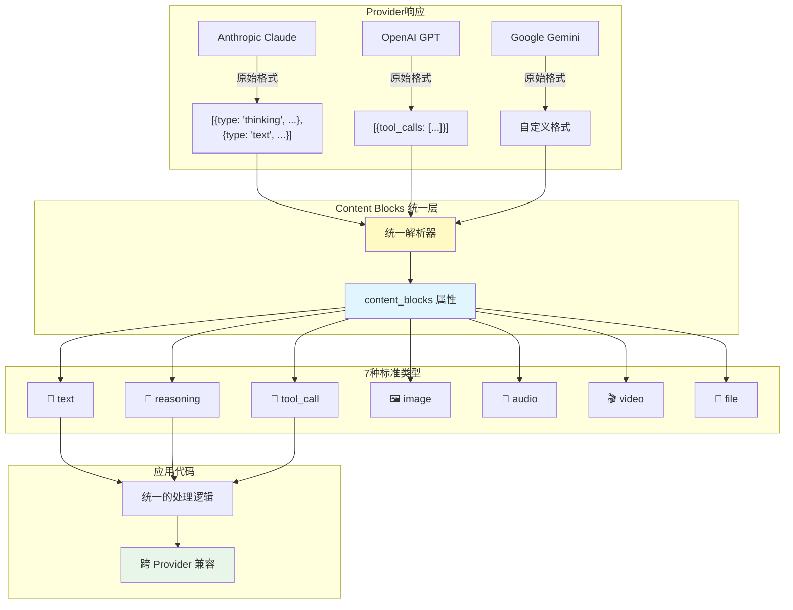
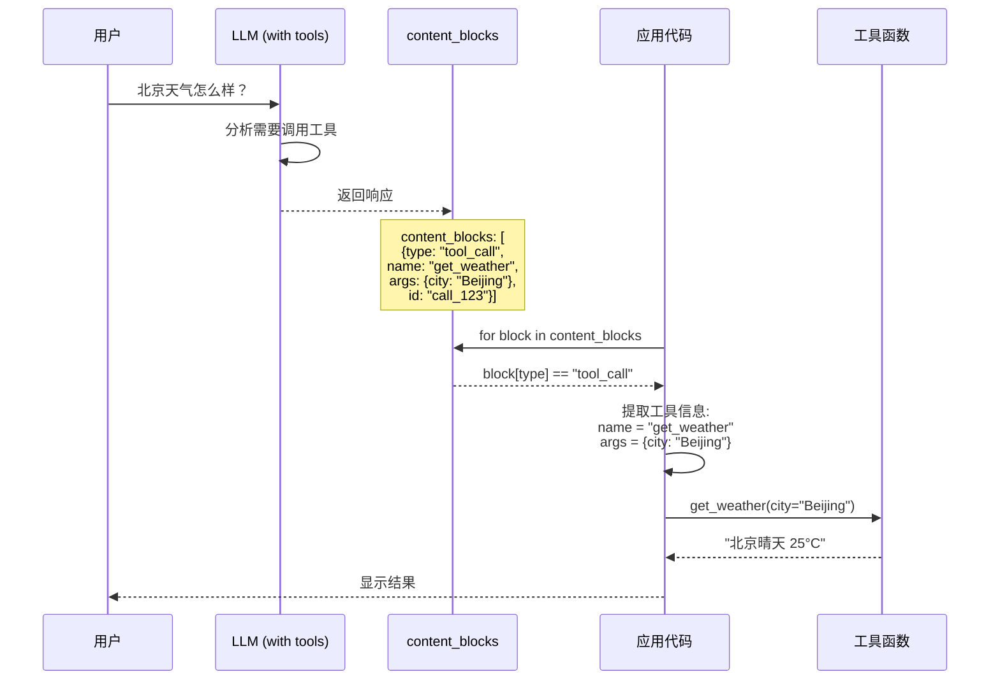

# Content Blocks

## 概述

Content Blocks（内容块）是 LangChain 1.0 引入的重要特性，它提供了一个统一的接口来访问不同 LLM Provider（如 Anthropic、OpenAI、Google）返回的内容。通过 Content Blocks，你可以用一致的方式处理文本、推理过程、工具调用等不同类型的响应内容。

## 核心概念

### 为什么需要 Content Blocks？

不同的 LLM Provider 返回的响应格式各不相同：

- **Anthropic Claude**: 支持 `thinking` 块（推理过程）
- **OpenAI**: 使用 `tool_calls` 数组
- **Google Gemini**: 有自己的内容结构

Content Blocks 统一了这些差异，让你的代码能够跨 Provider 工作。

### Content Block 类型层级图

下图展示了 Content Blocks 的类型体系和处理流程:



### Content Block 类型

1. **text**: 文本内容
2. **reasoning**: 模型的推理过程（仅部分 Provider 支持）
3. **tool_call**: 工具调用
4. **image**: 图片内容
5. **audio**: 音频内容

## 代码示例 1: 统一访问响应内容

使用 `content_blocks` 属性可以统一访问所有 Provider 的响应：

```python
from langchain_anthropic import ChatAnthropic

# 使用 Anthropic Claude
model = ChatAnthropic(model="claude-sonnet-4-5-20250929")
response = model.invoke("What's the capital of France?")

# 统一访问内容块
for block in response.content_blocks:
    if block["type"] == "reasoning":
        # Claude 特有的推理过程
        print(f"Model reasoning: {block['reasoning']}")
    elif block["type"] == "text":
        # 文本响应
        print(f"Response: {block['text']}")
    elif block["type"] == "tool_call":
        # 工具调用
        print(f"Tool call: {block['name']}({block['args']})")
```

**说明**:

- `content_blocks`: 返回一个列表，包含所有内容块
- 每个块都有 `type` 字段标识类型
- 根据类型访问相应的字段（`text`、`reasoning`、`name`、`args` 等）

## 代码示例 2: 跨 Provider 兼容代码

相同的代码可以用于不同的 Provider，无需修改：

```python
from langchain_anthropic import ChatAnthropic
from langchain_openai import ChatOpenAI
from langchain_google_genai import ChatGoogleGenerativeAI

def process_response(model, user_input: str):
    """处理模型响应，兼容所有 Provider"""
    response = model.invoke(user_input)

    # 统一的内容块处理
    for block in response.content_blocks:
        if block["type"] == "text":
            print(f"📝 文本: {block['text']}")
        elif block["type"] == "reasoning":
            print(f"🤔 推理: {block['reasoning']}")
        elif block["type"] == "tool_call":
            print(f"🔧 工具: {block['name']}")
            print(f"   参数: {block['args']}")

# 可以无缝切换 Provider
claude = ChatAnthropic(model="claude-sonnet-4-5-20250929")
gpt = ChatOpenAI(model="gpt-4")
gemini = ChatGoogleGenerativeAI(model="gemini-pro")

# 相同的处理逻辑
process_response(claude, "解释什么是量子计算")
process_response(gpt, "解释什么是量子计算")
process_response(gemini, "解释什么是量子计算")
```

**优势**:

- 代码可移植性强
- 容易切换 Provider
- 统一的错误处理

## 代码示例 3: 处理工具调用

Content Blocks 让工具调用的处理更加清晰：

### 工具调用处理流程图

下图展示了通过 Content Blocks 处理工具调用的完整流程:



```python
from langchain_anthropic import ChatAnthropic
from langchain.tools import tool

@tool
def get_weather(city: str) -> str:
    """获取城市天气"""
    return f"{city} 今天晴天，温度 25°C"

@tool
def search_wikipedia(query: str) -> str:
    """搜索维基百科"""
    return f"关于 {query} 的维基百科摘要..."

# 创建支持工具的模型
model = ChatAnthropic(model="claude-sonnet-4-5-20250929")
model_with_tools = model.bind_tools([get_weather, search_wikipedia])

# 调用模型
response = model_with_tools.invoke("北京天气怎么样？")

# 处理内容块
for block in response.content_blocks:
    if block["type"] == "tool_call":
        tool_name = block["name"]
        tool_args = block["args"]

        print(f"模型决定调用工具: {tool_name}")
        print(f"参数: {tool_args}")

        # 实际执行工具
        if tool_name == "get_weather":
            result = get_weather(**tool_args)
            print(f"工具结果: {result}")
        elif tool_name == "search_wikipedia":
            result = search_wikipedia(**tool_args)
            print(f"工具结果: {result}")

    elif block["type"] == "text":
        print(f"模型回复: {block['text']}")
```

**说明**:

- `bind_tools`: 将工具绑定到模型
- 模型会在需要时生成 `tool_call` 类型的内容块
- 你可以根据 `name` 执行相应的工具函数

## Content Block 结构

### Text Block

```python
{
    "type": "text",
    "text": "这是文本内容"
}
```

### Reasoning Block（仅Claude）

```python
{
    "type": "reasoning",
    "reasoning": "首先，我需要理解问题..."
}
```

### Tool Call Block

```python
{
    "type": "tool_call",
    "name": "get_weather",
    "args": {"city": "Beijing"},
    "id": "call_abc123"  # 调用ID，用于追踪
}
```

### Image Block

```python
{
    "type": "image",
    "image_url": "https://example.com/image.png",
    "detail": "high"  # 可选: low, high, auto
}
```

## 使用场景

### 1. 多模态内容处理

```python
response = model.invoke([
    {"type": "text", "text": "这张图片里有什么?"},
    {"type": "image_url", "image_url": "https://example.com/photo.jpg"}
])

for block in response.content_blocks:
    if block["type"] == "text":
        print(f"描述: {block['text']}")
```

### 2. 追踪模型推理过程

```python
# 仅 Claude 支持
response = claude.invoke("解决这个复杂的数学问题...")

for block in response.content_blocks:
    if block["type"] == "reasoning":
        # 记录模型的思考过程
        log_reasoning(block['reasoning'])
    elif block["type"] == "text":
        # 展示最终答案
        display_answer(block['text'])
```

### 3. 链式工具调用

```python
response = model_with_tools.invoke("先查天气，然后搜索相关的旅游攻略")

tool_calls = [
    block for block in response.content_blocks
    if block["type"] == "tool_call"
]

# 按顺序执行工具
for tool_call in tool_calls:
    result = execute_tool(tool_call["name"], tool_call["args"])
    print(f"{tool_call['name']} 结果: {result}")
```

## 最佳实践

1. **类型安全检查**

   ```python
   for block in response.content_blocks:
       block_type = block.get("type")
       if block_type == "text":
           text = block.get("text", "")
       elif block_type == "tool_call":
           name = block.get("name", "")
           args = block.get("args", {})
   ```

2. **优雅的错误处理**

   ```python
   try:
       for block in response.content_blocks:
           if block["type"] == "tool_call":
               result = execute_tool(block["name"], block["args"])
   except KeyError as e:
       print(f"内容块格式错误: {e}")
   except Exception as e:
       print(f"执行失败: {e}")
   ```

3. **Provider 特定逻辑**
   ```python
   if isinstance(model, ChatAnthropic):
       # Claude 特有的推理块处理
       for block in response.content_blocks:
           if block["type"] == "reasoning":
               handle_claude_reasoning(block)
   ```

## 常见问题

**Q: 所有 Provider 都支持所有类型的 Content Blocks 吗？**

A: 不是。支持情况如下：

- `text`: 所有 Provider 都支持
- `reasoning`: 目前仅 Anthropic Claude 支持
- `tool_call`: 大部分 Provider 支持
- `image`: 支持多模态的 Provider

**Q: 如何知道某个 Provider 支持哪些 Block 类型？**

A: 可以检查文档或运行时检查：

```python
response = model.invoke("test")
supported_types = {block["type"] for block in response.content_blocks}
print(f"支持的类型: {supported_types}")
```

**Q: Content Blocks 与传统的 `content` 属性有什么区别？**

A:

- `content`: 返回简单的字符串或字典，格式因 Provider 而异
- `content_blocks`: 返回统一的列表结构，跨 Provider 兼容
- 建议在 LangChain 1.0 中使用 `content_blocks`

**Q: 如何处理流式响应的 Content Blocks？**

A: 流式响应也支持 Content Blocks：

```python
for chunk in model.stream("长文本生成任务..."):
    for block in chunk.content_blocks:
        if block["type"] == "text":
            print(block["text"], end="", flush=True)
```

## 下一步

现在你已经掌握了 Content Blocks 的使用，接下来可以：

- 查看 [Legacy 迁移指南](/ai/langchain/guide/legacy-migration) - 如何从旧版 API 迁移到 v1.0
- 返回 [Agent 架构](/ai/langchain/guide/agent-architecture) - 回顾 Agent 基础知识
- 学习 [Middleware](/ai/langchain/guide/middleware) - 了解如何增强 Agent 功能

## 参考资源

- [LangChain Content Blocks 官方文档](https://python.langchain.com/docs/modules/model_io/content_blocks/)
- [多模态支持](https://python.langchain.com/docs/guides/multimodal/)
- [Provider 兼容性表](https://python.langchain.com/docs/integrations/providers/)
