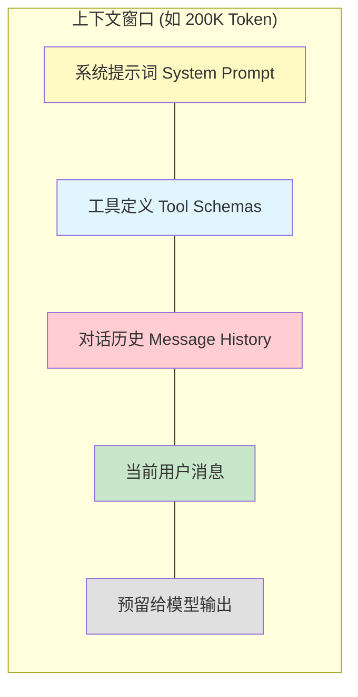

# 上下文工程

> 前置阅读：[短期记忆](/ai/langchain/guide/short-term-memory) · [Agent 实战指南](/ai/langchain/guide/agents)

## 什么是上下文工程

上下文工程（Context Engineering）是**管理 LLM 上下文窗口的系统性方法**。大语言模型的推理完全依赖于上下文窗口中的信息——模型只能"看到"你传入的内容。因此，"传什么、不传什么、怎么传"直接决定了 Agent 的回答质量。

与传统编程中的内存管理类似，上下文窗口是一种**有限资源**。每个模型都有 Token 上限（如 Claude 的 200K、GPT-4 的 128K），超出限制会导致截断或报错。上下文工程的目标就是：**在有限的窗口内，让模型获得最相关、最有用的信息**。

::: tip 前端类比
上下文工程类似于 React 的状态管理——你需要决定哪些数据放入 `useState`（保留在上下文中），哪些通过 `useMemo` 按需计算（按需检索），哪些存入 `localStorage` 后只在需要时读取（长期记忆）。就像过度使用 `useState` 会导致组件重渲染性能下降，往上下文窗口塞入过多信息也会降低 LLM 的推理质量和响应速度。

不过要注意，前端状态管理的"性能下降"是线性的，而 LLM 上下文过载的质量下降往往是**断崖式的**——一旦关键信息被淹没在大量无关内容中，模型可能完全忽略它。
:::

## 上下文窗口与 Token

### Token 是什么

Token 是 LLM 处理文本的基本单位。一个 Token 大致对应：

- 英文：约 4 个字符（一个常见单词）
- 中文：约 1-2 个汉字
- 代码：变量名、运算符等各占不同数量的 Token

### 上下文窗口的组成



每个部分都占用 Token 额度，其中**对话历史**通常是增长最快的部分。随着对话轮次增加，历史消息可能耗尽整个窗口，导致没有足够空间给模型生成回复。

### Token 计算

```python
from langchain_anthropic import ChatAnthropic

model = ChatAnthropic(model="claude-sonnet-4-5-20250929")

# 使用模型的 tokenizer 计算 Token 数量
messages = [
    {"role": "system", "content": "你是一个技术助手"},
    {"role": "user", "content": "请解释什么是上下文工程"},
]

token_count = model.get_num_tokens_from_messages(messages)
print(f"消息总 Token 数: {token_count}")
```

## 消息裁剪 trim_messages

`trim_messages` 是 LangChain 提供的核心工具，用于在对话历史超出限制时智能裁剪消息。

### 基本用法

```python
from langchain_core.messages import (
    SystemMessage,
    HumanMessage,
    AIMessage,
    trim_messages,
)

messages = [
    SystemMessage(content="你是一个技术助手"),
    HumanMessage(content="什么是 Python？"),
    AIMessage(content="Python 是一种通用编程语言...（很长的回复）"),
    HumanMessage(content="它和 JavaScript 有什么区别？"),
    AIMessage(content="Python 和 JavaScript 的主要区别...（很长的回复）"),
    HumanMessage(content="推荐学习 Python 的路线"),
    AIMessage(content="以下是 Python 学习路线..."),
    HumanMessage(content="那 FastAPI 呢？"),
]

# 裁剪到 1000 Token 以内
trimmed = trim_messages(
    messages,
    max_tokens=1000,
    strategy="last",          # 保留最近的消息
    token_counter=len,        # Token 计数函数（简化示例）
    include_system=True,      # 始终保留系统消息
    allow_partial=False,      # 不截断单条消息
)
```

### 裁剪策略

`trim_messages` 支持两种策略：

| 策略 | 说明 | 适用场景 |
|------|------|---------|
| `"last"` | 保留最近的消息，丢弃最早的 | 多轮对话（最常用） |
| `"first"` | 保留最早的消息，丢弃最近的 | 需要保留初始上下文的场景 |

### 与 Agent 集成

在 Agent 中通过 Middleware 集成 `trim_messages`：

```python
from langchain.agents import create_agent
from langchain.agents.middleware import Middleware
from langchain_core.messages import trim_messages
from langchain_anthropic import ChatAnthropic

model = ChatAnthropic(model="claude-sonnet-4-5-20250929")


class ContextTrimmer(Middleware):
    """在每次 Agent 调用前裁剪对话历史"""

    def __init__(self, max_tokens: int = 4000):
        self.max_tokens = max_tokens

    async def on_request(self, state, config, *, next):
        # 裁剪消息列表
        state["messages"] = trim_messages(
            state["messages"],
            max_tokens=self.max_tokens,
            strategy="last",
            token_counter=model,      # 使用模型的 tokenizer 精确计数
            include_system=True,
            allow_partial=False,
        )
        return await next(state, config)


agent = create_agent(
    model=model,
    tools=[search, calculate],
    middleware=[ContextTrimmer(max_tokens=4000)],
)
```

### start_on 参数

`start_on` 参数可以指定裁剪的起始消息类型，确保裁剪后的消息列表以合理的消息类型开头：

```python
trimmed = trim_messages(
    messages,
    max_tokens=2000,
    strategy="last",
    token_counter=model,
    include_system=True,
    start_on="human",  # 确保裁剪后第一条非系统消息是用户消息
)
```

这避免了裁剪后以 AI 回复开头的不自然对话结构。

## 上下文压缩

当对话过长时，除了直接裁剪，还可以用**摘要压缩**来保留历史信息的核心要点。

### 对话摘要压缩

```python
class ConversationCompressor(Middleware):
    """将早期对话压缩为摘要"""

    def __init__(self, model, summary_threshold: int = 20):
        self.model = model
        self.summary_threshold = summary_threshold

    async def on_request(self, state, config, *, next):
        messages = state["messages"]

        # 当消息数量超过阈值时触发压缩
        if len(messages) <= self.summary_threshold:
            return await next(state, config)

        # 保留系统消息
        system_msgs = [m for m in messages if m.type == "system"]
        non_system = [m for m in messages if m.type != "system"]

        # 将早期消息（前 70%）压缩为摘要
        split_point = int(len(non_system) * 0.7)
        old_messages = non_system[:split_point]
        recent_messages = non_system[split_point:]

        # 使用 LLM 生成摘要
        summary_prompt = (
            "请将以下对话历史压缩为一段简洁的摘要，保留关键信息和结论：\n\n"
            + "\n".join(
                f"{m.type}: {m.content}" for m in old_messages
            )
        )
        summary_result = await self.model.ainvoke(summary_prompt)

        # 用摘要替代早期消息
        from langchain_core.messages import SystemMessage
        summary_msg = SystemMessage(
            content=f"[对话历史摘要]\n{summary_result.content}"
        )

        state["messages"] = system_msgs + [summary_msg] + recent_messages
        return await next(state, config)
```

### LangChain 内置的 SummarizationMiddleware

LangChain 提供了内置的 `SummarizationMiddleware`，功能与上面的自定义实现类似，但更加完善：

```python
from langchain.agents import create_agent
from langchain.agents.middleware import SummarizationMiddleware

agent = create_agent(
    model="claude-sonnet-4-5-20250929",
    tools=[search, analyze],
    middleware=[
        SummarizationMiddleware(
            max_messages=20,     # 超过 20 条消息时触发摘要
        ),
    ],
)
```

> 完整的 SummarizationMiddleware API 请参考 [内置中间件](/ai/langchain/guide/prebuilt-middleware)。

## 优先级上下文选择

在复杂的 Agent 系统中，上下文不仅来自对话历史，还可能包括检索到的文档、工具结果、系统指令等。优先级选择策略帮助你决定**哪些内容最值得放入上下文窗口**。

### 上下文优先级框架

| 优先级 | 内容类型 | 说明 |
|--------|---------|------|
| P0 | 系统提示词 | 定义 Agent 的角色和行为规范 |
| P0 | 当前用户消息 | 本轮需要回答的问题 |
| P1 | 工具定义 | Agent 可用的工具 Schema |
| P1 | 最近 2-3 轮对话 | 维持上下文连贯性 |
| P2 | 检索到的相关文档 | RAG 结果 |
| P2 | 工具调用结果 | 前几轮的工具返回值 |
| P3 | 早期对话摘要 | 压缩后的历史信息 |
| P4 | 长期记忆 | 用户画像、偏好等 |

### 实现优先级选择

```python
class PriorityContextManager(Middleware):
    """基于优先级管理上下文内容"""

    def __init__(self, max_tokens: int = 8000, model=None):
        self.max_tokens = max_tokens
        self.model = model

    async def on_request(self, state, config, *, next):
        messages = state["messages"]

        # P0：始终保留的内容
        system_msgs = [m for m in messages if m.type == "system"]
        current_msg = messages[-1] if messages else None

        # P1：最近的对话
        recent_window = 6  # 最近 3 轮（每轮 human + AI 各 1 条）
        recent_msgs = [
            m for m in messages[-recent_window:-1]
            if m.type in ("human", "ai")
        ]

        # P2：工具调用结果（保留最近的）
        tool_msgs = [m for m in messages if m.type == "tool"][-3:]

        # 按优先级组装
        assembled = system_msgs + recent_msgs + tool_msgs
        if current_msg:
            assembled.append(current_msg)

        # 如果仍然超限，进行裁剪
        assembled = trim_messages(
            assembled,
            max_tokens=self.max_tokens,
            strategy="last",
            token_counter=self.model,
            include_system=True,
        )

        state["messages"] = assembled
        return await next(state, config)
```

## 上下文工程与记忆系统的关系

上下文工程不是独立存在的，它与 LangChain 的记忆系统紧密配合：

| 概念 | 职责 | 关系 |
|------|------|------|
| [短期记忆](/ai/langchain/guide/short-term-memory) | 通过 Checkpointer 持久化对话历史 | 提供原始的消息列表 |
| 上下文工程 | 管理和优化送入 LLM 的内容 | 对消息列表进行裁剪、压缩、排序 |
| [长期记忆](/ai/langchain/guide/long-term-memory) | 跨会话的知识存储 | 提供可选的额外上下文 |

**数据流**：Checkpointer 加载完整对话 → 上下文工程裁剪/压缩 → 模型接收优化后的上下文 → 生成回复。

## 实战：构建智能上下文管理器

将裁剪、压缩和优先级选择组合起来：

```python
from langchain.agents import create_agent
from langchain.agents.middleware import SummarizationMiddleware
from langchain_anthropic import ChatAnthropic
from langgraph.checkpoint.memory import MemorySaver

model = ChatAnthropic(model="claude-sonnet-4-5-20250929")

agent = create_agent(
    model=model,
    tools=[search, analyze, write_report],
    middleware=[
        # 第 1 层：超过 30 条消息时自动压缩早期对话
        SummarizationMiddleware(max_messages=30),
        # 第 2 层：确保总 Token 不超过 8000
        ContextTrimmer(max_tokens=8000),
    ],
    checkpointer=MemorySaver(),
    system_prompt="你是一个数据分析助手。",
)

# 即使经过 100 轮对话，上下文也始终保持在可控范围内
for i in range(100):
    result = agent.invoke(
        {"messages": [{"role": "user", "content": f"第 {i + 1} 个问题..."}]},
        config={"configurable": {"thread_id": "long-session"}},
    )
```

## 最佳实践

1. **监控 Token 使用量**：在 Middleware 中记录每次调用的 Token 消耗，及时发现异常增长
2. **为摘要预留空间**：压缩后的摘要本身也占 Token，预留 10-15% 的窗口空间
3. **保持消息配对完整**：裁剪时确保 Human-AI 消息成对出现，避免产生孤立的工具调用结果
4. **测试边界情况**：模拟超长对话、大量工具调用结果等极端场景
5. **使用精确的 Token 计数器**：生产环境中使用模型的原生 tokenizer 而非估算

## 下一步

- [短期记忆](/ai/langchain/guide/short-term-memory) — Checkpointer 与 thread_id 的完整指南
- [Agent 实战指南](/ai/langchain/guide/agents) — Agent 的核心用法与最佳实践
- [长期记忆](/ai/langchain/guide/long-term-memory) — 跨会话的知识持久化方案
