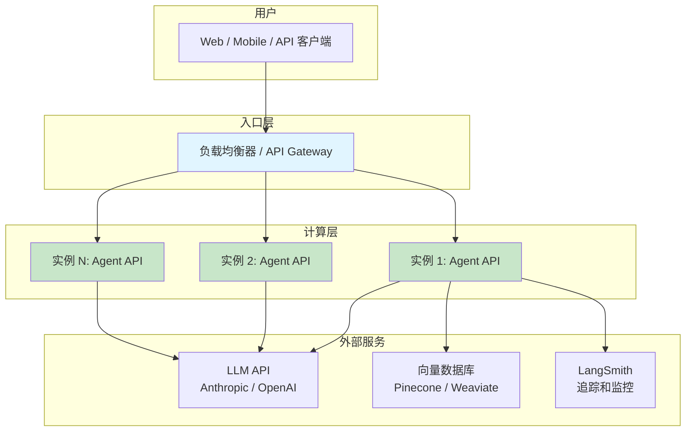

# 部署

## 部署方案概览

将 LangChain Agent 从开发环境部署到生产环境，需要选择合适的部署策略。不同方案在成本、灵活性和运维复杂度之间各有取舍。

::: tip 前端类比
部署 LangChain Agent 的选择逻辑与部署 Next.js 应用类似：**LangServe** 类似 Next.js 内置的 API Routes（快速上手）；**Docker 容器化** 类似自行打包部署到 VPS；**Cloud Run / Lambda** 则类似 Vercel 的 Serverless Functions。核心考量都是：**运维复杂度 vs 控制力度**。
:::

| 方案 | 适用场景 | 优势 | 劣势 |
|------|----------|------|------|
| **FastAPI + LangServe** | 快速原型、中小规模 | 开箱即用、内置 Playground | 需自行部署基础设施 |
| **Docker 容器** | 团队协作、可重复部署 | 环境一致性、易于 CI/CD | 需要容器编排知识 |
| **云平台托管** | 生产环境、自动扩缩 | 运维省心、按量付费 | 冷启动延迟、供应商锁定 |
| **LangSmith 托管** | LangChain 生态深度用户 | 全链路集成 | 目前功能仍在演进中 |

## FastAPI + LangServe 部署

LangServe 是 LangChain 官方的部署方案，基于 FastAPI 构建，提供了开箱即用的 REST API 能力。

### 创建 API 端点

```python
from fastapi import FastAPI
from fastapi.middleware.cors import CORSMiddleware
from langchain.chat_models import init_chat_model
from langchain.prompts import ChatPromptTemplate
from langchain.tools import tool
from langchain.agents import create_tool_calling_agent, AgentExecutor
from langserve import add_routes

app = FastAPI(
    title="LangChain Agent API",
    version="1.0.0",
    description="基于 LangServe 的 Agent API 服务",
)

# 配置 CORS
app.add_middleware(
    CORSMiddleware,
    allow_origins=["https://yourdomain.com"],  # 生产环境不要用 *
    allow_credentials=True,
    allow_methods=["*"],
    allow_headers=["*"],
)

# 定义工具
@tool
def search_knowledge(query: str) -> str:
    """搜索知识库"""
    # 实际应用中连接向量数据库
    return f"找到关于 '{query}' 的相关文档 3 篇"

# 创建 Agent
llm = init_chat_model("claude-sonnet-4-5-20250929")
prompt = ChatPromptTemplate.from_messages([
    ("system", "你是一个智能助手，可以搜索知识库回答问题。"),
    ("human", "{input}"),
    ("placeholder", "{agent_scratchpad}"),
])
agent = create_tool_calling_agent(llm, [search_knowledge], prompt)
executor = AgentExecutor(agent=agent, tools=[search_knowledge])

# 注册路由 —— 自动生成 invoke/stream/batch/playground 端点
add_routes(app, executor, path="/agent")
```

注册后自动生成的端点：

| 端点 | 方法 | 描述 |
|------|------|------|
| `/agent/invoke` | POST | 同步调用 |
| `/agent/stream` | POST | SSE 流式调用 |
| `/agent/batch` | POST | 批量调用 |
| `/agent/input_schema` | GET | 输入 Schema |
| `/agent/output_schema` | GET | 输出 Schema |
| `/agent/playground` | GET | 可视化测试界面 |

### SSE 流式端点

LangServe 内置了 SSE（Server-Sent Events）流式端点，但有时你需要更精细的控制：

```python
from fastapi import FastAPI
from fastapi.responses import StreamingResponse
from langchain.chat_models import init_chat_model
from langchain.prompts import ChatPromptTemplate
import json

app = FastAPI()

llm = init_chat_model("claude-sonnet-4-5-20250929")
prompt = ChatPromptTemplate.from_template("{input}")
chain = prompt | llm

@app.post("/chat/stream")
async def stream_chat(request: dict):
    """自定义 SSE 流式端点"""
    async def event_generator():
        async for chunk in chain.astream({"input": request["input"]}):
            data = json.dumps({"content": chunk.content}, ensure_ascii=False)
            yield f"data: {data}\n\n"
        yield "data: [DONE]\n\n"

    return StreamingResponse(
        event_generator(),
        media_type="text/event-stream",
        headers={
            "Cache-Control": "no-cache",
            "Connection": "keep-alive",
        },
    )
```

### 健康检查端点

```python
from fastapi import FastAPI
from datetime import datetime

app = FastAPI()

_start_time = datetime.now()

@app.get("/health")
def health_check():
    """存活探针 —— 容器是否在运行"""
    return {"status": "healthy", "timestamp": datetime.now().isoformat()}

@app.get("/ready")
async def readiness_check():
    """就绪探针 —— 服务是否可以接受请求"""
    checks = {}
    try:
        # 检查 LLM API 连通性
        llm = init_chat_model("claude-sonnet-4-5-20250929")
        await llm.ainvoke("ping")
        checks["llm_api"] = "ok"
    except Exception as e:
        checks["llm_api"] = f"error: {e}"

    all_ok = all(v == "ok" for v in checks.values())
    return {
        "status": "ready" if all_ok else "not_ready",
        "checks": checks,
        "uptime_seconds": (datetime.now() - _start_time).total_seconds(),
    }
```

## Docker 容器化

### 项目结构

```
my-langchain-app/
├── app/
│   ├── __init__.py
│   ├── server.py           # FastAPI 应用入口
│   ├── agents/
│   │   └── chat_agent.py   # Agent 定义
│   └── tools/
│       └── search.py       # 工具函数
├── tests/
│   ├── test_tools.py
│   └── test_agent.py
├── Dockerfile
├── docker-compose.yml
├── requirements.txt
├── .env.example
└── .dockerignore
```

### Dockerfile

```dockerfile
# 多阶段构建 —— 减小镜像体积
FROM python:3.11-slim AS builder

WORKDIR /app

# 安装依赖（利用 Docker 层缓存）
COPY requirements.txt .
RUN pip install --no-cache-dir --user -r requirements.txt

# ---- 运行阶段 ----
FROM python:3.11-slim

WORKDIR /app

# 复制已安装的依赖
COPY --from=builder /root/.local /root/.local
ENV PATH=/root/.local/bin:$PATH

# 复制应用代码
COPY app/ ./app/

# 创建非 root 用户
RUN useradd --create-home appuser
USER appuser

# 暴露端口
EXPOSE 8000

# 健康检查
HEALTHCHECK --interval=30s --timeout=10s --retries=3 \
    CMD python -c "import urllib.request; urllib.request.urlopen('http://localhost:8000/health')"

# 启动命令
CMD ["uvicorn", "app.server:app", "--host", "0.0.0.0", "--port", "8000"]
```

### docker-compose.yml

```yaml
version: "3.8"

services:
  langchain-api:
    build: .
    ports:
      - "8000:8000"
    env_file:
      - .env
    environment:
      - LANGSMITH_TRACING=true
      - LOG_LEVEL=INFO
    restart: unless-stopped
    deploy:
      resources:
        limits:
          memory: 512M
          cpus: "1.0"
    healthcheck:
      test: ["CMD", "python", "-c", "import urllib.request; urllib.request.urlopen('http://localhost:8000/health')"]
      interval: 30s
      timeout: 10s
      retries: 3

  redis:
    image: redis:7-alpine
    ports:
      - "6379:6379"
    volumes:
      - redis_data:/data

volumes:
  redis_data:
```

### 构建和运行

```bash
# 构建镜像
docker build -t langchain-api:latest .

# 运行容器（单独）
docker run -p 8000:8000 --env-file .env langchain-api:latest

# 使用 docker-compose（带 Redis 等依赖）
docker compose up -d

# 查看日志
docker compose logs -f langchain-api

# 停止服务
docker compose down
```

### .dockerignore

```
__pycache__
*.pyc
.env
.git
.gitignore
tests/
*.md
.vscode/
.idea/
```

## LangSmith 托管部署

LangSmith 平台提供了托管部署能力（LangServe Cloud），适合深度使用 LangChain 生态的团队：

```bash
# 使用 LangChain CLI 部署到 LangSmith
pip install langchain-cli

# 初始化项目
langchain app new my-app --package pirate-speak

# 部署（需要 LangSmith 账号）
langchain deploy
```

详细信息请参考 [LangSmith 部署文档](https://docs.smith.langchain.com/deployment)。

## 环境变量与密钥管理

### 使用 Pydantic Settings

```python
from pydantic_settings import BaseSettings
from functools import lru_cache

class Settings(BaseSettings):
    """应用配置 —— 从环境变量读取"""
    # LLM API Keys
    anthropic_api_key: str
    openai_api_key: str | None = None

    # 应用配置
    api_key: str                    # 客户端认证 Key
    log_level: str = "INFO"
    max_tokens: int = 4096
    default_model: str = "claude-sonnet-4-5-20250929"

    # LangSmith
    langsmith_api_key: str | None = None
    langsmith_tracing: bool = False
    langsmith_project: str = "default"

    class Config:
        env_file = ".env"

@lru_cache
def get_settings() -> Settings:
    return Settings()
```

### API Key 认证中间件

```python
import os
from fastapi import FastAPI, HTTPException, Depends, Security
from fastapi.security import HTTPBearer, HTTPAuthorizationCredentials

app = FastAPI()
security = HTTPBearer()

def verify_api_key(
    credentials: HTTPAuthorizationCredentials = Security(security),
) -> str:
    """验证客户端 API Key"""
    expected = os.getenv("API_KEY")
    if not expected or credentials.credentials != expected:
        raise HTTPException(status_code=401, detail="无效的 API Key")
    return credentials.credentials

@app.post("/agent/invoke")
async def invoke_agent(
    request: dict,
    api_key: str = Depends(verify_api_key),
):
    """受保护的 Agent 调用端点"""
    result = executor.invoke(request)
    return result
```

### .env 文件示例

```bash
# .env.example —— 复制为 .env 并填入实际值
# LLM API Keys
ANTHROPIC_API_KEY=sk-ant-xxxxxxxxxxxx
OPENAI_API_KEY=sk-xxxxxxxxxxxx

# 客户端认证
API_KEY=your-client-api-key

# LangSmith（可选）
LANGSMITH_API_KEY=lsv2_pt_xxxxxxxxxxxx
LANGSMITH_TRACING=true
LANGSMITH_PROJECT=my-agent

# 应用配置
LOG_LEVEL=INFO
MAX_TOKENS=4096
```

## 云平台部署

### 部署架构



### AWS 部署

**方案一：ECS Fargate（推荐）**

```bash
# 使用 AWS Copilot CLI 快速部署
pip install copilot-cli

# 初始化应用
copilot init \
    --app langchain-app \
    --name api-service \
    --type "Load Balanced Web Service" \
    --dockerfile ./Dockerfile \
    --deploy

# 配置环境变量（使用 AWS Secrets Manager）
copilot secret init --name ANTHROPIC_API_KEY
```

**方案二：Lambda + API Gateway（Serverless）**

```python
# lambda_handler.py
from mangum import Mangum
from app.server import app

# 使用 Mangum 将 FastAPI 转换为 Lambda handler
handler = Mangum(app, lifespan="off")
```

```bash
# 使用 SAM 部署
sam build && sam deploy --guided
```

> **注意**：Lambda 有 15 分钟超时限制和冷启动延迟，不适合长时间运行的 Agent 任务。

### GCP Cloud Run

```bash
# 构建并推送镜像
gcloud builds submit --tag gcr.io/PROJECT_ID/langchain-api

# 部署到 Cloud Run
gcloud run deploy langchain-api \
    --image gcr.io/PROJECT_ID/langchain-api \
    --port 8000 \
    --allow-unauthenticated \
    --region asia-east1 \
    --memory 512Mi \
    --cpu 1 \
    --min-instances 0 \
    --max-instances 10 \
    --set-env-vars LANGSMITH_TRACING=true \
    --set-secrets ANTHROPIC_API_KEY=anthropic-key:latest
```

### Azure Container Apps

```bash
# 创建容器应用环境
az containerapp env create \
    --name langchain-env \
    --resource-group my-rg \
    --location eastasia

# 部署应用
az containerapp up \
    --name langchain-api \
    --source . \
    --resource-group my-rg \
    --environment langchain-env \
    --ingress external \
    --target-port 8000 \
    --min-replicas 0 \
    --max-replicas 10 \
    --env-vars LANGSMITH_TRACING=true \
    --secrets anthropic-key=YOUR_KEY \
    --secret-env-vars ANTHROPIC_API_KEY=anthropic-key
```

## 生产环境清单

### 速率限制

```python
from fastapi import FastAPI, Request
from slowapi import Limiter, _rate_limit_exceeded_handler
from slowapi.util import get_remote_address
from slowapi.errors import RateLimitExceeded

limiter = Limiter(key_func=get_remote_address)
app = FastAPI()
app.state.limiter = limiter
app.add_exception_handler(RateLimitExceeded, _rate_limit_exceeded_handler)

@app.post("/agent/invoke")
@limiter.limit("10/minute")  # 每分钟最多 10 次请求
async def invoke_agent(request: Request, body: dict):
    result = executor.invoke(body)
    return result
```

### 结构化日志

```python
import logging
import json
import sys

class JSONFormatter(logging.Formatter):
    """结构化 JSON 日志格式"""
    def format(self, record):
        log_data = {
            "timestamp": self.formatTime(record),
            "level": record.levelname,
            "message": record.getMessage(),
            "module": record.module,
            "function": record.funcName,
        }
        if record.exc_info:
            log_data["exception"] = self.formatException(record.exc_info)
        return json.dumps(log_data, ensure_ascii=False)

# 配置根日志器
handler = logging.StreamHandler(sys.stdout)
handler.setFormatter(JSONFormatter())
logging.basicConfig(level=logging.INFO, handlers=[handler])

logger = logging.getLogger(__name__)
```

### 优雅关闭

```python
from contextlib import asynccontextmanager
from fastapi import FastAPI
import logging

logger = logging.getLogger(__name__)

@asynccontextmanager
async def lifespan(app: FastAPI):
    # ---- 启动阶段 ----
    logger.info("应用启动，初始化资源...")
    # 预热模型连接、初始化连接池等
    yield
    # ---- 关闭阶段 ----
    logger.info("应用关闭，清理资源...")
    # 关闭数据库连接、刷新日志缓冲区等

app = FastAPI(lifespan=lifespan)
```

### 扩展策略

```bash
# 使用 Gunicorn 多 Worker 模式
gunicorn app.server:app \
    -w 4 \
    -k uvicorn.workers.UvicornWorker \
    --bind 0.0.0.0:8000 \
    --timeout 120 \
    --graceful-timeout 30
```

### 完整检查清单

**安全性**

- [ ] 使用 HTTPS（配置 SSL/TLS 证书）
- [ ] 实现 API Key / JWT 认证
- [ ] 配置 CORS 白名单（禁止使用 `*`）
- [ ] 密钥通过环境变量或 Secrets Manager 注入，不硬编码
- [ ] 定期轮换 API Key
- [ ] 输入验证和清洗（防止 prompt injection）

**性能**

- [ ] 配置适当的请求超时（Agent 通常需要 30-120 秒）
- [ ] 实现速率限制
- [ ] 使用连接池（数据库、HTTP 客户端）
- [ ] 考虑响应缓存（幂等请求）
- [ ] 启用 SSE 流式响应减少首字延迟

**可观测性**

- [ ] 结构化日志（JSON 格式）
- [ ] 集成 LangSmith 追踪
- [ ] 健康检查端点（`/health` + `/ready`）
- [ ] 配置告警（错误率、延迟、Token 用量）

**可靠性**

- [ ] 实现优雅关闭（`lifespan`）
- [ ] 配置自动重启策略
- [ ] 设置资源限制（CPU、内存）
- [ ] 配置水平自动扩缩
- [ ] 异常重试与断路器

## 常见问题

**Q: LangServe 和直接使用 FastAPI 有什么区别？**

LangServe 在 FastAPI 基础上自动为 LangChain Runnable 生成 REST API、内置 Playground、自动处理流式响应。如果你的应用只是简单的 API 封装，直接用 FastAPI 即可；如果要部署完整的 LangChain Chain/Agent，LangServe 更方便。

**Q: 如何处理长时间运行的 Agent 请求？**

1. 优先使用流式响应（stream）而非同步调用，让用户尽快看到输出
2. 配置足够的超时时间（Agent 可能需要多轮工具调用）
3. 对于超过 5 分钟的任务，考虑异步处理 + WebSocket 通知

**Q: 如何选择云平台？**

- **已有 AWS 基础设施** → ECS Fargate 或 Lambda
- **想要最简单的部署** → GCP Cloud Run（从源码直接部署）
- **企业级合规要求** → Azure Container Apps
- **纯 LangChain 生态** → LangSmith 托管

## 下一步

- 学习 [流式响应](/ai/langchain/guide/streaming) 优化用户体验
- 了解 [可观测性](/ai/langchain/guide/observability) 在生产环境中监控 Agent
- 掌握 [测试](/ai/langchain/guide/testing) 确保部署前的质量关

## 参考资源

- [LangServe 官方仓库](https://github.com/langchain-ai/langserve)
- [FastAPI 官方文档](https://fastapi.tiangolo.com/)
- [Docker 官方文档](https://docs.docker.com/)
- [LangSmith 部署文档](https://docs.smith.langchain.com/)
