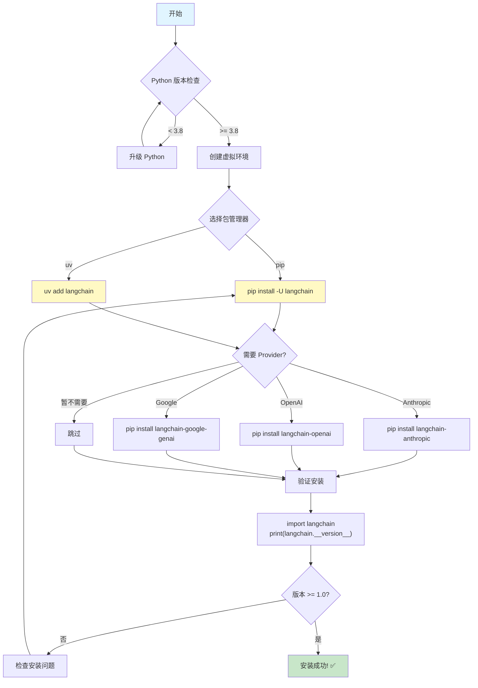
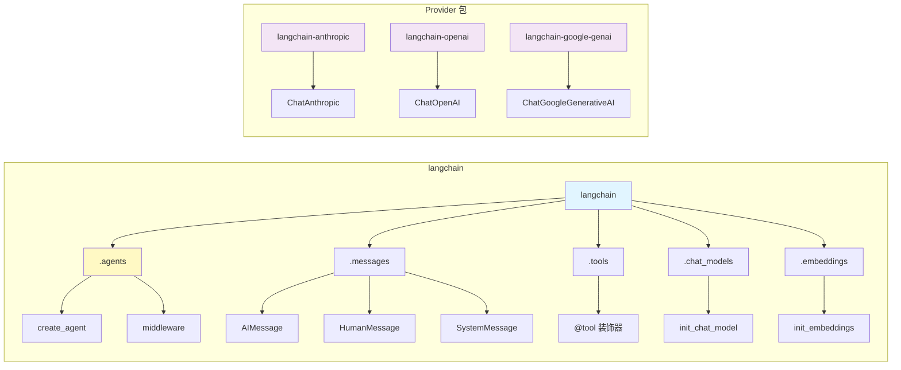

# 环境搭建

## 概述

本章将指导你完成 LangChain 1.0 的环境搭建，从 Python 环境要求到包安装，让你快速开始 LangChain 开发之旅。

## 核心概念

LangChain 1.0 是一个全新的里程碑版本，带来了更简洁的API和更强大的功能。与旧版本相比，v1.0 引入了统一的 `create_agent` 接口、内容块（Content Blocks）以及更简化的命名空间。

### 安装与验证流程图

下图展示了 LangChain 1.0 的完整安装流程:



### 主要特性

- **统一的Agent创建接口**: 使用 `create_agent` 函数简化Agent构建
- **中间件支持**: 通过middleware增强Agent功能
- **内容块**: 统一的内容访问接口，支持多种Provider
- **简化的命名空间**: 更清晰的import路径

## 前置要求

- **Python版本**: Python 3.8 或更高版本
- **包管理器**: pip 或 uv

## 代码示例 1: 安装 LangChain 1.0

### 使用 pip 安装

最常用的安装方式是使用 pip：

```python
# 在命令行执行
pip install -U langchain
```

### 使用 uv 安装

uv 是一个更快的 Python 包管理器，推荐使用：

```python
# 在命令行执行
uv add langchain
```

**说明**: `-U` 参数表示升级到最新版本。如果你是首次安装，这个参数会自动安装最新的稳定版本。

## 代码示例 2: 验证安装

安装完成后，可以通过以下代码验证 LangChain 是否正确安装：

```python
# 导入核心组件
from langchain.agents import create_agent
from langchain.messages import AIMessage, HumanMessage
from langchain.tools import tool
from langchain.chat_models import init_chat_model

# 打印版本信息
import langchain
print(f"LangChain 版本: {langchain.__version__}")

# 验证核心导入
print("核心组件导入成功!")
```

**预期输出**:

```
LangChain 版本: 1.0.x
核心组件导入成功!
```

## 代码示例 3: 基础导入规范

LangChain 1.0 提供了清晰的导入路径。以下是常用组件的标准导入方式：

### 导入命名空间结构图



**代码示例**:

```python
# Agent构建
from langchain.agents import create_agent

# 消息和内容
from langchain.messages import AIMessage, HumanMessage

# 工具定义
from langchain.tools import tool

# 模型初始化
from langchain.chat_models import init_chat_model
from langchain.embeddings import init_embeddings
```

**说明**:

- `create_agent`: 用于创建Agent的统一接口
- `AIMessage`, `HumanMessage`: 消息对象，用于构建对话
- `tool`: 装饰器，用于定义自定义工具
- `init_chat_model`, `init_embeddings`: 模型初始化函数

## Legacy 包安装（可选）

如果你需要使用旧版本的 LangChain 功能（如legacy chains、retrievers等），可以安装 `langchain-classic` 包：

```python
# 使用 pip 安装
pip install langchain-classic

# 使用 uv 安装
uv add langchain-classic
```

**注意**: `langchain-classic` 包含已弃用的功能，仅在迁移期间使用。新项目应使用 LangChain 1.0 的新API。

## 最佳实践

1. **使用虚拟环境**: 建议为每个项目创建独立的 Python 虚拟环境

   ```bash
   python -m venv langchain-env
   source langchain-env/bin/activate  # Linux/Mac
   langchain-env\Scripts\activate     # Windows
   ```

2. **固定版本**: 在生产环境中，使用 `requirements.txt` 固定依赖版本

   ```
   langchain==1.0.x
   ```

3. **保持更新**: 定期更新 LangChain 以获取最新功能和安全修复

   ```bash
   pip install -U langchain
   ```

4. **Provider包**: 根据使用的LLM Provider安装对应的集成包

   ```bash
   # Anthropic
   pip install langchain-anthropic

   # OpenAI
   pip install langchain-openai

   # Google
   pip install langchain-google-genai
   ```

## 常见问题

**Q: LangChain 1.0 与之前版本有什么主要区别？**

A: LangChain 1.0 是一个重大更新，主要变化包括：

- 统一的 `create_agent` 接口替代多个Agent构造函数
- 新的Content Blocks API提供统一的内容访问
- 简化的命名空间，减少导入复杂度
- 弃用了部分legacy功能（转移到 `langchain-classic`）

**Q: 我需要同时安装 langchain 和 langchain-classic 吗？**

A: 不需要。如果你是新项目，只需安装 `langchain`。只有在迁移旧代码或需要使用legacy功能时才安装 `langchain-classic`。

**Q: 如何选择 pip 和 uv？**

A: uv 是一个更快的包管理器，安装速度通常快 10-100 倍。如果你对性能有要求，推荐使用 uv。否则，传统的 pip 也完全够用。

**Q: 安装时遇到权限错误怎么办？**

A: 有两种解决方案：

1. 使用 `--user` 标志：`pip install --user langchain`
2. 使用虚拟环境（推荐）

## 下一步

现在你已经成功搭建了 LangChain 1.0 开发环境，接下来可以：

- 学习 [Agent 架构](/ai/langchain/guide/agent-architecture) - 了解如何创建强大的AI Agent
- 探索 [Middleware](/ai/langchain/guide/middleware) - 通过中间件增强Agent功能
- 查看 [Content Blocks](/ai/langchain/guide/content-blocks) - 掌握统一的内容访问接口

## 参考资源

- [LangChain 官方文档](https://python.langchain.com/)
- [LangChain GitHub 仓库](https://github.com/langchain-ai/langchain)
- [LangChain v1.0 发布说明](https://docs.langchain.com/oss/python/releases/langchain-v1/)
