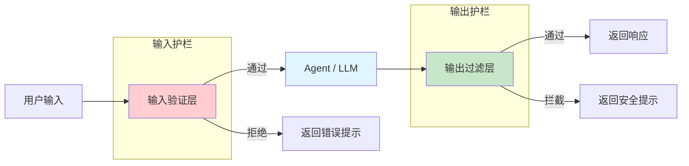

# 安全护栏 Guardrails

> 前置阅读：[中间件概览](/ai/langchain/guide/middleware-overview) · [内置中间件](/ai/langchain/guide/prebuilt-middleware)

## 什么是安全护栏

安全护栏（Guardrails）是 AI Agent 系统中的**安全保障机制**。LLM 的输出具有不可预测性——它可能生成有害内容、泄露隐私信息、偏离预定主题，甚至在工具调用时执行危险操作。安全护栏通过在 Agent 的输入和输出两端设置检查点，确保系统行为始终在可控范围内。

在 LangChain 1.0 中，安全护栏的实现依赖于**中间件（Middleware）系统**。每种安全策略都可以封装为独立的 Middleware，按需组合到 Agent 中。

### 护栏的核心目标

| 目标 | 说明 | 示例 |
|------|------|------|
| 输入安全 | 阻止恶意或不合规的用户输入 | 注入攻击检测、话题限制 |
| 输出安全 | 过滤模型返回的不当内容 | 敏感词过滤、格式校验 |
| 隐私保护 | 防止 PII 泄露 | 邮箱脱敏、身份证号拦截 |
| 行为约束 | 限制 Agent 的操作范围 | 工具调用白名单、频率限制 |

## 护栏架构全景



## 输入验证

输入验证是第一道防线，在消息到达 LLM 之前进行检查。

### 输入长度限制

防止过长的输入消耗过多 Token 或触发上下文溢出：

```python
from langchain.agents.middleware import Middleware

class InputLengthGuard(Middleware):
    """限制用户输入长度的护栏"""

    def __init__(self, max_chars: int = 5000):
        self.max_chars = max_chars

    async def on_request(self, state, config, *, next):
        # 获取最后一条用户消息
        last_message = state["messages"][-1]
        if hasattr(last_message, "content") and len(last_message.content) > self.max_chars:
            # 拦截请求，直接返回提示
            from langchain_core.messages import AIMessage
            return {
                "messages": [
                    AIMessage(content=f"输入过长，请将内容控制在 {self.max_chars} 字符以内。")
                ]
            }
        # 通过验证，继续执行
        return await next(state, config)
```

### 话题限制

将 Agent 的对话范围限定在特定领域内：

```python
class TopicGuard(Middleware):
    """限制对话话题范围"""

    def __init__(self, allowed_topics: list[str], model=None):
        self.allowed_topics = allowed_topics
        self.model = model

    async def on_request(self, state, config, *, next):
        last_message = state["messages"][-1]
        user_input = last_message.content

        # 使用轻量级模型判断话题是否在允许范围内
        check_prompt = (
            f"判断以下用户输入是否与这些话题相关：{', '.join(self.allowed_topics)}。\n"
            f"用户输入：{user_input}\n"
            f"只回答 YES 或 NO。"
        )
        result = await self.model.ainvoke(check_prompt)

        if "NO" in result.content.upper():
            from langchain_core.messages import AIMessage
            return {
                "messages": [
                    AIMessage(
                        content=f"抱歉，我只能回答与以下话题相关的问题：{', '.join(self.allowed_topics)}"
                    )
                ]
            }

        return await next(state, config)
```

### Prompt 注入检测

检测并拦截常见的 Prompt 注入攻击模式：

```python
import re

class PromptInjectionGuard(Middleware):
    """检测常见的 Prompt 注入攻击"""

    INJECTION_PATTERNS = [
        r"ignore\s+(all\s+)?previous\s+instructions",
        r"forget\s+(everything|all|your\s+instructions)",
        r"you\s+are\s+now\s+a",
        r"system\s*:\s*",
        r"new\s+instructions?\s*:",
    ]

    def __init__(self):
        self.compiled_patterns = [
            re.compile(p, re.IGNORECASE) for p in self.INJECTION_PATTERNS
        ]

    async def on_request(self, state, config, *, next):
        last_message = state["messages"][-1]
        user_input = last_message.content

        for pattern in self.compiled_patterns:
            if pattern.search(user_input):
                from langchain_core.messages import AIMessage
                return {
                    "messages": [
                        AIMessage(content="检测到不安全的输入内容，请重新描述您的问题。")
                    ]
                }

        return await next(state, config)
```

## 输出过滤

输出过滤在 LLM 生成响应之后、返回给用户之前进行检查。

### 敏感词过滤

过滤模型输出中的敏感词或不当内容：

```python
class OutputContentFilter(Middleware):
    """过滤模型输出中的敏感内容"""

    def __init__(self, blocked_words: list[str], replacement: str = "***"):
        self.blocked_words = blocked_words
        self.replacement = replacement

    async def on_request(self, state, config, *, next):
        # 先正常执行 Agent
        response = await next(state, config)

        # 过滤输出中的敏感词
        for msg in response.get("messages", []):
            if hasattr(msg, "content") and isinstance(msg.content, str):
                for word in self.blocked_words:
                    msg.content = msg.content.replace(word, self.replacement)

        return response
```

### 输出格式校验

确保 Agent 的输出符合预期格式：

```python
import json

class OutputFormatValidator(Middleware):
    """校验输出是否符合预期的 JSON 格式"""

    def __init__(self, required_fields: list[str] | None = None):
        self.required_fields = required_fields or []

    async def on_request(self, state, config, *, next):
        response = await next(state, config)

        for msg in response.get("messages", []):
            if not hasattr(msg, "content"):
                continue
            try:
                data = json.loads(msg.content)
                missing = [f for f in self.required_fields if f not in data]
                if missing:
                    from langchain_core.messages import AIMessage
                    return {
                        "messages": [
                            AIMessage(
                                content=f"输出缺少必要字段：{', '.join(missing)}，请重新生成。"
                            )
                        ]
                    }
            except json.JSONDecodeError:
                # 非 JSON 输出，跳过校验
                pass

        return response
```

## PII 检测

个人身份信息（PII）检测是安全护栏的重要组成部分。LangChain 内置了 `PIIMiddleware`，提供开箱即用的 PII 检测与处理能力。

> 完整的 PIIMiddleware API 和配置选项请参考 [内置中间件](/ai/langchain/guide/prebuilt-middleware)。

### 快速使用

```python
from langchain.agents import create_agent
from langchain.agents.middleware import PIIMiddleware

agent = create_agent(
    model="claude-sonnet-4-5-20250929",
    tools=[search, send_email],
    middleware=[
        # 邮箱脱敏：test@example.com → ***@***.***
        PIIMiddleware("email", strategy="redact"),
        # 身份证号拦截：包含身份证号的请求直接拒绝
        PIIMiddleware("ssn", strategy="block"),
        # 手机号脱敏（自定义正则）
        PIIMiddleware(
            "phone_number",
            detector=r"(?:(?:\+|00)86)?1[3-9]\d{9}",
            strategy="redact",
        ),
    ],
)
```

### 自定义 PII 检测器

当内置检测器不满足需求时，可以编写自定义的 PII Middleware：

```python
import re

class CustomPIIGuard(Middleware):
    """自定义 PII 检测护栏"""

    def __init__(self):
        self.patterns = {
            "银行卡号": re.compile(r"\b\d{16,19}\b"),
            "IP 地址": re.compile(r"\b\d{1,3}\.\d{1,3}\.\d{1,3}\.\d{1,3}\b"),
        }

    async def on_request(self, state, config, *, next):
        last_message = state["messages"][-1]
        user_input = last_message.content

        detected = []
        for pii_type, pattern in self.patterns.items():
            if pattern.search(user_input):
                detected.append(pii_type)

        if detected:
            from langchain_core.messages import AIMessage
            return {
                "messages": [
                    AIMessage(
                        content=f"检测到敏感信息（{', '.join(detected)}），请移除后重试。"
                    )
                ]
            }

        return await next(state, config)
```

## 内容安全过滤

内容安全过滤器用于阻止有害、违规或不适当的内容进出 Agent 系统。

```python
class ContentSafetyFilter(Middleware):
    """基于分类模型的内容安全过滤"""

    def __init__(self, safety_model=None, threshold: float = 0.8):
        self.safety_model = safety_model
        self.threshold = threshold

    async def on_request(self, state, config, *, next):
        last_message = state["messages"][-1]

        # 使用安全分类模型评估输入
        safety_check = await self.safety_model.ainvoke(
            f"评估以下文本的安全性，返回 0-1 的分数（1=完全安全）：\n{last_message.content}"
        )

        score = float(safety_check.content.strip())
        if score < self.threshold:
            from langchain_core.messages import AIMessage
            return {
                "messages": [
                    AIMessage(content="您的输入可能包含不适当的内容，请调整后重试。")
                ]
            }

        return await next(state, config)
```

## 组合多个护栏

在生产环境中，通常需要组合多种护栏，形成多层防御。Middleware 的洋葱模型使得组合非常自然：

```python
from langchain.agents import create_agent
from langchain.agents.middleware import PIIMiddleware
from langchain_anthropic import ChatAnthropic

model = ChatAnthropic(model="claude-sonnet-4-5-20250929")

agent = create_agent(
    model=model,
    tools=[search, calculate, send_email],
    middleware=[
        # 第 1 层：Prompt 注入检测（最外层，最先执行）
        PromptInjectionGuard(),
        # 第 2 层：输入长度限制
        InputLengthGuard(max_chars=3000),
        # 第 3 层：话题限制
        TopicGuard(
            allowed_topics=["技术", "编程", "数据分析"],
            model=model,
        ),
        # 第 4 层：PII 脱敏
        PIIMiddleware("email", strategy="redact"),
        PIIMiddleware("phone_number", strategy="redact"),
        # 第 5 层：输出内容过滤（最内层）
        OutputContentFilter(blocked_words=["密码", "秘钥"]),
    ],
    system_prompt="你是一个技术助手，只回答技术相关问题。",
)
```

**执行顺序**：

1. 请求阶段：PromptInjectionGuard → InputLengthGuard → TopicGuard → PIIMiddleware → Agent 处理
2. 响应阶段：Agent 响应 → OutputContentFilter（从内到外返回）

::: tip 前端类比
多层护栏就像 Express.js 的中间件链——每个 `app.use()` 注册一层检查，请求必须逐层通过所有中间件后才能到达路由处理函数。任何一层都可以拦截请求并直接返回响应。
:::

## 生产环境最佳实践

### 1. 分层防御

不要依赖单一护栏，而是构建多层防御体系：

| 层级 | 护栏类型 | 说明 |
|------|---------|------|
| L1 | 输入格式校验 | 长度、编码、基础格式 |
| L2 | 注入攻击检测 | Prompt 注入、越狱尝试 |
| L3 | PII 检测 | 隐私信息脱敏或拦截 |
| L4 | 话题限制 | 确保在业务范围内 |
| L5 | 输出过滤 | 敏感词、格式校验 |

### 2. 日志与监控

记录每次护栏触发的详细信息，用于分析和改进：

```python
import logging

logger = logging.getLogger("guardrails")

class LoggingGuard(Middleware):
    """记录所有护栏触发事件"""

    async def on_request(self, state, config, *, next):
        response = await next(state, config)

        # 检查是否有护栏触发记录
        metadata = config.get("metadata", {})
        if metadata.get("guardrail_triggered"):
            logger.warning(
                "护栏触发: type=%s, reason=%s, user_input=%s",
                metadata["guardrail_type"],
                metadata["guardrail_reason"],
                state["messages"][-1].content[:100],
            )

        return response
```

### 3. 优雅降级

护栏拦截时应提供清晰、友好的提示，而不是简单地拒绝：

```python
# 不推荐：生硬拒绝
"请求被拒绝。"

# 推荐：解释原因并引导用户
"您的问题涉及医疗建议，这超出了我的能力范围。建议您咨询专业医生。我可以帮您查找附近的医院信息。"
```

### 4. 定期更新规则

安全威胁不断演变，护栏规则也需要持续迭代：

- 定期审查注入攻击模式库
- 根据用户反馈调整话题限制范围
- 更新 PII 检测正则以覆盖新场景
- 监控误拦截率（False Positive），避免过度限制

## 下一步

- [中间件概览](/ai/langchain/guide/middleware-overview) — 深入理解 Middleware 的洋葱模型与执行机制
- [内置中间件](/ai/langchain/guide/prebuilt-middleware) — PIIMiddleware、HumanInTheLoopMiddleware 的完整 API
- [人机协作 HITL](/ai/langchain/guide/hitl) — 在关键操作前暂停并等待人工审批
