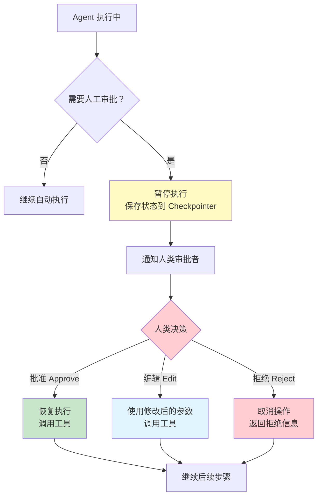

# 人机协作 HITL

> 前置阅读：[内置中间件](/ai/langchain/guide/prebuilt-middleware) · [Agent 实战指南](/ai/langchain/guide/agents)

## 什么是 Human-in-the-Loop

Human-in-the-Loop（HITL，人机协作 / 人工介入）是一种**在 Agent 执行关键操作前暂停并等待人工审批**的机制。并非所有 AI 决策都应该自动执行——发送邮件、修改数据库、执行支付等高风险操作需要人类确认后才能继续。

HITL 的核心思想是：**让 AI 处理日常工作，让人类把关关键决策**。

### 为什么需要 HITL

| 场景 | 没有 HITL | 有 HITL |
|------|----------|---------|
| 发送邮件 | Agent 直接发送，内容可能不当 | 人工审核邮件内容后确认发送 |
| 数据库操作 | Agent 直接执行 DELETE，可能误删 | 人工确认 SQL 语句后再执行 |
| 费用支出 | Agent 自动调用付费 API | 超过阈值时暂停，等待审批 |
| 代码部署 | Agent 直接推送到生产环境 | 人工 Review 代码变更后批准 |

::: tip 前端类比
HITL 类似于表单提交前的**确认对话框**（Confirmation Dialog），但有本质区别：前端的确认是**客户端同步阻塞**，用户点击"确认"后立即继续；而 HITL 是**服务端持久化暂停**——Agent 将状态保存到数据库后完全停止，可能几分钟甚至几天后才收到人工审批，然后从中断点恢复执行。这更像是审批工作流系统（如 OA 系统的请假审批），而不是简单的 `window.confirm()`。
:::

## HITL 决策流程



## HumanInTheLoopMiddleware

LangChain 1.0 内置了 `HumanInTheLoopMiddleware`，提供开箱即用的 HITL 能力。

> 完整的 API 参数和配置选项请参考 [内置中间件](/ai/langchain/guide/prebuilt-middleware)。

### 基本用法

```python
from langchain.agents import create_agent
from langchain.agents.middleware import HumanInTheLoopMiddleware
from langchain.tools import tool
from langgraph.checkpoint.memory import MemorySaver

@tool
def send_email(to: str, subject: str, body: str) -> str:
    """发送电子邮件"""
    # 实际的邮件发送逻辑
    return f"邮件已发送至 {to}"

@tool
def search(query: str) -> str:
    """搜索信息"""
    return f"搜索结果: {query}"

agent = create_agent(
    model="claude-sonnet-4-5-20250929",
    tools=[send_email, search],
    middleware=[
        HumanInTheLoopMiddleware(
            tools=["send_email"],  # 只对 send_email 启用人工审批
        ),
    ],
    checkpointer=MemorySaver(),  # HITL 需要 Checkpointer 来保存中断状态
)
```

### 中断与恢复流程

当 Agent 尝试调用受保护的工具时，执行会暂停：

```python
# 第 1 步：用户发起请求
config = {"configurable": {"thread_id": "email-thread-1"}}
result = agent.invoke(
    {"messages": [{"role": "user", "content": "给 alice@example.com 发一封会议通知邮件"}]},
    config=config,
)

# Agent 会在调用 send_email 前暂停
# result 包含中断信息：
# {
#   "interrupted": True,
#   "tool_call": {
#     "name": "send_email",
#     "args": {
#       "to": "alice@example.com",
#       "subject": "会议通知",
#       "body": "您好，明天下午 3 点有项目周会..."
#     }
#   }
# }
```

```python
# 第 2 步：人工审批后恢复执行
# 方式 A：批准执行
result = agent.invoke(
    {"messages": [{"role": "user", "content": "approve"}]},
    config=config,
)
# Agent 恢复执行，调用 send_email

# 方式 B：修改参数后批准
result = agent.invoke(
    {
        "messages": [
            {
                "role": "user",
                "content": "approve",
                "tool_call_override": {
                    "args": {
                        "to": "alice@example.com",
                        "subject": "紧急：会议通知",  # 修改了标题
                        "body": "您好，明天下午 3 点有紧急项目周会...",
                    }
                },
            }
        ]
    },
    config=config,
)

# 方式 C：拒绝执行
result = agent.invoke(
    {"messages": [{"role": "user", "content": "reject"}]},
    config=config,
)
# Agent 收到拒绝信号，生成替代回复
```

## 工具级 vs 步骤级中断

HITL 可以在不同粒度上设置中断：

### 工具级中断（推荐）

只对特定的高风险工具启用审批，其他工具自动执行：

```python
HumanInTheLoopMiddleware(
    tools=["send_email", "delete_record", "execute_payment"],
    # 只有调用这三个工具时才会暂停
)
```

**优点**：用户体验好，只在必要时中断；Agent 的常规操作（搜索、计算等）不受影响。

### 步骤级中断

对 Agent 的每一步决策都要求人工确认：

```python
HumanInTheLoopMiddleware(
    tools=None,  # 不指定工具 = 对所有工具生效
)
```

**优点**：安全性最高；**缺点**：交互成本极高，适合调试或极高风险场景。

### 条件中断

根据工具参数动态决定是否需要审批：

```python
from langchain.agents.middleware import Middleware

class ConditionalApproval(Middleware):
    """根据金额决定是否需要人工审批"""

    async def on_request(self, state, config, *, next):
        response = await next(state, config)

        # 检查是否有待执行的工具调用
        for msg in response.get("messages", []):
            if hasattr(msg, "tool_calls"):
                for tc in msg.tool_calls:
                    if tc["name"] == "execute_payment":
                        amount = tc["args"].get("amount", 0)
                        if amount > 1000:
                            # 超过 1000 元需要人工审批
                            return self._create_interrupt(
                                response,
                                reason=f"支付金额 ¥{amount} 超过阈值，需要审批",
                            )

        return response
```

## 与 Web 应用集成

在实际生产环境中，HITL 通常需要集成到 Web 应用中，通过 UI 界面展示待审批的操作。

### 审批 UI 模式

```python
# FastAPI 后端示例
from fastapi import FastAPI
from pydantic import BaseModel

app = FastAPI()

class ApprovalRequest(BaseModel):
    thread_id: str
    decision: str  # "approve" | "reject" | "edit"
    modified_args: dict | None = None


@app.post("/chat")
async def chat(message: str, thread_id: str):
    """用户发送消息"""
    config = {"configurable": {"thread_id": thread_id}}
    result = agent.invoke(
        {"messages": [{"role": "user", "content": message}]},
        config=config,
    )

    # 检查是否需要人工审批
    if result.get("interrupted"):
        return {
            "status": "pending_approval",
            "tool_call": result["tool_call"],
            "message": "Agent 请求执行以下操作，请审批：",
        }

    return {
        "status": "completed",
        "response": result["messages"][-1].content,
    }


@app.post("/approve")
async def approve(request: ApprovalRequest):
    """处理人工审批"""
    config = {"configurable": {"thread_id": request.thread_id}}

    if request.decision == "approve":
        message = "approve"
    elif request.decision == "reject":
        message = "reject"
    elif request.decision == "edit" and request.modified_args:
        message = "approve"
        # 将修改后的参数传递给 Agent
    else:
        return {"error": "无效的审批决策"}

    result = agent.invoke(
        {"messages": [{"role": "user", "content": message}]},
        config=config,
    )

    return {
        "status": "completed",
        "response": result["messages"][-1].content,
    }
```

### 前端审批界面模式

```
┌─────────────────────────────────────────┐
│  AI 助手请求执行以下操作：                 │
│                                         │
│  📧 发送邮件                             │
│  ├─ 收件人: alice@example.com           │
│  ├─ 主题: 会议通知                       │
│  └─ 正文: 您好，明天下午 3 点有项目周会...  │
│                                         │
│  ┌──────┐  ┌──────┐  ┌──────┐          │
│  │ 批准  │  │ 编辑  │  │ 拒绝  │          │
│  └──────┘  └──────┘  └──────┘          │
└─────────────────────────────────────────┘
```

## 实战：邮件发送审批系统

下面是一个完整的邮件发送审批示例：

```python
import asyncio
from langchain.agents import create_agent
from langchain.agents.middleware import HumanInTheLoopMiddleware
from langchain.tools import tool
from langchain_anthropic import ChatAnthropic
from langgraph.checkpoint.memory import MemorySaver


@tool
def send_email(to: str, subject: str, body: str) -> str:
    """发送电子邮件

    Args:
        to: 收件人邮箱地址
        subject: 邮件主题
        body: 邮件正文
    """
    # 模拟发送邮件
    print(f"[邮件已发送] 收件人: {to}, 主题: {subject}")
    return f"邮件已成功发送至 {to}"


@tool
def search_contacts(name: str) -> str:
    """搜索联系人信息

    Args:
        name: 联系人姓名
    """
    contacts = {
        "Alice": "alice@example.com",
        "Bob": "bob@company.com",
    }
    email = contacts.get(name)
    if email:
        return f"{name} 的邮箱是 {email}"
    return f"未找到联系人 {name}"


@tool
def get_schedule(date: str) -> str:
    """查询日程安排

    Args:
        date: 日期，格式 YYYY-MM-DD
    """
    return f"{date} 的日程：14:00 技术评审，16:00 周会"


# 创建带 HITL 的 Agent
model = ChatAnthropic(model="claude-sonnet-4-5-20250929")

agent = create_agent(
    model=model,
    tools=[send_email, search_contacts, get_schedule],
    middleware=[
        HumanInTheLoopMiddleware(
            tools=["send_email"],  # 只有发邮件需要审批
        ),
    ],
    checkpointer=MemorySaver(),
    system_prompt=(
        "你是一个办公助手，可以帮助用户搜索联系人、查询日程和发送邮件。\n"
        "发送邮件前请先确认收件人信息。"
    ),
)


async def run():
    config = {"configurable": {"thread_id": "email-demo"}}

    # 用户请求发送邮件
    result = agent.invoke(
        {
            "messages": [
                {
                    "role": "user",
                    "content": "帮我给 Alice 发一封邮件，通知她明天的技术评审时间",
                }
            ]
        },
        config=config,
    )

    # Agent 会先搜索联系人、查询日程（自动执行）
    # 然后在发送邮件前暂停，等待审批

    if result.get("interrupted"):
        print("=== 待审批的邮件 ===")
        print(f"收件人: {result['tool_call']['args']['to']}")
        print(f"主题: {result['tool_call']['args']['subject']}")
        print(f"正文: {result['tool_call']['args']['body']}")
        print("==================")

        # 人工批准
        result = agent.invoke(
            {"messages": [{"role": "user", "content": "approve"}]},
            config=config,
        )
        print(f"最终回复: {result['messages'][-1].content}")


asyncio.run(run())
```

## 与 LangGraph Interrupts 的关系

LangChain 的 `HumanInTheLoopMiddleware` 底层使用了 LangGraph 的 `interrupt` 机制。如果你需要更细粒度的控制（如在自定义节点中设置中断、多步审批流程等），可以直接使用 LangGraph 的 Interrupts API。

| 特性 | LangChain HITL Middleware | LangGraph Interrupts |
|------|--------------------------|---------------------|
| 使用门槛 | 低，声明式配置 | 中，需要了解图结构 |
| 灵活性 | 工具级别的中断 | 任意节点级别的中断 |
| 多步审批 | 不支持 | 支持 |
| 自定义中断逻辑 | 有限 | 完全自定义 |
| 适用场景 | 简单的工具审批 | 复杂的审批工作流 |

> 详细了解 LangGraph 的中断机制，请参考 [LangGraph Interrupts](/ai/langgraph/guide/interrupts)。

## 最佳实践

### 1. 合理选择需要审批的工具

不是所有工具都需要 HITL。遵循最小权限原则：

```python
# 推荐：只对有副作用的工具启用
HumanInTheLoopMiddleware(tools=["send_email", "delete_file", "execute_sql"])

# 不推荐：对所有工具启用（用户体验差）
HumanInTheLoopMiddleware(tools=None)
```

### 2. 提供清晰的审批上下文

在 system_prompt 中指导 Agent 解释为什么要执行该操作：

```python
system_prompt = """
在调用需要审批的工具之前，请先向用户说明：
1. 你准备执行什么操作
2. 为什么要执行这个操作
3. 操作的具体参数
"""
```

### 3. 设置审批超时

长时间未审批的请求应有超时处理：

```python
# 在 Web 应用中实现超时逻辑
from datetime import datetime, timedelta

APPROVAL_TIMEOUT = timedelta(hours=24)

async def check_pending_approvals():
    """定期检查并过期超时的审批请求"""
    pending = await get_pending_approvals()
    for approval in pending:
        if datetime.now() - approval.created_at > APPROVAL_TIMEOUT:
            await expire_approval(approval.thread_id)
            # 通知用户审批已超时
```

### 4. 记录审批日志

所有审批决策都应记录，便于审计追溯：

```python
import logging

logger = logging.getLogger("hitl_audit")

# 记录每次审批决策
logger.info(
    "HITL 审批: thread=%s, tool=%s, decision=%s, reviewer=%s",
    thread_id,
    tool_name,
    decision,
    reviewer_id,
)
```

## 下一步

- [内置中间件](/ai/langchain/guide/prebuilt-middleware) — HumanInTheLoopMiddleware 的完整 API 参考
- [Agent 实战指南](/ai/langchain/guide/agents) — Agent 的核心用法与工具绑定
- [LangGraph Interrupts](/ai/langgraph/guide/interrupts) — 更灵活的图级别中断机制
