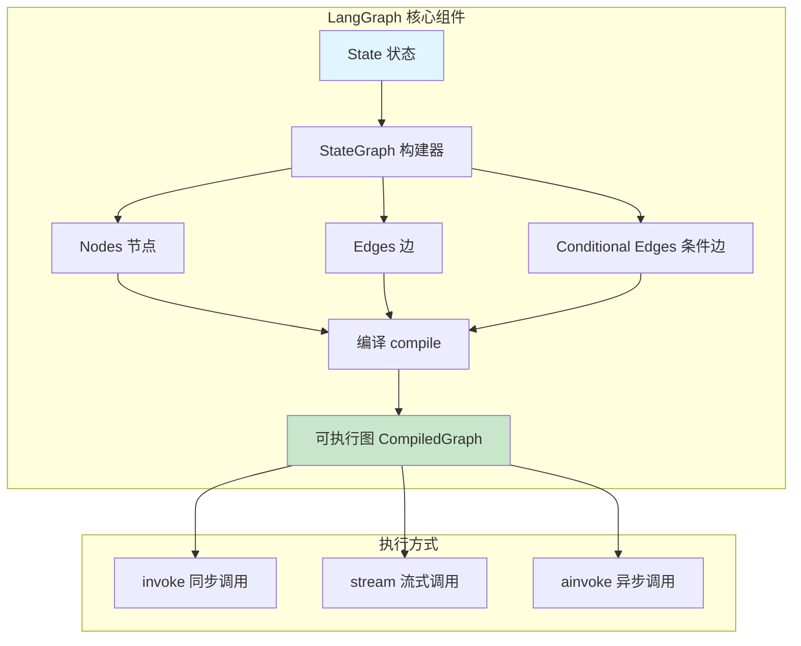

# LangGraph 工作流

## 概述

> 这是一页 LangChain -> LangGraph 的桥接页：帮助你判断“什么时候从 `create_agent` 升级到图编排”。
>
> 如果你准备系统学习 LangGraph，请直接进入 [LangGraph 专题](/ai/langgraph/)。

LangGraph 是 LangChain 官方推荐的工作流编排框架，专门用于构建复杂的、有状态的 Agent 应用。当 `create_agent` 无法满足你的需求时——比如需要条件分支、并行执行、循环迭代或人工审批——LangGraph 就是你的选择。

### LangGraph 是什么？

LangGraph 是一个基于图（Graph）的状态机框架：

- **节点（Nodes）**: 执行具体操作的函数
- **边（Edges）**: 定义节点之间的执行顺序
- **状态（State）**: 在节点之间传递和更新的数据

### 与 create_agent 的关系

| 特性     | create_agent           | LangGraph             |
| -------- | ---------------------- | --------------------- |
| 易用性   | ⭐⭐⭐⭐⭐ 一行代码    | ⭐⭐⭐ 需要定义图结构 |
| 灵活性   | ⭐⭐⭐ 标准 ReAct 模式 | ⭐⭐⭐⭐⭐ 完全自定义 |
| 条件分支 | ❌ 不支持              | ✅ 支持               |
| 并行执行 | ❌ 不支持              | ✅ 支持               |
| 循环控制 | ✅ 内置工具循环        | ✅ 完全可控           |
| 适用场景 | 简单 Agent             | 复杂工作流            |

**重要**：`create_agent` 底层实际上也使用了 LangGraph，只是提供了更简单的抽象。

## 核心概念

### State（状态）

状态是 LangGraph 的核心，它定义了在整个工作流中需要传递的数据结构：

```python
from typing import TypedDict
from langgraph.graph import MessagesState

# 方式 1: 使用内置的 MessagesState（适合聊天场景）
# MessagesState 包含一个 messages 列表

# 方式 2: 自定义状态
class State(TypedDict):
    topic: str           # 主题
    research: str        # 研究结果
    draft: str           # 草稿
    final_output: str    # 最终输出
```

### Nodes（节点）

节点是执行具体操作的函数，接收当前状态，返回状态更新：

```python
def research_node(state: State) -> dict:
    """研究节点：根据主题进行研究"""
    topic = state["topic"]
    # 执行研究逻辑
    result = llm.invoke(f"研究主题: {topic}")
    return {"research": result.content}

def write_node(state: State) -> dict:
    """写作节点：根据研究结果撰写草稿"""
    research = state["research"]
    draft = llm.invoke(f"基于以下研究撰写文章:\n{research}")
    return {"draft": draft.content}
```

### Edges（边）

边定义了节点之间的执行顺序：

```python
from langgraph.graph import StateGraph, START, END

builder = StateGraph(State)

# 添加节点
builder.add_node("research", research_node)
builder.add_node("write", write_node)

# 添加边 - 定义执行顺序
builder.add_edge(START, "research")    # 从开始到 research
builder.add_edge("research", "write")  # research 到 write
builder.add_edge("write", END)         # write 到结束
```

### 条件边（Conditional Edges）

条件边允许根据状态动态决定下一个节点：

```python
from typing import Literal

def route_decision(state: State) -> Literal["approve", "revise", "reject"]:
    """根据状态决定下一步"""
    quality = state.get("quality_score", 0)
    if quality >= 90:
        return "approve"
    elif quality >= 60:
        return "revise"
    else:
        return "reject"

builder.add_conditional_edges(
    "review",           # 从 review 节点出发
    route_decision,     # 路由函数
    {
        "approve": "publish",
        "revise": "write",
        "reject": END
    }
)
```

### LangGraph 架构图



## 代码示例 1: 简单顺序工作流

一个基础的三步顺序工作流——研究、写作、审校：

```python
from typing import TypedDict
from langgraph.graph import StateGraph, START, END
from langchain.chat_models import init_chat_model

# 初始化模型
llm = init_chat_model("claude-sonnet-4-5-20250929")

# 定义状态
class ArticleState(TypedDict):
    topic: str
    research: str
    draft: str
    final: str

# 定义节点
def research(state: ArticleState) -> dict:
    """步骤 1: 研究主题"""
    result = llm.invoke(f"请对以下主题进行简要研究: {state['topic']}")
    return {"research": result.content}

def write(state: ArticleState) -> dict:
    """步骤 2: 撰写草稿"""
    result = llm.invoke(
        f"基于以下研究内容撰写文章草稿:\n{state['research']}"
    )
    return {"draft": result.content}

def polish(state: ArticleState) -> dict:
    """步骤 3: 润色定稿"""
    result = llm.invoke(
        f"请润色以下草稿，使其更加专业:\n{state['draft']}"
    )
    return {"final": result.content}

# 构建图
builder = StateGraph(ArticleState)
builder.add_node("research", research)
builder.add_node("write", write)
builder.add_node("polish", polish)

builder.add_edge(START, "research")
builder.add_edge("research", "write")
builder.add_edge("write", "polish")
builder.add_edge("polish", END)

# 编译并执行
workflow = builder.compile()

result = workflow.invoke({"topic": "人工智能的发展趋势"})
print(result["final"])
```

## 代码示例 2: 条件分支工作流

根据用户请求类型路由到不同处理节点：

```python
from typing import TypedDict, Literal
from langgraph.graph import StateGraph, START, END
from langchain.chat_models import init_chat_model
from pydantic import BaseModel, Field

llm = init_chat_model("claude-sonnet-4-5-20250929")

# 定义路由结构
class RouteDecision(BaseModel):
    route: Literal["joke", "poem", "story"] = Field(
        description="根据用户请求选择输出类型"
    )

# 定义状态
class ContentState(TypedDict):
    user_input: str
    route: str
    output: str

# 路由节点
def router(state: ContentState) -> dict:
    """决定内容类型"""
    router_llm = llm.with_structured_output(RouteDecision)
    decision = router_llm.invoke(
        f"用户请求: {state['user_input']}\n"
        "请判断用户想要什么类型的内容"
    )
    return {"route": decision.route}

# 内容生成节点
def write_joke(state: ContentState) -> dict:
    result = llm.invoke(f"写一个关于 {state['user_input']} 的笑话")
    return {"output": result.content}

def write_poem(state: ContentState) -> dict:
    result = llm.invoke(f"写一首关于 {state['user_input']} 的诗")
    return {"output": result.content}

def write_story(state: ContentState) -> dict:
    result = llm.invoke(f"写一个关于 {state['user_input']} 的故事")
    return {"output": result.content}

# 路由函数
def route_content(state: ContentState) -> str:
    return state["route"]

# 构建图
builder = StateGraph(ContentState)

builder.add_node("router", router)
builder.add_node("joke", write_joke)
builder.add_node("poem", write_poem)
builder.add_node("story", write_story)

builder.add_edge(START, "router")
builder.add_conditional_edges(
    "router",
    route_content,
    {"joke": "joke", "poem": "poem", "story": "story"}
)
builder.add_edge("joke", END)
builder.add_edge("poem", END)
builder.add_edge("story", END)

workflow = builder.compile()

# 测试
result = workflow.invoke({"user_input": "给我讲个关于猫的"})
print(result["output"])
```

## 代码示例 3: 带工具的 Agent 工作流

手动实现一个与 `create_agent` 等效的 ReAct Agent：

```python
from typing import Literal
from langgraph.graph import StateGraph, START, END, MessagesState
from langchain.messages import ToolMessage, HumanMessage
from langchain.chat_models import init_chat_model
from langchain.tools import tool

# 定义工具
@tool
def get_weather(city: str) -> str:
    """获取城市天气"""
    return f"{city}今天晴天，温度 25°C"

@tool
def search_web(query: str) -> str:
    """搜索网页"""
    return f"搜索 '{query}' 的结果: 找到 10 条相关信息"

tools = [get_weather, search_web]
tools_by_name = {tool.name: tool for tool in tools}

# 初始化模型
llm = init_chat_model("claude-sonnet-4-5-20250929")
llm_with_tools = llm.bind_tools(tools)

# LLM 调用节点
def llm_call(state: MessagesState) -> dict:
    """调用 LLM 决定下一步"""
    response = llm_with_tools.invoke(state["messages"])
    return {"messages": [response]}

# 工具执行节点
def tool_executor(state: MessagesState) -> dict:
    """执行工具调用"""
    results = []
    last_message = state["messages"][-1]

    for tool_call in last_message.tool_calls:
        tool = tools_by_name[tool_call["name"]]
        result = tool.invoke(tool_call["args"])
        results.append(
            ToolMessage(content=result, tool_call_id=tool_call["id"])
        )

    return {"messages": results}

# 路由函数
def should_continue(state: MessagesState) -> Literal["tools", "__end__"]:
    """决定是继续调用工具还是结束"""
    last_message = state["messages"][-1]
    if last_message.tool_calls:
        return "tools"
    return END

# 构建图
builder = StateGraph(MessagesState)

builder.add_node("llm", llm_call)
builder.add_node("tools", tool_executor)

builder.add_edge(START, "llm")
builder.add_conditional_edges("llm", should_continue, ["tools", END])
builder.add_edge("tools", "llm")  # 工具执行后返回 LLM

agent = builder.compile()

# 执行
result = agent.invoke({
    "messages": [HumanMessage(content="北京天气怎么样？")]
})

for msg in result["messages"]:
    print(f"{msg.__class__.__name__}: {msg.content}")
```

## 代码示例 4: 并行执行

同时执行多个独立任务，然后聚合结果：

```python
import operator
from typing import Annotated, TypedDict
from langgraph.graph import StateGraph, START, END
from langchain.chat_models import init_chat_model

llm = init_chat_model("claude-sonnet-4-5-20250929")

# 使用 Annotated 和 operator.add 实现列表累加
class ParallelState(TypedDict):
    topic: str
    results: Annotated[list, operator.add]  # 多个节点的结果会累加
    summary: str

# 并行任务节点
def write_intro(state: ParallelState) -> dict:
    result = llm.invoke(f"为主题 '{state['topic']}' 写一个简短介绍")
    return {"results": [f"【介绍】{result.content}"]}

def write_body(state: ParallelState) -> dict:
    result = llm.invoke(f"为主题 '{state['topic']}' 写主要内容")
    return {"results": [f"【正文】{result.content}"]}

def write_conclusion(state: ParallelState) -> dict:
    result = llm.invoke(f"为主题 '{state['topic']}' 写一个结论")
    return {"results": [f"【结论】{result.content}"]}

# 聚合节点
def aggregate(state: ParallelState) -> dict:
    combined = "\n\n".join(state["results"])
    return {"summary": combined}

# 构建图
builder = StateGraph(ParallelState)

builder.add_node("intro", write_intro)
builder.add_node("body", write_body)
builder.add_node("conclusion", write_conclusion)
builder.add_node("aggregate", aggregate)

# 并行: 从 START 同时连接到多个节点
builder.add_edge(START, "intro")
builder.add_edge(START, "body")
builder.add_edge(START, "conclusion")

# 聚合: 多个节点都连接到聚合节点
builder.add_edge("intro", "aggregate")
builder.add_edge("body", "aggregate")
builder.add_edge("conclusion", "aggregate")
builder.add_edge("aggregate", END)

workflow = builder.compile()

result = workflow.invoke({"topic": "LangChain 1.0", "results": []})
print(result["summary"])
```

## create_agent vs LangGraph 对比

| 场景           | 推荐方案       | 原因                   |
| -------------- | -------------- | ---------------------- |
| 简单问答 Agent | `create_agent` | 一行代码搞定           |
| 带工具的 Agent | `create_agent` | 内置工具循环           |
| 需要条件分支   | LangGraph      | 支持 conditional_edges |
| 需要并行执行   | LangGraph      | 支持多分支             |
| 需要循环控制   | LangGraph      | 完全可控的边           |
| 需要人工审批   | LangGraph      | 可以暂停和恢复         |
| 复杂状态管理   | LangGraph      | 自定义 State           |

### 选择建议

```python
# 如果你的需求是这样的，用 create_agent:
agent = create_agent(model="...", tools=[...])

# 如果你需要这些功能，用 LangGraph:
# - 根据结果决定下一步（条件分支）
# - 同时执行多个任务（并行）
# - 多次尝试直到成功（循环）
# - 等待人工确认（暂停/恢复）
```

## 最佳实践

### 1. 状态设计原则

```python
# ✅ 好的设计: 明确、最小化
class State(TypedDict):
    input: str
    output: str
    error: str | None

# ❌ 避免: 状态过于复杂
class State(TypedDict):
    everything: dict  # 不要用 catch-all
```

### 2. 节点粒度

```python
# ✅ 单一职责
def validate(state): ...
def process(state): ...
def format(state): ...

# ❌ 避免: 节点做太多事
def do_everything(state): ...
```

### 3. 错误处理

```python
def safe_node(state: State) -> dict:
    try:
        result = risky_operation(state)
        return {"output": result, "error": None}
    except Exception as e:
        return {"error": str(e)}
```

## 常见问题

**Q: 什么时候应该使用 LangGraph？**

A: 当 `create_agent` 无法满足需求时：

- 需要条件分支（if-else 逻辑）
- 需要并行执行多个任务
- 需要精确控制执行流程
- 需要人工审批或暂停点

**Q: LangGraph 和 LCEL 有什么区别？**

A:

- **LCEL**: 线性管道，适合简单的链式调用 `A | B | C`
- **LangGraph**: 状态机，适合复杂的图结构（分支、循环、并行）

**Q: 如何调试 LangGraph 工作流？**

A:

1. 使用 `stream_mode="updates"` 查看每步执行
2. 在节点中添加 print 语句
3. 使用 LangSmith 进行追踪
4. 使用 `workflow.get_graph().draw_mermaid()` 可视化

### 何时从 LangChain Agent 升级到 LangGraph

以下场景建议直接使用 LangGraph：

| 场景 | 说明 |
|------|------|
| **条件分支** | Agent 需要根据中间结果走不同路径 |
| **并行执行** | 多个工具需要同时执行以减少延迟 |
| **持久化恢复** | 流程中断后需要从上次位置继续 |
| **复杂状态管理** | 需要在多个步骤间共享和更新复杂状态 |
| **精确流程控制** | 需要明确定义每一步的执行顺序 |

如果你的场景是"接收输入 → 调用工具 → 返回结果"的线性流程，继续使用 `create_agent` 即可。

## 下一步

现在你已经掌握了 LangGraph 的基础，接下来可以：

- 从头学习 [LangGraph 快速开始](/ai/langgraph/guide/quickstart) - 用最小示例建立完整心智模型
- 进阶 [LangGraph 进阶编排模式](/ai/langgraph/guide/workflows-agents) - 条件分支、并行、中断恢复
- 学习 [部署](/ai/langchain/guide/deployment) - 将 Agent 应用部署到生产环境
- 回顾 [流式响应 Streaming](/ai/langchain/guide/streaming) - LangGraph 也支持流式输出
- 了解 [多智能体模式](/ai/langchain/guide/multi-agent-overview) - LangChain 内置的多智能体协作

## 参考资源

- [LangGraph 官方文档](https://docs.langchain.com/oss/python/langgraph/)
- [LangGraph Overview](https://docs.langchain.com/oss/python/langgraph/overview)
- [Graph API](https://docs.langchain.com/oss/python/langgraph/use-graph-api)
- [Durable Execution](https://docs.langchain.com/oss/python/langgraph/durable-execution)
