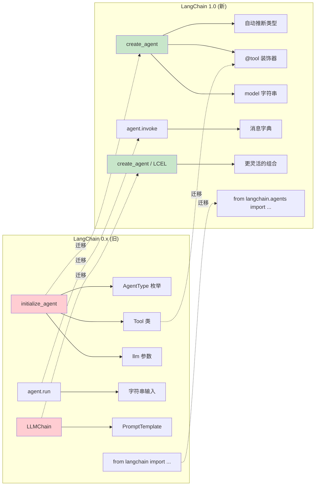
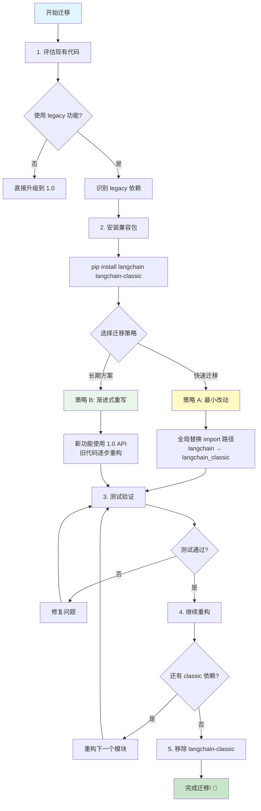

# Legacy 迁移指南

## 概述

LangChain 1.0 带来了重大的 API 改进和简化,如果你有使用 LangChain 0.x 版本的项目,本指南将帮助你平滑迁移到 1.0 版本。

## 核心变化

### API 变化对比图

下图对比了 0.x 和 1.0 的主要 API 差异:



### 主要 API 变化

LangChain 1.0 的核心变化包括:

1. **统一的 Agent 创建**: `create_agent` 替代了多个 Agent 构造函数
2. **新的导入路径**: 更清晰的命名空间结构
3. **Content Blocks**: 统一的内容访问接口
4. **Middleware 系统**: 新增的中间件支持
5. **Legacy 包分离**: 旧版功能移至 `langchain-classic`

## 代码示例 1: 安装 langchain-classic

如果你的项目依赖旧版 LangChain 功能,可以安装 `langchain-classic` 包来保持兼容:

```python
# 使用 pip 安装
pip install langchain-classic

# 使用 uv 安装
uv add langchain-classic
```

**说明**:

- `langchain-classic` 包含了 legacy chains、retrievers、hub 模块等已弃用功能
- 这是临时方案,建议逐步迁移到 LangChain 1.0 新 API
- 新项目不应使用 `langchain-classic`

## 代码示例 2: 更新导入语句

将旧版导入更新为 `langchain-classic`:

```python
# 0.x 版本 (旧)
from langchain import LLMChain
from langchain.chains import RetrievalQA
from langchain.retrievers import ContextualCompressionRetriever
from langchain import hub

# 迁移方案 1: 使用 langchain-classic (临时)
from langchain_classic import LLMChain
from langchain_classic.chains import RetrievalQA
from langchain_classic.retrievers import ContextualCompressionRetriever
from langchain_classic import hub

# 迁移方案 2: 使用 LangChain 1.0 新 API (推荐)
from langchain.agents import create_agent
from langchain.tools import tool
from langchain.chat_models import init_chat_model
```

**说明**:

- 方案 1 适合快速迁移,保持代码最小改动
- 方案 2 是长期方案,利用 LangChain 1.0 的新特性
- 建议逐步从方案 1 过渡到方案 2

## 代码示例 3: Agent 创建迁移

从旧版 Agent API 迁移到 `create_agent`:

```python
# === 0.x 版本 (旧) ===
from langchain.agents import initialize_agent, AgentType
from langchain.llms import OpenAI
from langchain.tools import Tool

llm = OpenAI(temperature=0)

tools = [
    Tool(
        name="Search",
        func=search_function,
        description="useful for searching"
    ),
    Tool(
        name="Calculator",
        func=calculator_function,
        description="useful for math"
    )
]

agent = initialize_agent(
    tools=tools,
    llm=llm,
    agent=AgentType.ZERO_SHOT_REACT_DESCRIPTION,
    verbose=True
)

result = agent.run("What is 2 + 2?")

# === 1.0 版本 (新) ===
from langchain.agents import create_agent
from langchain.tools import tool

@tool
def search_function(query: str) -> str:
    """useful for searching"""
    return f"Search results for: {query}"

@tool
def calculator_function(expression: str) -> str:
    """useful for math"""
    return str(eval(expression))

agent = create_agent(
    model="gpt-4",
    tools=[search_function, calculator_function],
    system_prompt="You are a helpful assistant."
)

result = agent.invoke({
    "messages": [{"role": "user", "content": "What is 2 + 2?"}]
})
```

**主要差异**:

- `initialize_agent` → `create_agent`
- `Tool` 类 → `@tool` 装饰器
- `llm` 参数 → `model` 字符串
- `agent.run()` → `agent.invoke()`
- 去除了 `AgentType` 枚举,简化为统一接口

## 版本对比表

### API 映射表

| 0.x 版本                                    | 1.0 版本                            | 说明                                        |
| ------------------------------------------- | ----------------------------------- | ------------------------------------------- |
| `initialize_agent()`                        | `create_agent()`                    | 统一的 Agent 创建接口                       |
| `AgentType.ZERO_SHOT_REACT_DESCRIPTION`     | (自动推断)                          | 不再需要显式指定 Agent 类型                 |
| `LLMChain`                                  | `create_agent()` 或 LCEL            | 使用 Agent 或 LangChain Expression Language |
| `Tool(name=..., func=..., description=...)` | `@tool` 装饰器                      | 工具定义更简洁                              |
| `agent.run(prompt)`                         | `agent.invoke({"messages": [...]})` | 标准化的调用接口                            |
| `from langchain import ...`                 | `from langchain.agents import ...`  | 更清晰的命名空间                            |

### 功能迁移状态

| 功能       | 0.x 位置               | 1.0 状态  | 迁移方案                                |
| ---------- | ---------------------- | --------- | --------------------------------------- |
| Agent 创建 | `langchain.agents`     | ✅ 改进   | 使用 `create_agent`                     |
| LLMChain   | `langchain.chains`     | ⚠️ Legacy | 迁移到 Agent 或 LCEL                    |
| Retrievers | `langchain.retrievers` | ⚠️ Legacy | 使用 `langchain-classic` 或迁移到新 API |
| Hub        | `langchain.hub`        | ⚠️ Legacy | 使用 `langchain-classic`                |
| Tools      | `langchain.tools`      | ✅ 改进   | 使用 `@tool` 装饰器                     |
| Memory     | `langchain.memory`     | ⚠️ Legacy | 迁移到 Middleware                       |

**图例**:

- ✅ 改进: 功能在 1.0 中有更好的实现
- ⚠️ Legacy: 功能移至 `langchain-classic`
- ❌ 移除: 功能已完全弃用

## 迁移步骤

### 迁移流程概览图

下图展示了从 LangChain 0.x 迁移到 1.0 的推荐流程:



### 1. 评估现有代码

**识别需要迁移的部分**:

- 统计项目中使用的 LangChain 导入
- 检查是否使用了 legacy 功能
- 评估迁移工作量

```bash
# 查找旧版导入
grep -r "from langchain import" .
grep -r "from langchain.chains import" .
grep -r "from langchain.agents import initialize_agent" .
```

### 2. 安装兼容包

**临时方案 (快速迁移)**:

```bash
pip install langchain langchain-classic
```

**长期方案 (推荐)**:

```bash
pip install langchain
# 不安装 langchain-classic,逐步重写代码
```

### 3. 更新导入语句

**选择迁移策略**:

**策略 A: 最小改动 (临时)**

```python
# 全局替换
from langchain.chains import → from langchain_classic.chains import
from langchain.retrievers import → from langchain_classic.retrievers import
```

**策略 B: 渐进式重写 (推荐)**

```python
# 优先使用 1.0 新 API
from langchain.agents import create_agent
from langchain.tools import tool

# 保留 legacy 功能使用 classic
from langchain_classic.chains import LLMChain  # TODO: 迁移到 create_agent
```

### 4. 重构 Agent 代码

**迁移清单**:

- [ ] 将 `initialize_agent` 替换为 `create_agent`
- [ ] 将 `Tool` 类替换为 `@tool` 装饰器
- [ ] 更新 `llm` 参数为 `model` 字符串
- [ ] 更新 `.run()` 调用为 `.invoke()`
- [ ] 移除 `AgentType` 枚举

### 5. 测试验证

**验证步骤**:

1. 运行现有测试套件
2. 对比新旧 API 的输出结果
3. 检查性能是否有变化
4. 验证错误处理逻辑

### 6. 移除 langchain-classic

**最终目标**:

```bash
# 确认不再依赖 legacy 功能
pip uninstall langchain-classic

# 只保留 LangChain 1.0
pip list | grep langchain
# 应该只看到 langchain 和 provider 包 (如 langchain-anthropic)
```

## 常见迁移问题

**Q: 我必须立即迁移吗？**

A: 不必须,但强烈建议:

- `langchain-classic` 会继续维护一段时间
- 新功能只在 LangChain 1.0 中提供
- 越早迁移,技术债务越少
- 1.0 API 更简洁,开发体验更好

**Q: 迁移会破坏现有功能吗？**

A: 取决于迁移方式:

- 使用 `langchain-classic`: 行为基本一致
- 重写为 1.0 API: 行为可能有细微差异,需要测试验证
- 建议在测试环境先验证

**Q: 如何处理大型项目的迁移？**

A: 推荐渐进式迁移:

1. 先安装 `langchain-classic` 保持现有代码运行
2. 新功能使用 LangChain 1.0 API
3. 逐个模块重构旧代码
4. 每次重构后运行测试
5. 最终移除 `langchain-classic` 依赖

**Q: LangChain 0.x 和 1.0 可以共存吗？**

A: 不建议:

- `langchain` 1.0 和 `langchain` 0.x 会冲突
- 使用 `langchain` 1.0 + `langchain-classic` 来过渡
- `langchain-classic` 包含 0.x 的 legacy 功能

**Q: 哪些功能在 1.0 中被移除了？**

A: 主要移除的功能:

- 旧版 Agent 类 (`ZeroShotAgent`、`ConversationalAgent` 等)
- `LLMChain` (使用 `create_agent` 或 LCEL 替代)
- 部分 legacy retrievers (移至 `langchain-classic`)
- `langchain.hub` 模块 (移至 `langchain-classic`)

**Q: 如何迁移 LLMChain？**

A: 三种方案:

```python
# 方案 1: 使用 langchain-classic (临时)
from langchain_classic import LLMChain

# 方案 2: 迁移到 create_agent
from langchain.agents import create_agent

agent = create_agent(
    model="gpt-4",
    tools=[],  # 如果不需要工具
    system_prompt="..."
)

# 方案 3: 使用 LCEL (LangChain Expression Language)
from langchain_core.prompts import ChatPromptTemplate
from langchain_core.output_parsers import StrOutputParser

chain = ChatPromptTemplate.from_template("...") | model | StrOutputParser()
```

## 迁移资源

### 官方文档

- [LangChain 1.0 发布说明](https://docs.langchain.com/oss/python/releases/langchain-v1/)
- [create_agent API 文档](https://python.langchain.com/api_reference/langchain/agents.html)
- [LangChain Expression Language (LCEL) 指南](https://python.langchain.com/docs/expression_language/)

### 迁移工具

```bash
# 使用 grep 查找需要迁移的代码
grep -r "initialize_agent" . --include="*.py"
grep -r "from langchain.chains" . --include="*.py"
grep -r "AgentType" . --include="*.py"

# 使用 sed 批量替换 (谨慎使用)
find . -name "*.py" -exec sed -i 's/from langchain.chains/from langchain_classic.chains/g' {} +
```

### 社区支持

- [LangChain GitHub Discussions](https://github.com/langchain-ai/langchain/discussions)
- [LangChain Discord 社区](https://discord.gg/langchain)
- [Stack Overflow #langchain 标签](https://stackoverflow.com/questions/tagged/langchain)

## 下一步

现在你已经了解了如何从 LangChain 0.x 迁移到 1.0,接下来可以:

- 返回 [环境搭建](/ai/langchain/guide/getting-started) - 设置 LangChain 1.0 开发环境
- 学习 [Agent 架构](/ai/langchain/guide/agent-architecture) - 掌握 `create_agent` 的使用
- 探索 [Middleware](/ai/langchain/guide/middleware) - 了解 1.0 的新特性

## 参考资源

- [LangChain v1.0 官方迁移指南](https://docs.langchain.com/oss/python/releases/langchain-v1/)
- [LangChain GitHub 更新日志](https://github.com/langchain-ai/langchain/releases)
- [langchain-classic 包文档](https://python.langchain.com/docs/integrations/platforms/classic/)
