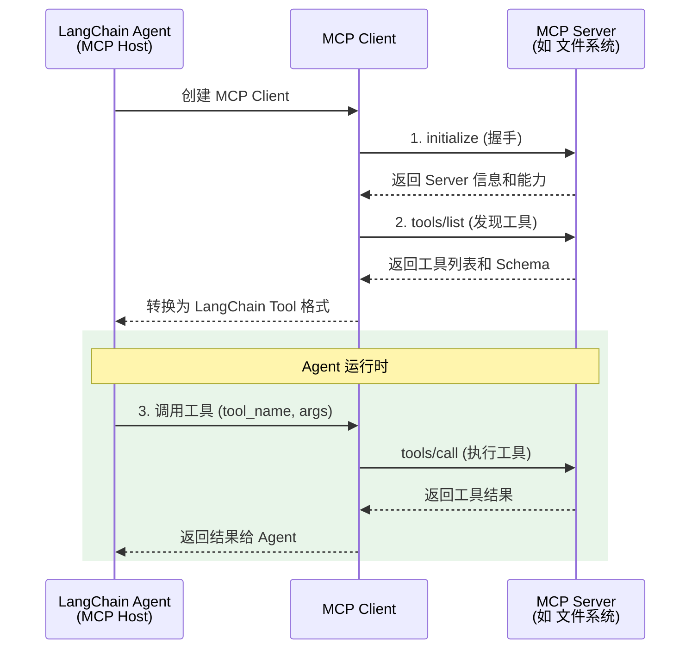

# MCP 协议

> 前置阅读：[工具 Tools](/ai/langchain/guide/tools) · [Agent 实战指南](/ai/langchain/guide/agents)

## 什么是 MCP

Model Context Protocol（MCP，模型上下文协议）是由 Anthropic 提出的**开放标准协议**，用于标准化 AI 模型与外部工具、数据源之间的连接方式。

在 MCP 出现之前，每个 AI 应用都需要为每个工具编写独立的集成代码——调用数据库需要一套代码，操作文件系统需要另一套代码，接入第三方 API 又是一套。MCP 通过定义统一的通信协议，让 AI 应用可以**即插即用**地连接任何 MCP 兼容的工具服务器。

[🔗 langchain-mcp-adapters 官方文档](https://python.langchain.com/docs/integrations/tools/mcp/){target="_blank" rel="noopener"}

### MCP 的核心角色

| 角色 | 说明 | 类比 |
|------|------|------|
| MCP Host | 发起连接的 AI 应用（如你的 LangChain Agent） | 浏览器 |
| MCP Client | Host 内嵌的协议客户端，管理与 Server 的通信 | HTTP Client |
| MCP Server | 提供工具和数据的服务进程 | REST API Server |

::: tip 前端类比
MCP 之于 AI 工具，就像 OpenAPI / Swagger 之于 REST API。在 OpenAPI 规范出现之前，每个 API 的调用方式、参数格式、错误处理都不统一，前端开发者需要逐个阅读文档。OpenAPI 通过统一的 Schema 描述格式，让工具（如 Swagger UI、代码生成器）可以自动理解和调用任何符合规范的 API。MCP 做的是同样的事——让 AI 模型能自动发现和调用任何符合 MCP 协议的工具服务器。
:::

## MCP vs @tool 装饰器

LangChain 的 `@tool` 装饰器和 MCP 都能为 Agent 提供工具能力，但适用场景不同：

| 维度 | @tool 装饰器 | MCP |
|------|-------------|-----|
| 定义位置 | 与 Agent 代码在同一进程内 | 独立的外部服务进程 |
| 工具发现 | 手动注册到 tools 列表 | 自动发现服务器提供的所有工具 |
| 复用性 | 绑定到特定项目 | 跨项目、跨框架复用 |
| 生态系统 | 自定义实现 | 丰富的社区 MCP Server |
| 部署模式 | 随 Agent 一起部署 | 可独立部署和扩展 |
| 适用场景 | 简单、项目特定的工具 | 通用工具、团队共享、第三方集成 |

**选择建议**：

- 如果工具逻辑简单且只在当前项目使用 → `@tool` 装饰器
- 如果工具需要跨项目复用、已有现成的 MCP Server、或工具涉及复杂的外部系统 → MCP

## MCP 工具发现与 Schema

MCP 协议的核心优势之一是**自动工具发现**。当 Agent 连接到 MCP Server 后，可以自动获取该服务器提供的所有工具及其参数 Schema。

### 协议通信流程



### 工具 Schema 示例

MCP Server 返回的工具 Schema 遵循 JSON Schema 格式：

```json
{
  "name": "read_file",
  "description": "Read the contents of a file from the filesystem",
  "inputSchema": {
    "type": "object",
    "properties": {
      "path": {
        "type": "string",
        "description": "The absolute path to the file to read"
      }
    },
    "required": ["path"]
  }
}
```

LangChain 的 MCP 集成会自动将这些 Schema 转换为 LangChain 的 `Tool` 对象，无需手动处理。

## 在 LangChain 中配置 MCP

### 安装依赖

```bash
pip install langchain-mcp-adapters
```

`langchain-mcp-adapters` 是官方维护的适配器包，负责将 MCP 协议转换为 LangChain 的工具接口。

### 连接 stdio 模式的 MCP Server

stdio 模式是最常见的 MCP Server 运行方式——Agent 启动 Server 进程，通过标准输入输出通信：

```python
from langchain_mcp_adapters.client import MultiServerMCPClient

# 配置 MCP Server
client = MultiServerMCPClient(
    {
        "filesystem": {
            "command": "npx",
            "args": [
                "-y",
                "@modelcontextprotocol/server-filesystem",
                "/path/to/allowed/directory",
            ],
            "transport": "stdio",
        }
    }
)
```

### 连接 SSE 模式的 MCP Server

SSE（Server-Sent Events）模式适合远程部署的 MCP Server：

```python
client = MultiServerMCPClient(
    {
        "remote_tools": {
            "url": "http://localhost:8080/sse",
            "transport": "sse",
        }
    }
)
```

### 连接多个 MCP Server

一个 Agent 可以同时连接多个 MCP Server，获取不同领域的工具能力：

```python
client = MultiServerMCPClient(
    {
        "filesystem": {
            "command": "npx",
            "args": ["-y", "@modelcontextprotocol/server-filesystem", "/data"],
            "transport": "stdio",
        },
        "database": {
            "command": "npx",
            "args": ["-y", "@modelcontextprotocol/server-sqlite", "mydb.sqlite"],
            "transport": "stdio",
        },
        "web_search": {
            "url": "http://search-service:8080/sse",
            "transport": "sse",
        },
    }
)
```

## 使用 MCP 工具与 create_agent

### 基本集成

```python
from langchain.agents import create_agent
from langchain_mcp_adapters.client import MultiServerMCPClient
from langchain_anthropic import ChatAnthropic

async def main():
    model = ChatAnthropic(model="claude-sonnet-4-5-20250929")

    async with MultiServerMCPClient(
        {
            "filesystem": {
                "command": "npx",
                "args": [
                    "-y",
                    "@modelcontextprotocol/server-filesystem",
                    "/home/user/documents",
                ],
                "transport": "stdio",
            }
        }
    ) as client:
        # 自动获取 MCP Server 提供的所有工具
        mcp_tools = client.get_tools()

        # 创建 Agent，MCP 工具和本地工具可以混合使用
        agent = create_agent(
            model=model,
            tools=mcp_tools,
            system_prompt="你是一个文件管理助手，可以帮助用户读取和管理文件。",
        )

        result = agent.invoke(
            {"messages": [{"role": "user", "content": "读取 /home/user/documents/notes.txt 的内容"}]}
        )
        print(result)
```

### 混合使用 MCP 工具和本地工具

MCP 工具可以和 `@tool` 装饰器定义的本地工具无缝混合：

```python
from langchain.tools import tool

@tool
def calculate(expression: str) -> str:
    """计算数学表达式的结果"""
    try:
        return str(eval(expression))
    except Exception as e:
        return f"计算错误: {e}"

@tool
def format_report(title: str, content: str) -> str:
    """将内容格式化为 Markdown 报告"""
    return f"# {title}\n\n{content}"


async def main():
    async with MultiServerMCPClient(
        {
            "filesystem": {
                "command": "npx",
                "args": ["-y", "@modelcontextprotocol/server-filesystem", "/data"],
                "transport": "stdio",
            }
        }
    ) as client:
        mcp_tools = client.get_tools()

        # 混合 MCP 工具 + 本地工具
        all_tools = mcp_tools + [calculate, format_report]

        agent = create_agent(
            model="claude-sonnet-4-5-20250929",
            tools=all_tools,
            system_prompt="你是一个数据分析助手，可以读取文件、计算数据并生成报告。",
        )

        result = agent.invoke(
            {
                "messages": [
                    {
                        "role": "user",
                        "content": "读取 /data/sales.csv，计算总销售额，然后生成报告",
                    }
                ]
            }
        )
        print(result)
```

## 实战：连接文件系统 MCP Server

下面是一个完整的端到端示例，演示如何连接文件系统 MCP Server 并执行文件操作。

### 第 1 步：安装 MCP Server

```bash
# 文件系统 MCP Server（官方维护）
npm install -g @modelcontextprotocol/server-filesystem
```

### 第 2 步：编写 Agent 代码

```python
import asyncio
from langchain.agents import create_agent
from langchain_mcp_adapters.client import MultiServerMCPClient
from langchain_anthropic import ChatAnthropic


async def file_assistant():
    model = ChatAnthropic(model="claude-sonnet-4-5-20250929")

    async with MultiServerMCPClient(
        {
            "filesystem": {
                "command": "npx",
                "args": [
                    "-y",
                    "@modelcontextprotocol/server-filesystem",
                    # 只允许访问指定目录（安全边界）
                    "/home/user/workspace",
                ],
                "transport": "stdio",
            }
        }
    ) as client:
        tools = client.get_tools()

        # 打印发现的工具
        print("已发现的 MCP 工具:")
        for t in tools:
            print(f"  - {t.name}: {t.description}")

        agent = create_agent(
            model=model,
            tools=tools,
            system_prompt=(
                "你是一个文件管理助手。\n"
                "- 在操作文件前先确认文件是否存在\n"
                "- 对破坏性操作（删除、覆盖）请先向用户确认\n"
                "- 用中文回复"
            ),
        )

        # 示例交互
        result = agent.invoke(
            {
                "messages": [
                    {
                        "role": "user",
                        "content": "列出 workspace 目录下的所有文件，然后读取 README.md 的内容",
                    }
                ]
            }
        )
        print(result["messages"][-1].content)


asyncio.run(file_assistant())
```

### 第 3 步：运行效果

```
已发现的 MCP 工具:
  - read_file: Read the contents of a file
  - write_file: Write content to a file
  - list_directory: List directory contents
  - create_directory: Create a new directory
  - move_file: Move or rename a file
  - search_files: Search for files matching a pattern

Agent 输出:
workspace 目录下的文件如下：
1. README.md
2. src/
3. config.json

README.md 的内容为：
# My Project
这是一个示例项目...
```

## 常用 MCP Server 一览

社区和官方已提供大量开箱即用的 MCP Server：

| Server | 功能 | 安装命令 |
|--------|------|---------|
| `server-filesystem` | 文件读写、目录管理 | `npx @modelcontextprotocol/server-filesystem` |
| `server-sqlite` | SQLite 数据库操作 | `npx @modelcontextprotocol/server-sqlite` |
| `server-github` | GitHub API（Issues、PR 等） | `npx @modelcontextprotocol/server-github` |
| `server-postgres` | PostgreSQL 数据库 | `npx @modelcontextprotocol/server-postgres` |
| `server-brave-search` | Brave 搜索引擎 | `npx @modelcontextprotocol/server-brave-search` |

更多 MCP Server 可在 [MCP Server 仓库](https://github.com/modelcontextprotocol/servers) 中查找。

## 注意事项与最佳实践

### 安全性

- **限制文件系统访问范围**：始终通过 MCP Server 参数指定允许访问的目录，避免暴露整个文件系统
- **审计工具调用**：记录所有 MCP 工具调用的日志，便于事后审计
- **网络隔离**：SSE 模式的远程 Server 应部署在受控网络环境中

### 性能

- **连接复用**：使用 `async with` 上下文管理器确保连接在 Agent 生命周期内复用
- **超时设置**：为工具调用设置合理的超时时间，避免长时间阻塞
- **工具数量控制**：连接过多 MCP Server 会增加工具列表的 Token 消耗，按需连接

### 错误处理

```python
async with MultiServerMCPClient(config) as client:
    tools = client.get_tools()

    if not tools:
        print("警告：未发现任何 MCP 工具，请检查 Server 配置")
        return

    agent = create_agent(
        model=model,
        tools=tools,
        system_prompt="如果工具调用失败，请向用户解释错误原因并建议替代方案。",
    )
```

## 下一步

- [工具 Tools](/ai/langchain/guide/tools) — @tool 装饰器的完整用法与 Schema 自动推导
- [Agent 实战指南](/ai/langchain/guide/agents) — create_agent 的核心用法与工具绑定
