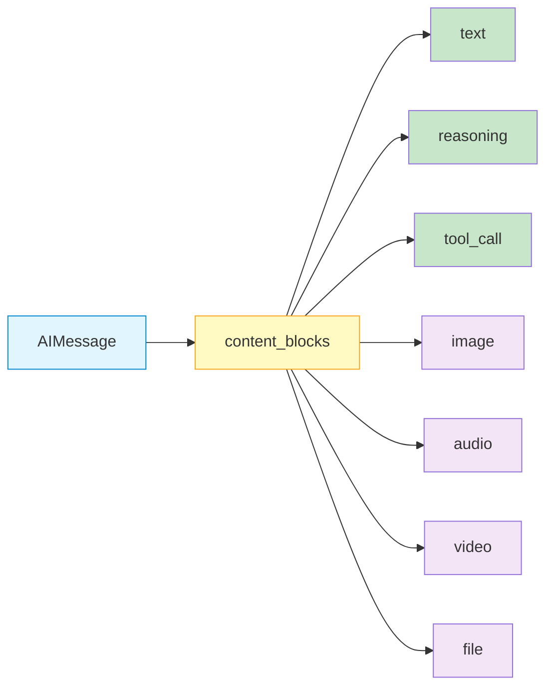
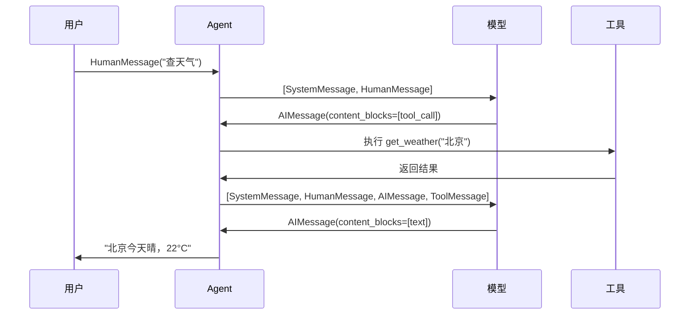

# 消息 Messages

## 概述

消息（Messages）是 LangChain 中一切对话交互的基础数据单元。无论是用户输入、模型回复、系统指令还是工具调用结果，都被表示为特定类型的消息对象。LangChain 1.0 进一步引入了 **Content Blocks** 机制，为不同 Provider（Anthropic、OpenAI、Google 等）的异构内容格式提供了统一的访问接口。

本页将覆盖：消息类型、消息结构字段、Content Blocks 七种块类型、对话历史管理和消息序列化。

::: tip 前端类比
消息类似 HTTP 请求/响应对象——结构化、有类型、包含头部（元数据）和正文（内容）。`HumanMessage` 相当于 Request，`AIMessage` 相当于 Response，`SystemMessage` 相当于请求头中的全局配置。

Content Blocks 则类似 GraphQL 的统一响应格式——不管后端数据源如何各异，前端拿到的都是一致的 schema，无需为每个 Provider 写特殊处理逻辑。
:::

理解类比之后，也请记住消息的**原生语义**：在 LLM 语境中，消息列表构成了模型的"上下文窗口"，模型根据完整的消息历史来生成下一个回复。消息类型（role）决定了模型如何理解每条信息的来源和权重。

## 核心概念

### 四种消息类型

LangChain 提供四种核心消息类型，全部从 `langchain_core.messages`（或 `langchain.messages`）导入：

| 消息类型 | 对应 role | 用途 | 前端类比 |
|---------|-----------|------|---------|
| `HumanMessage` | `user` | 用户输入 | 前端发送的请求 body |
| `AIMessage` | `assistant` | 模型响应 | 后端返回的响应 body |
| `SystemMessage` | `system` | 系统指令，设定模型行为 | 请求头中的全局配置 |
| `ToolMessage` | `tool` | 工具执行结果，回传给模型 | Webhook 回调数据 |

### 消息结构字段

每个消息对象都包含以下关键字段：

```python
from langchain.messages import HumanMessage

msg = HumanMessage(content="你好，请帮我分析数据")

# 核心字段
msg.content          # str 或 list — 消息内容（原生格式）
msg.type             # str — 消息类型标识，如 "human"、"ai"
msg.content_blocks   # list[dict] — 标准化内容块（推荐访问方式）
msg.additional_kwargs  # dict — 扩展元数据（Provider 特有信息）
msg.response_metadata  # dict — 响应元数据（仅 AIMessage，含 token 用量等）
```

### Content Blocks：统一内容访问

不同 Provider 返回的内容格式各不相同——Anthropic 用 `thinking` 块表示推理过程，OpenAI 用 `tool_calls` 数组表示工具调用。LangChain 1.0 通过 `content_blocks` 属性将它们统一为 **7 种标准块类型**：



| 块类型 | 说明 | 典型来源 |
|--------|------|---------|
| `text` | 文本内容 | 所有 Provider |
| `reasoning` | 模型推理/思考步骤 | Anthropic extended thinking、DeepSeek |
| `tool_call` | 工具调用请求 | 所有支持 function calling 的 Provider |
| `image` | 图片内容 | 多模态模型 |
| `audio` | 音频内容 | 支持语音的模型 |
| `video` | 视频内容 | 支持视频的模型 |
| `file` | 通用文件 | MCP 工具等 |

**核心价值**：无论底层 Provider 如何组织数据，你只需要写一套 `content_blocks` 处理代码。

## 代码示例 1: 创建基础消息

最基础的用法——用消息对象构建对话并发送给模型：

```python
from langchain.messages import HumanMessage, AIMessage, SystemMessage
from langchain_anthropic import ChatAnthropic

model = ChatAnthropic(model="claude-sonnet-4-5-20250929")

# 方式 1：使用消息对象（推荐，类型安全）
messages = [
    SystemMessage("你是一位资深 Python 开发工程师，回答简洁准确。"),
    HumanMessage("什么是装饰器？"),
]

response = model.invoke(messages)
print(response.content)
# => 装饰器是一种特殊的函数，用于在不修改原函数代码的情况下...
```

```python
# 方式 2：使用字典格式（简洁，适合快速原型）
messages = [
    {"role": "system", "content": "你是一位资深 Python 开发工程师。"},
    {"role": "user", "content": "什么是装饰器？"},
]

response = model.invoke(messages)
```

两种方式等价，但**消息对象**在代码补全、类型检查和 Content Blocks 访问上更有优势。

## 代码示例 2: 构建对话历史

消息列表天然构成了对话历史。通过维护一个有序的消息列表，可以实现多轮对话：

```python
from langchain.messages import HumanMessage, AIMessage, SystemMessage

# 构建多轮对话历史
conversation = [
    SystemMessage("你是一位 Python 导师，用简单易懂的方式教学。"),
    HumanMessage("Python 的列表和元组有什么区别？"),
    AIMessage("列表（list）是可变的，元组（tuple）是不可变的。"
              "列表用方括号 []，元组用圆括号 ()。"),
    HumanMessage("那什么时候该用元组？"),
]

# 模型会参考整个对话上下文生成回复
response = model.invoke(conversation)
print(response.content)
# => 当你确定数据不会被修改时，使用元组更合适...
```

**要点**：
- 消息列表按时间顺序排列，模型会参考完整上下文
- `SystemMessage` 通常放在列表开头，设定全局行为
- 过长的对话历史需要截断或摘要，否则会超出上下文窗口限制
- 在 Agent 场景中，LangChain 会自动管理对话历史（参见[短期记忆](/ai/langchain/guide/short-term-memory)）

## 代码示例 3: Content Blocks 跨 Provider 处理

Content Blocks 的核心价值是跨 Provider 兼容。以下示例展示如何用统一代码处理不同 Provider 的响应：

```python
from langchain.messages import HumanMessage
from langchain_anthropic import ChatAnthropic

model = ChatAnthropic(model="claude-sonnet-4-5-20250929")

response = model.invoke([HumanMessage("解释什么是闭包")])

# 通过 content_blocks 统一访问（推荐）
for block in response.content_blocks:
    if block["type"] == "text":
        print(f"文本: {block['text']}")
    elif block["type"] == "reasoning":
        # Anthropic extended thinking 产生的推理块
        print(f"推理过程: {block['reasoning'][:100]}...")
        # extras 可能包含签名等 Provider 特有信息
        print(f"附加信息: {block.get('extras', {})}")
```

下面是一个通用的 Content Blocks 处理函数，适用于**任何 Provider**：

```python
def process_ai_response(ai_message):
    """统一处理 AIMessage 的 content_blocks，兼容所有 Provider"""
    result = {
        "texts": [],
        "reasoning": [],
        "tool_calls": [],
        "media": [],
    }

    for block in ai_message.content_blocks:
        match block["type"]:
            case "text":
                result["texts"].append(block["text"])
            case "reasoning":
                result["reasoning"].append(block["reasoning"])
            case "tool_call":
                result["tool_calls"].append({
                    "name": block["name"],
                    "args": block["args"],
                    "id": block.get("id"),
                })
            case "image" | "audio" | "video" | "file":
                result["media"].append({
                    "type": block["type"],
                    "url": block.get("url"),
                    "mime_type": block.get("mime_type"),
                })

    return result


# 使用示例
response = model.invoke([HumanMessage("你好")])
parsed = process_ai_response(response)
print(parsed["texts"])  # => ["你好！有什么我可以帮助你的吗？"]
```

## 代码示例 4: 工具调用与 ToolMessage

当模型决定调用工具时，`AIMessage` 的 `content_blocks` 中会包含 `tool_call` 类型的块。工具执行结果通过 `ToolMessage` 回传给模型：

```python
from langchain.messages import HumanMessage, ToolMessage
from langchain_anthropic import ChatAnthropic

def get_weather(city: str) -> str:
    """获取指定城市的天气"""
    return f"{city}今天晴，气温 22°C"

model = ChatAnthropic(model="claude-sonnet-4-5-20250929").bind_tools([get_weather])

# 第 1 步：模型决定调用工具
response = model.invoke([HumanMessage("北京天气怎么样？")])

# 检查 content_blocks 中的工具调用
tool_calls = [
    block for block in response.content_blocks
    if block["type"] == "tool_call"
]

if tool_calls:
    call = tool_calls[0]
    print(f"模型请求调用: {call['name']}({call['args']})")

    # 第 2 步：执行工具，获取结果
    tool_result = get_weather(**call["args"])

    # 第 3 步：构建 ToolMessage 回传结果
    tool_msg = ToolMessage(
        content=tool_result,
        tool_call_id=call["id"],  # 必须匹配 tool_call 的 id
    )

    # 第 4 步：将完整对话（含工具结果）发回模型
    final_response = model.invoke([
        HumanMessage("北京天气怎么样？"),
        response,     # AIMessage（含 tool_call）
        tool_msg,     # ToolMessage（工具结果）
    ])
    print(final_response.content)
    # => 北京今天天气晴朗，气温 22°C，适合外出活动。
```

::: warning 注意
`ToolMessage` 的 `tool_call_id` 必须与对应 `tool_call` 块的 `id` 匹配，否则模型无法正确关联工具结果。
:::

> 在实际项目中，推荐使用 `create_agent` 自动管理工具调用循环，而不是手动处理。参见 [智能体 Agent](/ai/langchain/guide/agents)。

## 代码示例 5: 多模态消息

LangChain 1.0 通过 `content_blocks` 原生支持多模态输入：

```python
from langchain.messages import HumanMessage

# 发送图文混合消息
message = HumanMessage(content_blocks=[
    {"type": "text", "text": "请描述这张图片中的内容"},
    {"type": "image", "url": "https://example.com/photo.jpg"},
])

response = model.invoke([message])
print(response.content)
```

```python
# 使用 base64 编码的本地图片
import base64
from pathlib import Path

image_data = base64.b64encode(Path("chart.png").read_bytes()).decode()

message = HumanMessage(content_blocks=[
    {"type": "text", "text": "这个图表展示了什么趋势？"},
    {
        "type": "image",
        "base64": image_data,
        "mime_type": "image/png",
    },
])

response = model.invoke([message])
for block in response.content_blocks:
    if block["type"] == "text":
        print(block["text"])
```

## 代码示例 6: 消息序列化

消息可以序列化为字典格式（JSON 兼容），方便持久化存储或网络传输：

```python
from langchain.messages import (
    HumanMessage, AIMessage, SystemMessage,
    messages_to_dict, messages_from_dict,
)

# 构建消息列表
messages = [
    SystemMessage("你是一位助手。"),
    HumanMessage("你好"),
    AIMessage("你好！有什么可以帮你的？"),
]

# 序列化为字典列表
serialized = messages_to_dict(messages)
print(serialized)
# [
#   {"type": "system", "content": "你是一位助手。", ...},
#   {"type": "human", "content": "你好", ...},
#   {"type": "ai", "content": "你好！有什么可以帮你的？", ...},
# ]

# 从字典列表反序列化
restored = messages_from_dict(serialized)
assert restored[0].content == "你是一位助手。"
assert isinstance(restored[1], HumanMessage)
```

**应用场景**：
- 将对话历史保存到数据库（Redis / PostgreSQL）
- 通过 API 在前后端之间传递对话状态
- 对话日志记录与调试分析

## 消息流转全景图

下图展示了消息在 Agent 执行过程中的完整流转：



## 最佳实践

### 1. 优先使用 content_blocks

```python
# 推荐：统一、跨 Provider 兼容
for block in response.content_blocks:
    if block["type"] == "text":
        print(block["text"])

# 不推荐：content 格式因 Provider 而异
print(response.content)  # 可能是 str，也可能是 list[dict]
```

### 2. SystemMessage 放在列表开头

```python
# 正确：SystemMessage 在最前面
messages = [
    SystemMessage("你是一位专业翻译。"),
    HumanMessage("翻译：Hello World"),
]

# 不推荐：SystemMessage 放在中间或末尾
messages = [
    HumanMessage("翻译：Hello World"),
    SystemMessage("你是一位专业翻译。"),  # 部分模型可能忽略
]
```

### 3. 控制对话历史长度

```python
# 保留最近 N 轮对话，避免超出上下文窗口
MAX_HISTORY = 20

def trim_messages(messages: list, max_count: int = MAX_HISTORY) -> list:
    """保留 SystemMessage + 最近 N 条消息"""
    system_msgs = [m for m in messages if m.type == "system"]
    other_msgs = [m for m in messages if m.type != "system"]
    return system_msgs + other_msgs[-max_count:]
```

### 4. ToolMessage 必须匹配 tool_call_id

确保每个 `ToolMessage` 的 `tool_call_id` 与对应的 `tool_call` 块 `id` 一一匹配，否则模型会混淆工具调用结果的对应关系。

## 常见问题

### Q: content 和 content_blocks 有什么区别？

`content` 是消息的原生内容字段，格式因 Provider 而异（可能是 `str`，也可能是 `list[dict]`）。`content_blocks` 是 LangChain 1.0 新增的**标准化**访问属性，将所有 Provider 的内容统一转换为 7 种块类型。新代码建议始终使用 `content_blocks`。

### Q: 使用字典还是消息对象？

两者都可以传给 `model.invoke()`。字典格式适合快速原型开发，消息对象适合生产代码——它提供更好的类型检查和 IDE 补全，还能直接访问 `content_blocks`、`additional_kwargs` 等属性。

### Q: ToolMessage 和 AIMessage 中的 tool_call 有什么关系？

`AIMessage` 的 `content_blocks` 包含 `tool_call` 块，表示模型**请求**调用某个工具。`ToolMessage` 则是工具执行后的**结果**回传。两者通过 `tool_call_id` 关联。

### Q: 如何处理 Anthropic 的 thinking 块？

Anthropic 的 extended thinking 会在 `content` 中返回 `thinking` 类型的原生块。通过 `content_blocks` 访问时，它们会被标准化为 `reasoning` 类型：

```python
for block in response.content_blocks:
    if block["type"] == "reasoning":
        print(f"模型思考过程: {block['reasoning']}")
```

## 下一步

- [模型](/ai/langchain/guide/models) — 了解如何配置和使用不同的 LLM Provider
- [工具](/ai/langchain/guide/tools) — 学习如何定义工具，让模型通过 tool_call 调用
- [流式响应](/ai/langchain/guide/streaming) — 使用 `content_blocks` 实现 Token 级别的实时输出
- [短期记忆](/ai/langchain/guide/short-term-memory) — Agent 如何自动管理对话历史中的消息

## 参考资源

- [LangChain Messages 官方文档](https://docs.langchain.com/oss/python/langchain/messages)
- [Content Blocks 规范](https://docs.langchain.com/oss/python/langchain/messages#content-blocks)
- [LangChain v1 迁移指南](https://docs.langchain.com/oss/python/migrate/langchain-v1)
