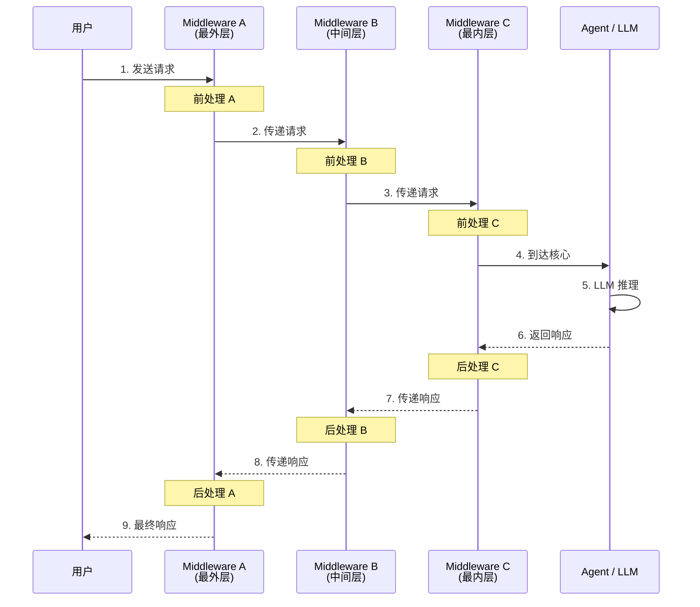

# 中间件概览

## 什么是 Middleware？

Middleware（中间件）是 LangChain 1.0 Agent 架构中的**拦截器层**。它允许你在 Agent 的请求-响应流程中插入自定义逻辑，而无需修改 Agent 的核心代码。

具体来说，Middleware 可以在三个时机介入：

- **请求前（Pre-processing）**：修改用户输入、检测敏感信息、记录日志
- **响应后（Post-processing）**：处理模型输出、格式化结果、触发通知
- **模型调用时（Wrap model call）**：动态调整模型参数、过滤工具列表、注入上下文

这种设计实现了**横切关注点**（Cross-Cutting Concerns）的分离——安全、日志、审批等功能不再散落在业务代码中，而是集中到独立的 Middleware 模块。

### 先修知识

- 已完成 [Agent 实战指南](/ai/langchain/guide/agents)
- 了解 [智能体 Agent](/ai/langchain/guide/agents) 的基本概念

## 洋葱模型：Middleware 执行机制

Middleware 采用经典的**洋葱模型**（Onion Model）执行。每个 Middleware 像洋葱的一层皮，请求从外层向内层穿透，到达 Agent/LLM 核心后，响应再从内层向外层返回。每一层都有机会在请求和响应两个阶段分别执行逻辑。



关键特征：

| 阶段 | 方向 | 说明 |
|------|------|------|
| 请求阶段 | 从上到下（外→内） | 按 middleware 列表的声明顺序执行 |
| 响应阶段 | 从下到上（内→外） | 按 middleware 列表的**逆序**执行 |

这意味着列表中第一个 Middleware **最先**接触请求，也**最后**接触响应——它拥有"全局视角"。

::: tip 前端类比
如果你用过 Express 或 Koa，这个模型会非常熟悉。Express 的 `app.use()` 链和 Koa 的 `async (ctx, next) => {}` 模式本质上就是洋葱模型。LangChain 的 Middleware 与 Koa 的实现最为接近：

```javascript
// Koa 中间件 — 等价概念
app.use(async (ctx, next) => {
  console.log('请求前')  // 前处理
  await next()           // 调用下一层
  console.log('响应后')  // 后处理
})
```

LangChain 的 `handler(request)` 等价于 Koa 的 `await next()`，都是"穿透到下一层"的调用。
:::

## 如何添加 Middleware

通过 `create_agent` 的 `middleware` 参数传入 Middleware 列表：

```python
from langchain.agents import create_agent
from langchain.agents.middleware import PIIMiddleware, SummarizationMiddleware

agent = create_agent(
    model="claude-sonnet-4-5-20250929",
    tools=[search, calculator],
    middleware=[
        PIIMiddleware("email", strategy="redact"),
        SummarizationMiddleware(
            model="claude-sonnet-4-5-20250929",
            max_tokens_before_summary=500
        ),
    ]
)
```

`middleware` 接收一个列表，列表中的顺序就是执行顺序。Agent 创建后，Middleware 链即固定，不可在运行时动态修改。

如需根据环境动态配置，可以在创建前构建列表：

```python
middlewares = []

if config.enable_logging:
    middlewares.append(LoggingMiddleware(log_level="INFO"))

if config.enable_pii_detection:
    middlewares.append(PIIMiddleware("email", strategy="redact"))

agent = create_agent(
    model="claude-sonnet-4-5-20250929",
    tools=[search],
    middleware=middlewares
)
```

## Middleware 排序策略

排序直接影响行为正确性和性能。推荐的排序原则：

```
外层（最先执行）
  ├── 1. 日志 / 追踪         ← 记录原始请求，方便调试
  ├── 2. 安全检查（PII / 内容过滤）  ← 尽早拦截不合规请求
  ├── 3. 性能优化（缓存 / 摘要）    ← 减少后续层的处理量
  └── 4. 流程控制（人工审批）      ← 只在必要时介入
内层（最接近 Agent/LLM）
```

**为什么这样排？**

- **日志在最外层**：能够捕获完整的请求-响应生命周期，包括其他 Middleware 的处理时间
- **安全检查靠前**：尽早拦截包含敏感信息的请求，避免不必要的后续处理（如 LLM 调用）
- **人工审批靠后**：只有通过了所有自动化检查的请求，才需要人工介入，减少审批负担

**反面示例**：

```python
# 错误的排序 — 先摘要再 PII 检测
middleware=[
    SummarizationMiddleware(...),  # 摘要过程可能引入 PII
    PIIMiddleware("email"),        # 此时检测可能遗漏摘要中的 PII
]

# 正确的排序
middleware=[
    PIIMiddleware("email"),        # 先检测原始输入
    SummarizationMiddleware(...),  # 再进行摘要
]
```

## 内置 vs 自定义 Middleware

LangChain 提供了三个核心内置 Middleware，覆盖最常见的横切关注点：

| 内置 Middleware | 功能 | 适用场景 |
|----------------|------|---------|
| `PIIMiddleware` | PII 检测、脱敏、拦截 | 合规要求、数据安全 |
| `SummarizationMiddleware` | 自动摘要长对话 | 控制 token 用量、降低成本 |
| `HumanInTheLoopMiddleware` | 敏感操作人工审批 | 高风险工具调用、合规审计 |

当内置 Middleware 无法满足需求时，可以继承 `AgentMiddleware` 基类创建自定义 Middleware：

```python
from langchain.agents.middleware import AgentMiddleware, ModelRequest
from langchain.agents.middleware.types import ModelResponse

class MyMiddleware(AgentMiddleware):
    def wrap_model_call(self, request, handler):
        # 前处理
        modified_request = self.preprocess(request)
        # 穿透到下一层
        response = handler(modified_request)
        # 后处理
        return self.postprocess(response)
```

详细用法请参考：

- [内置中间件](/ai/langchain/guide/prebuilt-middleware) — PIIMiddleware、SummarizationMiddleware、HumanInTheLoopMiddleware 的完整 API 和实战示例
- [自定义中间件](/ai/langchain/guide/custom-middleware) — 从零编写 Middleware，包括日志、限流、工具过滤等实用模式

## 性能考量

每个 Middleware 都会在请求-响应路径上增加额外开销。以下是典型的延迟参考：

| Middleware 类型 | 典型延迟 | 说明 |
|----------------|---------|------|
| 日志记录 | < 1ms | 仅 I/O 写入 |
| PII 正则检测 | 1-10ms | 取决于正则复杂度和文本长度 |
| 对话摘要 | 1-5s | 需要额外的 LLM 调用 |
| 人工审批 | 不确定 | 取决于人工响应时间 |

优化建议：

1. **只添加必需的 Middleware**：每多一层，请求链路就多一次函数调用开销
2. **利用短路逻辑**：在 Middleware 内部尽早判断是否需要处理，避免无意义的计算
3. **异步日志**：如果日志 Middleware 涉及网络 I/O（如发送到远程服务），使用异步写入避免阻塞主链路
4. **监控 Middleware 耗时**：在日志 Middleware 中记录每层的处理时间，定位性能瓶颈

```python
import time

class TimingMiddleware(AgentMiddleware):
    def wrap_model_call(self, request, handler):
        start = time.perf_counter()
        response = handler(request)
        elapsed = time.perf_counter() - start
        print(f"内层处理耗时: {elapsed:.3f}s")
        return response
```

将 `TimingMiddleware` 放在不同位置，可以测量不同层级的耗时。

## 下一步

- [内置中间件](/ai/langchain/guide/prebuilt-middleware) — 深入了解 PIIMiddleware、SummarizationMiddleware、HumanInTheLoopMiddleware
- [自定义中间件](/ai/langchain/guide/custom-middleware) — 学习编写自定义 Middleware
- [Agent 实战指南](/ai/langchain/guide/agents) — 回顾 Agent 的完整用法
