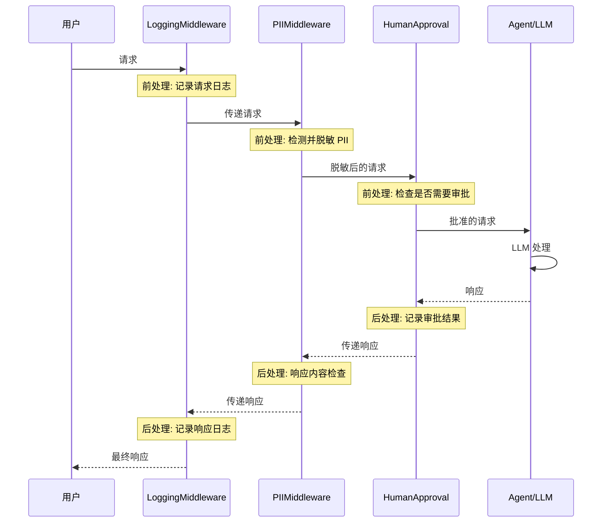
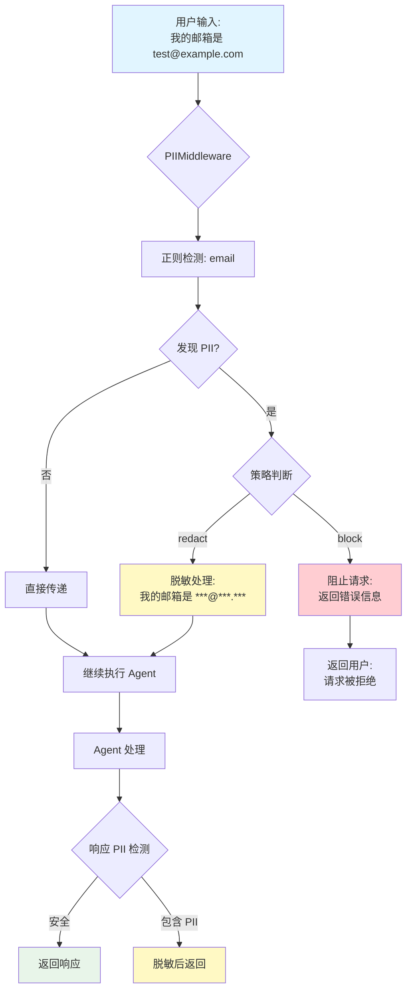
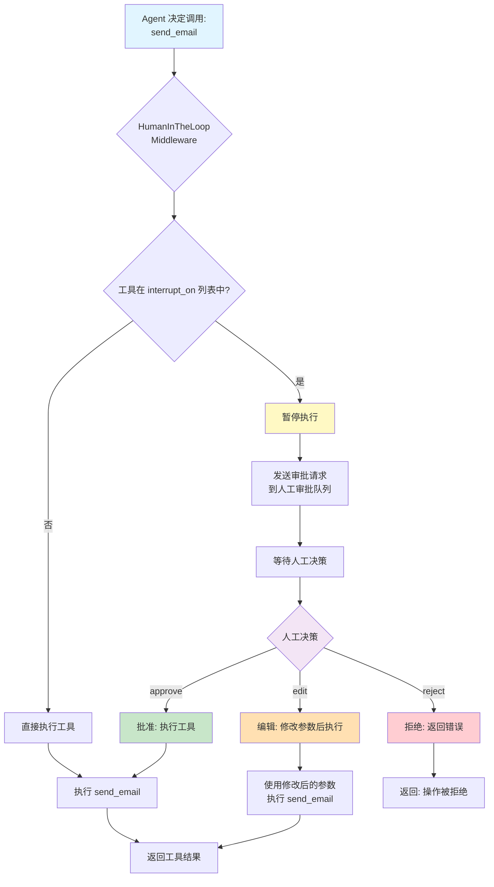

# Middleware

## 概述

Middleware（中间件）是 LangChain 1.0 的重要特性之一，它允许你在 Agent 的请求-响应流程中插入自定义逻辑。通过 Middleware，你可以实现 PII 检测、对话摘要、人工审批等高级功能，而无需修改 Agent 核心代码。

## 核心概念

### 什么是 Middleware？

Middleware 是一个拦截器，它可以：

- **在请求前执行**: 修改用户输入、检测敏感信息
- **在响应后执行**: 处理模型输出、记录日志
- **包装模型调用**: 动态调整模型参数、工具列表

### Middleware 工作原理

下图展示了 Middleware 的洋葱模型执行流程:



**执行流程**:

```
输入 → 日志 → PII检测 → 人工审批 → Agent → LLM → 人工审批 → PII检测 → 日志 → 输出
```

Middleware 可以在流程的任意环节介入，实现横切关注点（Cross-Cutting Concerns）如：

- 安全性（PII 脱敏）
- 性能优化（缓存、摘要）
- 合规性（审计日志、人工审批）

## 代码示例 1: 使用内置 Middleware

LangChain 提供了多个预构建的 Middleware，可以直接使用：

```python
from langchain.agents import create_agent
from langchain.agents.middleware import (
    PIIMiddleware,
    SummarizationMiddleware,
    HumanInTheLoopMiddleware
)

# 定义一些示例工具
def read_email(folder: str) -> str:
    """读取邮件"""
    return "邮件内容示例"

def send_email(to: str, subject: str, body: str) -> str:
    """发送邮件"""
    return f"邮件已发送至 {to}"

# 创建带 Middleware 的 Agent
agent = create_agent(
    model="claude-sonnet-4-5-20250929",
    tools=[read_email, send_email],
    middleware=[
        # PII 检测和编辑：邮箱地址脱敏
        PIIMiddleware("email", strategy="redact", apply_to_input=True),

        # PII 检测和拦截：电话号码阻止
        PIIMiddleware(
            "phone_number",
            detector=(
                r"(?:\+?\d{1,3}[\s.-]?)?"
                r"(?:\(?\d{2,4}\)?[\s.-]?)?"
                r"\d{3,4}[\s.-]?\d{4}"
            ),
            strategy="block"  # 发现电话号码时阻止请求
        ),

        # 对话摘要：当消息过长时自动生成摘要
        SummarizationMiddleware(
            model="claude-sonnet-4-5-20250929",
            max_tokens_before_summary=500  # 超过500 token时触发摘要
        ),

        # 人工审批：敏感操作需要人工确认
        HumanInTheLoopMiddleware(
            interrupt_on={
                "send_email": {
                    "allowed_decisions": ["approve", "edit", "reject"]
                }
            }
        ),
    ]
)
```

**说明**:

- `PIIMiddleware`: 检测和处理个人身份信息（PII）
  - `strategy="redact"`: 脱敏（用 `***` 替换）
  - `strategy="block"`: 阻止包含 PII 的请求
- `SummarizationMiddleware`: 自动摘要长对话历史
- `HumanInTheLoopMiddleware`: 在执行敏感工具前暂停并请求人工批准

### PII 检测流程图

下图展示了 PIIMiddleware 的详细处理流程:



## 代码示例 2: 自定义 Middleware

你可以创建自定义 Middleware 来实现特定逻辑：

```python
from dataclasses import dataclass
from typing import Callable
from langchain_openai import ChatOpenAI
from langchain.agents.middleware import (
    AgentMiddleware,
    ModelRequest
)
from langchain.agents.middleware.types import ModelResponse

# 定义上下文数据结构
@dataclass
class Context:
    user_expertise: str = "beginner"

# 自定义 Middleware：根据用户专业程度调整模型和工具
class ExpertiseBasedToolMiddleware(AgentMiddleware):
    def wrap_model_call(
        self,
        request: ModelRequest,
        handler: Callable[[ModelRequest], ModelResponse]
    ) -> ModelResponse:
        # 获取用户专业程度
        user_level = request.runtime.context.user_expertise

        if user_level == "expert":
            # 专家用户：使用更强大的模型和高级工具
            model = ChatOpenAI(model="gpt-5")
            tools = [advanced_search, data_analysis]
        else:
            # 普通用户：使用较简单的模型和基础工具
            model = ChatOpenAI(model="gpt-5-nano")
            tools = [simple_search, basic_calculator]

        # 修改请求
        request.model = model
        request.tools = tools

        # 调用下一个处理器
        return handler(request)

# 使用自定义 Middleware
agent = create_agent(
    model="claude-sonnet-4-5-20250929",
    tools=[
        simple_search,
        advanced_search,
        basic_calculator,
        data_analysis
    ],
    middleware=[ExpertiseBasedToolMiddleware()],
    context_schema=Context  # 提供上下文类型
)
```

**说明**:

- `AgentMiddleware`: 自定义 Middleware 的基类
- `wrap_model_call`: 拦截模型调用的方法
- `ModelRequest`: 包含模型、工具、消息等信息
- `handler`: 调用下一个 Middleware 或实际的模型

## 代码示例 3: Middleware 链式组合

多个 Middleware 可以组合使用，按顺序执行：

```python
from langchain.agents import create_agent
from langchain.agents.middleware import (
    PIIMiddleware,
    SummarizationMiddleware,
    HumanInTheLoopMiddleware,
    LoggingMiddleware,  # 假设存在日志中间件
)

# Middleware 执行顺序
agent = create_agent(
    model="claude-sonnet-4-5-20250929",
    tools=[search_database, update_user_profile, send_notification],
    middleware=[
        # 1. 首先记录请求日志
        LoggingMiddleware(log_level="INFO"),

        # 2. 检测并脱敏 PII
        PIIMiddleware("email", strategy="redact"),
        PIIMiddleware("ssn", strategy="block"),

        # 3. 摘要长对话
        SummarizationMiddleware(
            model="claude-sonnet-4-5-20250929",
            max_tokens_before_summary=1000
        ),

        # 4. 敏感操作人工审批
        HumanInTheLoopMiddleware(
            interrupt_on={
                "update_user_profile": {"allowed_decisions": ["approve", "reject"]},
                "send_notification": {"allowed_decisions": ["approve", "edit", "reject"]}
            }
        ),
    ]
)
```

**执行流程**:

```
输入 → 日志 → PII检测 → 摘要 → 人工审批 → Agent → LLM → 人工审批 → 摘要 → PII检测 → 日志 → 输出
```

## Middleware 类型

### 1. 安全类 Middleware

- **PIIMiddleware**: PII 检测和处理
- **ContentFilterMiddleware**: 内容过滤（假设）
- **RateLimitMiddleware**: 速率限制（假设）

### 2. 性能类 Middleware

- **CacheMiddleware**: 缓存模型响应（假设）
- **SummarizationMiddleware**: 对话摘要
- **CompressionMiddleware**: 压缩长文本（假设）

### 3. 控制类 Middleware

- **HumanInTheLoopMiddleware**: 人工审批
- **RetryMiddleware**: 自动重试（假设）
- **FallbackMiddleware**: 失败回退（假设）

### 4. 可观测类 Middleware

- **LoggingMiddleware**: 日志记录（假设）
- **TracingMiddleware**: 追踪请求（假设）
- **MetricsMiddleware**: 性能指标（假设）

### HumanInTheLoop 审批流程图

下图展示了敏感操作的人工审批流程:



**审批选项说明**:

- **approve**: 批准执行，不修改参数
- **edit**: 允许审批者修改参数后再执行
- **reject**: 拒绝执行，返回错误给用户

## 最佳实践

1. **合理排序 Middleware**
   - 日志和追踪放在最外层
   - 安全检查放在靠前位置
   - 人工审批放在靠后位置（避免不必要的人工介入）

2. **避免过度使用**
   - 每个 Middleware 都会增加延迟
   - 只添加必需的 Middleware
   - 考虑性能开销

3. **错误处理**
   - 在 Middleware 中添加适当的 try-catch
   - 记录错误日志
   - 提供友好的错误消息

4. **可配置性**
   - 将 Middleware 参数外部化
   - 支持动态启用/禁用
   - 提供不同环境的配置

## 常见问题

**Q: Middleware 的执行顺序重要吗？**

A: 非常重要！Middleware 按照列表顺序执行：

- 请求阶段：从上到下
- 响应阶段：从下到上

例如，如果先摘要后 PII检测，可能会遗漏摘要过程中引入的 PII。

**Q: 如何调试 Middleware？**

A: 几种方法：

1. 使用 `LoggingMiddleware` 记录每个阶段
2. 在自定义 Middleware 中添加 `print` 语句
3. 使用 LangChain 的内置追踪工具（LangSmith）

**Q: Middleware 会影响性能吗？**

A: 是的。每个 Middleware 都会增加一定延迟：

- PII 检测：几毫秒到几十毫秒
- 摘要：需要额外的 LLM 调用（几秒）
- 人工审批：取决于人工响应时间

建议只在必要时使用，并在开发环境测试性能影响。

**Q: 可以在运行时动态添加 Middleware 吗？**

A: 目前 LangChain 1.0 不直接支持运行时修改 Middleware。建议在创建 Agent 时根据配置动态构建 Middleware 列表：

```python
middlewares = [LoggingMiddleware()]
if config.enable_pii_detection:
    middlewares.append(PIIMiddleware("email"))
if config.enable_human_approval:
    middlewares.append(HumanInTheLoopMiddleware(...))

agent = create_agent(model="...", tools=[...], middleware=middlewares)
```

## 下一步

现在你已经掌握了 Middleware 的使用，接下来可以：

- 学习 [Content Blocks](/ai/langchain/guide/content-blocks) - 统一访问不同 Provider 的响应内容
- 查看 [Legacy 迁移指南](/ai/langchain/guide/legacy-migration) - 如何从旧版 API 迁移到 v1.0

## 参考资源

- [LangChain Middleware 官方文档](https://python.langchain.com/docs/modules/agents/middleware/)
- [自定义 Middleware 指南](https://python.langchain.com/docs/modules/agents/custom_middleware/)
- [Middleware 最佳实践](https://python.langchain.com/docs/guides/middleware_best_practices/)
