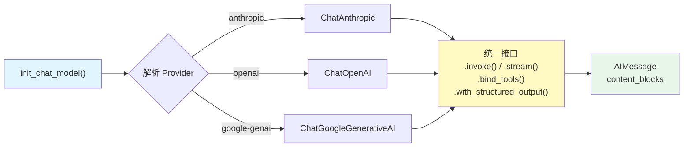

# 模型（Models）

## 概述

模型是 LangChain 的基础层——所有 Agent、Chain、工具调用都建立在模型之上。LangChain 提供了统一的模型接口，让你可以用相同的代码与 Anthropic Claude、OpenAI GPT、Google Gemini 等不同 Provider 交互，并在它们之间无缝切换。

::: tip 前端类比
模型接口类似于前端的 HTTP 请求适配器模式。就像 axios 封装了 `fetch` 和 `XMLHttpRequest` 的差异，让你用同一套 API 发起请求一样，LangChain 的 `init_chat_model` 封装了不同 LLM Provider 的差异，让你用同一套接口调用任何模型。切换 Provider 就像切换 axios 的 `baseURL`。
:::

从 LangChain 的原生语义来看，`init_chat_model` 是一个工厂函数，它根据模型名称或 `model_provider` 参数自动选择对应的 Provider 实现类（如 `ChatAnthropic`、`ChatOpenAI`），返回一个遵循 `BaseChatModel` 接口的实例。所有模型实例都支持 `.invoke()`、`.stream()`、`.bind_tools()`、`.with_structured_output()` 等标准方法。

[🔗 init_chat_model API 参考](https://python.langchain.com/api_reference/langchain/chat_models/langchain.chat_models.base.init_chat_model.html){target="_blank" rel="noopener"} · [🔗 Chat Model 集成列表](https://python.langchain.com/docs/integrations/chat/){target="_blank" rel="noopener"}

## 核心概念

### 模型初始化的两种方式

LangChain 提供两种方式初始化聊天模型：

| 方式 | 适用场景 | 优势 |
|------|---------|------|
| `init_chat_model()` | 需要运行时切换 Provider | 统一接口，配置驱动 |
| 直接实例化 Provider 类 | 固定 Provider，需要细粒度控制 | 类型提示更完整，IDE 支持更好 |

### Provider 包生态

每个 LLM Provider 有独立的集成包：

| Provider | 包名 | 模型类 |
|----------|------|--------|
| Anthropic | `langchain-anthropic` | `ChatAnthropic` |
| OpenAI | `langchain-openai` | `ChatOpenAI` |
| Google | `langchain-google-genai` | `ChatGoogleGenerativeAI` |
| HuggingFace | `langchain-huggingface` | `ChatHuggingFace` |

### 模型调用流程



## 代码示例 1: 使用 init_chat_model 初始化

`init_chat_model` 是推荐的模型初始化方式，支持所有已安装的 Provider：

```python
from langchain.chat_models import init_chat_model

# 方式 1: 直接指定模型名称（自动推断 Provider）
model = init_chat_model("claude-sonnet-4-5-20250929")

# 方式 2: 显式指定 Provider
model = init_chat_model(
    "claude-sonnet-4-5-20250929",
    model_provider="anthropic",
)

# 方式 3: 带参数初始化
model = init_chat_model(
    "claude-sonnet-4-5-20250929",
    temperature=0.7,
    max_tokens=1000,
    timeout=30,
)

# 调用模型
response = model.invoke("用一句话解释什么是 LangChain")
print(response.content)
```

**说明**：

- 当模型名称能唯一映射到 Provider 时（如 `claude-*` 映射到 Anthropic），可省略 `model_provider`
- 如果名称有歧义，需要显式指定 `model_provider` 参数
- `temperature`、`max_tokens`、`timeout` 等通用参数直接作为关键字参数传入

## 代码示例 2: 直接实例化 Provider 类

当你确定使用哪个 Provider 时，可以直接实例化对应的模型类：

```python
from langchain_anthropic import ChatAnthropic
from langchain_openai import ChatOpenAI
from langchain_google_genai import ChatGoogleGenerativeAI

# Anthropic Claude
claude = ChatAnthropic(
    model="claude-sonnet-4-5-20250929",
    temperature=0.7,
    max_tokens=1024,
)

# OpenAI GPT
gpt = ChatOpenAI(
    model="gpt-4o",
    temperature=0.7,
    max_tokens=1024,
)

# Google Gemini
gemini = ChatGoogleGenerativeAI(
    model="gemini-2.0-flash",
    temperature=0.7,
    max_tokens=1024,
)

# 所有模型都遵循相同的接口
for m in [claude, gpt, gemini]:
    response = m.invoke("你好，请做个自我介绍")
    print(response.content)
    print("---")
```

**安装对应的 Provider 包**：

```bash
# 根据需要安装
pip install langchain-anthropic   # Anthropic Claude
pip install langchain-openai      # OpenAI GPT
pip install langchain-google-genai # Google Gemini
```

每个包需要对应的 API Key 环境变量：

```bash
export ANTHROPIC_API_KEY="sk-ant-..."
export OPENAI_API_KEY="sk-..."
export GOOGLE_API_KEY="AI..."
```

## 代码示例 3: 模型参数详解

所有模型都支持一组通用参数，用于控制生成行为：

```python
from langchain.chat_models import init_chat_model

model = init_chat_model(
    "claude-sonnet-4-5-20250929",
    # 控制随机性：0 = 确定性输出，1 = 高随机性
    temperature=0.3,
    # 最大生成 token 数
    max_tokens=2048,
    # 核采样：只从概率最高的 top_p 比例的 token 中采样
    top_p=0.9,
    # 停止序列：遇到这些字符串时停止生成
    stop=["\n\n---", "END"],
    # 请求超时时间（秒）
    timeout=60,
)

response = model.invoke("写一篇关于 Python 的简短介绍")
print(response.content)
```

**参数说明**：

| 参数 | 类型 | 默认值 | 说明 |
|------|------|--------|------|
| `temperature` | float | 1.0 | 控制输出随机性。0 表示几乎确定性，适合代码生成；0.7-1.0 适合创意写作 |
| `max_tokens` | int | 因模型而异 | 限制生成的最大 token 数量 |
| `top_p` | float | 1.0 | 核采样参数，与 temperature 互补使用 |
| `stop` | list[str] | None | 遇到指定字符串时提前停止生成 |
| `timeout` | int | None | API 请求超时时间（秒） |

> **提示**：一般建议调整 `temperature` 或 `top_p` 其中之一，不要同时调整两者。

## 代码示例 4: bind_tools 绑定工具

`bind_tools` 让模型知道有哪些工具可以调用：

```python
from langchain.chat_models import init_chat_model
from langchain.tools import tool

@tool
def get_weather(city: str) -> str:
    """获取指定城市的天气信息"""
    return f"{city}今天晴，气温 22°C"

@tool
def search_docs(query: str) -> str:
    """搜索技术文档"""
    return f"找到关于 {query} 的 5 篇文档"

model = init_chat_model("claude-sonnet-4-5-20250929")

# 绑定工具到模型
model_with_tools = model.bind_tools([get_weather, search_docs])

# 模型会根据输入决定是否调用工具
response = model_with_tools.invoke("北京今天天气怎么样？")

# 检查工具调用
if response.tool_calls:
    for tc in response.tool_calls:
        print(f"工具: {tc['name']}")
        print(f"参数: {tc['args']}")
else:
    print(f"直接回复: {response.content}")
```

**说明**：

- `bind_tools` 返回一个新的模型实例，不会修改原模型
- 模型不会自动执行工具，只是生成工具调用指令
- 实际的工具执行由 Agent 框架完成（参见 [智能体 Agent](/ai/langchain/guide/agents)）

## 代码示例 5: with_structured_output 结构化输出

`with_structured_output` 让模型返回符合指定 Schema 的结构化数据：

```python
from langchain.chat_models import init_chat_model
from pydantic import BaseModel, Field

# 定义输出结构
class BookReview(BaseModel):
    title: str = Field(description="书名")
    rating: int = Field(description="评分 1-5")
    summary: str = Field(description="一句话总结")
    recommend: bool = Field(description="是否推荐")

model = init_chat_model("claude-sonnet-4-5-20250929")

# 绑定结构化输出
structured_model = model.with_structured_output(BookReview)

# 返回值直接是 BookReview 实例
review = structured_model.invoke("评价一下《Python Cookbook》这本书")

print(f"书名: {review.title}")
print(f"评分: {review.rating}/5")
print(f"总结: {review.summary}")
print(f"推荐: {'是' if review.recommend else '否'}")
```

**说明**：

- 支持 Pydantic BaseModel、TypedDict、JSON Schema 作为输出格式定义
- 模型会自动将响应解析为指定类型，解析失败会抛出异常
- 适合需要从非结构化文本中提取结构化信息的场景

## 代码示例 6: 运行时切换 Provider

`init_chat_model` 支持创建可配置的模型实例，在运行时通过 config 切换 Provider：

```python
from langchain.chat_models import init_chat_model

# 不指定模型名称，创建可配置实例
configurable_model = init_chat_model(temperature=0)

# 运行时通过 config 切换模型
# 使用 Claude
response_claude = configurable_model.invoke(
    "你好",
    config={"configurable": {"model": "claude-sonnet-4-5-20250929"}},
)
print(f"Claude: {response_claude.content}")

# 使用 GPT
response_gpt = configurable_model.invoke(
    "你好",
    config={"configurable": {"model": "gpt-4o"}},
)
print(f"GPT: {response_gpt.content}")

# 使用 Gemini
response_gemini = configurable_model.invoke(
    "你好",
    config={"configurable": {"model": "gemini-2.0-flash"}},
)
print(f"Gemini: {response_gemini.content}")
```

**使用场景**：

- A/B 测试不同模型的表现
- 根据任务复杂度动态选择模型（简单任务用小模型，复杂任务用大模型）
- 用户可选模型的应用场景

## 代码示例 7: Content Blocks 统一响应格式

所有模型返回的 `AIMessage` 都支持 `content_blocks` 属性，提供跨 Provider 的统一响应格式：

```python
from langchain.chat_models import init_chat_model

model = init_chat_model("claude-sonnet-4-5-20250929")
response = model.invoke("解释什么是递归")

# content_blocks 提供结构化的内容访问
for block in response.content_blocks:
    if block["type"] == "text":
        print(f"文本: {block['text']}")
    elif block["type"] == "reasoning":
        print(f"推理过程: {block['reasoning']}")
    elif block["type"] == "tool_call":
        print(f"工具调用: {block['name']}({block['args']})")
```

Content Blocks 支持 7 种标准类型：

| 类型 | 说明 | 支持的 Provider |
|------|------|----------------|
| `text` | 文本内容 | 所有 Provider |
| `reasoning` | 模型推理过程 | Anthropic Claude |
| `tool_call` | 工具调用指令 | 大部分 Provider |
| `image` | 图片内容 | 支持多模态的 Provider |
| `audio` | 音频内容 | 支持音频的 Provider |
| `video` | 视频内容 | 支持视频的 Provider |
| `file` | 文件内容 | 支持文件的 Provider |

> 更多 Content Blocks 细节请参阅 [消息 Messages](/ai/langchain/guide/messages) 专题页。

## 代码示例 8: 多模态输入

支持多模态的模型可以接收图片、音频等输入：

```python
from langchain.chat_models import init_chat_model
from langchain.messages import HumanMessage

model = init_chat_model("claude-sonnet-4-5-20250929")

# 方式 1: 通过 URL 发送图片
message_url = HumanMessage(content_blocks=[
    {"type": "text", "text": "描述这张图片的内容。"},
    {"type": "image", "url": "https://example.com/photo.jpg"},
])

response = model.invoke([message_url])
print(response.content)

# 方式 2: 通过 base64 发送图片
import base64

with open("local_image.png", "rb") as f:
    image_data = base64.b64encode(f.read()).decode()

message_b64 = HumanMessage(content_blocks=[
    {"type": "text", "text": "这张图里有什么？"},
    {
        "type": "image",
        "base64": image_data,
        "mime_type": "image/png",
    },
])

response = model.invoke([message_b64])
print(response.content)
```

**说明**：

- 多模态输入使用 `content_blocks` 构造消息，每个块指定 `type`
- 图片支持 URL、base64、provider 文件 ID 三种方式
- 不同 Provider 对多模态的支持程度不同，使用前请确认目标模型的能力

## 最佳实践

### 1. 优先使用 init_chat_model

除非有特殊需求，推荐使用 `init_chat_model` 而非直接实例化 Provider 类。这样代码更容易维护和迁移：

```python
# 推荐：统一接口
from langchain.chat_models import init_chat_model
model = init_chat_model("claude-sonnet-4-5-20250929", temperature=0)

# 也可以：直接实例化（需要 Provider 特有功能时）
from langchain_anthropic import ChatAnthropic
model = ChatAnthropic(model="claude-sonnet-4-5-20250929", temperature=0)
```

### 2. 环境变量管理 API Key

永远不要在代码中硬编码 API Key：

```python
# 错误：硬编码
model = init_chat_model("claude-sonnet-4-5-20250929", api_key="sk-ant-xxx")

# 正确：通过环境变量（模型自动读取）
# export ANTHROPIC_API_KEY="sk-ant-xxx"
model = init_chat_model("claude-sonnet-4-5-20250929")
```

### 3. 根据任务选择参数

```python
# 代码生成 / 数据提取 → 低 temperature
code_model = init_chat_model("claude-sonnet-4-5-20250929", temperature=0)

# 创意写作 / 头脑风暴 → 较高 temperature
creative_model = init_chat_model("claude-sonnet-4-5-20250929", temperature=0.9)

# 长文本生成 → 增大 max_tokens
long_model = init_chat_model("claude-sonnet-4-5-20250929", max_tokens=4096)
```

### 4. 使用 content_blocks 而非 content

`content_blocks` 是 LangChain 1.0 推荐的响应访问方式，跨 Provider 兼容性更好：

```python
response = model.invoke("你好")

# 推荐：统一格式
for block in response.content_blocks:
    if block["type"] == "text":
        print(block["text"])

# 不推荐：格式因 Provider 而异
print(response.content)
```

## 常见问题

**Q: init_chat_model 和直接实例化 Provider 类有什么区别？**

A: `init_chat_model` 是工厂函数，根据模型名称动态选择 Provider 类。它的优势是代码与 Provider 解耦，便于切换。直接实例化 Provider 类的优势是 IDE 类型提示更完整，可以使用 Provider 特有的参数。两者返回的对象接口完全一致。

**Q: 如何处理不同 Provider 的 API Key？**

A: 每个 Provider 有固定的环境变量名称：
- Anthropic: `ANTHROPIC_API_KEY`
- OpenAI: `OPENAI_API_KEY`
- Google: `GOOGLE_API_KEY`

模型初始化时会自动读取对应的环境变量，也可以通过 `api_key` 参数显式传入。

**Q: temperature 设为 0 就完全确定性了吗？**

A: 大多数 Provider 在 `temperature=0` 时输出接近确定性，但不保证完全一致。如果需要可复现的输出，部分 Provider 支持 `seed` 参数。

**Q: 模型不支持我绑定的工具怎么办？**

A: 不是所有模型都支持 tool calling。如果模型不支持，`bind_tools` 会在调用时抛出异常。建议使用支持 function calling 的模型（如 Claude 3.5+、GPT-4+、Gemini 1.5+）。

**Q: 多模态输入支持哪些格式？**

A: 取决于 Provider。Anthropic Claude 支持图片（JPEG、PNG、GIF、WebP）和 PDF；OpenAI GPT-4o 支持图片和音频；Google Gemini 支持图片、音频和视频。具体限制请查阅各 Provider 的官方文档。

## 下一步

现在你已经掌握了 LangChain 的模型接口，接下来可以：

- 学习 [消息（Messages）](/ai/langchain/guide/messages) - 了解如何构造对话消息
- 探索 [工具（Tools）](/ai/langchain/guide/tools) - 让模型调用外部工具
- 掌握 [结构化输出](/ai/langchain/guide/structured-output) - 从文本中提取结构化数据
- 了解 [消息 Messages](/ai/langchain/guide/messages) - 深入统一内容访问接口
- 实践 [流式响应](/ai/langchain/guide/streaming) - 实时接收模型输出

## 参考资源

- [LangChain Models 官方文档](https://docs.langchain.com/oss/python/langchain/models)
- [init_chat_model API 参考](https://python.langchain.com/api_reference/langchain/chat_models/langchain.chat_models.base.init_chat_model.html)
- [LangChain Provider 集成列表](https://python.langchain.com/docs/integrations/chat/)
- [LangChain v1.0 迁移指南](https://docs.langchain.com/oss/python/migrate/langchain-v1)
