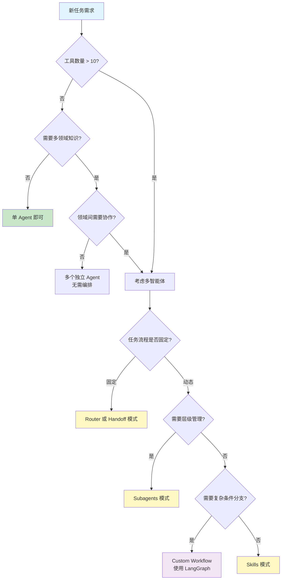
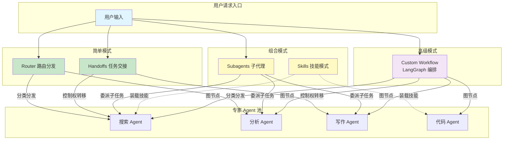

# 多智能体概览

> 前置阅读：[智能体 Agent](/ai/langchain/guide/agents)

## 什么是多智能体系统

单个 Agent 已经很强——它能理解意图、选择工具、执行任务。但当任务规模和复杂度上升时，一个 Agent 独揽一切会遇到瓶颈：

| 挑战 | 表现 | 多智能体方案 |
|------|------|-------------|
| 工具爆炸 | 单 Agent 挂载 30+ 工具，LLM 选择准确率下降 | 按职能拆分，每个 Agent 只负责 5-8 个工具 |
| 上下文膨胀 | 长对话 + 多工具结果导致 Token 超限 | 子任务独立处理，父 Agent 只汇总结果 |
| 专业化不足 | 通用 prompt 难以覆盖所有领域 | 每个 Agent 有独立的 system prompt 和领域知识 |
| 可维护性差 | 单体 Agent 修改牵一发动全身 | 模块化拆分，独立测试和迭代 |

**多智能体系统（Multi-Agent System）** 的核心思路：将复杂任务拆分给多个专职 Agent，它们各司其职、协同完成目标。

```python
# 单 Agent 模式 — 什么都做，容易出错
single_agent = create_react_agent(
    model,
    tools=[search, analyze, write_sql, send_email, translate, ...],  # 工具太多
    prompt="你是万能助手"  # 角色太泛
)

# 多智能体模式 — 各司其职
research_agent = create_react_agent(model, tools=[search, summarize], prompt="你是研究员")
data_agent = create_react_agent(model, tools=[write_sql, analyze], prompt="你是数据分析师")
comm_agent = create_react_agent(model, tools=[send_email, translate], prompt="你是沟通专员")
```

## 何时使用多智能体

并非所有场景都需要多智能体。以下是判断标准：

### 适合单 Agent

- 工具数量 < 10 个
- 任务流程线性、不涉及多领域
- 对话轮次较少，上下文可控
- 快速原型开发阶段

### 适合多 Agent

- 工具数量 > 10 个，且可按领域分组
- 任务需要多步骤、多领域协作
- 需要不同 Agent 使用不同模型（如推理用 Claude，代码用 GPT-4o）
- 团队需要独立维护各自的 Agent 模块
- 需要对子任务做精细权限控制

### 决策流程



## 五大多智能体模式

LangChain 提供了五种多智能体协作模式，覆盖从简单到复杂的各种场景。

### 1. Subagents 子代理

**核心思想**：父 Agent 创建并管理子 Agent，将子任务委派下去，汇总子 Agent 的结果。

```
父 Agent（管理者）
  ├── 子 Agent A（研究）
  ├── 子 Agent B（分析）
  └── 子 Agent C（撰写）
```

**适用场景**：复杂任务的分而治之，如研究报告生成、多步骤数据处理。

详见 [多智能体模式 - Subagents](/ai/langchain/guide/multi-agent-patterns#subagents-子代理)

### 2. Handoffs 任务交接

**核心思想**：Agent 之间直接传递控制权，当前 Agent 判断自己无法处理时，将任务连同上下文交接给更合适的 Agent。

```
用户 → 分诊 Agent → 账单 Agent
                  → 技术 Agent
                  → 通用 Agent
```

**适用场景**：客服系统、多级审批、问题分类后路由到专家。

详见 [多智能体模式 - Handoffs](/ai/langchain/guide/multi-agent-patterns#handoffs-任务交接)

### 3. Router 路由分发

**核心思想**：中央路由器接收所有请求，根据分类规则将请求分发给对应的专家 Agent。

```
所有请求 → 路由器 → 数学专家
                 → 科学专家
                 → 历史专家
```

**适用场景**：知识问答系统、多领域客服、统一入口的服务台。

详见 [多智能体模式 - Router](/ai/langchain/guide/multi-agent-patterns#router-路由分发)

### 4. Skills 技能模式

**核心思想**：将 Agent 能力封装为可复用的"技能"单元，Agent 按需加载和组合技能。

```
Agent + [SQL 技能, 搜索技能, 代码生成技能]
```

**适用场景**：能力复用、插件化架构、渐进式增强 Agent 能力。

详见 [高级多智能体 - Skills](/ai/langchain/guide/multi-agent-advanced#skills-技能模式)

### 5. Custom Workflow 自定义工作流

**核心思想**：使用 LangGraph 构建完全自定义的多 Agent 编排流程，支持条件分支、并行执行、循环和人工干预。

```
LangGraph StateGraph → 条件路由 → 并行节点 → 汇聚 → 输出
```

**适用场景**：复杂业务流程、需要精细控制的场景、生产级多 Agent 系统。

详见 [高级多智能体 - Custom Workflow](/ai/langchain/guide/multi-agent-advanced#custom-workflow-自定义工作流)

## 模式对比速查

| 模式 | 复杂度 | 灵活性 | 典型场景 | 推荐度 |
|------|--------|--------|---------|--------|
| Subagents | 中 | 高 | 研究报告、项目管理 | 通用首选 |
| Handoffs | 低 | 中 | 客服路由、多级审批 | 流程明确时 |
| Router | 低 | 低 | 知识问答、分类分发 | 最简多Agent |
| Skills | 中 | 高 | 能力复用、插件化 | 工具密集型 |
| Custom Workflow | 高 | 最高 | 生产级编排、复杂流程 | 高级场景 |

## 架构全景

下图展示五种模式在系统中的位置和关系：



**模式递进关系**：

1. **Router / Handoffs** — 入门级多智能体，适合流程明确、分支固定的场景
2. **Subagents / Skills** — 中级模式，支持动态委派和能力复用
3. **Custom Workflow** — 高级模式，LangGraph 提供完全的流程控制能力

::: tip 前端类比
多智能体系统 ≈ **微前端架构（Micro Frontends）**：

- **独立团队**：每个 Agent 就像一个独立的微前端应用，有自己的技术栈（模型 + 工具 + prompt）
- **统一入口**：Router 模式类似 Module Federation 的路由分发
- **组合渲染**：Subagents 模式类似容器应用组合多个子应用的输出
- **共享状态**：Agent 间的消息传递类似微前端间通过 CustomEvent 或共享 Store 通信

不过，多智能体系统的"组合"发生在推理层面（语义理解 + 任务规划），而微前端的组合发生在 UI 层面。Agent 之间的通信是基于自然语言消息，比 API 调用更灵活，但也更不确定。
:::

## 快速上手建议

1. **从单 Agent 开始** — 先用一个 Agent 验证核心功能
2. **识别拆分点** — 当工具超过 10 个或 prompt 变得臃肿时考虑拆分
3. **选最简模式** — Router 和 Handoffs 能解决的就不用 Subagents
4. **渐进升级** — 从 LangChain 多智能体模式开始，需要更强控制时迁移到 LangGraph

## 下一步

- [多智能体模式](/ai/langchain/guide/multi-agent-patterns) — 深入学习 Subagents / Handoffs / Router 三大核心模式
- [高级多智能体](/ai/langchain/guide/multi-agent-advanced) — Skills 技能模式、LangGraph 自定义工作流、内存共享和错误处理
- [Agents](/ai/langchain/guide/agents) — 单 Agent 基础，多智能体的构建基石
- [LangGraph 概览](/ai/langgraph/guide/overview) — 需要更强编排能力时的升级方案

## 参考资源

- [LangChain Multi-Agent 官方文档](https://python.langchain.com/docs/concepts/multi_agent/)
- [LangGraph Multi-Agent 教程](https://langchain-ai.github.io/langgraph/tutorials/multi_agent/)
- [Agent 架构模式选型指南](https://python.langchain.com/docs/concepts/architecture/)
