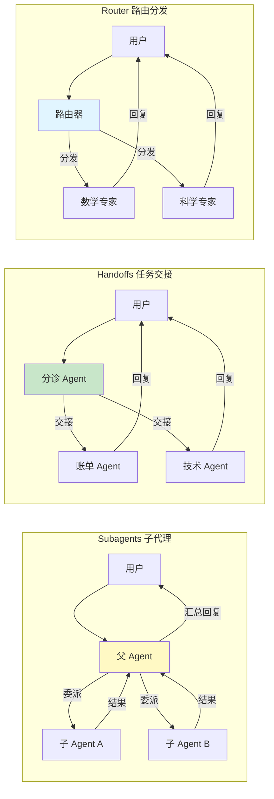

# 多智能体模式

> 前置阅读：[多智能体概览](/ai/langchain/guide/multi-agent-overview) · [智能体 Agent](/ai/langchain/guide/agents)

本章深入讲解三大核心多智能体模式：**Subagents（子代理）**、**Handoffs（任务交接）**、**Router（路由分发）**。每种模式都包含概念说明、适用场景和完整代码示例。

## Subagents 子代理

### 概念

Subagents 模式采用**层级结构**：一个父 Agent（Supervisor）负责理解用户意图、拆解任务，然后将子任务委派给专职的子 Agent 执行。子 Agent 完成后将结果返回给父 Agent，由父 Agent 汇总输出最终答案。

这是多智能体系统中最通用的模式——当你不确定选哪种模式时，Subagents 通常是安全的默认选择。

### 适用场景

- **研究报告生成**：搜索子 Agent 收集资料 → 分析子 Agent 提炼观点 → 写作子 Agent 组织文章
- **数据处理流水线**：提取子 Agent 解析数据 → 转换子 Agent 清洗格式 → 加载子 Agent 写入存储
- **项目管理**：分解任务 → 分配给不同专家 → 汇总进度

### 代码示例：研究 Agent

以下示例构建一个研究 Agent，它管理两个子 Agent——搜索子 Agent 和分析子 Agent：

```python
from langchain.chat_models import init_chat_model
from langchain.tools import tool
from langgraph.prebuilt import create_react_agent

model = init_chat_model("openai:gpt-4o")

# ============ 子 Agent 1：搜索 ============
@tool
def web_search(query: str) -> str:
    """搜索网页获取最新信息"""
    # 实际项目中接入 Tavily / SerpAPI 等
    return f"搜索 '{query}' 的结果：发现 3 篇相关论文和 5 篇行业报告"

@tool
def academic_search(query: str) -> str:
    """搜索学术论文"""
    return f"学术搜索 '{query}'：找到 2 篇高引用论文"

search_agent = create_react_agent(
    model,
    tools=[web_search, academic_search],
    prompt="你是专业的信息检索员。用户给你搜索关键词，你负责全面搜索并返回原始结果。不要分析，只搜索和汇总搜索结果。"
)

# ============ 子 Agent 2：分析 ============
@tool
def extract_key_points(text: str) -> str:
    """从文本中提取关键观点"""
    return f"关键观点：1) AI 安全研究投入增长 200% 2) 对齐问题成为核心议题 3) 多国出台监管框架"

@tool
def generate_summary(points: str) -> str:
    """根据关键观点生成结构化摘要"""
    return f"结构化摘要：\n- 趋势：{points}\n- 影响：深远\n- 建议：持续关注"

analysis_agent = create_react_agent(
    model,
    tools=[extract_key_points, generate_summary],
    prompt="你是数据分析专家。接收原始资料后提取关键观点并生成结构化摘要。"
)

# ============ 父 Agent：协调器 ============
@tool
def delegate_search(query: str) -> str:
    """委派搜索任务给搜索子 Agent"""
    result = search_agent.invoke(
        {"messages": [{"role": "user", "content": f"请搜索：{query}"}]}
    )
    return result["messages"][-1].content

@tool
def delegate_analysis(raw_data: str) -> str:
    """委派分析任务给分析子 Agent"""
    result = analysis_agent.invoke(
        {"messages": [{"role": "user", "content": f"请分析以下资料：{raw_data}"}]}
    )
    return result["messages"][-1].content

supervisor = create_react_agent(
    model,
    tools=[delegate_search, delegate_analysis],
    prompt="""你是研究项目管理者。收到用户的研究需求后：
1. 先委派搜索任务收集资料
2. 再将搜索结果交给分析 Agent 提炼
3. 最后综合所有结果，用清晰的格式回复用户"""
)

# 执行
result = supervisor.invoke(
    {"messages": [{"role": "user", "content": "帮我研究 2024 年 AI 安全领域的最新进展"}]}
)
print(result["messages"][-1].content)
```

### 父 Agent 的委派策略

父 Agent 通过**工具调用**来委派任务——每个子 Agent 被封装为一个工具。关键设计原则：

1. **工具描述清晰**：让父 Agent 准确知道每个子 Agent 的能力边界
2. **子 Agent 独立**：子 Agent 不依赖父 Agent 的上下文，通过参数接收全部所需信息
3. **结果精简**：子 Agent 返回摘要而非全部原始数据，避免父 Agent 上下文膨胀

```python
# 好的做法：工具描述明确子 Agent 的能力和输入要求
@tool
def delegate_search(query: str) -> str:
    """委派搜索任务给搜索子 Agent。
    输入：搜索关键词或问题
    输出：搜索结果的汇总文本
    注意：仅返回搜索结果，不做分析判断"""
    ...

# 不好的做法：描述模糊
@tool
def search(q: str) -> str:
    """搜索"""
    ...
```

## Handoffs 任务交接

### 概念

Handoffs 模式下，Agent 之间**直接传递控制权**。当前 Agent 判断任务超出自己的能力范围时，主动将对话连同上下文"交接"给更合适的 Agent。

与 Subagents 的关键区别：Subagents 有明确的上下级关系，而 Handoffs 是平级 Agent 之间的协作——控制权可以在任意 Agent 间流转。

### 适用场景

- **客服系统**：分诊 Agent 判断问题类型 → 交接给账单 / 技术 / 售后专家
- **多步骤审批**：初审 Agent → 复审 Agent → 终审 Agent
- **问题升级**：一线 Agent 无法解决 → 交接给高级 Agent

### 代码示例：客服交接系统

```python
from langchain.chat_models import init_chat_model
from langchain.tools import tool
from langgraph.prebuilt import create_react_agent

model = init_chat_model("openai:gpt-4o")

# ============ 专家 Agent 定义 ============

# 账单专家
@tool
def check_billing(account_id: str) -> str:
    """查询账单信息"""
    return f"账户 {account_id}：当前余额 ¥128.50，上月消费 ¥89.00，无欠费"

@tool
def apply_refund(account_id: str, amount: float, reason: str) -> str:
    """申请退款"""
    return f"退款申请已提交：账户 {account_id}，金额 ¥{amount}，原因：{reason}"

billing_agent = create_react_agent(
    model,
    tools=[check_billing, apply_refund],
    prompt="你是账单专家。只处理账单查询、费用争议、退款申请。如果用户问题与账单无关，告知无法处理。"
)

# 技术专家
@tool
def diagnose_network(issue: str) -> str:
    """诊断网络问题"""
    return f"网络诊断结果：{issue} — 检测到 DNS 解析延迟，建议更换 DNS 服务器"

@tool
def check_service_status(service: str) -> str:
    """检查服务状态"""
    return f"服务 {service} 状态：运行正常，延迟 23ms，可用率 99.97%"

tech_agent = create_react_agent(
    model,
    tools=[diagnose_network, check_service_status],
    prompt="你是技术支持专家。只处理技术故障、网络问题、服务状态查询。"
)

# 通用客服
@tool
def query_faq(question: str) -> str:
    """查询常见问题"""
    return f"FAQ 匹配结果：关于 '{question}' 的常见解答..."

general_agent = create_react_agent(
    model,
    tools=[query_faq],
    prompt="你是通用客服。处理一般性咨询、FAQ 查询、意见反馈。"
)

# ============ 分诊 Agent（入口）============

@tool
def handoff_to_billing(user_message: str, context: str = "") -> str:
    """将对话交接给账单专家。当用户询问账单、费用、退款相关问题时使用。
    Args:
        user_message: 用户的原始问题
        context: 之前对话的上下文摘要
    """
    result = billing_agent.invoke(
        {"messages": [
            {"role": "system", "content": f"上下文：{context}"},
            {"role": "user", "content": user_message}
        ]}
    )
    return f"[账单专家回复] {result['messages'][-1].content}"

@tool
def handoff_to_tech(user_message: str, context: str = "") -> str:
    """将对话交接给技术支持专家。当用户遇到技术故障、网络问题时使用。
    Args:
        user_message: 用户的原始问题
        context: 之前对话的上下文摘要
    """
    result = tech_agent.invoke(
        {"messages": [
            {"role": "system", "content": f"上下文：{context}"},
            {"role": "user", "content": user_message}
        ]}
    )
    return f"[技术专家回复] {result['messages'][-1].content}"

@tool
def handoff_to_general(user_message: str, context: str = "") -> str:
    """将对话交接给通用客服。处理一般性咨询。
    Args:
        user_message: 用户的原始问题
        context: 之前对话的上下文摘要
    """
    result = general_agent.invoke(
        {"messages": [
            {"role": "system", "content": f"上下文：{context}"},
            {"role": "user", "content": user_message}
        ]}
    )
    return f"[通用客服回复] {result['messages'][-1].content}"

triage_agent = create_react_agent(
    model,
    tools=[handoff_to_billing, handoff_to_tech, handoff_to_general],
    prompt="""你是客服分诊 Agent。你的职责是：
1. 理解用户问题的类别
2. 将问题交接给合适的专家
3. 如果专家的回复不完整，可以追加交接

分类规则：
- 账单、费用、退款、充值 → 账单专家
- 网络故障、服务异常、技术问题 → 技术专家
- 其他一般性问题 → 通用客服

交接时务必传递完整的用户原始问题和上下文。"""
)

# 执行
result = triage_agent.invoke(
    {"messages": [{"role": "user", "content": "我的网络突然很慢，而且上个月的账单好像多扣了钱"}]}
)
print(result["messages"][-1].content)
```

### 交接机制与状态传递

Handoffs 的关键在于**上下文的完整传递**。交接时需要传递：

```python
# 交接数据结构
handoff_data = {
    "user_message": "用户的原始问题",
    "context": "之前对话的摘要",
    "metadata": {
        "source_agent": "triage",         # 来源 Agent
        "reason": "billing_related",       # 交接原因
        "priority": "normal",              # 优先级
        "attempt": 1,                      # 第几次交接
    }
}
```

**避免交接死循环**：设置最大交接次数，防止 Agent A 交给 B，B 又交回 A：

```python
MAX_HANDOFFS = 3

@tool
def handoff_to_billing(user_message: str, context: str = "", attempt: int = 1) -> str:
    """交接给账单专家"""
    if attempt > MAX_HANDOFFS:
        return "已达最大交接次数，转人工客服处理"
    result = billing_agent.invoke(...)
    return result["messages"][-1].content
```

## Router 路由分发

### 概念

Router 模式是最简单的多智能体架构：一个**中央路由器**接收所有请求，根据分类规则将请求分发给对应的专家 Agent。路由器本身不处理业务逻辑，只负责"分类"和"转发"。

与 Handoffs 的区别：Router 是单跳分发（路由器 → 专家），不存在专家之间的横向交接。

### 适用场景

- **知识问答**：数学问题 → 数学 Agent，历史问题 → 历史 Agent
- **多语言支持**：检测语言 → 对应语言的 Agent
- **服务台**：根据请求类型分发到不同的处理 Agent

### 代码示例：知识路由器

```python
from langchain.chat_models import init_chat_model
from langchain.tools import tool
from langgraph.prebuilt import create_react_agent

model = init_chat_model("openai:gpt-4o")

# ============ 专家 Agent ============

@tool
def solve_equation(equation: str) -> str:
    """求解数学方程"""
    return f"方程 {equation} 的解：x = 42"

@tool
def explain_theorem(name: str) -> str:
    """解释数学定理"""
    return f"{name} 定理：...详细解释..."

math_agent = create_react_agent(
    model,
    tools=[solve_equation, explain_theorem],
    prompt="你是数学教授。用严谨但易懂的方式解答数学问题，提供解题步骤。"
)

@tool
def lookup_experiment(topic: str) -> str:
    """查找科学实验"""
    return f"关于 {topic} 的经典实验：...实验描述..."

@tool
def explain_phenomenon(phenomenon: str) -> str:
    """解释科学现象"""
    return f"{phenomenon} 的科学解释：...原理说明..."

science_agent = create_react_agent(
    model,
    tools=[lookup_experiment, explain_phenomenon],
    prompt="你是自然科学老师。用通俗的语言解释科学原理，配合实验例子。"
)

@tool
def lookup_event(event: str) -> str:
    """查找历史事件"""
    return f"历史事件 {event}：...时间线和背景..."

@tool
def analyze_impact(event: str) -> str:
    """分析历史事件的影响"""
    return f"{event} 的影响：...社会、经济、文化层面分析..."

history_agent = create_react_agent(
    model,
    tools=[lookup_event, analyze_impact],
    prompt="你是历史学家。从多角度分析历史事件，注重因果关系和现代启示。"
)

# ============ 路由器 ============

@tool
def route_to_math(question: str) -> str:
    """将数学相关的问题路由给数学专家。
    适用于：方程求解、定理证明、数学概念解释、计算问题"""
    result = math_agent.invoke(
        {"messages": [{"role": "user", "content": question}]}
    )
    return result["messages"][-1].content

@tool
def route_to_science(question: str) -> str:
    """将自然科学问题路由给科学专家。
    适用于：物理、化学、生物、天文等自然科学问题"""
    result = science_agent.invoke(
        {"messages": [{"role": "user", "content": question}]}
    )
    return result["messages"][-1].content

@tool
def route_to_history(question: str) -> str:
    """将历史相关问题路由给历史专家。
    适用于：历史事件、历史人物、历史时期、文明发展"""
    result = history_agent.invoke(
        {"messages": [{"role": "user", "content": question}]}
    )
    return result["messages"][-1].content

router = create_react_agent(
    model,
    tools=[route_to_math, route_to_science, route_to_history],
    prompt="""你是知识问答路由器。你的唯一任务是判断用户问题属于哪个领域，然后路由给对应专家。

路由规则：
- 数学、计算、方程、几何 → route_to_math
- 物理、化学、生物、自然 → route_to_science
- 历史、事件、人物、朝代 → route_to_history

如果问题跨领域，选择最相关的领域。不要自己回答，务必路由给专家。"""
)

# 执行
result = router.invoke(
    {"messages": [{"role": "user", "content": "为什么苹果会从树上掉下来？牛顿是怎么发现万有引力的？"}]}
)
print(result["messages"][-1].content)
```

### 路由决策逻辑

路由器的决策可以基于两种策略：

**策略一：LLM 自然语言分类**（上面示例的方式）

路由器本身是一个 Agent，通过 prompt 和工具描述让 LLM 判断路由目标。优点是灵活，缺点是有一定的推理成本。

**策略二：嵌入向量匹配**

预先为每个专家 Agent 创建领域描述的嵌入向量，用户问题通过向量相似度匹配最合适的专家。优点是快速且确定性高：

```python
from langchain.embeddings import init_embeddings

embeddings = init_embeddings("openai:text-embedding-3-small")

# 预定义每个专家的领域描述
domain_descriptions = {
    "math": "数学 方程 计算 几何 代数 微积分 概率 统计",
    "science": "物理 化学 生物 天文 地理 自然科学 实验",
    "history": "历史 事件 人物 朝代 文明 战争 革命",
}

# 预计算领域嵌入
domain_embeddings = {
    name: embeddings.embed_query(desc)
    for name, desc in domain_descriptions.items()
}

def route_by_embedding(question: str) -> str:
    """基于嵌入向量的路由"""
    q_embedding = embeddings.embed_query(question)
    # 计算余弦相似度，选择最匹配的领域
    scores = {
        name: cosine_similarity(q_embedding, emb)
        for name, emb in domain_embeddings.items()
    }
    best_domain = max(scores, key=scores.get)
    return best_domain
```

## 三种模式对比

| 维度 | Subagents | Handoffs | Router |
|------|-----------|----------|--------|
| **拓扑结构** | 树形（父→子） | 网状（任意方向） | 星形（中心→分支） |
| **控制权** | 父 Agent 始终持有 | 在 Agent 间流转 | 路由器单次分发 |
| **复杂度** | 中等 | 中等 | 低 |
| **灵活性** | 高（动态委派） | 高（动态交接） | 低（固定分发） |
| **状态管理** | 父 Agent 维护全局状态 | 需显式传递上下文 | 无状态或极少状态 |
| **典型用例** | 研究、项目管理 | 客服、审批流 | 问答、分类分发 |
| **子任务组合** | 支持（多个子 Agent 结果汇总） | 不支持（只有一个 Agent 最终回复） | 不支持 |

## 数据流对比



::: tip 前端类比
三种模式在前端也有对应物：

- **Subagents** ≈ React 的**组合组件模式**：父组件负责状态管理和数据协调，子组件各自渲染独立区域
- **Handoffs** ≈ **React Router 路由切换**：页面之间传递 state，控制权从一个页面转移到另一个页面
- **Router** ≈ **API Gateway / BFF**：统一入口根据请求类型分发到不同的微服务

理解这些类比后要注意：Agent 的"分发"是基于语义理解而非 URL 匹配，因此分发结果具有概率性而非确定性。
:::

## 常见问题

**Q：Handoffs 和 Router 看起来很像，怎么区分？**

A：关键区别在于**是否存在横向交接**：
- Router：路由器 → 专家，专家直接回复，不会再交给其他专家
- Handoffs：Agent A → Agent B → Agent C，控制权可以多次转移

**Q：Subagents 的父 Agent 可以嵌套吗？**

A：可以。父 Agent A 的子 Agent B 也可以有自己的子 Agent C，形成多级层次。但建议层级不超过 3 层，否则调试和错误追踪会变得困难。

**Q：多个子 Agent 可以并行执行吗？**

A：在 LangChain 的标准 Subagents 模式中，子 Agent 是顺序执行的（父 Agent 依次调用工具）。如果需要并行执行，应使用 LangGraph 的 [并行节点](/ai/langgraph/guide/graph-api) 特性。

**Q：路由器分错了怎么办？**

A：几种应对策略：
1. 优化路由器的 prompt，增加分类示例
2. 使用嵌入向量匹配提高准确率
3. 在专家 Agent 中添加"拒绝处理"逻辑——当发现问题不属于自己时返回提示
4. 添加兜底 Agent 处理无法分类的请求

## 下一步

- [高级多智能体](/ai/langchain/guide/multi-agent-advanced) — Skills 技能模式、LangGraph 自定义工作流、内存共享
- [多智能体概览](/ai/langchain/guide/multi-agent-overview) — 回顾五种模式全景和选型决策
- [Agents](/ai/langchain/guide/agents) — 单 Agent 基础知识

## 参考资源

- [LangChain Multi-Agent 官方文档](https://python.langchain.com/docs/concepts/multi_agent/)
- [Handoffs 模式详解](https://langchain-ai.github.io/langgraph/concepts/multi_agent/#handoffs)
- [LangGraph Supervisor 教程](https://langchain-ai.github.io/langgraph/tutorials/multi_agent/agent_supervisor/)
