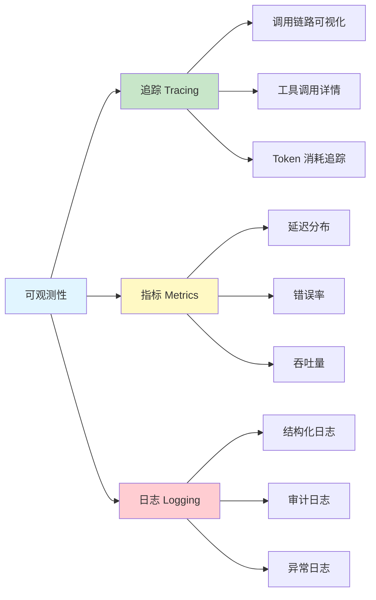

# 可观测性

## 什么是 AI Agent 的可观测性

可观测性（Observability）是指从系统的外部输出推断其内部状态的能力。对于 AI Agent 来说，这意味着你能够回答以下问题：

- Agent 在处理用户请求时经历了哪些步骤？
- 每一步消耗了多少 Token、花了多长时间？
- Agent 为什么选择调用这个工具而不是那个？
- 哪些请求出了问题，根因是什么？

::: tip 前端类比
Agent 的可观测性类似于前端应用中 **Sentry（错误追踪） + Datadog（性能监控）** 的组合。Sentry 告诉你"哪里报错了、错误堆栈是什么"；Datadog 告诉你"页面加载 P95 是多少、哪个接口最慢"。LangSmith 则把这两种能力统一在一个平台上，针对 LLM 应用做了专门的适配。
:::

### 可观测性三支柱



## LangSmith 追踪集成

LangSmith 是 LangChain 官方的追踪和评估平台，提供了对 LangChain 应用最深入的可视化能力。

### 启用追踪

只需要设置两个环境变量，所有 LangChain 调用就会自动上报追踪数据：

```bash
# .env
LANGSMITH_API_KEY=lsv2_pt_xxxxxxxxxxxx
LANGSMITH_TRACING=true
LANGSMITH_PROJECT=my-agent-production    # 可选，用于分组
```

```python
import os
from dotenv import load_dotenv
from langchain.chat_models import init_chat_model

load_dotenv()

# 启用追踪后，所有调用自动上报
llm = init_chat_model("claude-sonnet-4-5-20250929")
response = llm.invoke("你好，请介绍一下 Python 的 GIL")

# 在 LangSmith 控制台查看这次调用的完整追踪：
# https://smith.langchain.com/
```

### 在 LangSmith 中查看追踪

登录 LangSmith 控制台后，你可以：

1. **项目视图**：查看所有追踪记录的列表，按时间、延迟、状态筛选
2. **追踪详情**：展开单个追踪，查看每一步的输入/输出/耗时
3. **错误追踪**：快速筛选失败的运行，查看错误详情
4. **搜索和筛选**：按标签、元数据、时间范围查找特定追踪

### 追踪结构

LangSmith 中的追踪由 **Run** 和 **Span** 组成：

- **Run**：一次完整的顶层调用（如 `agent.invoke(...)`）
- **Span**：Run 内部的子步骤（如一次 LLM 调用、一次工具调用）

```python
from langsmith import traceable

@traceable(name="customer_service_agent", tags=["production", "v2"])
def handle_customer_query(query: str) -> str:
    """处理客户查询 —— 整个函数作为一个 Run"""

    # 子 Span 1: 意图识别
    intent = classify_intent(query)

    # 子 Span 2: 根据意图调用不同处理逻辑
    if intent == "refund":
        return handle_refund(query)
    elif intent == "inquiry":
        return handle_inquiry(query)
    else:
        return handle_general(query)

@traceable(name="classify_intent")
def classify_intent(query: str) -> str:
    """意图分类 —— 作为子 Span"""
    llm = init_chat_model("claude-sonnet-4-5-20250929")
    response = llm.invoke(
        f"将以下查询分类为 refund/inquiry/general: {query}"
    )
    return response.content.strip().lower()

@traceable(name="handle_inquiry")
def handle_inquiry(query: str) -> str:
    """处理咨询 —— 作为子 Span"""
    llm = init_chat_model("claude-sonnet-4-5-20250929")
    return llm.invoke(f"回答客户咨询: {query}").content
```

## Token 用量追踪

Token 消耗是 LLM 应用最直接的成本指标。

### 使用回调追踪 Token

```python
from langchain.chat_models import init_chat_model
from langchain_core.callbacks import BaseCallbackHandler
from langchain_core.outputs import LLMResult

class TokenTracker(BaseCallbackHandler):
    """追踪 Token 使用量的回调"""

    def __init__(self):
        self.total_input_tokens = 0
        self.total_output_tokens = 0
        self.call_count = 0

    def on_llm_end(self, response: LLMResult, **kwargs):
        """每次 LLM 调用结束时记录 Token 用量"""
        for generation in response.generations:
            for gen in generation:
                if hasattr(gen, "generation_info") and gen.generation_info:
                    usage = gen.generation_info.get("usage", {})
                    self.total_input_tokens += usage.get("input_tokens", 0)
                    self.total_output_tokens += usage.get("output_tokens", 0)
        self.call_count += 1

    def report(self) -> dict:
        return {
            "total_input_tokens": self.total_input_tokens,
            "total_output_tokens": self.total_output_tokens,
            "total_tokens": self.total_input_tokens + self.total_output_tokens,
            "call_count": self.call_count,
        }

# 使用
tracker = TokenTracker()
llm = init_chat_model("claude-sonnet-4-5-20250929", callbacks=[tracker])

llm.invoke("解释 Python 的装饰器")
llm.invoke("什么是闭包？")

print(tracker.report())
# {'total_input_tokens': 84, 'total_output_tokens': 312, 'total_tokens': 396, 'call_count': 2}
```

### 使用 LangSmith 的内置 Token 追踪

当启用 LangSmith 追踪后，Token 用量会自动记录在每个 Run 中。你可以在 LangSmith 控制台看到：

- 每次调用的输入/输出 Token 数
- 按项目聚合的 Token 消耗趋势
- Token 消耗的 Top N 请求

## 延迟监控

### 自定义延迟追踪中间件

```python
import time
import logging
from fastapi import FastAPI, Request
from starlette.middleware.base import BaseHTTPMiddleware

logger = logging.getLogger(__name__)

class LatencyMiddleware(BaseHTTPMiddleware):
    """追踪每个请求的延迟"""

    async def dispatch(self, request: Request, call_next):
        start = time.perf_counter()
        response = await call_next(request)
        duration = time.perf_counter() - start

        # 记录延迟
        logger.info(
            "request_completed",
            extra={
                "path": request.url.path,
                "method": request.method,
                "status_code": response.status_code,
                "duration_seconds": round(duration, 3),
            },
        )

        # 将延迟写入响应头（方便客户端观察）
        response.headers["X-Response-Time"] = f"{duration:.3f}s"

        # 慢请求告警
        if duration > 30:
            logger.warning(
                f"慢请求警告: {request.url.path} 耗时 {duration:.1f}s",
            )

        return response

app = FastAPI()
app.add_middleware(LatencyMiddleware)
```

### 追踪各阶段延迟

```python
import time
from langsmith import traceable

@traceable(name="full_pipeline")
def process_with_timing(query: str) -> dict:
    """追踪各阶段耗时"""
    timings = {}

    # 阶段 1: 意图理解
    t0 = time.perf_counter()
    intent = understand_intent(query)
    timings["intent_classification"] = time.perf_counter() - t0

    # 阶段 2: 检索相关文档
    t0 = time.perf_counter()
    docs = retrieve_documents(query)
    timings["document_retrieval"] = time.perf_counter() - t0

    # 阶段 3: 生成回答
    t0 = time.perf_counter()
    answer = generate_answer(query, docs)
    timings["answer_generation"] = time.perf_counter() - t0

    timings["total"] = sum(timings.values())

    return {"answer": answer, "timings": timings}
```

## 自定义指标和标签

### 使用 LangSmith 标签和元数据

```python
from langsmith import traceable

@traceable(
    name="agent_run",
    tags=["production", "v3.1", "customer-service"],
    metadata={
        "model": "claude-sonnet",
        "max_tools": 5,
        "region": "asia-east1",
    },
)
def run_agent(query: str, user_id: str) -> str:
    """带有丰富标签和元数据的 Agent 运行"""
    # Agent 逻辑...
    pass

# 在 LangSmith 控制台中可以：
# - 按标签筛选（如只看 production 的运行）
# - 按元数据分组（如按 model 分组比较延迟）
```

### 自定义指标收集

```python
from dataclasses import dataclass, field
from datetime import datetime
import threading

@dataclass
class AgentMetrics:
    """Agent 运行指标收集器"""
    total_requests: int = 0
    successful_requests: int = 0
    failed_requests: int = 0
    total_tokens: int = 0
    total_tool_calls: int = 0
    latencies: list = field(default_factory=list)
    _lock: threading.Lock = field(default_factory=threading.Lock)

    def record_request(
        self,
        success: bool,
        tokens: int,
        tool_calls: int,
        latency: float,
    ):
        with self._lock:
            self.total_requests += 1
            if success:
                self.successful_requests += 1
            else:
                self.failed_requests += 1
            self.total_tokens += tokens
            self.total_tool_calls += tool_calls
            self.latencies.append(latency)

    def get_summary(self) -> dict:
        with self._lock:
            sorted_latencies = sorted(self.latencies) if self.latencies else [0]
            p50_idx = len(sorted_latencies) // 2
            p95_idx = int(len(sorted_latencies) * 0.95)
            return {
                "total_requests": self.total_requests,
                "success_rate": (
                    self.successful_requests / self.total_requests
                    if self.total_requests > 0
                    else 0
                ),
                "error_rate": (
                    self.failed_requests / self.total_requests
                    if self.total_requests > 0
                    else 0
                ),
                "total_tokens": self.total_tokens,
                "avg_tool_calls": (
                    self.total_tool_calls / self.total_requests
                    if self.total_requests > 0
                    else 0
                ),
                "latency_p50": sorted_latencies[p50_idx],
                "latency_p95": sorted_latencies[p95_idx],
            }

# 全局指标实例
metrics = AgentMetrics()

# 暴露为 API 端点
from fastapi import FastAPI

app = FastAPI()

@app.get("/metrics")
def get_metrics():
    return metrics.get_summary()
```

## 告警和通知

### 基于阈值的告警

```python
import logging
from langsmith import traceable

logger = logging.getLogger(__name__)

# 告警阈值配置
ALERT_THRESHOLDS = {
    "max_latency_seconds": 60,
    "max_tokens_per_request": 10000,
    "max_tool_calls": 10,
    "error_rate_threshold": 0.1,  # 10%
}

def check_and_alert(run_data: dict):
    """检查运行数据是否触发告警"""
    alerts = []

    if run_data.get("latency", 0) > ALERT_THRESHOLDS["max_latency_seconds"]:
        alerts.append(
            f"高延迟告警: {run_data['latency']:.1f}s "
            f"(阈值: {ALERT_THRESHOLDS['max_latency_seconds']}s)"
        )

    if run_data.get("tokens", 0) > ALERT_THRESHOLDS["max_tokens_per_request"]:
        alerts.append(
            f"Token 用量告警: {run_data['tokens']} "
            f"(阈值: {ALERT_THRESHOLDS['max_tokens_per_request']})"
        )

    if run_data.get("tool_calls", 0) > ALERT_THRESHOLDS["max_tool_calls"]:
        alerts.append(
            f"工具调用次数告警: {run_data['tool_calls']} "
            f"(阈值: {ALERT_THRESHOLDS['max_tool_calls']})"
        )

    for alert in alerts:
        logger.warning(f"[ALERT] {alert}")
        # 实际应用中发送到 Slack / 邮件 / PagerDuty
        send_alert_notification(alert)

def send_alert_notification(message: str):
    """发送告警通知（示例：Slack Webhook）"""
    import httpx

    webhook_url = os.getenv("SLACK_WEBHOOK_URL")
    if webhook_url:
        httpx.post(webhook_url, json={"text": f":warning: {message}"})
```

## 与 OpenTelemetry 集成

对于已有 OpenTelemetry 基础设施的团队，可以将 LangChain 的追踪数据导出到 OTel：

```python
# 安装依赖
# pip install opentelemetry-api opentelemetry-sdk opentelemetry-exporter-otlp

from opentelemetry import trace
from opentelemetry.sdk.trace import TracerProvider
from opentelemetry.sdk.trace.export import BatchSpanProcessor
from opentelemetry.exporter.otlp.proto.grpc.trace_exporter import OTLPSpanExporter
from opentelemetry.sdk.resources import Resource

# 初始化 OTel
resource = Resource.create({"service.name": "langchain-agent"})
provider = TracerProvider(resource=resource)
processor = BatchSpanProcessor(
    OTLPSpanExporter(endpoint="http://otel-collector:4317")
)
provider.add_span_processor(processor)
trace.set_tracer_provider(provider)

tracer = trace.get_tracer(__name__)

# 在 Agent 代码中使用 OTel Span
def process_request(query: str) -> str:
    with tracer.start_as_current_span("agent.process_request") as span:
        span.set_attribute("query.length", len(query))
        span.set_attribute("agent.version", "v3.1")

        # LLM 调用
        with tracer.start_as_current_span("agent.llm_call"):
            llm = init_chat_model("claude-sonnet-4-5-20250929")
            response = llm.invoke(query)

        span.set_attribute("response.length", len(response.content))
        return response.content
```

### OTel + LangSmith 双写

LangSmith 追踪和 OTel 可以同时使用，互不冲突：

```bash
# 同时启用两套追踪
LANGSMITH_TRACING=true          # LangSmith 追踪（LangChain 专用视图）
OTEL_EXPORTER_OTLP_ENDPOINT=http://otel-collector:4317  # OTel（通用基础设施）
```

## 实战：构建完整可观测性

下面将上述所有组件整合为一个完整的示例：

```python
import os
import time
import logging
from fastapi import FastAPI, Request
from starlette.middleware.base import BaseHTTPMiddleware
from dotenv import load_dotenv
from langchain.chat_models import init_chat_model
from langsmith import traceable

load_dotenv()

# ---- 日志配置 ----
logging.basicConfig(
    level=os.getenv("LOG_LEVEL", "INFO"),
    format='{"time":"%(asctime)s","level":"%(levelname)s","msg":"%(message)s"}',
)
logger = logging.getLogger(__name__)

# ---- FastAPI 应用 ----
app = FastAPI(title="Observable Agent API")

# ---- 延迟追踪中间件 ----
class ObservabilityMiddleware(BaseHTTPMiddleware):
    async def dispatch(self, request: Request, call_next):
        start = time.perf_counter()
        response = await call_next(request)
        duration = time.perf_counter() - start

        logger.info(
            f"path={request.url.path} method={request.method} "
            f"status={response.status_code} duration={duration:.3f}s"
        )
        response.headers["X-Response-Time"] = f"{duration:.3f}s"
        return response

app.add_middleware(ObservabilityMiddleware)

# ---- Agent 定义 ----
@traceable(name="observable_agent", tags=["production"])
def run_agent(query: str) -> dict:
    start = time.perf_counter()
    llm = init_chat_model("claude-sonnet-4-5-20250929")
    response = llm.invoke(query)
    duration = time.perf_counter() - start

    result = {
        "answer": response.content,
        "latency": round(duration, 3),
    }

    # 慢请求告警
    if duration > 30:
        logger.warning(f"慢请求: {duration:.1f}s, query={query[:50]}")

    return result

# ---- 端点 ----
@app.post("/agent/invoke")
async def invoke(body: dict):
    return run_agent(body.get("query", ""))

@app.get("/health")
def health():
    return {"status": "healthy"}
```

## 下一步

- 使用 [LangSmith Studio](/ai/langchain/guide/studio) 可视化调试追踪中发现的问题
- 了解 [部署](/ai/langchain/guide/deployment) 将可观测性集成到生产部署流程中
- 学习 [测试](/ai/langchain/guide/testing) 通过评估管道建立质量基线

## 参考资源

- [LangSmith 官方文档](https://docs.smith.langchain.com/)
- [OpenTelemetry Python 文档](https://opentelemetry.io/docs/languages/python/)
- [LangChain 回调机制](https://python.langchain.com/docs/how_to/callbacks_runtime)
