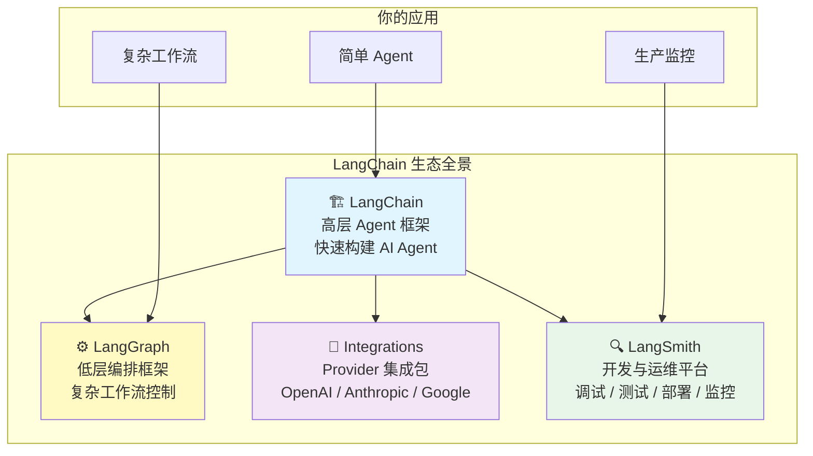
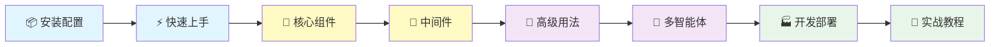

# LangChain 概览

> LangChain 是构建 **AI Agent 和 LLM 应用**最简单的方式。只需不到 10 行代码，你就可以连接 OpenAI、Anthropic、Google 等主流模型提供商，快速构建具备工具调用、流式响应和结构化输出能力的智能体。

## 1. LangChain 是什么

### 1.1 一句话定义

LangChain 是一个提供 **预置 Agent 架构和模型集成** 的高层框架，帮助你快速将 LLM 接入应用、构建智能体、处理复杂的工具编排任务。

### 1.2 生态定位

LangChain 不是一个孤立的库，它是整个 LangChain 生态的核心入口。理解生态各部分的关系，有助于你在正确的场景选择正确的工具。



| 组件 | 定位 | 何时使用 |
|------|------|----------|
| **LangChain** | 高层 Agent 框架 | 快速构建 Agent、工具链、RAG 管道 |
| **LangGraph** | 低层编排框架 | 复杂工作流、需要中断/恢复/持久化 |
| **Integrations** | 模型集成包 | 连接具体的 LLM Provider |
| **LangSmith** | 开发运维平台 | 调试、测试、部署、监控 |

::: tip 前端类比
把 LangChain 生态类比为前端工具链：**LangChain ≈ Next.js**（高层、约定式、开箱即用），**LangGraph ≈ Express.js**（低层、自由度高、完全控制中间件和路由），**Provider 包 ≈ npm 适配器**（如 axios 对 fetch 的封装），**LangSmith ≈ Sentry + Vercel**（监控 + 部署平台）。
:::

**LangChain 原生语义**：LangChain 自我定位为 "the easiest way to start building agents"。它提供的 `create_agent` 是一个高层封装，底层实际运行在 LangGraph 的运行时之上。你无需了解 LangGraph 就能使用 LangChain 的基础功能，但当你需要更精细的控制时，可以随时"下探"到 LangGraph 层面。

### 1.3 LangChain vs LangGraph：如何选择

| 维度 | LangChain | LangGraph |
|------|-----------|-----------|
| **抽象层级** | 高层——预置 Agent 架构、工具绑定 | 低层——节点、边、状态、执行运行时 |
| **核心关注** | 模型调用、工具编排、Middleware | 执行控制：中断/恢复/持久化/流式 |
| **上手成本** | 低——10 行代码创建 Agent | 中——需要理解图模型 |
| **适用场景** | 快速原型、标准 Agent 模式 | 复杂流程、生产级控制需求 |

**简单判断标准**：
- 如果你的 Agent 是"接收输入 → 调用工具 → 返回结果"的线性流程 → **用 LangChain**
- 如果你需要条件分支、并行执行、中断恢复、复杂状态管理 → **用 LangGraph**
- 先用 LangChain 快速验证，遇到瓶颈再升级到 LangGraph → **推荐路径**

## 2. 核心能力

LangChain 提供以下核心能力：

### 2.1 Agent 创建

通过 `create_agent` 统一接口，几行代码创建具备工具调用能力的智能体：

```python
from langchain.agents import create_agent
from langchain.tools import tool

@tool
def search(query: str) -> str:
    """搜索信息"""
    return f"关于 {query} 的搜索结果"

agent = create_agent(
    model="anthropic:claude-sonnet-4-5-20250929",
    tools=[search],
)

result = agent.invoke({"messages": [{"role": "user", "content": "搜索 AI 最新进展"}]})
```

### 2.2 多 Provider 支持

通过 `init_chat_model` 统一接口，一行代码切换不同的模型提供商：

```python
from langchain.chat_models import init_chat_model

# 切换 Provider 只需改一个字符串
model = init_chat_model("anthropic:claude-sonnet-4-5-20250929")
model = init_chat_model("openai:gpt-4o")
model = init_chat_model("google-genai:gemini-2.0-flash")
```

### 2.3 流式响应

内置三种流式模式（updates / messages / custom），支持前端实时显示 AI 回复。

### 2.4 Middleware 系统

通过中间件增强 Agent 功能——PII 检测、对话摘要、人工审批等，无需修改核心逻辑。

### 2.5 结构化输出

让 Agent 返回 Pydantic 模型、TypedDict 或 JSON Schema 格式的结构化数据，告别手动解析。

### 2.6 多智能体模式

内置 Subagents、Handoffs、Router 等多智能体协作模式，构建复杂的 Agent 团队。

## 3. 学习路径

建议按以下顺序学习本教程：



| 阶段 | 内容 | 目标 |
|------|------|------|
| **入门** | 安装、快速上手、设计理念 | 跑通第一个 Agent |
| **核心** | Agent、Models、Tools、Streaming 等 | 掌握基础组件 |
| **进阶** | Middleware、RAG、MCP、多智能体 | 构建生产级应用 |
| **实战** | 语义搜索、RAG Agent、SQL Agent | 端到端项目经验 |

## 4. 前置知识

开始学习 LangChain 前，建议具备以下基础：

- **Python 基础**：变量、函数、类、装饰器、async/await
- **LLM 概念**：了解什么是大语言模型、prompt、token
- **API 概念**：了解 REST API 调用方式（前端开发者已具备）

不需要有 AI/ML 背景，LangChain 的设计目标就是让应用开发者也能轻松构建 AI 应用。

## 下一步

- [安装与配置](/ai/langchain/guide/install) — 搭建开发环境
- [快速上手](/ai/langchain/guide/quickstart) — 创建你的第一个 Agent
- [设计理念](/ai/langchain/guide/philosophy) — 理解 LangChain 1.0 的架构思想

## 参考资源

- [LangChain 官方文档](https://docs.langchain.com/oss/python/langchain/overview)
- [LangChain GitHub 仓库](https://github.com/langchain-ai/langchain)
- [LangGraph 概览](/ai/langgraph/guide/overview) — 了解低层编排框架
