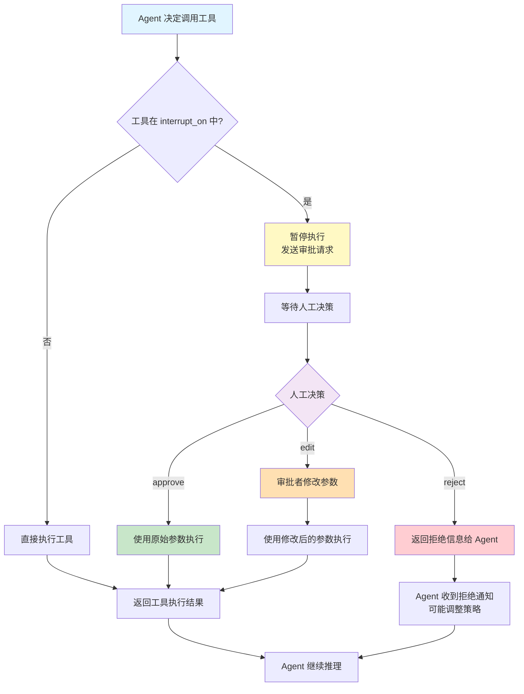

# 内置中间件

LangChain 1.0 提供了三个核心内置 Middleware，覆盖安全合规、成本控制和流程管理三大横切关注点。本章逐一讲解每个 Middleware 的完整 API、配置选项和实战示例。

### 先修知识

- 已阅读 [中间件概览](/ai/langchain/guide/middleware-overview)
- 了解 [Agent 实战指南](/ai/langchain/guide/agents) 中的 `create_agent` 用法

## PIIMiddleware — PII 检测与处理

`PIIMiddleware` 用于在 Agent 的请求-响应流程中自动检测和处理个人身份信息（Personally Identifiable Information）。它支持对用户输入和模型输出的双向检测。

### 基本用法

```python
from langchain.agents import create_agent
from langchain.agents.middleware import PIIMiddleware

agent = create_agent(
    model="claude-sonnet-4-5-20250929",
    tools=[search, send_email],
    middleware=[
        PIIMiddleware("email", strategy="redact"),
    ]
)
```

### 构造参数

| 参数 | 类型 | 默认值 | 说明 |
|------|------|--------|------|
| `pii_type` | `str` | 必填 | PII 类型标识，如 `"email"`、`"phone_number"`、`"ssn"` |
| `strategy` | `str` | `"redact"` | 处理策略：`"redact"` 脱敏替换，`"block"` 拦截请求 |
| `detector` | `str` (regex) | 内置正则 | 自定义正则表达式，覆盖内置检测规则 |
| `apply_to_input` | `bool` | `True` | 是否检测用户输入 |

### 策略详解

#### strategy: "redact" — 脱敏替换

将匹配到的 PII 信息替换为 `***` 占位符，请求继续执行：

```python
# 输入: "我的邮箱是 test@example.com"
# 脱敏后: "我的邮箱是 ***@***.***"

PIIMiddleware("email", strategy="redact")
```

适用于：需要保留对话上下文但隐藏具体信息的场景。

#### strategy: "block" — 拦截请求

发现 PII 后立即拦截请求，返回错误信息，不继续执行后续 Middleware 或 Agent 调用：

```python
# 输入: "我的身份证号是 110101199001011234"
# 结果: 请求被拦截，返回错误提示

PIIMiddleware("ssn", strategy="block")
```

适用于：严格合规要求，任何包含特定 PII 的请求都不应被处理。

### 自定义正则检测器

内置检测器覆盖了常见的 PII 类型。当内置规则不满足需求时，可以通过 `detector` 参数提供自定义正则：

```python
# 检测中国大陆手机号
PIIMiddleware(
    "phone_number",
    detector=r"(?:(?:\+|00)86)?1[3-9]\d{9}",
    strategy="redact"
)

# 检测中国大陆身份证号
PIIMiddleware(
    "id_card",
    detector=r"[1-9]\d{5}(?:19|20)\d{2}(?:0[1-9]|1[0-2])(?:0[1-9]|[12]\d|3[01])\d{3}[\dXx]",
    strategy="block"
)
```

### apply_to_input 选项

默认情况下，`PIIMiddleware` 同时检测用户输入和模型输出。设置 `apply_to_input=False` 可以只检测模型输出：

```python
# 只检测模型输出中的 PII（不检测用户输入）
PIIMiddleware("email", strategy="redact", apply_to_input=False)
```

典型场景：用户主动提供自己的邮箱用于发送邮件，不应拦截输入，但需要确保模型不会在响应中泄露其他用户的邮箱。

### 完整示例：多类型 PII 检测

```python
from langchain.agents import create_agent
from langchain.agents.middleware import PIIMiddleware

def search_contacts(name: str) -> str:
    """搜索联系人信息"""
    return "张三, test@example.com, 13800138000"

def send_message(to: str, content: str) -> str:
    """发送消息"""
    return f"消息已发送至 {to}"

agent = create_agent(
    model="claude-sonnet-4-5-20250929",
    tools=[search_contacts, send_message],
    middleware=[
        # 邮箱：脱敏处理（允许流程继续，但隐藏具体地址）
        PIIMiddleware("email", strategy="redact", apply_to_input=True),

        # 手机号：自定义正则，拦截请求
        PIIMiddleware(
            "phone_number",
            detector=r"(?:(?:\+|00)86)?1[3-9]\d{9}",
            strategy="block"
        ),

        # 身份证号：拦截请求
        PIIMiddleware(
            "id_card",
            detector=(
                r"[1-9]\d{5}(?:19|20)\d{2}"
                r"(?:0[1-9]|1[0-2])"
                r"(?:0[1-9]|[12]\d|3[01])"
                r"\d{3}[\dXx]"
            ),
            strategy="block"
        ),
    ]
)

# 运行 Agent
result = agent.invoke("帮我查一下张三的联系方式")
# 邮箱会被脱敏显示，手机号会被拦截
```

## SummarizationMiddleware — 自动对话摘要

当对话历史过长时，`SummarizationMiddleware` 会自动调用 LLM 生成摘要，用摘要替换早期消息，从而控制 token 用量和成本。

### 基本用法

```python
from langchain.agents.middleware import SummarizationMiddleware

SummarizationMiddleware(
    model="claude-sonnet-4-5-20250929",
    max_tokens_before_summary=500
)
```

### 构造参数

| 参数 | 类型 | 默认值 | 说明 |
|------|------|--------|------|
| `model` | `str` | 必填 | 用于生成摘要的模型标识符 |
| `max_tokens_before_summary` | `int` | `1000` | 触发摘要的 token 阈值 |

### 工作原理

1. 每次请求时，统计当前对话历史的 token 数量
2. 如果超过 `max_tokens_before_summary` 阈值，触发摘要
3. 使用指定模型将早期消息压缩为一条摘要消息
4. 用摘要替换原始的早期消息，保留最近的几轮对话
5. 将压缩后的消息列表传递给后续 Middleware 和 Agent

::: tip 前端类比
这类似于前端虚拟列表（Virtual List）的思路——不渲染所有 DOM 节点，只保留视口内的元素。SummarizationMiddleware 不保留所有历史消息，只保留"视口"（最近对话）加一个"摘要"（早期内容的压缩表示）。

不过需要注意：摘要会丢失细节信息，这是有损压缩，不像虚拟列表可以无损还原。
:::

### 完整示例

```python
from langchain.agents import create_agent
from langchain.agents.middleware import SummarizationMiddleware

def search_docs(query: str) -> str:
    """搜索文档库"""
    return f"关于 '{query}' 的搜索结果..."

agent = create_agent(
    model="claude-sonnet-4-5-20250929",
    tools=[search_docs],
    middleware=[
        SummarizationMiddleware(
            model="claude-sonnet-4-5-20250929",
            max_tokens_before_summary=500  # 超过 500 token 时自动摘要
        ),
    ]
)

# 长对话场景
result = agent.invoke("帮我查一下 Python 异步编程的最佳实践")
# ... 多轮对话后，早期消息会被自动摘要
result = agent.invoke("再查一下 asyncio 和 trio 的对比")
# 此时如果历史 token 超过 500，早期对话会被压缩
```

### 使用建议

- **摘要模型选择**：可以使用与 Agent 相同的模型，也可以使用更轻量的模型（如 `gpt-4o-mini`）降低摘要成本
- **阈值设置**：根据模型的上下文窗口大小和对话长度预期来设定，通常设为上下文窗口的 30%-50%
- **信息丢失**：摘要是有损压缩，对于需要精确回溯的场景（如法律咨询），应额外保存完整对话记录

## HumanInTheLoopMiddleware — 人工审批

`HumanInTheLoopMiddleware` 在 Agent 执行敏感工具调用前暂停流程，等待人工审批。这是实现合规审计和风险控制的关键 Middleware。

### 基本用法

```python
from langchain.agents.middleware import HumanInTheLoopMiddleware

HumanInTheLoopMiddleware(
    interrupt_on={
        "send_email": {
            "allowed_decisions": ["approve", "edit", "reject"]
        }
    }
)
```

### 构造参数

| 参数 | 类型 | 说明 |
|------|------|------|
| `interrupt_on` | `dict` | 需要人工审批的工具配置，key 为工具名，value 包含 `allowed_decisions` |

`allowed_decisions` 支持三种决策：

| 决策 | 含义 |
|------|------|
| `"approve"` | 批准执行，不修改参数 |
| `"edit"` | 允许审批者修改工具参数后再执行 |
| `"reject"` | 拒绝执行，返回错误给 Agent |

### 审批流程



流程说明：

1. Agent 在推理过程中决定调用某个工具
2. `HumanInTheLoopMiddleware` 检查该工具是否在 `interrupt_on` 配置中
3. 如果是，暂停执行并向人工审批队列发送请求
4. 人工审批者做出决策（批准/编辑/拒绝）
5. 根据决策结果继续或终止工具调用
6. Agent 收到结果后继续推理

### 完整示例

```python
from langchain.agents import create_agent
from langchain.agents.middleware import HumanInTheLoopMiddleware

def read_database(query: str) -> str:
    """查询数据库（只读，低风险）"""
    return f"查询结果: {query}"

def update_user_profile(user_id: str, data: dict) -> str:
    """更新用户资料（写操作，中风险）"""
    return f"用户 {user_id} 资料已更新"

def delete_account(user_id: str) -> str:
    """删除用户账户（不可逆，高风险）"""
    return f"用户 {user_id} 账户已删除"

def send_bulk_email(recipients: list, content: str) -> str:
    """群发邮件（影响范围大，高风险）"""
    return f"邮件已发送给 {len(recipients)} 位收件人"

agent = create_agent(
    model="claude-sonnet-4-5-20250929",
    tools=[read_database, update_user_profile, delete_account, send_bulk_email],
    middleware=[
        HumanInTheLoopMiddleware(
            interrupt_on={
                # 更新操作：允许批准或拒绝
                "update_user_profile": {
                    "allowed_decisions": ["approve", "reject"]
                },
                # 删除操作：只允许批准或拒绝（不允许编辑，因为操作本身不应修改）
                "delete_account": {
                    "allowed_decisions": ["approve", "reject"]
                },
                # 群发邮件：允许编辑内容后发送
                "send_bulk_email": {
                    "allowed_decisions": ["approve", "edit", "reject"]
                },
            }
        ),
    ]
)

# read_database 不在 interrupt_on 中，直接执行
# update_user_profile / delete_account / send_bulk_email 会触发人工审批
result = agent.invoke("帮我清理过期用户并通知他们")
```

### 设计建议

- **按风险分级**：只对中高风险工具启用审批，低风险的只读操作无需审批
- **精简 allowed_decisions**：不可逆操作（如删除）不提供 `"edit"` 选项，避免误操作
- **结合 PII 检测**：将 `PIIMiddleware` 放在 `HumanInTheLoopMiddleware` 前面，确保审批者看到的是脱敏后的内容

## 实战：组合使用内置 Middleware

下面是一个完整的生产级配置示例，展示三个内置 Middleware 的协同工作：

```python
from langchain.agents import create_agent
from langchain.agents.middleware import (
    PIIMiddleware,
    SummarizationMiddleware,
    HumanInTheLoopMiddleware,
)

def search_customers(query: str) -> str:
    """搜索客户信息"""
    return "客户: 李四, li4@company.com, 13912345678"

def send_notification(customer_id: str, message: str) -> str:
    """向客户发送通知"""
    return f"通知已发送给客户 {customer_id}"

def update_crm_record(customer_id: str, field: str, value: str) -> str:
    """更新 CRM 记录"""
    return f"已更新客户 {customer_id} 的 {field}"

agent = create_agent(
    model="claude-sonnet-4-5-20250929",
    tools=[search_customers, send_notification, update_crm_record],
    middleware=[
        # 第一层：PII 脱敏（邮箱和手机号）
        PIIMiddleware("email", strategy="redact"),
        PIIMiddleware(
            "phone_number",
            detector=r"(?:(?:\+|00)86)?1[3-9]\d{9}",
            strategy="redact"
        ),

        # 第二层：对话摘要（控制 token 用量）
        SummarizationMiddleware(
            model="claude-sonnet-4-5-20250929",
            max_tokens_before_summary=800
        ),

        # 第三层：人工审批（敏感操作）
        HumanInTheLoopMiddleware(
            interrupt_on={
                "send_notification": {
                    "allowed_decisions": ["approve", "edit", "reject"]
                },
                "update_crm_record": {
                    "allowed_decisions": ["approve", "reject"]
                },
            }
        ),
    ]
)

result = agent.invoke("帮我查一下李四的信息，然后通知他账户即将到期")
```

**执行流程**：

```
用户请求
  → PIIMiddleware: 脱敏邮箱和手机号
    → SummarizationMiddleware: 检查是否需要摘要
      → HumanInTheLoopMiddleware: send_notification 需要审批
        → Agent / LLM 处理
      ← HumanInTheLoopMiddleware: 返回审批结果
    ← SummarizationMiddleware: 更新对话历史
  ← PIIMiddleware: 检测响应中的 PII
最终响应
```

## 下一步

- [自定义中间件](/ai/langchain/guide/custom-middleware) — 当内置 Middleware 不满足需求时，学习从零编写自定义 Middleware
- [中间件概览](/ai/langchain/guide/middleware-overview) — 回顾 Middleware 的执行机制和排序策略
- [Agent 实战指南](/ai/langchain/guide/agents) — 了解 `create_agent` 的完整参数和工具定义
