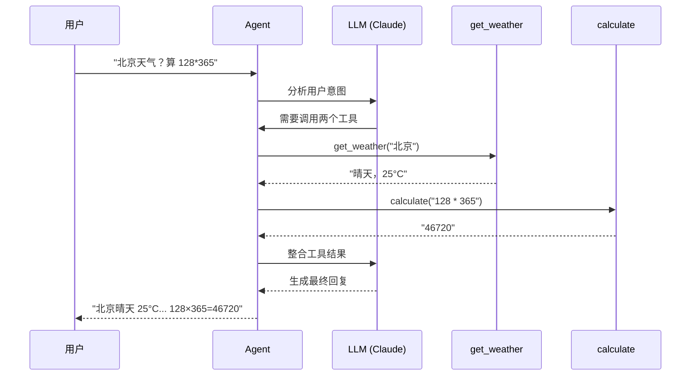

# 快速上手

## 概述

本章通过一个完整的示例，带你在几分钟内创建第一个具备工具调用能力的 AI Agent。完成本章后，你将理解 LangChain 的基本工作模式。

## 先修知识

- 已完成 [安装与配置](/ai/langchain/guide/install)

## 你的第一个 Agent

LangChain 的核心是 `create_agent` 函数——只需指定模型和工具，就能创建一个完整的 AI Agent：

```python
from langchain.agents import create_agent
from langchain.tools import tool

# 1. 定义工具
@tool
def get_weather(city: str) -> str:
    """获取指定城市的当前天气"""
    # 实际项目中这里调用天气 API
    weather_data = {
        "北京": "晴天，25°C",
        "上海": "多云，28°C",
        "深圳": "小雨，30°C",
    }
    return weather_data.get(city, f"暂无 {city} 的天气数据")

@tool
def calculate(expression: str) -> str:
    """计算数学表达式"""
    try:
        return str(eval(expression))
    except Exception as e:
        return f"计算错误: {e}"

# 2. 创建 Agent
agent = create_agent(
    model="anthropic:claude-sonnet-4-5-20250929",
    tools=[get_weather, calculate],
)

# 3. 调用 Agent
result = agent.invoke({
    "messages": [
        {"role": "user", "content": "北京今天天气怎么样？另外帮我算一下 128 * 365"}
    ]
})

# 4. 查看结果
print(result["messages"][-1].content)
```

**输出示例**：

```
北京今天天气晴朗，温度 25°C，非常适合户外活动！

另外，128 × 365 = 46720。
```

### 发生了什么？



::: tip 前端类比
`create_agent` 的工作模式类似于 React 的组件组合：你定义好"能力"（工具），把它们"注入"到 Agent 中，Agent 会根据用户输入自动决定调用哪些能力。就像 React 组件根据 props 决定渲染什么一样。
:::

**LangChain 原生语义**：`create_agent` 底层运行在 LangGraph 的运行时上，它构建了一个包含"模型调用"和"工具执行"两个节点的循环图。LLM 在每轮迭代中决定是调用工具还是返回最终结果。

## 核心概念速览

通过上面的示例，你已经接触到了 LangChain 的三个核心概念：

### 模型 (Model)

通过 `model` 参数指定 LLM。LangChain 使用 `provider:model-name` 格式：

```python
# Anthropic Claude
agent = create_agent(model="anthropic:claude-sonnet-4-5-20250929", tools=[...])

# OpenAI GPT
agent = create_agent(model="openai:gpt-4o", tools=[...])

# Google Gemini
agent = create_agent(model="google-genai:gemini-2.0-flash", tools=[...])
```

### 工具 (Tool)

使用 `@tool` 装饰器将普通函数变成 Agent 可调用的工具。函数的 **docstring 是关键**——LLM 通过它理解工具的用途：

```python
@tool
def search_docs(query: str, max_results: int = 5) -> str:
    """在知识库中搜索文档

    Args:
        query: 搜索关键词
        max_results: 最大返回数量，默认 5
    """
    return f"找到 {max_results} 条关于 '{query}' 的结果"
```

### 消息 (Message)

Agent 通过消息列表与用户交互。每条消息有一个 `role`（角色）：

```python
result = agent.invoke({
    "messages": [
        {"role": "system", "content": "你是一个专业的数据分析师"},
        {"role": "user", "content": "分析这组数据的趋势"},
    ]
})
```

## 添加 System Prompt

通过 `prompt` 参数定制 Agent 的行为和角色：

```python
agent = create_agent(
    model="anthropic:claude-sonnet-4-5-20250929",
    tools=[get_weather, calculate],
    prompt="你是一个友好的中文助手。回答问题时要详细且有条理。",
)
```

## 流式输出

使用 `.stream()` 方法实时查看 Agent 的执行过程：

```python
for chunk in agent.stream(
    {"messages": [{"role": "user", "content": "北京天气如何？"}]},
    stream_mode="updates",
):
    for node, data in chunk.items():
        print(f"[{node}] {data['messages'][-1].content_blocks}")
```

## 结构化输出

让 Agent 返回结构化数据：

```python
from pydantic import BaseModel

class WeatherReport(BaseModel):
    city: str
    temperature: float
    condition: str
    suggestion: str

agent = create_agent(
    model="anthropic:claude-sonnet-4-5-20250929",
    tools=[get_weather],
    response_format=WeatherReport,
)

result = agent.invoke({
    "messages": [{"role": "user", "content": "北京天气怎么样？"}]
})

report = result["structured_response"]
print(f"{report.city}: {report.temperature}°C, {report.condition}")
```

## 完整示例：个人助手 Agent

下面是一个稍微复杂的示例，展示如何组合多个工具构建实用的 Agent：

```python
from langchain.agents import create_agent
from langchain.tools import tool
from datetime import datetime

@tool
def get_current_time() -> str:
    """获取当前日期和时间"""
    return datetime.now().strftime("%Y-%m-%d %H:%M:%S")

@tool
def search_notes(keyword: str) -> str:
    """搜索笔记内容

    Args:
        keyword: 搜索关键词
    """
    notes = {
        "会议": "明天下午 3 点产品评审会议",
        "待办": "完成 API 文档、Review PR #42",
        "学习": "学习 LangChain 的 Middleware 系统",
    }
    results = [v for k, v in notes.items() if keyword in k]
    return "\n".join(results) if results else "未找到相关笔记"

@tool
def create_reminder(content: str, time: str) -> str:
    """创建提醒

    Args:
        content: 提醒内容
        time: 提醒时间
    """
    return f"已创建提醒: [{time}] {content}"

# 创建个人助手
assistant = create_agent(
    model="anthropic:claude-sonnet-4-5-20250929",
    tools=[get_current_time, search_notes, create_reminder],
    prompt="你是一个高效的个人助手，帮助用户管理日程和笔记。回复简洁明了。",
)

# 使用
result = assistant.invoke({
    "messages": [
        {"role": "user", "content": "帮我查一下有没有关于会议的笔记，然后提醒我明天准备材料"}
    ]
})

print(result["messages"][-1].content)
```

## 常见问题

**Q: `create_agent` 与旧版 `initialize_agent` 有什么区别？**

A: `create_agent` 是 LangChain 1.0 引入的统一接口，替代了旧版的多个 Agent 构造函数。它更简洁、类型安全，且内置 Middleware 支持。详见 [迁移指南](/ai/langchain/guide/legacy-migration)。

**Q: Agent 调用工具的次数有限制吗？**

A: 默认没有硬性限制，Agent 会在认为任务完成时停止。你可以通过 `recursion_limit` 参数限制最大迭代次数。

**Q: 可以不使用工具吗？**

A: 可以。不传 `tools` 参数时，Agent 退化为普通的对话模型：

```python
agent = create_agent(model="anthropic:claude-sonnet-4-5-20250929")
```

## 下一步

恭喜你创建了第一个 Agent！接下来建议深入学习各个核心组件：

- [智能体 Agent](/ai/langchain/guide/agents) — 深入理解 Agent 架构和高级用法
- [模型 Models](/ai/langchain/guide/models) — 掌握多 Provider 模型管理
- [工具 Tools](/ai/langchain/guide/tools) — 学习更多工具定义技巧
- [设计理念](/ai/langchain/guide/philosophy) — 理解 LangChain 的设计哲学

## 参考资源

- [LangChain Quickstart](https://docs.langchain.com/oss/python/langchain/quickstart)
- [create_agent API 文档](https://docs.langchain.com/oss/python/langchain/agents)
