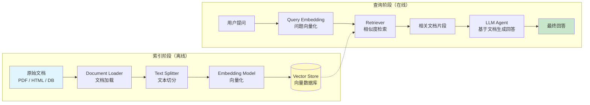

# 检索增强 RAG

## 概述

大语言模型的知识来源于训练数据，存在**时效性差**和**缺乏私有数据**两大局限。RAG（Retrieval Augmented Generation，检索增强生成）通过在生成前先检索相关文档，让模型基于真实数据回答问题，而非仅依赖参数化记忆。

RAG 的核心理念很简单：**先找到相关内容，再让 LLM 基于这些内容回答**。这将 LLM 从"凭记忆回答"升级为"查资料后回答"，显著提高了回答的准确性和可信度。

[🔗 LangChain RAG 官方教程](https://python.langchain.com/docs/tutorials/rag/){target="_blank" rel="noopener"} · [🔗 Retrievers 概念文档](https://python.langchain.com/docs/concepts/retrievers/){target="_blank" rel="noopener"}

::: tip 前端类比
RAG 类似搜索引擎的工作方式——Google 先为网页建立倒排索引（对应 Embedding + Vector Store），用户搜索时快速检索相关文档（Retrieval），最后将结果呈现给用户（Generation）。你可以把向量数据库看作 Elasticsearch，把 Embedding 看作建立索引的过程，只不过这里的"索引"是基于语义而非关键词。
:::

### 先修知识

- 已完成 [环境搭建](/ai/langchain/guide/install)
- 了解 [Agent 实战指南](/ai/langchain/guide/agents) 和 [工具 Tools](/ai/langchain/guide/tools) 的基本用法

## RAG Pipeline 全景

一个完整的 RAG 系统包含两个阶段：**索引阶段**（离线，一次性或定期执行）和**查询阶段**（在线，每次用户提问时执行）。



**关键理解：**

1. 索引阶段将文档转换为向量并存储，这是一次性的前置工作
2. 查询阶段将用户问题也转换为向量，在向量空间中找到最相似的文档片段
3. 找到的文档片段作为上下文注入 LLM 的提示词中，LLM 据此生成回答
4. 整个过程中 LLM 不需要"记住"文档内容，只需要理解并回答

## Document Loaders 文档加载

LangChain 提供了丰富的 Document Loader，支持从各种数据源加载文档：

```python
from langchain_community.document_loaders import (
    PyPDFLoader,
    TextLoader,
    WebBaseLoader,
    CSVLoader,
    DirectoryLoader,
)

# 1. 加载 PDF 文件
pdf_loader = PyPDFLoader("knowledge_base/product_manual.pdf")
pdf_docs = pdf_loader.load()
# 每页作为一个 Document，包含 page_content 和 metadata

# 2. 加载纯文本文件
text_loader = TextLoader("knowledge_base/faq.txt", encoding="utf-8")
text_docs = text_loader.load()

# 3. 加载网页内容
web_loader = WebBaseLoader("https://docs.example.com/api-guide")
web_docs = web_loader.load()

# 4. 加载 CSV 数据
csv_loader = CSVLoader("knowledge_base/products.csv")
csv_docs = csv_loader.load()
# 每行作为一个 Document

# 5. 批量加载目录下所有文件
dir_loader = DirectoryLoader(
    "knowledge_base/",
    glob="**/*.md",          # 匹配模式
    loader_cls=TextLoader,   # 使用的加载器
    loader_kwargs={"encoding": "utf-8"},
)
all_docs = dir_loader.load()

# Document 数据结构
print(pdf_docs[0].page_content[:100])  # 文档文本内容
print(pdf_docs[0].metadata)            # {"source": "...", "page": 0}
```

**Document 结构说明：**

| 字段 | 类型 | 说明 |
|------|------|------|
| `page_content` | `str` | 文档的文本内容 |
| `metadata` | `dict` | 元数据（来源、页码、日期等），可用于后续过滤 |

## Text Splitters 文本切分

文档通常很长，而 LLM 的上下文窗口有限，且过长的上下文会降低检索精度。因此需要将文档切分为合理大小的片段（chunks）。

### RecursiveCharacterTextSplitter（推荐）

递归字符切分器按优先级依次尝试 `\n\n` → `\n` → ` ` → `""` 进行切分，尽可能保持段落和句子的完整性：

```python
from langchain_text_splitters import RecursiveCharacterTextSplitter

splitter = RecursiveCharacterTextSplitter(
    chunk_size=1000,       # 每个片段的最大字符数
    chunk_overlap=200,     # 相邻片段的重叠字符数（保持上下文连贯）
    separators=["\n\n", "\n", "。", "，", " ", ""],  # 中文友好的分隔符
    length_function=len,
)

chunks = splitter.split_documents(all_docs)
print(f"原始文档: {len(all_docs)} 个 → 切分后: {len(chunks)} 个片段")
```

### Token-based 切分

当需要精确控制 token 数时（如确保每个片段不超过模型 token 限制）：

```python
from langchain_text_splitters import TokenTextSplitter

token_splitter = TokenTextSplitter(
    chunk_size=500,        # 每个片段的最大 token 数
    chunk_overlap=50,      # 重叠 token 数
    encoding_name="cl100k_base",  # OpenAI 模型的 tokenizer
)

token_chunks = token_splitter.split_documents(all_docs)
```

### 切分策略选择

| 切分器 | 适用场景 | 特点 |
|--------|---------|------|
| `RecursiveCharacterTextSplitter` | 通用场景（推荐） | 保持段落完整性，中文友好 |
| `TokenTextSplitter` | 需要精确 token 控制 | 按 token 切分，适配特定模型 |
| `MarkdownHeaderTextSplitter` | Markdown 文档 | 按标题层级切分，保留结构 |
| `HTMLSectionSplitter` | HTML 文档 | 按 HTML 标签结构切分 |

## Embedding Models 向量嵌入

Embedding 模型将文本转换为高维向量，使得语义相似的文本在向量空间中距离更近：

```python
from langchain.embeddings import init_embeddings

# 使用统一接口初始化 Embedding 模型
embeddings = init_embeddings("openai:text-embedding-3-small")

# 或使用其他提供商
# embeddings = init_embeddings("anthropic:voyage-3")
# embeddings = init_embeddings("huggingface:BAAI/bge-small-zh-v1.5")

# 嵌入单条文本
vector = embeddings.embed_query("LangChain 是什么？")
print(f"向量维度: {len(vector)}")  # 1536（text-embedding-3-small）

# 批量嵌入文档
doc_vectors = embeddings.embed_documents([
    "LangChain 是一个 LLM 应用开发框架",
    "RAG 通过检索增强模型的回答质量",
])
```

**选型建议：**

| 模型 | 维度 | 特点 | 适用场景 |
|------|------|------|---------|
| `openai:text-embedding-3-small` | 1536 | 性价比高，英文优秀 | 通用英文场景 |
| `openai:text-embedding-3-large` | 3072 | 高精度，支持维度裁剪 | 高精度需求 |
| `huggingface:BAAI/bge-small-zh-v1.5` | 512 | 中文效果好，可本地部署 | 中文场景、私有化部署 |

## Vector Stores 向量数据库

向量数据库存储 Embedding 向量并提供高效的相似度搜索：

### Chroma（本地开发推荐）

```python
from langchain_chroma import Chroma

# 从文档创建向量库（自动嵌入）
vectorstore = Chroma.from_documents(
    documents=chunks,
    embedding=embeddings,
    collection_name="knowledge_base",
    persist_directory="./chroma_db",  # 持久化到本地
)

# 或加载已有的向量库
vectorstore = Chroma(
    collection_name="knowledge_base",
    embedding_function=embeddings,
    persist_directory="./chroma_db",
)
```

### FAISS（高性能本地方案）

```python
from langchain_community.vectorstores import FAISS

# 创建 FAISS 向量库
vectorstore = FAISS.from_documents(chunks, embeddings)

# 保存与加载
vectorstore.save_local("./faiss_index")
vectorstore = FAISS.load_local(
    "./faiss_index", embeddings, allow_dangerous_deserialization=True
)
```

### Pinecone（生产级云服务）

```python
from langchain_pinecone import PineconeVectorStore

vectorstore = PineconeVectorStore.from_documents(
    documents=chunks,
    embedding=embeddings,
    index_name="knowledge-base",
)
```

### 向量数据库对比

| 向量库 | 部署方式 | 适用场景 | 安装 |
|--------|---------|---------|------|
| Chroma | 本地/嵌入式 | 开发测试、小规模数据 | `pip install langchain-chroma` |
| FAISS | 本地 | 高性能本地搜索 | `pip install faiss-cpu` |
| Pinecone | 云服务 | 生产环境、大规模数据 | `pip install langchain-pinecone` |
| Milvus | 自部署/云 | 企业级、高可用 | `pip install langchain-milvus` |

## Retriever 检索器

Retriever 是 LangChain 的检索抽象层，从向量库中检索与查询最相关的文档片段：

```python
# 从向量库创建检索器
retriever = vectorstore.as_retriever(
    search_type="similarity",     # 相似度搜索
    search_kwargs={
        "k": 4,                   # 返回 top-4 结果
    },
)

# 执行检索
docs = retriever.invoke("LangChain 的核心组件有哪些？")
for doc in docs:
    print(f"[来源: {doc.metadata.get('source', '未知')}]")
    print(doc.page_content[:200])
    print("---")
```

### 检索策略

```python
# 策略 1：相似度搜索（默认）
retriever = vectorstore.as_retriever(search_type="similarity", search_kwargs={"k": 4})

# 策略 2：相似度 + 分数阈值
retriever = vectorstore.as_retriever(
    search_type="similarity_score_threshold",
    search_kwargs={"score_threshold": 0.7, "k": 10},
)

# 策略 3：MMR（最大边际相关性）— 兼顾相关性与多样性
retriever = vectorstore.as_retriever(
    search_type="mmr",
    search_kwargs={"k": 4, "fetch_k": 20, "lambda_mult": 0.5},
)
```

| 策略 | 说明 | 适用场景 |
|------|------|---------|
| `similarity` | 纯相似度排序 | 精确匹配需求 |
| `similarity_score_threshold` | 过滤低分结果 | 避免引入噪音 |
| `mmr` | 兼顾相关性与结果多样性 | 广泛信息收集 |

## 将检索集成到 Agent

LangChain 1.0 中，最佳实践是将检索器封装为工具，让 Agent 自主决定何时检索：

```python
from langchain.agents import create_agent
from langchain.tools import tool
from langchain_chroma import Chroma
from langchain.embeddings import init_embeddings

# 初始化向量库（假设已建好索引）
embeddings = init_embeddings("openai:text-embedding-3-small")
vectorstore = Chroma(
    collection_name="knowledge_base",
    embedding_function=embeddings,
    persist_directory="./chroma_db",
)
retriever = vectorstore.as_retriever(search_kwargs={"k": 4})

@tool
def search_knowledge_base(query: str) -> str:
    """在产品知识库中搜索相关文档。当用户询问产品功能、使用方法、
    常见问题等与产品知识相关的问题时使用此工具。

    Args:
        query: 搜索关键词或问题描述
    """
    docs = retriever.invoke(query)
    if not docs:
        return "未找到相关文档。"
    results = []
    for i, doc in enumerate(docs, 1):
        source = doc.metadata.get("source", "未知来源")
        results.append(f"[文档 {i} | 来源: {source}]\n{doc.page_content}")
    return "\n\n---\n\n".join(results)

agent = create_agent(
    model="anthropic:claude-sonnet-4-5-20250929",
    tools=[search_knowledge_base],
    prompt="""你是一个产品知识助手。回答用户问题时：
1. 优先使用知识库搜索工具获取相关文档
2. 基于检索到的文档内容回答，不要编造信息
3. 如果知识库中没有相关信息，如实告知用户
4. 回答时引用文档来源""",
)
```

## 完整 RAG 示例：文档问答 Agent

以下是一个从零开始的完整 RAG 应用，包含索引构建和问答交互：

```python
from langchain.agents import create_agent
from langchain.tools import tool
from langchain.embeddings import init_embeddings
from langchain_text_splitters import RecursiveCharacterTextSplitter
from langchain_community.document_loaders import DirectoryLoader, TextLoader
from langchain_chroma import Chroma
from langgraph.checkpoint.memory import InMemorySaver

# ========== Step 1: 索引构建（离线执行一次） ==========

# 加载文档
loader = DirectoryLoader(
    "knowledge_base/",
    glob="**/*.md",
    loader_cls=TextLoader,
    loader_kwargs={"encoding": "utf-8"},
)
docs = loader.load()
print(f"加载 {len(docs)} 个文档")

# 切分
splitter = RecursiveCharacterTextSplitter(
    chunk_size=800,
    chunk_overlap=150,
    separators=["\n\n", "\n", "。", "，", " ", ""],
)
chunks = splitter.split_documents(docs)
print(f"切分为 {len(chunks)} 个片段")

# 向量化并存储
embeddings = init_embeddings("openai:text-embedding-3-small")
vectorstore = Chroma.from_documents(
    documents=chunks,
    embedding=embeddings,
    collection_name="docs_qa",
    persist_directory="./chroma_db",
)

# ========== Step 2: 构建问答 Agent ==========

retriever = vectorstore.as_retriever(
    search_type="mmr",
    search_kwargs={"k": 5, "fetch_k": 20},
)

@tool
def search_docs(query: str) -> str:
    """在文档库中搜索与问题相关的内容。
    对于任何关于项目文档、API 说明、使用指南的问题都应该使用此工具。

    Args:
        query: 搜索关键词或问题，尽量使用核心概念词
    """
    docs = retriever.invoke(query)
    if not docs:
        return "未在文档库中找到相关内容。"
    results = []
    for i, doc in enumerate(docs, 1):
        source = doc.metadata.get("source", "未知")
        results.append(f"[{i}] 来源: {source}\n{doc.page_content}")
    return "\n\n".join(results)

agent = create_agent(
    model="anthropic:claude-sonnet-4-5-20250929",
    tools=[search_docs],
    prompt="""你是一个文档问答助手。请遵循以下原则：
1. 回答问题前，先通过搜索工具查找相关文档
2. 严格基于检索到的文档内容回答，不要凭空编造
3. 如果文档中没有相关信息，明确告知用户"文档中暂无此信息"
4. 回答时标注信息来源，方便用户查证
5. 对于复杂问题，可以多次搜索不同关键词""",
    checkpointer=InMemorySaver(),
)

# ========== Step 3: 问答交互 ==========

config = {"configurable": {"thread_id": "qa-session-1"}}

result = agent.invoke(
    {"messages": [{"role": "user", "content": "项目的认证机制是怎么实现的？"}]},
    config,
)
print(result["messages"][-1].content)
```

## 质量优化技巧

### 1. Chunk Size 调优

```python
# 小 chunk（300-500 字符）：精确匹配，但可能丢失上下文
splitter_precise = RecursiveCharacterTextSplitter(chunk_size=400, chunk_overlap=50)

# 大 chunk（1000-1500 字符）：上下文丰富，但可能引入噪音
splitter_broad = RecursiveCharacterTextSplitter(chunk_size=1200, chunk_overlap=200)

# 经验值：800-1000 字符、150-200 重叠是多数场景的最佳起点
```

### 2. Metadata 过滤

利用文档元数据缩小检索范围，提高精度：

```python
from langchain_core.documents import Document

# 在加载时添加元数据
docs_with_metadata = [
    Document(
        page_content="API 认证采用 JWT Token 方案...",
        metadata={"source": "api-guide.md", "category": "auth", "version": "2.0"},
    ),
]

# 检索时按元数据过滤
retriever = vectorstore.as_retriever(
    search_kwargs={
        "k": 4,
        "filter": {"category": "auth"},  # 仅搜索认证相关文档
    },
)
```

### 3. 查询优化

```python
@tool
def smart_search(query: str) -> str:
    """智能搜索：先搜索原始问题，若结果不足，自动扩展关键词。

    Args:
        query: 用户的原始问题
    """
    # 第一轮：直接搜索
    docs = retriever.invoke(query)

    # 如果结果不足，尝试提取关键词重新搜索
    if len(docs) < 2:
        # 可以用 LLM 提取关键词
        keywords = extract_keywords(query)
        docs.extend(retriever.invoke(keywords))

    # 去重
    seen = set()
    unique_docs = []
    for doc in docs:
        content_hash = hash(doc.page_content[:100])
        if content_hash not in seen:
            seen.add(content_hash)
            unique_docs.append(doc)

    return format_results(unique_docs)
```

### 4. 优化检查清单

| 优化方向 | 方法 | 效果 |
|---------|------|------|
| chunk_size | 根据文档类型调整（FAQ 用小 chunk，文章用大 chunk） | 提高检索精度 |
| chunk_overlap | 设置 15-20% 的重叠率 | 防止信息在切分边界丢失 |
| metadata | 添加 category、date、version 等标签 | 支持精确过滤 |
| embedding 模型 | 中文场景选用 bge 系列 | 提升中文语义理解 |
| 检索策略 | 使用 MMR 替代纯相似度 | 增加结果多样性 |
| 多轮检索 | 首轮结果不足时扩展关键词重搜 | 提高召回率 |

## 常见问题

**Q: 向量数据库应该多久更新一次？**

A: 取决于数据源的变化频率。对于静态文档（如产品手册），建索引一次即可；对于动态数据（如新闻、工单），建议设置定时任务增量更新。Chroma 和 Pinecone 都支持增量添加文档。

**Q: chunk_size 设多大合适？**

A: 没有万能值，需要根据文档类型实验。一般建议：FAQ 类 300-500 字符，技术文档 800-1000 字符，长文分析 1200-1500 字符。overlap 设为 chunk_size 的 15-20%。

**Q: 检索出的文档不相关怎么办？**

A: 排查步骤：
1. 检查 embedding 模型是否适合你的语言（中文用 bge，英文用 OpenAI）
2. 调整 chunk_size，过大或过小都会影响精度
3. 添加 metadata 过滤，缩小检索范围
4. 尝试 MMR 策略增加结果多样性
5. 在工具描述中引导 LLM 使用更精确的搜索关键词

**Q: RAG 和 Fine-tuning 如何选择？**

A: RAG 适合知识密集型任务（问答、文档检索），优点是无需重新训练模型、知识可实时更新。Fine-tuning 适合调整模型的行为模式（风格、格式）。两者可以组合使用：Fine-tune 模型的回答风格，RAG 提供知识来源。

## 下一步

- [Agent 实战指南](/ai/langchain/guide/agents) -- 了解 Agent 如何编排工具调用
- [工具 Tools](/ai/langchain/guide/tools) -- 深入工具定义与运行时注入
- [长期记忆](/ai/langchain/guide/long-term-memory) -- 跨对话持久化用户信息
- [流式响应 Streaming](/ai/langchain/guide/streaming) -- 在检索过程中提供实时进度

## 参考资源

- [LangChain RAG 官方教程](https://python.langchain.com/docs/tutorials/rag/)
- [LangChain Retrievers 概念文档](https://python.langchain.com/docs/concepts/retrievers/)
- [LangChain Text Splitters 文档](https://python.langchain.com/docs/concepts/text_splitters/)
- [Chroma 官方文档](https://docs.trychroma.com/)
- [FAISS 官方文档](https://faiss.ai/)
