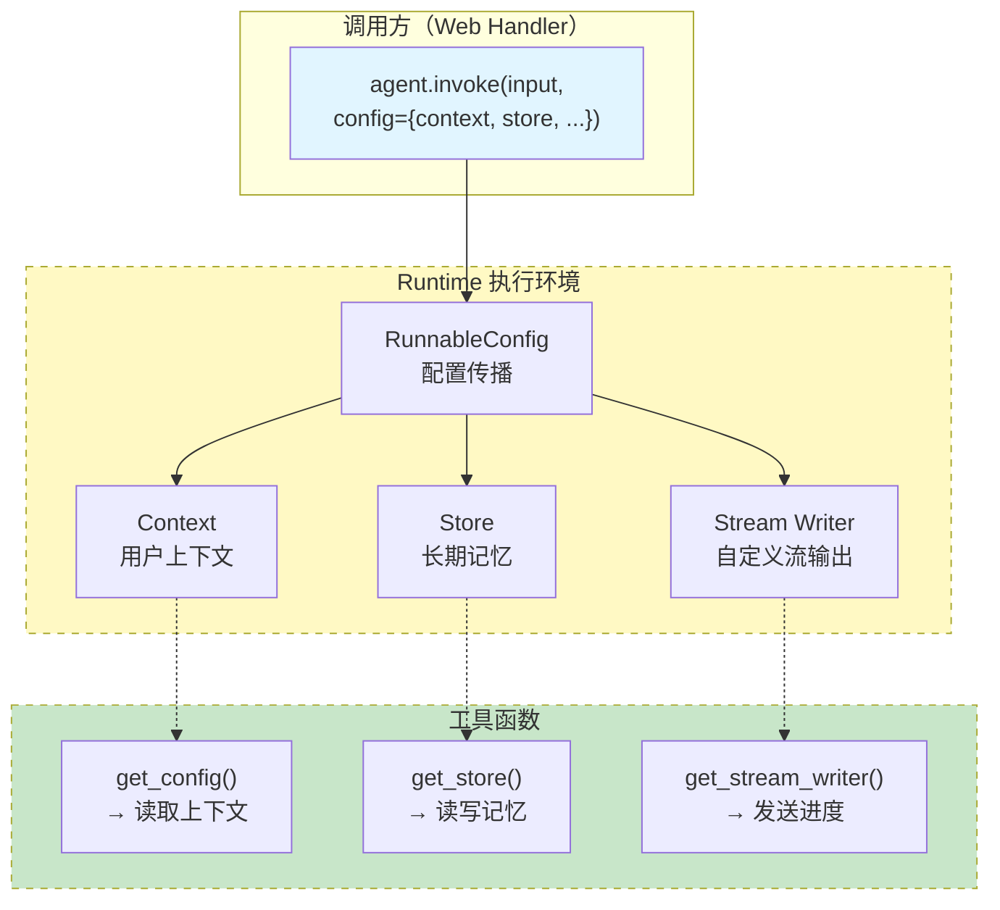

# 运行时配置

## 概述

Agent 在运行时需要访问各种"环境信息"——当前用户是谁、数据库连接在哪里、API 密钥是什么、应该把日志写到哪里。这些信息不应该硬编码在工具函数中，也不应该由 LLM 提供（LLM 不应该知道你的数据库密码）。LangChain 1.0 通过 **Runtime** 机制解决这个问题：在 Agent 调用时注入上下文，工具函数在执行时按需读取。

Runtime 建立在 LangGraph 运行时之上，包含三个核心组件：**Context**（上下文数据）、**Store**（长期记忆存储）、**Stream Writer**（自定义流式输出）。它们共同构成了 Agent 的执行环境。

::: tip 前端类比
Runtime 类似 React 的 Context + Provider 模式。`context_schema` 相当于 `createContext()`，定义了上下文的类型结构；调用 `invoke` 时传入的 `context` 相当于 `<Provider value={...}>`，提供实际值；工具函数中通过 `get_config()` 获取上下文，相当于组件中 `useContext()` 消费数据。核心思想一样：**依赖注入**——消费者不需要知道数据从哪里来，只需要声明"我需要什么"。
:::

理解类比之后，也要注意 Runtime 的**原生语义**：它本质上是 LangGraph 的 `RunnableConfig` 扩展——在图执行的每个节点中，都可以通过配置对象访问当前调用的上下文信息、存储实例和流式写入器。这种机制让工具函数保持纯粹的业务逻辑，运行时依赖通过配置链自动传播。

### 先修知识

- 掌握 [Agent 实战指南](/ai/langchain/guide/agents) 的基本用法
- 了解 [工具 Tools](/ai/langchain/guide/tools) 的定义与使用

## 三大组件

### 组件全景

| 组件 | 用途 | 获取方式 | 典型场景 |
|------|------|---------|---------|
| Context | 注入业务上下文（用户信息、配置等） | `get_config()` | 按用户身份过滤数据 |
| Store | 访问长期记忆存储 | `get_store()` | 读写用户偏好 |
| Stream Writer | 发送自定义流式数据 | `get_stream_writer()` | 工具执行进度反馈 |



## Context 注入

### 定义 Context Schema

通过 `context_schema` 参数声明 Agent 需要的上下文类型，调用时必须提供对应的值：

```python
from dataclasses import dataclass
from langchain.agents import create_agent
from langchain.tools import tool
from langgraph.config import get_config

@dataclass
class AppContext:
    """应用运行时上下文"""
    user_id: str
    user_role: str       # "admin" | "editor" | "viewer"
    tenant_id: str       # 多租户隔离
    api_base_url: str    # 外部服务地址

@tool
def get_user_data(query: str) -> str:
    """查询当前用户的数据

    Args:
        query: 查询关键词
    """
    config = get_config()
    user_id = config["configurable"].get("user_id")
    tenant_id = config["configurable"].get("tenant_id")
    # 使用 user_id 和 tenant_id 过滤查询
    return f"用户 {user_id}（租户 {tenant_id}）的数据: {query} 相关结果"

agent = create_agent(
    model="anthropic:claude-sonnet-4-5-20250929",
    tools=[get_user_data],
    prompt="你是一个数据查询助手，只返回当前用户有权限查看的数据。",
    context_schema=AppContext,
)

# 调用时注入上下文
result = agent.invoke(
    {"messages": [{"role": "user", "content": "查看我的最近订单"}]},
    context=AppContext(
        user_id="user-123",
        user_role="editor",
        tenant_id="company-abc",
        api_base_url="https://api.example.com",
    ),
)
```

**关键点：**

- `context_schema` 声明了 Agent 期望的上下文结构
- 调用 `invoke`/`stream` 时通过 `context` 参数传入实际值
- 上下文值对 LLM **不可见**——LLM 不知道 `user_id` 是什么
- 工具函数通过 `get_config()["configurable"]` 读取注入的值

### 在 Middleware 中使用 Context

Context 不仅在工具中可用，Middleware 同样可以访问：

```python
from langchain.agents.middleware import before_model
from langchain.agents import AgentState
from langgraph.runtime import Runtime
from typing import Any

@before_model
def inject_user_context(state: AgentState, runtime: Runtime) -> dict[str, Any] | None:
    """在每次模型调用前，将用户信息注入系统提示词。"""
    user_name = runtime.context.user_name if hasattr(runtime.context, "user_name") else "用户"
    user_role = runtime.context.user_role if hasattr(runtime.context, "user_role") else "viewer"

    # 动态修改系统提示词
    messages = state["messages"]
    if messages and messages[0].type == "system":
        enhanced_prompt = messages[0].content + f"\n\n当前用户: {user_name}，角色: {user_role}"
        from langchain_core.messages import SystemMessage
        messages[0] = SystemMessage(content=enhanced_prompt)
        return {"messages": messages}
    return None
```

## Store 访问

在工具中访问 Store 实现长期记忆的读写：

```python
from langchain.tools import tool
from langgraph.config import get_store, get_config

@tool
def save_note(title: str, content: str) -> str:
    """保存用户笔记

    Args:
        title: 笔记标题
        content: 笔记内容
    """
    store = get_store()
    config = get_config()
    user_id = config["configurable"].get("user_id", "default")
    namespace = ("users", user_id, "notes")
    store.put(namespace, title, {"content": content})
    return f"笔记「{title}」已保存。"

@tool
def search_notes(query: str) -> str:
    """搜索用户笔记

    Args:
        query: 搜索关键词
    """
    store = get_store()
    config = get_config()
    user_id = config["configurable"].get("user_id", "default")
    namespace = ("users", user_id, "notes")
    items = store.search(namespace)
    if not items:
        return "暂无笔记。"
    notes = [f"- {item.key}: {item.value['content'][:50]}..." for item in items]
    return "找到的笔记:\n" + "\n".join(notes)
```

更多关于 Store 的详细用法请参阅 [长期记忆](/ai/langchain/guide/long-term-memory)。

## Stream Writer 自定义流式输出

工具函数内部可以通过 Stream Writer 向客户端发送自定义的流式数据，适用于长时间操作的进度反馈：

```python
import time
from langchain.tools import tool
from langgraph.config import get_stream_writer

@tool
def process_large_dataset(dataset_name: str) -> str:
    """处理大型数据集，实时报告进度

    Args:
        dataset_name: 数据集名称
    """
    writer = get_stream_writer()

    steps = ["验证数据格式", "清洗异常值", "特征工程", "统计分析", "生成报告"]
    for i, step in enumerate(steps):
        writer({
            "type": "progress",
            "step": step,
            "progress": int((i + 1) / len(steps) * 100),
        })
        time.sleep(1)  # 模拟耗时操作

    writer({"type": "complete", "message": f"{dataset_name} 处理完成"})
    return f"{dataset_name} 分析完成: 50,000 条记录，发现 3 个异常模式"
```

消费端使用 `stream_mode="custom"` 接收这些自定义数据：

```python
for chunk in agent.stream(
    {"messages": [{"role": "user", "content": "处理用户行为数据集"}]},
    stream_mode="custom",
):
    if isinstance(chunk, dict) and chunk.get("type") == "progress":
        print(f"[{chunk['progress']}%] {chunk['step']}")
```

更多流式用法详见 [流式响应 Streaming](/ai/langchain/guide/streaming)。

## RunnableConfig 配置参数

`RunnableConfig` 是 LangChain 的底层配置对象，通过 `config` 参数传递，控制 Agent 的各种运行行为：

```python
from langchain_core.runnables import RunnableConfig

config = RunnableConfig(
    # 基础配置
    configurable={
        "thread_id": "session-1",     # Checkpointer 线程标识
        "user_id": "alice",            # 自定义业务参数
    },

    # 回调与追踪
    callbacks=[my_callback_handler],   # 回调处理器列表
    tags=["production", "v2"],         # 标签，用于追踪和过滤
    metadata={                         # 元数据，附加到追踪记录
        "environment": "prod",
        "request_id": "req-abc-123",
    },

    # 执行控制
    max_concurrency=5,                 # 最大并发数
    recursion_limit=15,                # 递归上限（覆盖 create_agent 的默认值）
)

result = agent.invoke(
    {"messages": [{"role": "user", "content": "分析数据"}]},
    config=config,
)
```

### configurable 常用字段

| 字段 | 说明 | 使用方 |
|------|------|--------|
| `thread_id` | 短期记忆的对话线程标识 | Checkpointer |
| `user_id` | 用户标识，用于记忆隔离 | Store / 工具 |
| `model` | 动态切换模型 | 模型层 |

### tags 与 metadata

tags 和 metadata 主要用于可观测性（observability）——在 LangSmith 或自定义 callback 中追踪和过滤请求：

```python
# 为不同场景添加标签
config_prod = {"tags": ["production", "high-priority"], "metadata": {"team": "data"}}
config_test = {"tags": ["testing", "experiment-42"], "metadata": {"team": "qa"}}

# 在 LangSmith 中可以按 tag 过滤追踪记录
agent.invoke(input, config=config_prod)
```

## 超时与重试配置

### 模型调用超时

```python
from langchain.chat_models import init_chat_model

# 在模型层面设置超时
model = init_chat_model(
    "anthropic:claude-sonnet-4-5-20250929",
    timeout=30,          # 单次请求超时（秒）
    max_retries=3,       # 最大重试次数
)

agent = create_agent(model=model, tools=[...])
```

### 工具级别超时

```python
import asyncio
from langchain.tools import tool

@tool
def call_slow_api(endpoint: str) -> str:
    """调用可能较慢的外部 API

    Args:
        endpoint: API 端点
    """
    import requests
    try:
        response = requests.get(
            f"https://api.example.com/{endpoint}",
            timeout=10,  # 工具内部设置 HTTP 超时
        )
        response.raise_for_status()
        return response.text
    except requests.Timeout:
        return "错误: API 请求超时（10s），请稍后重试"
    except requests.RequestException as e:
        return f"错误: API 调用失败 - {str(e)}"
```

### 带指数退避的重试

```python
import time
from langchain.tools import tool

def retry_with_backoff(func, max_retries=3, base_delay=1):
    """通用重试装饰器，指数退避策略"""
    def wrapper(*args, **kwargs):
        for attempt in range(max_retries):
            try:
                return func(*args, **kwargs)
            except Exception as e:
                if attempt == max_retries - 1:
                    return f"重试 {max_retries} 次后仍失败: {str(e)}"
                delay = base_delay * (2 ** attempt)
                time.sleep(delay)
    return wrapper

@tool
def fetch_external_data(source: str) -> str:
    """从外部数据源获取数据

    Args:
        source: 数据源标识
    """
    @retry_with_backoff
    def _fetch(source):
        import requests
        resp = requests.get(f"https://data.example.com/{source}", timeout=5)
        resp.raise_for_status()
        return resp.json()

    result = _fetch(source)
    return str(result) if isinstance(result, dict) else result
```

## 并发控制

### 限制并行工具执行

当 Agent 同时调用多个工具时，可以通过 `max_concurrency` 控制并行度，防止资源耗尽：

```python
# 方式 1：在 config 中全局设置
result = agent.invoke(
    {"messages": [{"role": "user", "content": "同时查询多个数据源"}]},
    config={"max_concurrency": 3},  # 最多 3 个工具并行执行
)

# 方式 2：在 create_agent 中设置递归上限
agent = create_agent(
    model="anthropic:claude-sonnet-4-5-20250929",
    tools=[tool_a, tool_b, tool_c, tool_d],
    recursion_limit=10,  # 同时限制总的模型-工具循环次数
)
```

### 工具级别的并发限制

对于有速率限制的外部 API，在工具内部实现限流：

```python
import asyncio
import threading
from langchain.tools import tool

# 简单的信号量限流
_api_semaphore = threading.Semaphore(5)  # 最多 5 个并发请求

@tool
def rate_limited_api(query: str) -> str:
    """调用有速率限制的外部 API

    Args:
        query: 查询参数
    """
    with _api_semaphore:
        import requests
        response = requests.get(
            "https://api.example.com/search",
            params={"q": query},
            timeout=10,
        )
        return response.text
```

## 实战：综合运用三大组件

以下示例展示了 Context、Store、Stream Writer 的综合使用：

```python
from dataclasses import dataclass
from langchain.agents import create_agent
from langchain.tools import tool
from langgraph.config import get_config, get_store, get_stream_writer
from langgraph.store.memory import InMemoryStore
from langgraph.checkpoint.memory import InMemorySaver

@dataclass
class UserContext:
    user_id: str
    user_name: str
    department: str

store = InMemoryStore()

@tool
def analyze_report(report_type: str) -> str:
    """分析业务报告并保存分析记录

    Args:
        report_type: 报告类型，如 "sales"、"traffic"、"retention"
    """
    config = get_config()
    mem = get_store()
    writer = get_stream_writer()

    # 1. 从 Context 获取用户信息
    user_id = config["configurable"].get("user_id", "unknown")
    department = config["configurable"].get("department", "unknown")

    # 2. 通过 Stream Writer 报告进度
    writer({"status": "loading", "message": f"正在加载 {report_type} 报告..."})

    # 3. 模拟分析过程
    import time
    for step in ["数据提取", "趋势分析", "异常检测"]:
        writer({"status": "processing", "step": step})
        time.sleep(0.5)

    # 4. 将分析记录写入 Store
    namespace = ("users", user_id, "analysis_history")
    mem.put(namespace, f"{report_type}-latest", {
        "type": report_type,
        "department": department,
        "summary": f"{report_type} 报告分析完成",
    })

    writer({"status": "complete"})
    return f"{report_type} 报告分析完成: 收入环比增长 12%，用户活跃度提升 8%"

agent = create_agent(
    model="anthropic:claude-sonnet-4-5-20250929",
    tools=[analyze_report],
    prompt="你是一个数据分析助手，帮助用户分析各类业务报告。",
    store=store,
    checkpointer=InMemorySaver(),
    context_schema=UserContext,
)

# 调用
for mode, chunk in agent.stream(
    {"messages": [{"role": "user", "content": "分析一下最近的销售报告"}]},
    config={"configurable": {"thread_id": "s1", "user_id": "alice", "department": "sales"}},
    context=UserContext(user_id="alice", user_name="Alice", department="sales"),
    stream_mode=["messages", "custom"],
):
    if mode == "custom" and isinstance(chunk, dict):
        print(f"[进度] {chunk.get('status')}: {chunk.get('step', chunk.get('message', ''))}")
    elif mode == "messages":
        msg_chunk, meta = chunk
        if meta.get("langgraph_node") == "agent" and msg_chunk.content:
            print(msg_chunk.content, end="", flush=True)
```

## 常见问题

**Q: context 和 configurable 有什么区别？**

A: `context` 通过 `context_schema` 类型安全地注入，适合结构化的业务上下文。`configurable` 是 `RunnableConfig` 的通用字典，适合传递 `thread_id` 等框架级配置。两者都可以在工具中通过 `get_config()` 访问。

**Q: 工具函数中可以访问其他工具的执行结果吗？**

A: 不能直接访问。工具之间通过消息流间接通信——前一个工具的结果作为 `ToolMessage` 进入对话历史，LLM 据此决定是否调用下一个工具。如果需要工具间共享状态，可以使用 Store。

**Q: get_config() 在非 Agent 场景下能用吗？**

A: `get_config()` 依赖 LangGraph 的运行时上下文。在 Agent / Graph 的节点和工具函数中可用，在普通 Python 函数中调用会返回空配置或抛出异常。

**Q: 如何在不同环境（开发/生产）中使用不同的 Store？**

A: 通过依赖注入。开发环境传入 `InMemoryStore()`，生产环境传入 `PostgresStore(...)`。Agent 代码不需要修改，只需在初始化时切换 Store 实例。

## 下一步

- [Agent 实战指南](/ai/langchain/guide/agents) -- Agent 的完整创建与使用方法
- [工具 Tools](/ai/langchain/guide/tools) -- 工具定义与高级模式
- [长期记忆](/ai/langchain/guide/long-term-memory) -- Store 的深入用法与最佳实践
- [流式响应 Streaming](/ai/langchain/guide/streaming) -- 三种流式模式的完整指南

## 参考资源

- [LangChain RunnableConfig 文档](https://python.langchain.com/docs/concepts/runnables/#runnableconfig)
- [LangGraph Runtime API](https://langchain-ai.github.io/langgraph/reference/config/)
- [LangGraph Store API](https://langchain-ai.github.io/langgraph/reference/store/)
