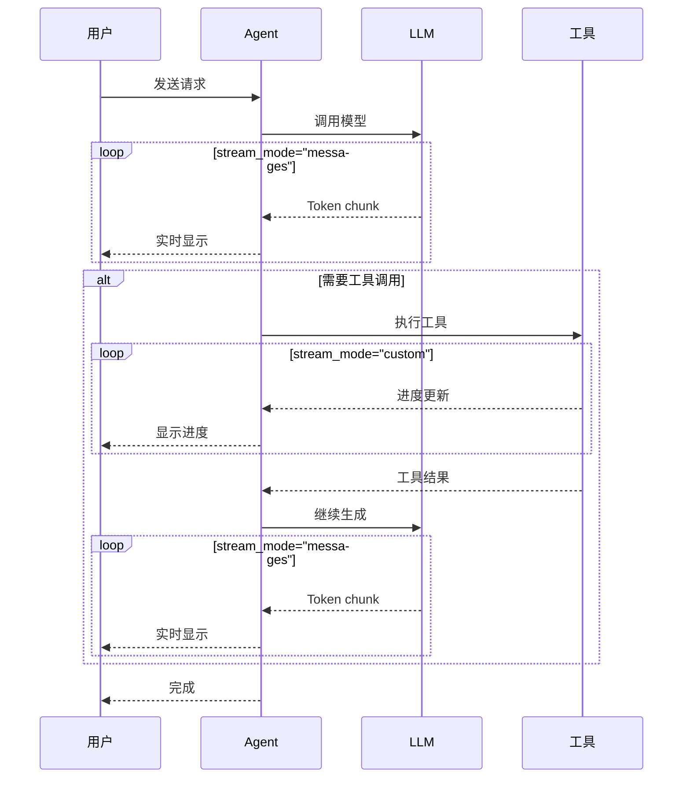

# Streaming 流式响应

## 概述

流式响应（Streaming）是 LangChain 1.0 的重要特性之一，它允许你在 LLM 生成内容时实时接收部分结果，而不是等待完整响应。这对于提升用户体验至关重要——用户可以看到 AI 正在"思考"和"打字"，而不是面对一个漫长的等待。

### 为什么需要流式响应？

1. **提升用户体验**：用户可以立即看到响应开始生成
2. **减少感知延迟**：即使总耗时相同，流式显示让等待更容易接受
3. **实时反馈**：工具执行过程中可以提供进度更新
4. **资源优化**：可以在生成过程中取消不需要的请求

## 核心概念

### agent.stream() 方法

LangChain 1.0 的 `create_agent` 返回的 Agent 支持 `.stream()` 方法，提供三种流式模式：

| stream_mode  | 描述                   | 适用场景             |
| ------------ | ---------------------- | -------------------- |
| `"updates"`  | 获取每个步骤的完整更新 | 追踪 Agent 执行流程  |
| `"messages"` | Token 级别流式输出     | 实时显示 AI 回复     |
| `"custom"`   | 工具内部自定义更新     | 长时间工具的进度反馈 |

### 流式 vs 非流式

```python
# 非流式调用 - 等待完整响应
result = agent.invoke({"messages": [...]})

# 流式调用 - 实时接收部分结果
for chunk in agent.stream({"messages": [...]}, stream_mode="updates"):
    print(chunk)
```

## 代码示例 1: 基础流式输出 (updates 模式)

`updates` 模式返回 Agent 执行过程中每个步骤的完整状态更新：

```python
from langchain.agents import create_agent

def get_weather(city: str) -> str:
    """获取指定城市的天气信息"""
    return f"今天{city}天气晴朗，气温 25°C"

agent = create_agent(
    model="claude-sonnet-4-5-20250929",
    tools=[get_weather],
    system_prompt="你是一个天气助手"
)

# 流式获取更新
for chunk in agent.stream(
    {"messages": [{"role": "user", "content": "北京天气怎么样？"}]},
    stream_mode="updates",
):
    for step, data in chunk.items():
        print(f"步骤: {step}")
        print(f"内容: {data['messages'][-1].content_blocks}")
        print("---")
```

**输出示例**:

```
步骤: model
内容: [{'type': 'tool_call', 'name': 'get_weather', 'args': {'city': 'Beijing'}}]
---
步骤: tools
内容: [{'type': 'text', 'text': '今天北京天气晴朗，气温 25°C'}]
---
步骤: model
内容: [{'type': 'text', 'text': '北京今天天气很好，晴朗，气温 25°C，非常适合外出！'}]
---
```

**使用场景**：

- 追踪 Agent 的决策过程
- 调试工具调用
- 显示执行进度

## 代码示例 2: Token 级别流式 (messages 模式)

`messages` 模式提供最细粒度的流式输出，每个 Token 都会触发一次更新：

```python
from langchain.agents import create_agent

def search_database(query: str) -> str:
    """搜索数据库"""
    return f"找到关于 {query} 的 10 条记录"

agent = create_agent(
    model="claude-sonnet-4-5-20250929",
    tools=[search_database],
)

# Token 级别流式输出
for token, metadata in agent.stream(
    {"messages": [{"role": "user", "content": "搜索用户信息"}]},
    stream_mode="messages",
):
    node = metadata['langgraph_node']
    content = token.content_blocks

    if node == "model":
        # 模型输出
        for block in content:
            if block.get("type") == "text":
                print(block["text"], end="", flush=True)
            elif block.get("type") == "tool_call_chunk":
                print(f"\n[调用工具: {block.get('name', '')}]")
    elif node == "tools":
        # 工具输出
        for block in content:
            if block.get("type") == "text":
                print(f"\n[工具结果: {block['text']}]")
```

**输出示例**:

```
[调用工具: search_database]
[工具结果: 找到关于 用户信息 的 10 条记录]
根据搜索结果，我找到了 10 条相关的用户信息记录...
```

**chunk 结构解析**:

- `token`: 包含 `content_blocks` 列表
- `metadata`: 包含 `langgraph_node` 标识当前节点

## 代码示例 3: 自定义流式更新 (custom 模式)

`custom` 模式允许工具函数内部发送自定义的流式更新，非常适合长时间运行的操作：

```python
from langchain.agents import create_agent
from langgraph.config import get_stream_writer

def analyze_large_dataset(dataset_name: str) -> str:
    """分析大型数据集"""
    writer = get_stream_writer()

    # 发送自定义进度更新
    writer(f"开始加载数据集: {dataset_name}")
    # 模拟加载时间
    writer("已加载 25% 数据...")
    writer("已加载 50% 数据...")
    writer("已加载 75% 数据...")
    writer("数据加载完成，开始分析...")
    writer("分析完成!")

    return f"数据集 {dataset_name} 分析完成：共 10000 条记录，平均值 42.5"

agent = create_agent(
    model="claude-sonnet-4-5-20250929",
    tools=[analyze_large_dataset],
)

# 接收自定义流式更新
for chunk in agent.stream(
    {"messages": [{"role": "user", "content": "分析销售数据集"}]},
    stream_mode="custom"
):
    print(f"进度: {chunk}")
```

**输出示例**:

```
进度: 开始加载数据集: 销售数据
进度: 已加载 25% 数据...
进度: 已加载 50% 数据...
进度: 已加载 75% 数据...
进度: 数据加载完成，开始分析...
进度: 分析完成!
```

### 多模式组合使用

可以同时使用多种流式模式：

```python
for stream_mode, chunk in agent.stream(
    {"messages": [{"role": "user", "content": "分析数据"}]},
    stream_mode=["updates", "custom"]  # 组合多种模式
):
    print(f"模式: {stream_mode}")
    print(f"内容: {chunk}")
    print("---")
```

## 流式响应数据流

下图展示了流式响应的完整处理流程:



## 最佳实践

### 1. 选择合适的 stream_mode

```python
# 场景 1: 实时显示 AI 回复 → messages
stream_mode="messages"

# 场景 2: 追踪执行流程 → updates
stream_mode="updates"

# 场景 3: 工具进度反馈 → custom
stream_mode="custom"

# 场景 4: 综合需求 → 组合模式
stream_mode=["updates", "custom"]
```

### 2. 错误处理

```python
try:
    for chunk in agent.stream(
        {"messages": [{"role": "user", "content": query}]},
        stream_mode="messages",
    ):
        process_chunk(chunk)
except Exception as e:
    print(f"流式处理中断: {e}")
    # 可以选择回退到非流式调用
    result = agent.invoke({"messages": [{"role": "user", "content": query}]})
```

### 3. 前端集成模式

使用 Server-Sent Events (SSE) 将流式响应传递到前端:

```python
from fastapi import FastAPI
from fastapi.responses import StreamingResponse

app = FastAPI()

async def stream_generator(query: str):
    for chunk in agent.stream(
        {"messages": [{"role": "user", "content": query}]},
        stream_mode="messages",
    ):
        # 将 chunk 序列化为 SSE 格式
        yield f"data: {json.dumps(chunk)}\n\n"
    yield "data: [DONE]\n\n"

@app.get("/stream")
async def stream_endpoint(query: str):
    return StreamingResponse(
        stream_generator(query),
        media_type="text/event-stream"
    )
```

## 常见问题

**Q: 流式响应会影响性能吗？**

A: 流式响应本身不会增加总耗时。实际上，由于可以更早开始处理结果，整体感知性能更好。但需要注意：

- 每个 chunk 都需要序列化和传输
- 前端需要处理增量更新
- 网络不稳定时可能需要重连机制

**Q: 如何处理流式中断？**

A: 建议实现重试和回退机制：

```python
max_retries = 3
for attempt in range(max_retries):
    try:
        for chunk in agent.stream(...):
            yield chunk
        break
    except ConnectionError:
        if attempt == max_retries - 1:
            # 回退到非流式
            result = agent.invoke(...)
            yield result
```

**Q: 如何在 Web 应用中使用流式响应？**

A: 推荐使用 Server-Sent Events (SSE) 或 WebSocket：

- **SSE**: 适合单向流式（服务器→客户端），实现简单
- **WebSocket**: 适合双向通信，功能更强大

**Q: 流式响应可以取消吗？**

A: 可以。在迭代过程中随时可以停止：

```python
for chunk in agent.stream(...):
    if should_cancel:
        break  # 停止流式处理
    process_chunk(chunk)
```

## 下一步

现在你已经掌握了流式响应的使用，接下来可以：

- 学习 [LangGraph 工作流](/ai/langchain/guide/langgraph-intro) - 构建复杂的 Agent 工作流
- 探索 [生产部署](/ai/langchain/guide/deployment) - 将流式 Agent 部署到生产环境

## 参考资源

- [LangChain Streaming 官方文档](https://docs.langchain.com/oss/python/langchain/streaming)
- [LangGraph 流式配置](https://docs.langchain.com/oss/python/langgraph/streaming)
- [Server-Sent Events 规范](https://developer.mozilla.org/en-US/docs/Web/API/Server-sent_events)
