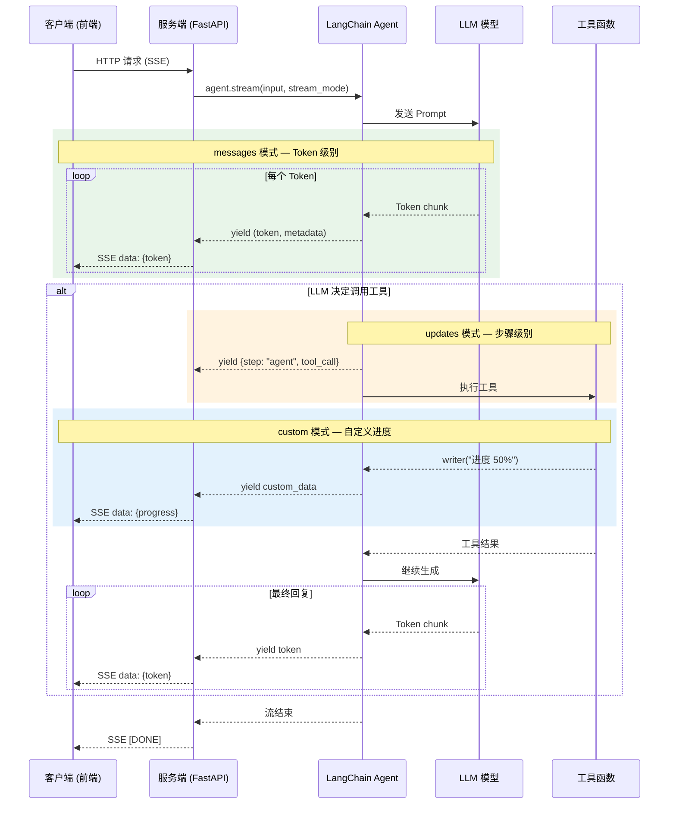

# 流式响应 Streaming

> 前置阅读：[模型调用 Models](/ai/langchain/guide/models) · [智能体 Agent](/ai/langchain/guide/agents)

## 为什么需要流式响应

大语言模型的推理往往需要数秒甚至数十秒。非流式调用让用户面对空白等待，而流式响应通过**增量返回**部分结果，从根本上改善体验：

| 维度 | 非流式 | 流式 |
|------|--------|------|
| 首字节延迟 | 等待全部生成完毕 | 首个 Token 即返回 |
| 用户感知 | "系统卡死了？" | "AI 正在打字" |
| 工具反馈 | 无中间状态 | 实时进度更新 |
| 资源利用 | 必须等完成 | 可随时取消 |

流式显示即使不减少实际响应时间，也能将**用户感知延迟降低 50% 以上**——我们习惯看到对方逐字回答，而不是沉默许久后突然出现一大段话。

[🔗 LangChain Streaming 概念文档](https://python.langchain.com/docs/concepts/streaming/){target="_blank" rel="noopener"} · [🔗 LangGraph 流式 Token 指南](https://langchain-ai.github.io/langgraph/how-tos/streaming-tokens/){target="_blank" rel="noopener"}

::: tip 前端类比
流式响应对前端开发者并不陌生：

- **SSE (Server-Sent Events)**：服务器单向推送数据流，LangChain 的 HTTP 流式通常通过 SSE 实现
- **WebSocket**：双向实时通信，适合客户端需要中途发送取消指令的场景
- **React Server Components Streaming**：Next.js RSC 逐步将 UI 片段送达客户端，与 LLM Token 流式输出理念一致——"准备好一部分就先发一部分"
- **ReadableStream**：Web Streams API 的流式原语，`for await...of` 消费 ReadableStream 和 `agent.stream()` 体验完全一样
:::

## 流式数据流全景



## 三种流式模式

| stream_mode | 粒度 | 返回内容 | 场景 |
|-------------|------|----------|------|
| `"updates"` | 步骤级 | 节点执行后的完整状态 | 追踪 Agent 决策、调试 |
| `"messages"` | Token 级 | 每个 Token 增量 | 聊天打字效果 |
| `"custom"` | 自定义 | 工具内发出的任意数据 | 长任务进度条 |

### updates — 步骤级别更新

每个执行步骤完成后返回一次，包含该步骤的完整输出：

```python
from langchain.chat_models import init_chat_model
from langgraph.prebuilt import create_react_agent

def get_weather(city: str) -> str:
    """获取天气"""
    return f"{city}：晴，25°C"

model = init_chat_model("openai:gpt-4o")
agent = create_react_agent(model, tools=[get_weather])

for chunk in agent.stream(
    {"messages": [{"role": "user", "content": "北京天气如何？"}]},
    stream_mode="updates",
):
    for node_name, node_output in chunk.items():
        last_msg = node_output["messages"][-1]
        if hasattr(last_msg, "tool_calls") and last_msg.tool_calls:
            for tc in last_msg.tool_calls:
                print(f"[{node_name}] 调用工具: {tc['name']}({tc['args']})")
        elif hasattr(last_msg, "content"):
            print(f"[{node_name}] {last_msg.content[:80]}")
```

输出：

```
[agent] 调用工具: get_weather({'city': '北京'})
[tools] 北京：晴，25°C
[agent] 北京今天天气很好！晴朗，气温 25°C，非常适合外出。
```

### messages — Token 级别流式

最细粒度——每个 Token 生成后立即返回，实现"打字机效果"：

```python
for event in agent.stream(
    {"messages": [{"role": "user", "content": "搜索活跃用户"}]},
    stream_mode="messages",
):
    msg_chunk, metadata = event  # 元组：(消息片段, 元数据)
    node = metadata.get("langgraph_node", "")

    if node == "agent" and msg_chunk.content:
        print(msg_chunk.content, end="", flush=True)  # 逐字输出

    if node == "agent" and msg_chunk.tool_call_chunks:
        for tc in msg_chunk.tool_call_chunks:
            if tc.get("name"):
                print(f"\n[调用: {tc['name']}]")

    if node == "tools" and msg_chunk.content:
        print(f"\n[结果: {msg_chunk.content}]")
```

关键数据结构：

```python
msg_chunk.content            # str — 文本片段
msg_chunk.tool_call_chunks   # list — 工具调用增量
metadata["langgraph_node"]   # "agent" | "tools"
metadata["langgraph_step"]   # int — 步骤序号
```

### custom — 自定义流式更新

工具函数内部通过 `get_stream_writer()` 发送任意数据，适合长时间操作的进度反馈：

```python
import time
from langgraph.config import get_stream_writer

def analyze_dataset(name: str) -> str:
    """分析数据集，过程中报告进度"""
    writer = get_stream_writer()

    for pct in [0, 25, 50, 75, 100]:
        writer({"phase": "loading", "progress": pct})
        time.sleep(0.3)

    writer({"phase": "analyzing", "progress": 100, "message": "分析完成"})
    return f"{name} 分析结果：50,000 条记录，日活 12,350"

agent = create_react_agent(model, tools=[analyze_dataset])

for chunk in agent.stream(
    {"messages": [{"role": "user", "content": "分析用户数据"}]},
    stream_mode="custom",
):
    if isinstance(chunk, dict):
        print(f"[{chunk.get('phase')}] {chunk.get('progress', 0)}%")
```

`get_stream_writer()` 要点：必须在工具函数**内部**调用；写入任意可序列化对象；仅 `stream_mode` 含 `"custom"` 时才被消费。

## 多模式组合

将 `stream_mode` 设为列表即可同时获取多种粒度的数据：

```python
for mode, chunk in agent.stream(
    {"messages": [{"role": "user", "content": "生成运营报告"}]},
    stream_mode=["messages", "custom"],
):
    if mode == "messages":
        msg_chunk, metadata = chunk
        if metadata.get("langgraph_node") == "agent" and msg_chunk.content:
            print(msg_chunk.content, end="", flush=True)
    elif mode == "custom":
        print(f"\n[进度] {chunk}")
```

每次迭代返回 `(mode, chunk)` 元组——通过 `mode` 区分数据来源，`chunk` 结构取决于对应模式。

::: warning 注意
组合模式下不同模式的数据会**交织**出现。务必通过 `mode` 字段区分处理。
:::

## 前端集成模式

### SSE + FastAPI（推荐）

```python
# server.py
import json
from fastapi import FastAPI
from fastapi.responses import StreamingResponse

app = FastAPI()

async def event_generator(query: str):
    for event in agent.stream(
        {"messages": [{"role": "user", "content": query}]},
        stream_mode="messages",
    ):
        msg_chunk, metadata = event
        node = metadata.get("langgraph_node", "")
        if node == "agent" and msg_chunk.content:
            yield f"data: {json.dumps({'type': 'token', 'content': msg_chunk.content}, ensure_ascii=False)}\n\n"
    yield "data: [DONE]\n\n"

@app.get("/api/chat/stream")
async def stream_chat(query: str):
    return StreamingResponse(event_generator(query), media_type="text/event-stream",
        headers={"Cache-Control": "no-cache", "X-Accel-Buffering": "no"})
```

```typescript
// React 前端
function useChatStream(query: string) {
  const [text, setText] = useState('')

  const start = useCallback(() => {
    const es = new EventSource(`/api/chat/stream?query=${encodeURIComponent(query)}`)
    es.onmessage = (e) => {
      if (e.data === '[DONE]') return es.close()
      const d = JSON.parse(e.data)
      if (d.type === 'token') setText((p) => p + d.content)
    }
    es.onerror = () => es.close()
    return () => es.close()
  }, [query])

  return { text, start }
}
```

### React useStream Hook（@langchain/sdk）

LangChain 官方封装，自动处理连接管理和消息状态：

```typescript
import { useStream } from '@langchain/sdk/react'

function Chat() {
  const { messages, start, stop, isStreaming } = useStream({
    apiUrl: 'http://localhost:8000',
    assistantId: 'my-agent',
    messagesKey: 'messages',
  })

  return (
    <div>
      {messages.map((m, i) => <div key={i}>{m.content}</div>)}
      {isStreaming && <span>AI 正在输入...</span>}
      <button onClick={stop}>停止</button>
    </div>
  )
}
```

优势：自动 SSE 重连、内置状态管理、`stop()` 取消、与 LangGraph Platform 无缝集成。

### WebSocket 方案

需要双向通信（如客户端实时取消）时使用：

```python
from fastapi import WebSocket

@app.websocket("/ws/chat")
async def ws_chat(ws: WebSocket):
    await ws.accept()
    try:
        while True:
            data = await ws.receive_json()
            if data.get("type") == "cancel":
                break
            for event in agent.stream(
                {"messages": [{"role": "user", "content": data["content"]}]},
                stream_mode="messages",
            ):
                msg_chunk, meta = event
                if meta.get("langgraph_node") == "agent" and msg_chunk.content:
                    await ws.send_json({"type": "token", "content": msg_chunk.content})
            await ws.send_json({"type": "done"})
    finally:
        await ws.close()
```

## 错误处理

流式响应中错误可能在任意位置发生，需要专门的处理策略：

```python
import time

def stream_with_retry(agent, query: str, max_retries: int = 3):
    """带指数退避重试 + 非流式回退"""
    for attempt in range(max_retries):
        try:
            for chunk in agent.stream(
                {"messages": [{"role": "user", "content": query}]},
                stream_mode="messages",
            ):
                yield chunk
            return  # 成功完成
        except (ConnectionError, TimeoutError) as e:
            wait = 2 ** attempt
            print(f"第 {attempt + 1} 次失败，{wait}s 后重试: {e}")
            time.sleep(wait)

    # 重试耗尽，回退到非流式
    result = agent.invoke({"messages": [{"role": "user", "content": query}]})
    yield result
```

SSE 场景下将错误传播到前端：

```python
async def safe_event_generator(query: str):
    try:
        for event in agent.stream(..., stream_mode="messages"):
            msg_chunk, metadata = event
            if metadata.get("langgraph_node") == "agent" and msg_chunk.content:
                yield f"data: {json.dumps({'type': 'token', 'content': msg_chunk.content}, ensure_ascii=False)}\n\n"
    except Exception as e:
        yield f"data: {json.dumps({'type': 'error', 'message': str(e)}, ensure_ascii=False)}\n\n"
    finally:
        yield "data: [DONE]\n\n"
```

## 流式取消

### Python 端：break 即取消

```python
for chunk in agent.stream(..., stream_mode="messages"):
    msg_chunk, metadata = chunk
    if metadata.get("langgraph_node") == "agent" and msg_chunk.content:
        print(msg_chunk.content, end="", flush=True)
    if should_cancel():
        break  # 跳出循环即停止消费
```

### 前端：AbortController

```typescript
const controller = new AbortController()

// 启动流式
fetch(`/api/chat/stream?query=${query}`, { signal: controller.signal })
  .then(async (res) => {
    const reader = res.body!.getReader()
    while (true) {
      const { done, value } = await reader.read()
      if (done) break
      processChunk(new TextDecoder().decode(value))
    }
  })
  .catch((err) => {
    if (err.name === 'AbortError') console.log('已取消')
  })

// 取消
controller.abort()
```

## 常见问题

**Q：流式和非流式的总耗时有区别吗？**

没有。LLM 推理时间相同，流式只是把"等完再返回"改为"生成一部分就返回一部分"。

**Q：三种模式怎么选？**

- 聊天打字效果 → `messages`
- 执行步骤可视化 → `updates`
- 工具进度条 → `custom`
- 综合需求 → `["messages", "custom"]`

**Q：前端选 SSE 还是 WebSocket？**

大多数场景选 SSE——实现简单、HTTP 兼容、自动重连。只有需要客户端**主动发数据**（如实时取消、追加上下文）时才用 WebSocket。

**Q：`get_stream_writer()` 可以在工具外使用吗？**

不可以。它依赖 LangGraph 运行时上下文，仅在工具函数执行期间可用。

## 下一步

- [智能体 Agent](/ai/langchain/guide/agents) — Agent 如何调度工具与模型
- [模型调用 Models](/ai/langchain/guide/models) — 不同模型对流式的支持差异
- [生产部署](/ai/langchain/guide/deployment) — 流式 Agent 的生产环境部署

## 参考资源

- [LangChain Streaming 官方文档](https://python.langchain.com/docs/concepts/streaming/)
- [LangGraph 流式配置](https://langchain-ai.github.io/langgraph/how-tos/streaming-tokens/)
- [Server-Sent Events MDN 文档](https://developer.mozilla.org/zh-CN/docs/Web/API/Server-sent_events)
- [useStream React Hook](https://langchain-ai.github.io/langgraphjs/reference/functions/langgraph_sdk_react.useStream.html)
