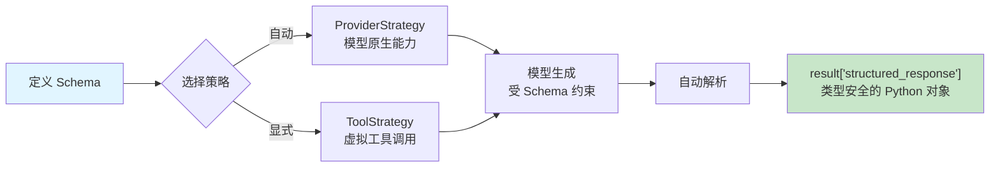

# 结构化输出

## 概述

在实际应用中，我们通常不只是需要 LLM 返回一段自然语言文本——我们需要**结构化数据**：提取的实体、分类标签、评分数值等。LangChain 1.0 的结构化输出（Structured Output）功能允许你定义一个 Schema，让模型的输出自动解析为符合该 Schema 的 Python 对象，而不是原始字符串。

[🔗 with_structured_output 使用指南](https://python.langchain.com/docs/how_to/structured_output/){target="_blank" rel="noopener"}

::: tip 前端类比
结构化输出类似于前端中的 **TypeScript 接口 + Zod 验证**。你定义一个 interface 描述数据结构，Zod 在运行时校验数据是否合规。LangChain 的结构化输出做的是同一件事：用 Pydantic Model 定义"接口"，框架自动确保 LLM 输出符合该"接口"。

不过要注意，LLM 的结构化输出是**生成时约束**，而非后处理校验——它在模型推理阶段就引导输出格式，这比前端的"先拿到数据再校验"更高效。
:::

### 为什么需要结构化输出？

1. **类型安全** — 直接获得 Python 对象（Pydantic Model / TypedDict），无需手动解析 JSON
2. **减少幻觉** — Schema 约束模型输出范围，降低生成无关内容的概率
3. **管线友好** — 输出可直接传入下游函数或写入数据库，无需 JSON.parse
4. **降低成本** — 不需要额外的 LLM 调用来"修正"输出格式

## 核心概念

### 两种策略

LangChain 1.0 提供两种结构化输出策略：

| 策略 | 原理 | 适用场景 |
| --- | --- | --- |
| **ProviderStrategy** | 利用模型提供商的原生结构化输出能力 | 模型支持 JSON Schema / JSON mode 时自动选择 |
| **ToolStrategy** | 创建一个"虚拟工具"，利用工具调用机制约束输出格式 | 任何支持工具调用的模型均可使用 |

**选择逻辑**：当你直接将 Schema 类型传给 `response_format` 时，`create_agent` 会自动选择 `ProviderStrategy`；如果你需要显式指定，可以用 `ToolStrategy(Schema)` 包装。

### 支持的 Schema 类型

LangChain 支持四种 Schema 定义方式，按推荐程度排列：

```
Pydantic BaseModel  ▸  最推荐，支持验证 + 字段描述 + 嵌套模型
Python dataclass    ▸  轻量替代，适合简单结构
TypedDict           ▸  最简洁，返回纯字典，无运行时验证
JSON Schema dict    ▸  最大灵活性，适合动态 Schema 场景
```

### 结构化输出数据流



## 代码示例 1: Pydantic Model + ProviderStrategy（自动）

最推荐的使用方式。定义 Pydantic `BaseModel`，直接传给 `response_format`：

```python
from pydantic import BaseModel, Field
from langchain.agents import create_agent


class ContactInfo(BaseModel):
    """联系人信息"""
    name: str = Field(description="姓名")
    email: str = Field(description="电子邮箱地址")
    phone: str = Field(description="电话号码")
    company: str | None = Field(default=None, description="所在公司（可选）")


# 直接传 Pydantic Model → 自动使用 ProviderStrategy
agent = create_agent(
    model="claude-sonnet-4-5-20250929",
    response_format=ContactInfo,
)

result = agent.invoke({
    "messages": [{
        "role": "user",
        "content": "提取联系信息：张三，邮箱 zhangsan@example.com，手机 138-0000-1234，就职于字节跳动"
    }]
})

contact = result["structured_response"]
print(contact)       # ContactInfo(name='张三', email='zhangsan@example.com', ...)
print(contact.name)  # 张三
```

**要点**：`Field(description=...)` 提高提取准确率；`str | None` + `default=None` 表示可选字段；通过 `result["structured_response"]` 访问 Pydantic 实例。

## 代码示例 2: ToolStrategy 显式指定

当模型不支持原生结构化输出，或你想确保使用工具调用方式时，显式使用 `ToolStrategy`：

```python
from pydantic import BaseModel, Field
from typing import Literal
from langchain.agents import create_agent
from langchain.agents.structured_output import ToolStrategy


class ProductReview(BaseModel):
    """商品评价分析结果"""
    rating: int = Field(description="评分（1-5）", ge=1, le=5)
    sentiment: Literal["positive", "negative", "neutral"] = Field(description="情感倾向")
    key_points: list[str] = Field(description="关键要点，每项 1-3 个词")


def search_reviews(product_name: str) -> str:
    """搜索商品评价"""
    return f"找到 {product_name} 的评价：质量很好，物流很快，但价格偏贵。4.5星"


agent = create_agent(
    model="claude-sonnet-4-5-20250929",
    tools=[search_reviews],
    response_format=ToolStrategy(ProductReview),
)

result = agent.invoke({
    "messages": [{"role": "user", "content": "分析：'质量不错，5星好评！发货速度快，但包装简陋'"}]
})

review = result["structured_response"]
print(review.rating)      # 5
print(review.sentiment)   # positive
print(review.key_points)  # ['质量不错', '发货快', '包装简陋']
```

**策略选择**：`ProviderStrategy` 延迟更低（无额外工具调用开销），但需模型原生支持；`ToolStrategy` 兼容性更广，适合作为兜底方案。

## 代码示例 3: 使用 TypedDict

不需要 Pydantic 运行时验证时，可以用更轻量的 `TypedDict`：

```python
from typing_extensions import TypedDict, Annotated
from langchain.agents import create_agent


class AnalysisResult(TypedDict):
    """数据分析结果"""
    total_count: Annotated[int, ..., "数据总条数"]
    average_value: Annotated[float, ..., "平均值"]
    trend: Annotated[str, ..., "趋势：上升/下降/平稳"]


agent = create_agent(model="claude-sonnet-4-5-20250929", response_format=AnalysisResult)

result = agent.invoke({
    "messages": [{"role": "user", "content": "分析销售：1月100万，2月120万，3月115万，4月135万，5月150万"}]
})

analysis = result["structured_response"]
# 返回的是普通字典，不是 Pydantic 实例
print(analysis["trend"])  # 上升
```

**TypedDict vs Pydantic**：TypedDict 返回普通字典、无运行时验证、不支持字段约束；Pydantic 返回模型实例、有完整验证、支持 `ge`/`le` 等约束和嵌套模型。简单场景选 TypedDict，需要验证选 Pydantic。

## 代码示例 4: 直接在模型上使用

除了 `create_agent`，也可以直接在模型实例上调用 `with_structured_output`：

```python
from langchain.chat_models import init_chat_model
from pydantic import BaseModel, Field

class Movie(BaseModel):
    """电影信息"""
    title: str = Field(description="电影标题")
    year: int = Field(description="上映年份")
    director: str = Field(description="导演")
    rating: float = Field(description="评分（满分 10）")

model = init_chat_model("claude-sonnet-4-5-20250929")
structured_model = model.with_structured_output(Movie)

movie = structured_model.invoke("介绍一下电影《盗梦空间》")
print(movie)  # Movie(title='盗梦空间', year=2010, director='克里斯托弗·诺兰', rating=9.3)
```

### 使用 JSON Schema

当 Schema 需要动态生成时，可以传入 JSON Schema 字典：

```python
json_schema = {
    "title": "Event",
    "type": "object",
    "properties": {
        "title": {"type": "string", "description": "事件标题"},
        "date": {"type": "string", "description": "日期，YYYY-MM-DD"},
        "attendees": {"type": "array", "items": {"type": "string"}, "description": "参与人"},
    },
    "required": ["title", "date"],
}

structured_model = model.with_structured_output(json_schema, method="json_schema")

event = structured_model.invoke("明天下午3点在会议室A开项目评审会，参加人：张三、李四")
print(event)
# {'title': '项目评审会', 'date': '2026-02-22', 'attendees': ['张三', '李四']}
```

## 代码示例 5: 复杂嵌套 Schema

Pydantic 天然支持模型嵌套，适合复杂业务场景：

```python
from pydantic import BaseModel, Field
from langchain.agents import create_agent

class Address(BaseModel):
    """地址信息"""
    province: str = Field(description="省份")
    city: str = Field(description="城市")
    street: str = Field(description="街道地址")

class Education(BaseModel):
    """教育经历"""
    school: str = Field(description="学校名称")
    degree: str = Field(description="学位")
    major: str = Field(description="专业")

class PersonProfile(BaseModel):
    """个人档案"""
    name: str = Field(description="姓名")
    age: int = Field(description="年龄")
    address: Address = Field(description="现居地址")
    education: list[Education] = Field(description="教育经历列表")
    skills: list[str] = Field(description="技能列表")

agent = create_agent(model="claude-sonnet-4-5-20250929", response_format=PersonProfile)

result = agent.invoke({
    "messages": [{
        "role": "user",
        "content": "提取简历：李明，28岁，现居北京市海淀区中关村大街1号。"
        "清华大学硕士（计算机），北邮学士（软件工程）。擅长 Python、Go、K8s。"
    }]
})

profile = result["structured_response"]
print(profile.name)                    # 李明
print(profile.address.city)            # 北京市
print(profile.education[0].school)     # 清华大学
```

## 验证与错误处理

### include_raw 获取原始输出

当你需要同时访问解析后的对象和原始输出（用于调试或日志记录）时：

```python
structured_model = model.with_structured_output(Movie, include_raw=True)

result = structured_model.invoke("介绍电影《星际穿越》")
# result: {"raw": AIMessage(...), "parsed": Movie(...), "parsing_error": None}

if result["parsing_error"]:
    print(f"解析失败: {result['parsing_error']}")
    print(f"原始输出: {result['raw'].content}")
else:
    print(result["parsed"].title)
```

### Agent 级别的错误处理

```python
from pydantic import ValidationError

try:
    result = agent.invoke({
        "messages": [{"role": "user", "content": "提取信息..."}]
    })
    data = result["structured_response"]
    process_data(data)
except ValidationError as e:
    print(f"数据验证失败: {e}")          # Pydantic 字段约束不满足
except KeyError:
    print("未获取到结构化输出")           # 模型可能未返回结构化输出
except Exception as e:
    print(f"调用失败: {e}")              # 网络错误、API 限流等
```

## 最佳实践

### 1. 为字段编写清晰的 description

```python
# 好 — 描述具体、明确
class Order(BaseModel):
    order_id: str = Field(description="订单编号，格式如 ORD-20260101-001")
    amount: float = Field(description="订单金额，单位：人民币元")

# 差 — 描述模糊，模型容易误解
class Order(BaseModel):
    order_id: str = Field(description="id")
    amount: float = Field(description="金额")
```

### 2. 使用 Literal 限制枚举值 + 合理设置可选字段

```python
from typing import Literal

class Ticket(BaseModel):
    priority: Literal["low", "medium", "high", "critical"] = Field(description="优先级")
    title: str = Field(description="工单标题")
    assignee: str | None = Field(default=None, description="负责人（可选）")
    tags: list[str] = Field(default_factory=list, description="标签列表")
```

### 3. 根据场景选择策略

```python
from langchain.agents.structured_output import ToolStrategy

# 模型支持原生结构化输出 → 直接传 Schema（自动 ProviderStrategy）
agent = create_agent(model="claude-sonnet-4-5-20250929", response_format=MySchema)

# 模型仅支持工具调用 → 显式 ToolStrategy
agent = create_agent(model="gpt-4.1-mini", response_format=ToolStrategy(MySchema))

# 简单提取、无需 Agent → 直接用模型
structured_model = model.with_structured_output(MySchema)
```

## 常见问题

**Q: ProviderStrategy 和 ToolStrategy 有什么区别？**
A: `ProviderStrategy` 利用模型提供商的原生 JSON Schema 能力，延迟更低。`ToolStrategy` 通过"虚拟工具"约束输出格式，兼容性更广。默认直接传 Schema 会自动选择 `ProviderStrategy`。

**Q: 结构化输出和工具调用是什么关系？**
A: 工具调用让模型调用外部函数获取结果；结构化输出让模型的**最终回复**符合指定格式。两者可同时使用——Agent 先调用工具收集信息，最后以结构化格式返回。

**Q: 输出不符合 Schema 怎么办？**
A: 使用 `include_raw=True` 捕获解析错误并获取原始输出调试。生产环境建议加重试逻辑或回退到 `ToolStrategy`。

**Q: TypedDict 和 Pydantic 该用哪个？**
A: 需要字段验证约束（`ge`/`le`/`min_length`）或嵌套模型用 **Pydantic**；只需简单键值结构用 **TypedDict**。

## 下一步

现在你已经掌握了结构化输出的使用，接下来可以：

- 学习 [智能体 Agent](/ai/langchain/guide/agents) — 了解 `create_agent` 的完整能力
- 探索 [模型配置](/ai/langchain/guide/models) — 深入了解 `init_chat_model` 和模型参数
- 进阶 [工具系统](/ai/langchain/guide/tools) — 结合工具调用 + 结构化输出构建完整应用

## 参考资源

- [LangChain Structured Output 官方文档](https://docs.langchain.com/oss/python/langchain/structured-output)
- [Pydantic V2 文档](https://docs.pydantic.dev/latest/)
- [LangChain Models 文档](https://docs.langchain.com/oss/python/langchain/models)
