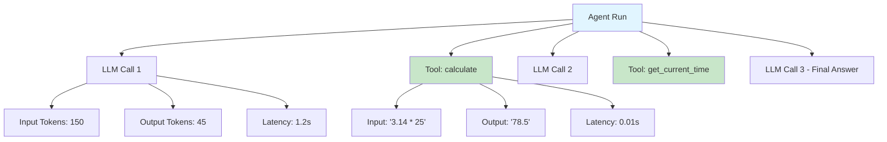

# LangSmith Studio

## 什么是 LangSmith Studio

LangSmith Studio 是 LangChain 官方提供的 **可视化 IDE**，专门用于 Agent 的开发、调试和测试。它让你能够在一个交互式界面中观察 Agent 的完整执行过程——包括每一次 LLM 调用、工具使用、中间状态变化，而不必在终端里逐行阅读日志。

::: tip 前端类比
LangSmith Studio 之于 AI Agent，类似于 **Chrome DevTools** 之于 Web 应用。DevTools 让你检查 DOM 树、网络请求、JS 执行；Studio 让你检查 Agent 的推理链路、工具调用和 Token 消耗。两者的核心理念相同：**让不可见的执行过程变得可视化、可调试**。
:::

### 核心能力

| 能力 | 描述 |
|------|------|
| **Playground** | 交互式测试 Agent，实时查看输出 |
| **Trace 可视化** | 追踪 Agent 执行的完整链路 |
| **调试工具调用** | 逐步查看每一次工具调用和返回值 |
| **运行对比** | 并排比较不同运行结果，定位差异 |
| **数据集管理** | 创建测试数据集进行回归测试 |

## 安装和配置

### 安装 LangSmith SDK

```bash
pip install langsmith langchain langchain-anthropic
```

### 配置 API Key

在 [LangSmith 控制台](https://smith.langchain.com/) 注册账号并获取 API Key，然后设置环境变量：

```bash
# .env 文件
LANGSMITH_API_KEY=lsv2_pt_xxxxxxxxxxxx
LANGSMITH_TRACING=true
LANGSMITH_PROJECT=my-agent-project

# LLM API Key
ANTHROPIC_API_KEY=sk-ant-xxxxxxxxxxxx
```

```python
import os
from dotenv import load_dotenv

load_dotenv()

# 验证配置
assert os.getenv("LANGSMITH_API_KEY"), "请设置 LANGSMITH_API_KEY"
assert os.getenv("LANGSMITH_TRACING") == "true", "请启用 LANGSMITH_TRACING"
```

### 启动本地 Studio

LangSmith Studio 可以通过 CLI 命令在本地启动，直接连接到你的 LangServe 应用：

```bash
# 安装 LangChain CLI
pip install langchain-cli

# 在项目目录中启动 Studio
langchain serve --port 8000

# Studio Playground 将在以下地址可用：
# http://localhost:8000/<your-route>/playground
```

对于已有的 LangServe 应用，Playground 是自动提供的。访问 `http://localhost:8000/docs` 可以查看所有可用端点。

## Playground：交互式测试

Playground 是 Studio 中最常用的功能，它提供了一个 Web 界面来测试你的 Agent。

### 基础用法

```python
from fastapi import FastAPI
from langchain.chat_models import init_chat_model
from langchain.prompts import ChatPromptTemplate
from langchain.tools import tool
from langchain.agents import create_tool_calling_agent, AgentExecutor
from langserve import add_routes

app = FastAPI(title="Studio Demo")

# 定义工具
@tool
def calculate(expression: str) -> str:
    """计算数学表达式"""
    try:
        result = eval(expression)
        return f"计算结果: {result}"
    except Exception as e:
        return f"计算错误: {e}"

@tool
def get_current_time() -> str:
    """获取当前时间"""
    from datetime import datetime
    return datetime.now().strftime("%Y-%m-%d %H:%M:%S")

# 创建 Agent
llm = init_chat_model("claude-sonnet-4-5-20250929")
prompt = ChatPromptTemplate.from_messages([
    ("system", "你是一个有用的助手，可以进行数学计算和查询时间。"),
    ("human", "{input}"),
    ("placeholder", "{agent_scratchpad}"),
])

agent = create_tool_calling_agent(llm, [calculate, get_current_time], prompt)
executor = AgentExecutor(agent=agent, tools=[calculate, get_current_time])

# 注册路由 - Playground 自动可用
add_routes(app, executor, path="/agent")

if __name__ == "__main__":
    import uvicorn
    uvicorn.run(app, host="0.0.0.0", port=8000)
```

启动后访问 `http://localhost:8000/agent/playground`，你可以：

1. 在输入框中输入问题（如 "3.14 * 25 等于多少？"）
2. 点击 "Send" 查看 Agent 的完整响应
3. 在右侧面板中观察中间步骤和工具调用
4. 修改输入参数重新测试

## Trace 可视化

Trace 是 LangSmith 的核心功能，它记录了 Agent 执行的完整链路。

### 自动追踪

当 `LANGSMITH_TRACING=true` 时，所有 LangChain 调用会自动上报到 LangSmith：

```python
from langchain.chat_models import init_chat_model
from langchain_core.messages import HumanMessage

# 配置环境变量后，调用会自动追踪
llm = init_chat_model("claude-sonnet-4-5-20250929")
response = llm.invoke([HumanMessage(content="你好")])

# 在 LangSmith 控制台中可以看到这次调用的完整 trace
# https://smith.langchain.com/
```

### Trace 结构



每个 Trace 包含以下信息：

- **Run ID**：唯一标识符
- **输入/输出**：完整的请求和响应数据
- **Token 用量**：输入/输出 Token 数
- **延迟**：每个步骤的执行时间
- **子步骤**：嵌套的 LLM 调用和工具调用

## 调试工具调用

Studio 的调试能力在排查工具调用问题时尤其有用。

### 手动追踪特定代码

```python
from langsmith import traceable

@traceable(name="process_user_query")
def process_query(query: str) -> str:
    """处理用户查询，可在 LangSmith 中追踪"""
    llm = init_chat_model("claude-sonnet-4-5-20250929")

    # 第一步：理解意图
    intent = llm.invoke(f"分析以下查询的意图: {query}")

    # 第二步：执行对应操作
    result = llm.invoke(f"基于意图 '{intent.content}'，回答: {query}")

    return result.content

# 调用时会在 LangSmith 中创建完整的 trace
answer = process_query("Python 的 GIL 是什么？")
```

### 使用 Run Tree 检查嵌套调用

```python
from langsmith import traceable
from langsmith.run_trees import RunTree

@traceable(name="outer_function")
def outer():
    """外层函数"""
    result_a = inner_a()
    result_b = inner_b(result_a)
    return result_b

@traceable(name="inner_function_a")
def inner_a():
    """内层函数 A"""
    llm = init_chat_model("claude-sonnet-4-5-20250929")
    return llm.invoke("生成一个随机数字").content

@traceable(name="inner_function_b")
def inner_b(input_data: str):
    """内层函数 B"""
    llm = init_chat_model("claude-sonnet-4-5-20250929")
    return llm.invoke(f"将 {input_data} 翻译成英文").content

# 执行后在 LangSmith 中可以看到完整的调用树
outer()
```

## 运行对比

Studio 支持将多次运行并排比较，帮助你：

- 对比不同 Prompt 版本的效果
- 比较不同模型的输出质量
- 检查修改前后的行为变化

### 使用标签组织运行

```python
from langsmith import traceable

@traceable(
    name="chat_agent",
    tags=["v2", "production"],
    metadata={"model": "claude-sonnet", "temperature": 0.7},
)
def run_agent_v2(query: str) -> str:
    llm = init_chat_model("claude-sonnet-4-5-20250929", temperature=0.7)
    return llm.invoke(query).content

@traceable(
    name="chat_agent",
    tags=["v3", "experiment"],
    metadata={"model": "claude-sonnet", "temperature": 0.3},
)
def run_agent_v3(query: str) -> str:
    llm = init_chat_model("claude-sonnet-4-5-20250929", temperature=0.3)
    return llm.invoke(query).content

# 运行两个版本，然后在 LangSmith 中按标签筛选和对比
test_query = "解释 Python 装饰器"
result_v2 = run_agent_v2(test_query)
result_v3 = run_agent_v3(test_query)
```

在 LangSmith 控制台中，你可以按标签 `v2` 和 `v3` 筛选运行记录，然后选择两条记录进行并排对比。

## 实战：调试一个失败的 Agent

下面通过一个完整的例子演示如何使用 Studio 定位和修复问题。

### 问题场景

一个搜索 Agent 在处理某些查询时返回空结果：

```python
from langchain.chat_models import init_chat_model
from langchain.tools import tool
from langchain.agents import create_tool_calling_agent, AgentExecutor
from langchain.prompts import ChatPromptTemplate
from langsmith import traceable

@tool
def search_products(query: str, category: str = None) -> str:
    """搜索产品数据库

    Args:
        query: 搜索关键词
        category: 可选的产品类别
    """
    # 模拟数据库搜索
    products = {
        "laptop": [{"name": "MacBook Pro", "price": 12999}],
        "phone": [{"name": "iPhone 15", "price": 7999}],
    }
    # Bug: category 参数被忽略，只按 query 精确匹配
    results = products.get(query.lower(), [])
    return str(results) if results else "未找到相关产品"

@traceable(name="debug_search_agent")
def create_search_agent():
    llm = init_chat_model("claude-sonnet-4-5-20250929")
    prompt = ChatPromptTemplate.from_messages([
        ("system", "你是一个产品搜索助手。使用 search_products 工具帮用户查找产品。"),
        ("human", "{input}"),
        ("placeholder", "{agent_scratchpad}"),
    ])
    agent = create_tool_calling_agent(llm, [search_products], prompt)
    return AgentExecutor(agent=agent, tools=[search_products], verbose=True)

# 测试
executor = create_search_agent()

# 这个查询会失败 - 因为用户输入 "笔记本电脑" 而非 "laptop"
result = executor.invoke({"input": "帮我找一台笔记本电脑"})
print(result)
```

### 调试过程

1. **查看 Trace**：在 LangSmith 控制台找到 `debug_search_agent` 的运行记录
2. **检查工具调用**：展开 Tool Run，查看传入的参数——发现 LLM 传的是中文 "笔记本电脑"
3. **定位根因**：`search_products` 只支持英文关键词精确匹配
4. **修复方案**：增加中英文映射或使用模糊搜索

### 修复后的代码

```python
@tool
def search_products(query: str, category: str = None) -> str:
    """搜索产品数据库

    Args:
        query: 搜索关键词（支持中英文）
        category: 可选的产品类别
    """
    # 中英文关键词映射
    keyword_map = {
        "笔记本电脑": "laptop", "笔记本": "laptop", "电脑": "laptop",
        "手机": "phone", "手机设备": "phone",
    }

    # 标准化查询词
    normalized = keyword_map.get(query, query.lower())

    products = {
        "laptop": [{"name": "MacBook Pro", "price": 12999}],
        "phone": [{"name": "iPhone 15", "price": 7999}],
    }

    results = products.get(normalized, [])
    if category:
        results = [p for p in results if p.get("category") == category]

    return str(results) if results else "未找到相关产品"
```

## 下一步

- 学习 [智能体 Agent](/ai/langchain/guide/agents) 了解如何构建健壮的 Agent
- 阅读 [测试](/ai/langchain/guide/testing) 掌握 Agent 的自动化测试方法
- 了解 [可观测性](/ai/langchain/guide/observability) 在生产环境中监控 Agent 行为

## 参考资源

- [LangSmith 官方文档](https://docs.smith.langchain.com/)
- [LangSmith Python SDK](https://github.com/langchain-ai/langsmith-sdk)
- [LangServe Playground 文档](https://github.com/langchain-ai/langserve)
