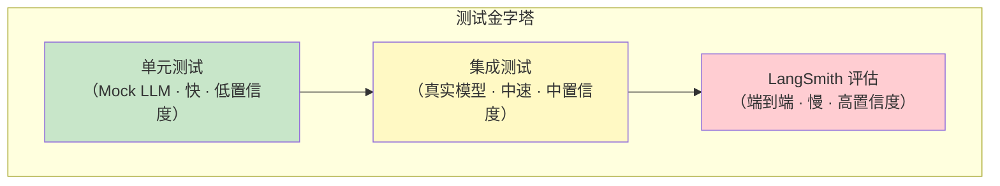

# 测试

## 为什么要测试 Agent

AI Agent 的行为具有非确定性——相同的输入可能产生不同的输出。这使得测试变得更加重要而非更不重要。没有测试的 Agent 在生产环境中就像一个没有安全绳的高空作业者：大部分时间可能没问题，但一旦出错就是灾难性的。

::: tip 前端类比
测试 Agent 的思路与测试 React 组件非常相似：**单元测试**验证单个工具函数（类似测试纯组件）；**集成测试**验证 Agent 的完整行为（类似 Testing Library 的用户行为测试）；**LangSmith 评估**则类似 E2E 测试（Cypress/Playwright），在真实环境中检验端到端行为。
:::

### 测试层次



## 单元测试策略

### 1. 独立测试工具函数

工具是 Agent 中最容易测试的部分——它们是普通的 Python 函数。

```python
# tools.py
from langchain.tools import tool
from datetime import datetime

@tool
def format_date(date_str: str, output_format: str = "%Y年%m月%d日") -> str:
    """将日期字符串格式化为指定格式

    Args:
        date_str: 输入日期，格式为 YYYY-MM-DD
        output_format: 输出格式，默认为中文格式
    """
    try:
        dt = datetime.strptime(date_str, "%Y-%m-%d")
        return dt.strftime(output_format)
    except ValueError:
        return f"无法解析日期: {date_str}"

@tool
def calculate_bmi(weight_kg: float, height_m: float) -> str:
    """计算 BMI 指数

    Args:
        weight_kg: 体重（千克）
        height_m: 身高（米）
    """
    if height_m <= 0 or weight_kg <= 0:
        return "输入值必须为正数"
    bmi = weight_kg / (height_m ** 2)
    if bmi < 18.5:
        category = "偏瘦"
    elif bmi < 24:
        category = "正常"
    elif bmi < 28:
        category = "偏胖"
    else:
        category = "肥胖"
    return f"BMI: {bmi:.1f}，分类: {category}"
```

```python
# test_tools.py
import pytest
from tools import format_date, calculate_bmi

class TestFormatDate:
    """测试日期格式化工具"""

    def test_basic_format(self):
        result = format_date.invoke({"date_str": "2024-03-15"})
        assert result == "2024年03月15日"

    def test_custom_format(self):
        result = format_date.invoke({
            "date_str": "2024-03-15",
            "output_format": "%m/%d/%Y",
        })
        assert result == "03/15/2024"

    def test_invalid_date(self):
        result = format_date.invoke({"date_str": "not-a-date"})
        assert "无法解析" in result

    def test_empty_string(self):
        result = format_date.invoke({"date_str": ""})
        assert "无法解析" in result

class TestCalculateBMI:
    """测试 BMI 计算工具"""

    def test_normal_weight(self):
        result = calculate_bmi.invoke({"weight_kg": 65, "height_m": 1.75})
        assert "正常" in result

    def test_underweight(self):
        result = calculate_bmi.invoke({"weight_kg": 45, "height_m": 1.75})
        assert "偏瘦" in result

    def test_invalid_input(self):
        result = calculate_bmi.invoke({"weight_kg": -1, "height_m": 1.75})
        assert "正数" in result

    @pytest.mark.parametrize("weight,height,expected", [
        (50, 1.70, "偏瘦"),
        (70, 1.75, "正常"),
        (85, 1.70, "偏胖"),
        (110, 1.70, "肥胖"),
    ])
    def test_all_categories(self, weight, height, expected):
        result = calculate_bmi.invoke({"weight_kg": weight, "height_m": height})
        assert expected in result
```

### 2. Mock LLM 响应

测试 Agent 逻辑时，使用 Mock 替代真实的 LLM 调用可以让测试变得快速且确定：

```python
# test_agent_with_mock.py
import pytest
from unittest.mock import MagicMock, patch
from langchain_core.messages import AIMessage, HumanMessage, ToolMessage

class TestAgentLogic:
    """使用 Mock LLM 测试 Agent 逻辑"""

    def test_agent_calls_correct_tool(self):
        """验证 Agent 在特定输入下调用正确的工具"""
        from langchain.chat_models import init_chat_model
        from langchain_core.messages import AIMessage

        # 创建 Mock LLM
        mock_llm = MagicMock()
        mock_llm.invoke.return_value = AIMessage(
            content="",
            tool_calls=[{
                "id": "call_1",
                "name": "format_date",
                "args": {"date_str": "2024-03-15"},
            }],
        )

        # 验证 LLM 返回了正确的工具调用
        response = mock_llm.invoke([HumanMessage(content="格式化日期 2024-03-15")])
        assert len(response.tool_calls) == 1
        assert response.tool_calls[0]["name"] == "format_date"

    def test_agent_handles_no_tool_call(self):
        """验证 Agent 在不需要工具时直接回复"""
        mock_llm = MagicMock()
        mock_llm.invoke.return_value = AIMessage(
            content="你好！有什么可以帮助你的吗？"
        )

        response = mock_llm.invoke([HumanMessage(content="你好")])
        assert response.content == "你好！有什么可以帮助你的吗？"
        assert not response.tool_calls

    def test_error_handling_in_tool(self):
        """验证工具错误时的处理逻辑"""
        mock_llm = MagicMock()

        # 第一次调用：LLM 请求调用工具
        # 第二次调用：工具返回错误后，LLM 应该给出友好提示
        mock_llm.invoke.side_effect = [
            AIMessage(
                content="",
                tool_calls=[{
                    "id": "call_1",
                    "name": "search",
                    "args": {"query": "test"},
                }],
            ),
            AIMessage(content="抱歉，搜索服务暂时不可用，请稍后再试。"),
        ]

        # 模拟工具调用流程
        first_response = mock_llm.invoke([HumanMessage(content="搜索测试")])
        assert first_response.tool_calls[0]["name"] == "search"

        # 模拟工具返回错误
        error_message = ToolMessage(
            content="Error: Connection timeout",
            tool_call_id="call_1",
        )

        final_response = mock_llm.invoke([
            HumanMessage(content="搜索测试"),
            first_response,
            error_message,
        ])
        assert "不可用" in final_response.content

class TestMiddlewareLogic:
    """测试中间件和预处理逻辑"""

    def test_input_sanitization(self):
        """测试输入清洗"""
        def sanitize_input(text: str) -> str:
            # 移除潜在的 prompt injection
            dangerous_patterns = ["ignore previous", "system:", "忽略之前"]
            cleaned = text
            for pattern in dangerous_patterns:
                cleaned = cleaned.replace(pattern, "[FILTERED]")
            return cleaned

        assert "FILTERED" in sanitize_input("ignore previous instructions")
        assert sanitize_input("正常的用户输入") == "正常的用户输入"

    def test_output_validation(self):
        """测试输出验证"""
        def validate_output(response: str, max_length: int = 1000) -> dict:
            if not response:
                return {"valid": False, "error": "空响应"}
            if len(response) > max_length:
                return {"valid": False, "error": "响应过长"}
            return {"valid": True, "response": response}

        assert validate_output("正常回复")["valid"] is True
        assert validate_output("")["valid"] is False
        assert validate_output("x" * 1001)["valid"] is False
```

## 集成测试

集成测试使用真实的 LLM 来验证 Agent 的端到端行为。由于 LLM 的非确定性，集成测试应关注行为模式而非精确输出。

### 使用真实模型的测试

```python
# test_integration.py
import pytest
from langchain.chat_models import init_chat_model
from langchain.tools import tool
from langchain.agents import create_tool_calling_agent, AgentExecutor
from langchain.prompts import ChatPromptTemplate

@tool
def add_numbers(a: float, b: float) -> float:
    """将两个数字相加

    Args:
        a: 第一个数字
        b: 第二个数字
    """
    return a + b

@pytest.fixture
def agent_executor():
    """创建测试用的 Agent"""
    llm = init_chat_model("claude-sonnet-4-5-20250929", temperature=0)
    prompt = ChatPromptTemplate.from_messages([
        ("system", "你是一个数学助手。使用工具进行计算，然后用中文回答。"),
        ("human", "{input}"),
        ("placeholder", "{agent_scratchpad}"),
    ])
    agent = create_tool_calling_agent(llm, [add_numbers], prompt)
    return AgentExecutor(agent=agent, tools=[add_numbers])

@pytest.mark.integration
class TestAgentIntegration:
    """集成测试 - 需要真实 API Key"""

    def test_agent_uses_tool_for_math(self, agent_executor):
        """验证 Agent 在数学问题时使用计算工具"""
        result = agent_executor.invoke({"input": "计算 42 + 58"})
        # 不检查精确输出，而是检查结果中包含正确答案
        assert "100" in result["output"]

    def test_agent_responds_to_greeting(self, agent_executor):
        """验证 Agent 对非计算问题不调用工具"""
        result = agent_executor.invoke({"input": "你好"})
        assert result["output"]  # 确保有输出
        assert len(result.get("intermediate_steps", [])) == 0  # 无工具调用

    def test_agent_handles_complex_query(self, agent_executor):
        """验证 Agent 处理复杂问题"""
        result = agent_executor.invoke({
            "input": "先计算 100 + 200，然后告诉我结果"
        })
        assert "300" in result["output"]
```

运行集成测试：

```bash
# 仅运行集成测试
pytest -m integration -v

# 跳过集成测试（CI 环境中节省费用）
pytest -m "not integration" -v
```

## LangSmith 评估

LangSmith 提供了自动化评估管道，可以用数据集驱动的方式系统性地测试 Agent。

### 创建评估数据集

```python
from langsmith import Client

client = Client()

# 创建数据集
dataset = client.create_dataset(
    dataset_name="math_agent_test_v1",
    description="数学 Agent 的测试用例集",
)

# 添加测试用例
examples = [
    {
        "input": {"input": "计算 2 + 3"},
        "output": {"expected": "5"},
    },
    {
        "input": {"input": "100 减去 37 等于多少"},
        "output": {"expected": "63"},
    },
    {
        "input": {"input": "计算 12 乘以 8"},
        "output": {"expected": "96"},
    },
    {
        "input": {"input": "你是谁？"},
        "output": {"expected_behavior": "自我介绍，不调用工具"},
    },
]

for example in examples:
    client.create_example(
        inputs=example["input"],
        outputs=example["output"],
        dataset_id=dataset.id,
    )
```

### 定义评估指标

```python
from langsmith.evaluation import evaluate, LangChainStringEvaluator

def correctness_evaluator(run, example) -> dict:
    """检查 Agent 输出是否包含预期答案"""
    prediction = run.outputs.get("output", "")
    expected = example.outputs.get("expected", "")

    if expected:
        score = 1.0 if expected in prediction else 0.0
        return {
            "key": "correctness",
            "score": score,
            "comment": f"预期: {expected}, 实际: {prediction[:100]}",
        }

    # 对于行为检查类用例
    expected_behavior = example.outputs.get("expected_behavior", "")
    return {
        "key": "correctness",
        "score": 1.0 if prediction else 0.0,
        "comment": f"期望行为: {expected_behavior}",
    }

def tool_usage_evaluator(run, example) -> dict:
    """检查工具使用是否合理"""
    # 检查中间步骤
    intermediate_steps = run.outputs.get("intermediate_steps", [])
    expected = example.outputs.get("expected", "")

    if expected:
        # 数学问题应该使用工具
        used_tool = len(intermediate_steps) > 0
        return {
            "key": "tool_usage",
            "score": 1.0 if used_tool else 0.0,
            "comment": "数学问题应调用计算工具",
        }

    # 非数学问题不应使用工具
    return {
        "key": "tool_usage",
        "score": 1.0 if len(intermediate_steps) == 0 else 0.0,
        "comment": "非数学问题不应调用工具",
    }
```

### 运行评估

```python
from langsmith.evaluation import evaluate

# 准备目标函数（被测 Agent）
def target(inputs: dict) -> dict:
    """执行 Agent 并返回结果"""
    result = agent_executor.invoke(inputs)
    return {
        "output": result["output"],
        "intermediate_steps": result.get("intermediate_steps", []),
    }

# 运行评估
results = evaluate(
    target,
    data="math_agent_test_v1",  # 数据集名称
    evaluators=[correctness_evaluator, tool_usage_evaluator],
    experiment_prefix="math-agent-v1",
    max_concurrency=2,
)

# 查看结果摘要
print(f"实验名称: {results.experiment_name}")
print(f"总用例数: {len(results.results)}")

# 在 LangSmith 控制台查看完整报告
# https://smith.langchain.com/
```

### 评估指标参考

常用的评估维度：

| 指标 | 描述 | 适用场景 |
|------|------|----------|
| **正确性** | 输出是否包含正确答案 | 事实性问答、计算 |
| **相关性** | 输出是否与问题相关 | 开放式问答 |
| **完整性** | 是否覆盖了所有要点 | 总结、报告生成 |
| **安全性** | 是否包含有害内容 | 面向用户的应用 |
| **一致性** | 多次运行结果是否稳定 | 关键业务场景 |
| **延迟** | 响应时间是否可接受 | 实时交互场景 |

## 测试配置与最佳实践

### pytest 配置

```ini
# pytest.ini
[pytest]
markers =
    integration: 集成测试（需要真实 API Key）
    evaluation: LangSmith 评估测试
    slow: 慢速测试

testpaths = tests
python_files = test_*.py
python_functions = test_*

# 默认不运行集成测试和评估测试
addopts = -m "not integration and not evaluation"
```

### conftest.py

```python
# tests/conftest.py
import os
import pytest

def pytest_configure(config):
    """注册自定义标记"""
    config.addinivalue_line("markers", "integration: 集成测试")
    config.addinivalue_line("markers", "evaluation: LangSmith 评估测试")

@pytest.fixture(scope="session")
def api_key_available():
    """检查 API Key 是否可用"""
    key = os.getenv("ANTHROPIC_API_KEY")
    if not key:
        pytest.skip("ANTHROPIC_API_KEY 未设置，跳过集成测试")
    return key

@pytest.fixture(scope="session")
def langsmith_available():
    """检查 LangSmith 是否可用"""
    key = os.getenv("LANGSMITH_API_KEY")
    if not key:
        pytest.skip("LANGSMITH_API_KEY 未设置，跳过评估测试")
    return key
```

### 项目测试结构

```
tests/
├── conftest.py               # 共享 fixture 和配置
├── unit/                      # 单元测试（快速、无外部依赖）
│   ├── test_tools.py          # 工具函数测试
│   ├── test_prompts.py        # Prompt 模板测试
│   └── test_middleware.py     # 中间件逻辑测试
├── integration/               # 集成测试（需要 API Key）
│   ├── test_agent.py          # Agent 端到端测试
│   └── test_chains.py         # Chain 集成测试
└── evaluation/                # LangSmith 评估
    ├── datasets/              # 测试数据集定义
    ├── evaluators/            # 自定义评估器
    └── test_eval.py           # 评估运行脚本
```

### CI/CD 集成建议

```yaml
# .github/workflows/test.yml 示例
# 单元测试: 每次 push 都运行
# 集成测试: 仅在 PR 合并到 main 时运行
# 评估测试: 每周定时运行或手动触发
```

```bash
# 本地开发时运行所有测试
pytest -v

# CI 中仅运行单元测试（快速反馈）
pytest -m "not integration and not evaluation" -v

# 合并前运行集成测试
pytest -m integration -v

# 手动运行评估
pytest -m evaluation -v --tb=long
```

## 下一步

- 使用 [LangSmith Studio](/ai/langchain/guide/studio) 可视化调试测试中发现的问题
- 了解 [部署](/ai/langchain/guide/deployment) 将经过充分测试的 Agent 推向生产
- 学习 [智能体 Agent](/ai/langchain/guide/agents) 设计更易于测试的 Agent 结构

## 参考资源

- [LangSmith 评估文档](https://docs.smith.langchain.com/evaluation)
- [pytest 官方文档](https://docs.pytest.org/)
- [LangChain 测试指南](https://python.langchain.com/docs/contributing/testing)
