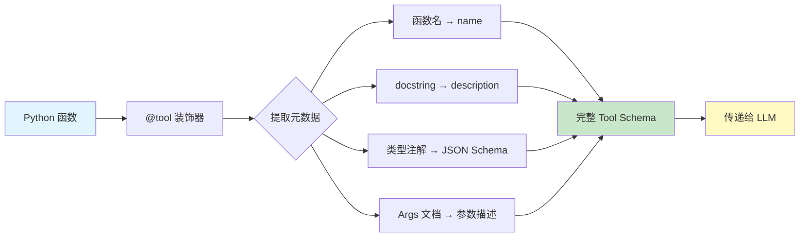
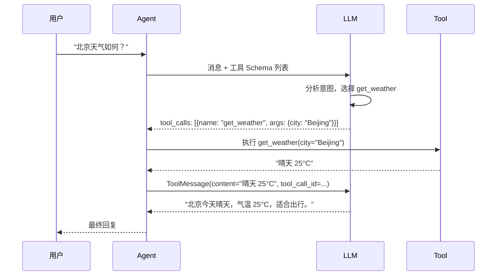

# 工具 Tools

## 概述

工具（Tool）是 Agent 与外部世界交互的桥梁。LLM 本身只能生成文本，而工具赋予它调用 API、查询数据库、执行计算等实际能力。LangChain 1.0 通过 `@tool` 装饰器和 `bind_tools` 方法，提供了一套类型安全、Schema 自动推导的工具定义与绑定机制。

[🔗 @tool 装饰器 API 参考](https://python.langchain.com/docs/how_to/custom_tools/){target="_blank" rel="noopener"} · [🔗 工具调用指南](https://python.langchain.com/docs/how_to/tool_calling/){target="_blank" rel="noopener"}

::: tip 前端类比
工具就像 Express / Next.js 中的 API Route Handler——你定义带有类型参数的端点（工具），而路由器（Agent / LLM）根据请求内容自动将调用分发到对应的处理函数。`@tool` 装饰器类似于 `@Get()` / `@Post()` 路由装饰器，docstring 则相当于 OpenAPI 的 `summary` 和 `description`。
:::

## 核心概念

### 工具的三要素

每个 LangChain 工具由三部分组成：

1. **name** — 工具名称（默认取函数名）
2. **description** — 工具描述（取自 docstring 第一行），LLM 据此决定何时调用
3. **args_schema** — 参数 Schema（从类型注解和 docstring 自动推导），告诉 LLM 如何构造调用参数

### Schema 自动推导流程



LangChain 读取函数签名中的类型注解（`str`、`int`、`list[str]`、Pydantic Model 等），自动生成符合 JSON Schema 的参数描述。docstring 中的 `Args:` 段落会被解析为每个参数的 `description` 字段。这意味着你只需要编写标准的 Python 函数，无需手动维护 Schema。

### 工具调用生命周期

1. LLM 接收用户消息和所有工具的 Schema
2. LLM 决定调用某个工具，返回 `tool_calls` 列表
3. Agent 框架执行对应的工具函数
4. 工具返回结果被封装为 `ToolMessage` 发回 LLM
5. LLM 根据工具结果继续推理或生成最终回复

## 代码示例 1: @tool 基础用法

最简单的工具定义只需要 `@tool` 装饰器和一个带 docstring 的函数：

```python
from langchain.tools import tool

@tool
def search_wiki(query: str) -> str:
    """在维基百科中搜索指定内容

    Args:
        query: 搜索关键词，例如 '量子计算' 或 'Python 语言'

    Returns:
        搜索结果摘要
    """
    # 实际项目中调用 Wikipedia API
    return f"维基百科搜索结果: {query} 是一种..."

# 查看自动推导的 Schema
print(search_wiki.name)          # "search_wiki"
print(search_wiki.description)   # "在维基百科中搜索指定内容"
print(search_wiki.args_schema.model_json_schema())
# {
#   "properties": {
#     "query": {
#       "description": "搜索关键词，例如 '量子计算' 或 'Python 语言'",
#       "type": "string"
#     }
#   },
#   "required": ["query"],
#   "type": "object"
# }
```

**关键点**：

- docstring 第一行作为工具描述，LLM 根据它判断何时使用该工具
- `Args:` 段落中的参数说明会映射到 JSON Schema 的 `description`
- 类型注解 `str` 自动映射为 `"type": "string"`
- 返回类型注解有助于代码可读性，但不影响 Schema 生成

## 代码示例 2: 复杂参数（Pydantic Model）

当工具参数较多或需要嵌套结构时，可以用 Pydantic Model 作为 `args_schema`：

```python
from langchain.tools import tool
from pydantic import BaseModel, Field
from typing import Optional

class SearchParams(BaseModel):
    """数据库搜索参数"""
    query: str = Field(description="搜索关键词")
    category: str = Field(description="搜索分类，如 'tech'、'finance'、'health'")
    max_results: int = Field(default=10, description="最大返回条数，默认 10")
    sort_by: Optional[str] = Field(
        default=None,
        description="排序字段，可选 'date' 或 'relevance'"
    )

@tool(args_schema=SearchParams)
def search_database(query: str, category: str, max_results: int = 10, sort_by: str = None) -> str:
    """在数据库中搜索记录

    支持按分类和排序方式进行精确搜索。
    """
    results = f"在 {category} 分类中搜索 '{query}'，返回 {max_results} 条结果"
    if sort_by:
        results += f"，按 {sort_by} 排序"
    return results

# 验证 Schema
schema = search_database.args_schema.model_json_schema()
print(schema)
# 包含所有字段的完整 JSON Schema，含 description、default、类型信息
```

**说明**：

- `Field(description=...)` 提供参数的详细描述，帮助 LLM 正确传参
- `default` 值标记可选参数，LLM 可以省略这些参数
- `Optional[str]` 表示参数可以为 `None`
- Pydantic Model 方式适合 3 个以上参数或需要嵌套对象的场景

## 代码示例 3: 工具绑定（bind_tools）

`bind_tools` 将工具 Schema 直接绑定到模型，让模型在生成响应时可以发起工具调用：

```python
from langchain.chat_models import init_chat_model
from langchain.tools import tool

@tool
def get_weather(city: str) -> str:
    """获取指定城市的实时天气信息

    Args:
        city: 城市名称，如 'Beijing'、'Shanghai'
    """
    weather_data = {"Beijing": "晴天 25°C", "Shanghai": "多云 28°C"}
    return weather_data.get(city, f"暂无 {city} 的天气数据")

@tool
def get_exchange_rate(from_currency: str, to_currency: str) -> str:
    """查询两种货币之间的实时汇率

    Args:
        from_currency: 源货币代码，如 'USD'、'EUR'
        to_currency: 目标货币代码，如 'CNY'、'JPY'
    """
    return f"1 {from_currency} = 7.25 {to_currency}"

# 初始化模型并绑定工具
model = init_chat_model("claude-sonnet-4-5-20250929", model_provider="anthropic")
model_with_tools = model.bind_tools([get_weather, get_exchange_rate])

# 调用模型 — LLM 自动决定是否使用工具
response = model_with_tools.invoke("北京今天天气怎么样？")

# 检查工具调用
if response.tool_calls:
    for tc in response.tool_calls:
        print(f"工具: {tc['name']}")     # "get_weather"
        print(f"参数: {tc['args']}")     # {"city": "Beijing"}
        print(f"调用ID: {tc['id']}")     # "call_xxx..."
else:
    print(f"直接回复: {response.content}")
```

**`bind_tools` vs `create_agent`**：

- `bind_tools` 是底层 API，只让模型"知道"工具的存在，但不自动执行工具
- `create_agent` 是高层 API，内部使用 `bind_tools` 并自动处理工具执行循环
- 需要精细控制工具执行流程时用 `bind_tools`，快速构建 Agent 时用 `create_agent`

## 代码示例 4: 工具调用与 ToolMessage

手动处理工具调用结果时，需要构建 `ToolMessage` 回传给模型：

```python
from langchain.chat_models import init_chat_model
from langchain.messages import HumanMessage, ToolMessage
from langchain.tools import tool

@tool
def calculate(expression: str) -> str:
    """计算数学表达式

    Args:
        expression: 数学表达式，如 '2 + 3 * 4'
    """
    try:
        return str(eval(expression))
    except Exception as e:
        return f"计算错误: {e}"

model = init_chat_model("claude-sonnet-4-5-20250929", model_provider="anthropic")
model_with_tools = model.bind_tools([calculate])

# 第一轮：用户提问，模型返回工具调用
messages = [HumanMessage(content="请帮我计算 (15 + 27) * 3")]
ai_response = model_with_tools.invoke(messages)
messages.append(ai_response)

# 第二轮：执行工具，将结果作为 ToolMessage 返回
if ai_response.tool_calls:
    for tc in ai_response.tool_calls:
        # 实际执行工具函数
        result = calculate.invoke(tc["args"])
        # 构建 ToolMessage，tool_call_id 必须与请求匹配
        messages.append(ToolMessage(
            content=result,
            tool_call_id=tc["id"]
        ))

# 第三轮：模型根据工具结果生成最终回复
final_response = model_with_tools.invoke(messages)
print(final_response.content)
# "计算结果为 126。即 (15 + 27) = 42，42 * 3 = 126。"
```

**说明**：

- `ToolMessage` 的 `tool_call_id` 必须与 `tool_calls` 中的 `id` 对应
- 这个手动流程就是 `create_agent` 内部自动完成的工作
- 理解这个流程对调试 Agent 行为非常有帮助

## 代码示例 5: 工具错误处理

工具执行可能失败，良好的错误处理可以让 LLM 自动重试或换用其他策略：

```python
from langchain.tools import tool
from langchain.agents import create_agent
from langchain.agents.middleware import wrap_tool_call
from langchain.messages import ToolMessage

@tool
def query_api(endpoint: str, params: str) -> str:
    """查询外部 API 数据

    Args:
        endpoint: API 端点路径
        params: 查询参数，JSON 格式字符串
    """
    import json
    try:
        parsed = json.loads(params)
        # 模拟 API 调用
        if endpoint == "/users":
            return json.dumps({"users": [{"name": "Alice"}, {"name": "Bob"}]})
        raise ValueError(f"未知端点: {endpoint}")
    except json.JSONDecodeError:
        # 返回清晰的错误信息，LLM 可以据此修正参数重试
        return "错误: params 必须是合法的 JSON 字符串，请检查格式后重试"
    except Exception as e:
        return f"API 调用失败: {str(e)}"

# 方式二：通过 middleware 统一处理工具错误
@wrap_tool_call
def handle_errors(request, handler):
    """统一的工具错误处理中间件"""
    try:
        return handler(request)
    except Exception as e:
        return ToolMessage(
            content=f"工具执行出错: {str(e)}。请检查参数后重试。",
            tool_call_id=request.tool_call["id"]
        )

agent = create_agent(
    model="claude-sonnet-4-5-20250929",
    tools=[query_api],
    middleware=[handle_errors],
)
```

**最佳做法**：

- 在工具函数内部处理可预见的错误，返回描述性错误信息
- 用 middleware 统一捕获未预料的异常
- 错误信息要对 LLM 友好，告诉它"出了什么问题"和"如何修正"

## 代码示例 6: 运行时上下文注入（Runtime Context）

工具经常需要访问运行时上下文（如当前用户 ID、API 密钥、数据库连接），但这些参数不应该由 LLM 提供。LangChain 1.0 通过 `runtime.context` 机制注入这些依赖：

```python
from dataclasses import dataclass
from langchain.agents import create_agent
from langchain.tools import tool
from langchain.agents.middleware import wrap_tool_call

@dataclass
class AppContext:
    """应用运行时上下文"""
    user_id: str
    db_connection: str
    api_key: str

@tool
def get_user_orders(query: str) -> str:
    """查询当前用户的订单信息

    Args:
        query: 搜索关键词，如 '最近订单'、'待发货'
    """
    return f"查询到关于 '{query}' 的订单"

# 通过 middleware 在工具调用时注入上下文
@wrap_tool_call
def inject_context(request, handler):
    """将 runtime context 注入到工具调用参数中"""
    user_id = request.runtime.context.user_id
    # 可以在工具执行前修改参数、添加上下文
    print(f"[审计] 用户 {user_id} 调用工具: {request.tool_call['name']}")
    return handler(request)

agent = create_agent(
    model="claude-sonnet-4-5-20250929",
    tools=[get_user_orders],
    middleware=[inject_context],
    context_schema=AppContext,  # 声明上下文类型
)

# 调用时传入上下文
result = agent.invoke(
    {"messages": [{"role": "user", "content": "查看我最近的订单"}]},
    context=AppContext(
        user_id="user_456",
        db_connection="postgresql://...",
        api_key="sk-..."
    ),
)
```

**关键点**：

- `context_schema` 声明 Agent 需要的运行时上下文类型
- 调用 `invoke` / `stream` 时通过 `context` 参数传入实际值
- 上下文对 LLM 不可见——LLM 不知道也不需要知道 `user_id`、`api_key` 的值
- middleware 可以读取 `request.runtime.context` 获取注入的上下文

## 代码示例 7: 动态工具选择

当工具数量很多时，可以根据上下文动态过滤，只向 LLM 提供相关的工具子集：

```python
from langchain.agents import create_agent
from langchain.agents.middleware import AgentMiddleware, ModelRequest, ModelResponse
from langchain.tools import tool
from typing import Callable

@tool
def read_data(table: str) -> str:
    """读取数据表"""
    return f"读取 {table} 成功"

@tool
def write_data(table: str, data: str) -> str:
    """写入数据表"""
    return f"写入 {table} 成功"

@tool
def delete_data(table: str, condition: str) -> str:
    """删除数据记录"""
    return f"删除 {table} 中满足 {condition} 的记录"

class RoleBasedToolFilter(AgentMiddleware):
    """根据用户角色动态过滤可用工具"""

    def wrap_model_call(
        self,
        request: ModelRequest,
        handler: Callable[[ModelRequest], ModelResponse],
    ) -> ModelResponse:
        user_role = request.runtime.context.user_role

        if user_role == "admin":
            # 管理员拥有全部工具
            return handler(request)
        elif user_role == "editor":
            # 编辑者不能删除
            tools = [t for t in request.tools if t.name != "delete_data"]
            return handler(request.override(tools=tools))
        else:
            # 只读用户只能读取
            tools = [t for t in request.tools if t.name.startswith("read_")]
            return handler(request.override(tools=tools))

agent = create_agent(
    model="claude-sonnet-4-5-20250929",
    tools=[read_data, write_data, delete_data],
    middleware=[RoleBasedToolFilter()],
    context_schema=UserContext,  # 包含 user_role 字段
)
```

**为什么需要动态工具选择**：

- 工具过多会降低 LLM 决策准确率（建议单次不超过 10-15 个）
- 安全考虑：不同用户角色应有不同的权限边界
- 场景优化：根据对话阶段提供不同的工具集

## 代码示例 8: 第三方工具集成

LangChain 生态提供了大量预构建的第三方工具包：

```python
# 社区工具包示例
from langchain_community.tools import DuckDuckGoSearchRun
from langchain_community.tools import WikipediaQueryRun
from langchain_community.utilities import WikipediaAPIWrapper

# 搜索工具
search = DuckDuckGoSearchRun()

# 维基百科工具
wiki = WikipediaQueryRun(api_wrapper=WikipediaAPIWrapper())

# 与自定义工具混合使用
from langchain.tools import tool
from langchain.agents import create_agent

@tool
def summarize(text: str) -> str:
    """对文本进行摘要总结

    Args:
        text: 需要总结的长文本
    """
    return f"摘要: {text[:100]}..."

agent = create_agent(
    model="claude-sonnet-4-5-20250929",
    tools=[search, wiki, summarize],  # 混合第三方和自定义工具
    system_prompt="你是一个研究助手，可以搜索网络和维基百科来回答问题。"
)
```

**常用第三方工具**：

| 工具包 | 用途 | 安装 |
|--------|------|------|
| `langchain-community` | DuckDuckGo、Wikipedia 等通用工具 | `pip install langchain-community` |
| `langchain_mcp_adapters` | MCP 协议工具服务器 | `pip install langchain-mcp-adapters` |
| `langchain-experimental` | 实验性工具（代码执行等） | `pip install langchain-experimental` |

### 工具调用完整流程



## 最佳实践

1. **工具描述是给 LLM 看的** — docstring 要明确说明工具"能做什么"和"什么时候该用"。模糊的描述会导致 LLM 误选工具。

2. **参数描述要具体** — 不要写 `query: 查询内容`，而要写 `query: 搜索关键词，如 '量子计算'、'Python 教程'`。示例值能显著提高 LLM 传参准确率。

3. **返回值要对 LLM 友好** — 工具返回值会被 LLM 阅读和理解。返回结构化的、易于解析的文本，避免返回 HTML 或大量无关数据。

4. **控制工具数量** — 单个 Agent 建议 5-15 个工具。超过这个范围用动态工具选择进行分组过滤。

5. **幂等与安全** — 读操作工具（查询、搜索）可以自由调用；写操作工具（创建、删除）应添加确认机制或权限检查。

6. **错误信息要可操作** — 不要返回 `"失败"`，而要返回 `"API 调用失败: 参数 city 不能为空，请提供城市名称"`。LLM 能根据可操作的错误信息自行修正。

## 常见问题

**Q: @tool 装饰器和手动创建 StructuredTool 有什么区别？**

A: `@tool` 是语法糖，内部创建的就是 `StructuredTool`。大多数场景用 `@tool` 即可。只有在需要动态创建工具（如从配置文件批量生成）时才需要直接使用 `StructuredTool.from_function()`。

**Q: 工具的返回类型有什么要求？**

A: 工具必须返回字符串。如果你的工具产出结构化数据，建议用 `json.dumps()` 序列化后返回。LLM 能够很好地理解 JSON 格式的返回值。

**Q: LLM 调用工具时参数不对怎么办？**

A: 常见原因和对策：

- **描述不够清晰** — 改进 docstring 和参数说明，加入示例值
- **参数类型不明确** — 确保使用精确的类型注解（`int` 而非 `str`）
- **工具过多导致混淆** — 减少工具数量或使用动态工具选择

**Q: bind_tools 和 create_agent 中传入 tools 有什么区别？**

A: `bind_tools` 是模型级别的 API，只是把工具 Schema 注入到模型请求中，模型会返回 `tool_calls` 但不会自动执行。`create_agent` 内部调用 `bind_tools`，并额外实现了"调用-执行-回传"的循环，是完整的 Agent 解决方案。

**Q: 如何测试工具？**

A: 工具本质是 Python 函数，可以直接调用测试：

```python
# 直接调用测试（绕过 LLM）
result = get_weather.invoke({"city": "Beijing"})
assert "晴天" in result

# 测试 Schema 是否正确
schema = get_weather.args_schema.model_json_schema()
assert "city" in schema["properties"]
```

## 下一步

现在你已经掌握了 LangChain 工具系统的核心用法，接下来可以：

- 学习 [智能体 Agent](/ai/langchain/guide/agents) — 了解 Agent 如何编排多个工具的调用
- 探索 [MCP 工具协议](/ai/langchain/guide/mcp) — 通过 MCP 协议接入更多外部工具服务
- 查看 [模型配置](/ai/langchain/guide/models) — 了解不同模型对工具调用的支持差异
- 进入 [Streaming 流式响应](/ai/langchain/guide/streaming) — 在工具执行过程中提供实时进度反馈

## 参考资源

- [LangChain Tools 官方文档](https://python.langchain.com/docs/concepts/tools/)
- [LangChain @tool API 参考](https://python.langchain.com/api_reference/core/tools/langchain_core.tools.structured.StructuredTool.html)
- [bind_tools 用法指南](https://python.langchain.com/docs/how_to/tool_calling/)
- [LangChain 社区工具集](https://python.langchain.com/docs/integrations/tools/)
