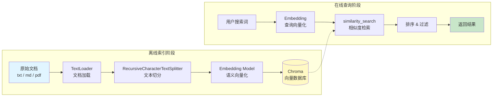

# 语义搜索实战

## 我们要构建什么

本教程将带你从零构建一个**语义搜索引擎**。与传统关键词搜索不同，语义搜索理解文本的"含义"而非简单匹配字符串——搜索"如何部署应用"可以找到包含"上线流程"、"发布步骤"的文档，即使它们没有出现"部署"这个词。

完成本教程后，你将拥有一个可通过 HTTP API 调用的语义搜索服务，支持对本地文档库进行高质量语义检索。

::: tip 前端类比
语义搜索类似 Algolia 或 Elasticsearch 的全文检索，但维度更高。关键词搜索是"精确匹配 + 分词"，相当于 CSS 选择器；语义搜索是"理解语义 + 向量相似度"，相当于 AI 在理解你的意图后帮你找到最相关的内容。
:::

### 先修知识

- 已完成 [环境搭建](/ai/langchain/guide/install)
- 了解 [检索增强 RAG](/ai/langchain/guide/retrieval) 的基本概念

## 语义搜索 Pipeline

整个系统分为**离线索引**和**在线查询**两个阶段：



## 前置准备

### 安装依赖

```bash
pip install langchain langchain-openai langchain-chroma langchain-community
pip install langchain-text-splitters
pip install fastapi uvicorn
```

如果使用 Anthropic 的 Embedding 模型，替换 `langchain-openai` 为 `langchain-anthropic`。

### 项目结构

```
semantic-search/
├── knowledge_base/          # 存放待索引的文档
│   ├── python-basics.txt
│   ├── fastapi-guide.md
│   └── deployment.md
├── chroma_db/               # Chroma 持久化目录（自动生成）
├── index.py                 # 索引构建脚本
├── search.py                # 搜索核心逻辑
└── server.py                # FastAPI 服务
```

### 准备示例文档

在 `knowledge_base/` 目录下创建几个文档用于测试：

```python
# create_sample_docs.py — 生成示例文档
import os

os.makedirs("knowledge_base", exist_ok=True)

docs = {
    "python-basics.txt": """Python 基础入门

Python 是一种通用编程语言，以简洁易读著称。
它支持多种编程范式：面向对象、函数式、过程式。

变量与数据类型：
Python 是动态类型语言，变量无需声明类型。
常用数据类型包括：int（整数）、float（浮点数）、str（字符串）、bool（布尔值）。
list（列表）和 dict（字典）是最常用的容器类型。

函数定义：
使用 def 关键字定义函数，支持默认参数、关键字参数和可变参数。
lambda 表达式用于创建匿名函数。
装饰器是 Python 的高级特性，用于在不修改函数代码的情况下增强其功能。
""",
    "fastapi-guide.md": """# FastAPI 开发指南

FastAPI 是一个高性能的 Python Web 框架，基于 Starlette 和 Pydantic 构建。

## 核心特性
- 自动生成 OpenAPI 文档
- 基于类型注解的请求参数验证
- 异步支持（async/await）
- 依赖注入系统

## 快速开始
安装 FastAPI 和 Uvicorn：pip install fastapi uvicorn
创建一个简单的 API 只需几行代码。

## 路由与路径参数
使用装饰器定义路由，路径参数通过花括号标记。
查询参数通过函数参数自动解析。

## 请求体与数据验证
使用 Pydantic BaseModel 定义请求体 Schema。
FastAPI 自动进行类型验证和数据转换。
""",
    "deployment.md": """# 应用部署指南

## Docker 部署
将应用打包为 Docker 镜像是最常见的部署方式。
编写 Dockerfile，定义基础镜像、依赖安装、启动命令。
使用 docker-compose 编排多个服务。

## 云服务部署
主流云平台：AWS、GCP、Azure。
常用服务：EC2/ECS（AWS）、Cloud Run（GCP）、App Service（Azure）。
Serverless 方案适合低流量、事件驱动的应用。

## CI/CD 流程
使用 GitHub Actions 或 GitLab CI 实现自动化构建和部署。
典型流程：代码提交 → 运行测试 → 构建镜像 → 推送至镜像仓库 → 部署到目标环境。

## 监控与日志
使用 Prometheus + Grafana 进行指标监控。
使用 ELK（Elasticsearch + Logstash + Kibana）进行日志聚合。
设置告警规则，及时发现和处理异常。
""",
}

for filename, content in docs.items():
    with open(f"knowledge_base/{filename}", "w", encoding="utf-8") as f:
        f.write(content)

print(f"已创建 {len(docs)} 个示例文档")
```

## Step 1: 加载文档

使用 LangChain 的 Document Loader 将文件内容加载为统一的 `Document` 对象：

```python
from langchain_community.document_loaders import TextLoader, DirectoryLoader

# 方式一：加载单个文件
loader = TextLoader("knowledge_base/python-basics.txt", encoding="utf-8")
single_doc = loader.load()
print(f"加载 1 个文件，内容长度: {len(single_doc[0].page_content)} 字符")

# 方式二：批量加载整个目录
dir_loader = DirectoryLoader(
    "knowledge_base/",
    glob="**/*.{txt,md}",       # 匹配 txt 和 md 文件
    loader_cls=TextLoader,
    loader_kwargs={"encoding": "utf-8"},
    show_progress=True,         # 显示加载进度
)
documents = dir_loader.load()

print(f"共加载 {len(documents)} 个文档")
for doc in documents:
    print(f"  - {doc.metadata['source']}: {len(doc.page_content)} 字符")
```

**输出示例：**

```
共加载 3 个文档
  - knowledge_base/python-basics.txt: 412 字符
  - knowledge_base/fastapi-guide.md: 387 字符
  - knowledge_base/deployment.md: 521 字符
```

每个 `Document` 对象包含两个字段：
- `page_content`：文档的文本内容
- `metadata`：元数据字典，默认包含 `source`（文件路径），可自行扩展

## Step 2: 切分文档

长文档需要切分为合理大小的片段，才能实现精准检索。`RecursiveCharacterTextSplitter` 会优先按段落、换行符切分，保持语义完整性：

```python
from langchain_text_splitters import RecursiveCharacterTextSplitter

splitter = RecursiveCharacterTextSplitter(
    chunk_size=500,         # 每个片段最大 500 字符
    chunk_overlap=100,      # 相邻片段重叠 100 字符，防止信息在切分边界丢失
    separators=["\n\n", "\n", "。", "，", " ", ""],  # 中文友好的分隔符优先级
    length_function=len,
)

chunks = splitter.split_documents(documents)

print(f"原始文档: {len(documents)} 个 → 切分后: {len(chunks)} 个片段")
print(f"\n片段示例（第 1 个）:")
print(f"  内容: {chunks[0].page_content[:100]}...")
print(f"  元数据: {chunks[0].metadata}")
```

**切分参数选择指南：**

| 参数 | 建议值 | 说明 |
|------|--------|------|
| `chunk_size` | 300-800 | FAQ 用小值，长文用大值 |
| `chunk_overlap` | chunk_size 的 15-20% | 防止关键信息被切断 |
| `separators` | 加入中文标点 | 确保中文段落完整性 |

## Step 3: 创建 Embeddings

Embedding 模型将文本转换为高维向量，使语义相近的文本在向量空间中距离也相近：

```python
from langchain.embeddings import init_embeddings

# 使用 OpenAI 的 Embedding 模型
embeddings = init_embeddings("openai:text-embedding-3-small")

# 测试：将一段文本转换为向量
test_vector = embeddings.embed_query("如何部署 Python 应用？")
print(f"向量维度: {len(test_vector)}")  # 1536
print(f"向量前 5 维: {test_vector[:5]}")

# 验证语义相似度
import numpy as np

vec_a = embeddings.embed_query("应用部署流程")
vec_b = embeddings.embed_query("如何上线服务")
vec_c = embeddings.embed_query("Python 变量类型")

def cosine_similarity(a, b):
    return np.dot(a, b) / (np.linalg.norm(a) * np.linalg.norm(b))

print(f"'应用部署流程' vs '如何上线服务': {cosine_similarity(vec_a, vec_b):.4f}")  # ~0.85 高相似
print(f"'应用部署流程' vs 'Python 变量类型': {cosine_similarity(vec_a, vec_c):.4f}")  # ~0.30 低相似
```

## Step 4: 存储到向量数据库

将切分后的文档片段向量化并存入 Chroma 向量数据库：

```python
from langchain_chroma import Chroma

# 创建向量库并持久化到本地
vectorstore = Chroma.from_documents(
    documents=chunks,
    embedding=embeddings,
    collection_name="knowledge_base",
    persist_directory="./chroma_db",  # 数据持久化目录
)

print(f"已索引 {vectorstore._collection.count()} 个文档片段")

# 后续使用时，直接加载已有的向量库（无需重新索引）
# vectorstore = Chroma(
#     collection_name="knowledge_base",
#     embedding_function=embeddings,
#     persist_directory="./chroma_db",
# )
```

## Step 5: 搜索与检索

向量库建好后，就可以进行语义搜索了：

```python
# 基础语义搜索
results = vectorstore.similarity_search(
    query="如何部署应用到云服务器",
    k=3,  # 返回最相关的 3 个结果
)

print("=== 搜索结果 ===")
for i, doc in enumerate(results, 1):
    print(f"\n[结果 {i}] 来源: {doc.metadata['source']}")
    print(f"内容: {doc.page_content[:150]}...")

# 带分数的搜索（分数越低越相似，L2 距离）
results_with_scores = vectorstore.similarity_search_with_score(
    query="如何部署应用到云服务器",
    k=3,
)

print("\n=== 带分数的搜索结果 ===")
for doc, score in results_with_scores:
    print(f"[分数: {score:.4f}] {doc.page_content[:80]}...")

# 基于分数阈值过滤（使用 Retriever 接口）
retriever = vectorstore.as_retriever(
    search_type="similarity_score_threshold",
    search_kwargs={
        "score_threshold": 0.5,  # 只返回相似度高于 0.5 的结果
        "k": 5,
    },
)

filtered_results = retriever.invoke("Python 函数定义")
print(f"\n通过阈值过滤后的结果数: {len(filtered_results)}")
```

### 检索策略对比

```python
# 策略 1：纯相似度搜索（默认，适合精确匹配）
results_sim = vectorstore.similarity_search("Docker 部署", k=3)

# 策略 2：MMR 搜索（兼顾相关性和多样性，避免结果重复）
results_mmr = vectorstore.max_marginal_relevance_search(
    query="Docker 部署",
    k=3,
    fetch_k=10,         # 先检索 10 个候选
    lambda_mult=0.5,    # 0=最大多样性，1=最大相关性
)

print("纯相似度结果:")
for doc in results_sim:
    print(f"  - {doc.page_content[:60]}...")

print("\nMMR 结果（更多样化）:")
for doc in results_mmr:
    print(f"  - {doc.page_content[:60]}...")
```

## Step 6: 构建搜索 API

将搜索能力封装为 FastAPI 服务，供其他应用调用：

```python
# server.py
from fastapi import FastAPI, Query
from pydantic import BaseModel
from langchain_chroma import Chroma
from langchain.embeddings import init_embeddings

app = FastAPI(title="语义搜索 API", version="1.0.0")

# 应用启动时初始化向量库
embeddings = init_embeddings("openai:text-embedding-3-small")
vectorstore = Chroma(
    collection_name="knowledge_base",
    embedding_function=embeddings,
    persist_directory="./chroma_db",
)


class SearchResult(BaseModel):
    content: str
    source: str
    score: float


class SearchResponse(BaseModel):
    query: str
    total: int
    results: list[SearchResult]


@app.get("/search", response_model=SearchResponse)
async def search(
    q: str = Query(..., description="搜索关键词"),
    k: int = Query(default=5, ge=1, le=20, description="返回结果数量"),
    threshold: float = Query(default=0.0, ge=0.0, le=1.0, description="最低相似度阈值"),
):
    """语义搜索接口"""
    results_with_scores = vectorstore.similarity_search_with_score(query=q, k=k)

    search_results = []
    for doc, score in results_with_scores:
        # Chroma 返回的是 L2 距离，转换为 0-1 的相似度分数
        similarity = max(0, 1 - score / 2)
        if similarity >= threshold:
            search_results.append(
                SearchResult(
                    content=doc.page_content,
                    source=doc.metadata.get("source", "unknown"),
                    score=round(similarity, 4),
                )
            )

    return SearchResponse(
        query=q,
        total=len(search_results),
        results=search_results,
    )


@app.get("/health")
async def health():
    """健康检查"""
    count = vectorstore._collection.count()
    return {"status": "ok", "indexed_documents": count}
```

启动服务并测试：

```bash
# 启动服务
uvicorn server:app --host 0.0.0.0 --port 8000 --reload

# 测试搜索
curl "http://localhost:8000/search?q=如何部署应用&k=3"

# 健康检查
curl "http://localhost:8000/health"
```

## 完整代码

将索引构建和搜索服务整合为一个完整可运行的脚本：

```python
"""
semantic_search.py — 完整的语义搜索引擎
用法:
    python semantic_search.py index    # 构建索引
    python semantic_search.py search "你的搜索词"  # 命令行搜索
    python semantic_search.py serve    # 启动 API 服务
"""

import sys
import os
from langchain_community.document_loaders import DirectoryLoader, TextLoader
from langchain_text_splitters import RecursiveCharacterTextSplitter
from langchain.embeddings import init_embeddings
from langchain_chroma import Chroma

# ========== 配置 ==========
DOCS_DIR = "knowledge_base"
CHROMA_DIR = "./chroma_db"
COLLECTION_NAME = "knowledge_base"
EMBEDDING_MODEL = "openai:text-embedding-3-small"
CHUNK_SIZE = 500
CHUNK_OVERLAP = 100


def get_embeddings():
    return init_embeddings(EMBEDDING_MODEL)


def build_index():
    """构建文档索引"""
    print(f"加载 {DOCS_DIR}/ 下的文档...")
    loader = DirectoryLoader(
        DOCS_DIR,
        glob="**/*.{txt,md}",
        loader_cls=TextLoader,
        loader_kwargs={"encoding": "utf-8"},
        show_progress=True,
    )
    documents = loader.load()
    print(f"共加载 {len(documents)} 个文档")

    splitter = RecursiveCharacterTextSplitter(
        chunk_size=CHUNK_SIZE,
        chunk_overlap=CHUNK_OVERLAP,
        separators=["\n\n", "\n", "。", "，", " ", ""],
    )
    chunks = splitter.split_documents(documents)
    print(f"切分为 {len(chunks)} 个片段")

    embeddings = get_embeddings()
    vectorstore = Chroma.from_documents(
        documents=chunks,
        embedding=embeddings,
        collection_name=COLLECTION_NAME,
        persist_directory=CHROMA_DIR,
    )
    print(f"索引构建完成，共 {vectorstore._collection.count()} 个片段")


def search(query: str, k: int = 5):
    """执行语义搜索"""
    embeddings = get_embeddings()
    vectorstore = Chroma(
        collection_name=COLLECTION_NAME,
        embedding_function=embeddings,
        persist_directory=CHROMA_DIR,
    )
    results = vectorstore.similarity_search_with_score(query=query, k=k)

    print(f'\n搜索: "{query}"')
    print(f"共 {len(results)} 个结果:\n")
    for i, (doc, score) in enumerate(results, 1):
        similarity = max(0, 1 - score / 2)
        print(f"[{i}] 相似度: {similarity:.4f} | 来源: {doc.metadata.get('source', '未知')}")
        print(f"    {doc.page_content[:120]}...")
        print()


if __name__ == "__main__":
    if len(sys.argv) < 2:
        print("用法: python semantic_search.py [index|search|serve]")
        sys.exit(1)

    command = sys.argv[1]

    if command == "index":
        build_index()
    elif command == "search":
        query = sys.argv[2] if len(sys.argv) > 2 else "Python 入门"
        search(query)
    elif command == "serve":
        import uvicorn
        uvicorn.run("server:app", host="0.0.0.0", port=8000, reload=True)
    else:
        print(f"未知命令: {command}")
```

## 扩展方向

### Metadata 过滤

为文档添加元数据标签，实现精确过滤：

```python
from langchain_core.documents import Document

# 加载时添加自定义元数据
enriched_docs = []
for doc in documents:
    doc.metadata["category"] = "backend" if "fastapi" in doc.metadata["source"] else "devops"
    doc.metadata["language"] = "zh"
    enriched_docs.append(doc)

# 搜索时按元数据过滤
results = vectorstore.similarity_search(
    query="API 开发",
    k=5,
    filter={"category": "backend"},  # 只搜索后端相关文档
)
```

### 混合搜索

结合关键词搜索和语义搜索的优势：

```python
from langchain.retrievers import EnsembleRetriever
from langchain_community.retrievers import BM25Retriever

# 关键词检索器（BM25）
bm25_retriever = BM25Retriever.from_documents(chunks, k=5)

# 语义检索器
semantic_retriever = vectorstore.as_retriever(search_kwargs={"k": 5})

# 混合检索器（各占 50% 权重）
ensemble_retriever = EnsembleRetriever(
    retrievers=[bm25_retriever, semantic_retriever],
    weights=[0.5, 0.5],
)

results = ensemble_retriever.invoke("Docker 部署流程")
```

### 增量更新

当文档有更新时，只需添加新文档而非重建全部索引：

```python
from langchain_core.documents import Document

# 添加新文档到已有向量库
new_docs = [
    Document(
        page_content="Kubernetes 是容器编排平台，用于自动化部署、扩展和管理容器化应用。",
        metadata={"source": "k8s-intro.md", "category": "devops"},
    ),
]

new_chunks = splitter.split_documents(new_docs)
vectorstore.add_documents(new_chunks)
print(f"增量添加 {len(new_chunks)} 个片段，当前总计: {vectorstore._collection.count()}")
```

## 下一步

- [RAG Agent 实战](/ai/langchain/guide/tutorial-rag-agent) -- 在语义搜索基础上构建智能问答 Agent
- [检索增强 RAG](/ai/langchain/guide/retrieval) -- 深入理解 RAG 全流程与优化技巧
- [Agent 实战指南](/ai/langchain/guide/agents) -- 了解 Agent 如何编排工具调用

## 参考资源

- [LangChain Text Splitters 文档](https://python.langchain.com/docs/concepts/text_splitters/)
- [LangChain Vector Stores 文档](https://python.langchain.com/docs/concepts/vectorstores/)
- [Chroma 官方文档](https://docs.trychroma.com/)
- [FastAPI 官方文档](https://fastapi.tiangolo.com/)
