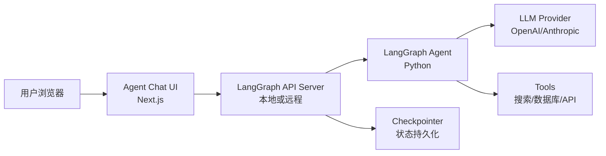

# Agent Chat UI

## Agent Chat UI 是什么

Agent Chat UI 是一个基于 **Next.js** 的开源 Web 应用，为任何 LangGraph Agent 提供即开即用的对话界面。它不是一个简单的聊天气泡——它支持：

- 实时对话与流式输出
- 工具调用过程可视化
- 时间旅行调试（time-travel debugging）
- 状态分叉（state forking）
- 与本地开发或 LangSmith 部署无缝对接

**前端类比**：如果 Storybook 是 React 组件的交互式演练场，那 Agent Chat UI 就是 AI Agent 的交互式演练场。但它比 Storybook 多了一层——不仅能展示 Agent 的最终输出，还能可视化 Agent 内部的工具调用、状态流转和决策路径。

| Storybook                | Agent Chat UI             |
| ------------------------ | ------------------------- |
| 展示组件在不同 props 下的渲染 | 展示 Agent 在不同输入下的行为 |
| Controls 面板调整参数    | 对话输入测试不同场景       |
| Actions 面板查看事件     | 工具调用可视化             |
| 不含业务逻辑             | 包含完整的 Agent 执行流程  |

**LangGraph 原生语义**：Agent Chat UI 通过 LangGraph 的标准 API（REST 接口）与 Agent 通信。它使用 `stream_mode` 获取实时更新，使用 `thread_id` 管理会话，使用 checkpoint API 实现时间旅行。这意味着它和任何遵循 LangGraph API 规范的 Agent 都兼容。

## 安装与配置

### 前置条件

- Node.js 18+ 和 pnpm（前端开发者的日常）
- 一个正在运行的 LangGraph Agent（本地 `langgraph dev` 或远程部署）

### 快速开始

```bash
# 克隆仓库
git clone https://github.com/langchain-ai/agent-chat-ui.git
cd agent-chat-ui

# 安装依赖
pnpm install

# 启动开发服务器
pnpm dev
```

启动后默认访问 `http://localhost:3000`。

**前端开发者的熟悉感**：是的，这就是一个标准的 Next.js 项目。`pnpm install` + `pnpm dev`，和你每天做的事一模一样。项目使用 TypeScript、Tailwind CSS，代码结构对前端开发者来说没有任何学习成本。

### 项目结构一览

```plaintext
agent-chat-ui/
├── src/
│   ├── app/                  # Next.js App Router 页面
│   ├── components/           # UI 组件
│   │   ├── chat/             # 聊天相关组件
│   │   ├── tools/            # 工具调用展示组件
│   │   └── ui/               # 基础 UI 组件（shadcn/ui）
│   ├── hooks/                # React Hooks
│   ├── lib/                  # 工具函数
│   └── types/                # TypeScript 类型定义
├── public/                   # 静态资源
├── package.json
├── tailwind.config.ts
└── tsconfig.json
```

## 连接到 LangGraph Agent

### 连接本地 Agent

首先确保你的 LangGraph Agent 已经通过 `langgraph dev` 启动：

```bash
# 在 Agent 项目目录
langgraph dev
# 输出类似：LangGraph API server running at http://127.0.0.1:2024
```

然后在 Agent Chat UI 的界面中，配置连接信息：

- **Deployment URL**: `http://127.0.0.1:2024`
- **LangSmith API Key**: 你的 LangSmith API Key（用于身份验证）
- **Assistant ID**: 你在 `langgraph.json` 中定义的图名称（如 `agent`）

### 连接远程部署的 Agent

如果 Agent 已部署到 LangSmith Agent Server：

- **Deployment URL**: LangSmith 提供的部署 URL
- **LangSmith API Key**: 你的 LangSmith API Key
- **Assistant ID**: 部署时注册的 Agent 名称

### 连接机制说明

```python
# Agent Chat UI 背后实际在做的事（伪代码）：

# 1. 创建新会话
thread = client.threads.create()

# 2. 发送消息并获取流式响应
async for event in client.runs.stream(
    thread_id=thread["thread_id"],
    assistant_id="agent",
    input={"messages": [{"role": "user", "content": user_input}]},
    stream_mode=["messages", "updates"],
):
    # 实时渲染响应
    render(event)
```

**LangGraph 原生语义**：Chat UI 使用 LangGraph 的 `runs/stream` REST 端点，通过 SSE（Server-Sent Events）获取实时更新。对前端开发者来说，这就是一个标准的 EventSource / fetch stream 模式。

## 核心交互功能

### 实时对话

基础功能——输入消息，获得流式响应。Agent 的回复会逐 token 渲染，就像 ChatGPT 的打字效果。

### 工具调用可视化

当 Agent 调用工具时，Chat UI 会展示：

1. **工具名称**：Agent 决定调用哪个工具
2. **调用参数**：传给工具的具体参数（JSON 格式）
3. **执行状态**：正在执行 / 已完成 / 出错
4. **返回结果**：工具返回的数据

```
用户: 帮我查一下北京明天的天气

🔧 工具调用: get_weather
   参数: {"city": "北京", "date": "2026-02-22"}
   状态: ✅ 完成
   结果: {"temperature": "5°C", "condition": "晴"}

Agent: 北京明天预计是晴天，气温 5°C 左右。
```

**前端类比**：这就像 Chrome DevTools Network 面板中展开一个 API 请求，查看 Request Payload 和 Response。但在 Chat UI 中它被集成到了对话流里，视觉上更直观。

### 时间旅行与状态分叉

Chat UI 集成了 LangGraph 的 checkpoint 能力：

- **回溯历史**：点击对话中的任意一步，查看当时的完整 Agent 状态
- **分叉执行**：从某个历史节点开始，用不同的输入重新执行
- **对比分支**：观察不同决策路径的结果差异

这是普通聊天界面做不到的——它将 LangGraph 的持久化和回放能力暴露给了用户界面层。

## 自定义界面

作为一个开源 Next.js 项目，你可以按需定制。

### 修改主题和样式

项目使用 Tailwind CSS + shadcn/ui：

```typescript
// tailwind.config.ts
// 修改主题色、字体等，和你平时定制 Tailwind 项目一样
```

### 添加自定义工具渲染器

当 Agent 返回特定类型的工具结果时，你可能想要自定义渲染方式：

```tsx
// src/components/tools/CustomToolRenderer.tsx
interface ToolResult {
  name: string;
  args: Record<string, unknown>;
  result: unknown;
}

export function CustomToolRenderer({ tool }: { tool: ToolResult }) {
  // 根据工具类型返回不同的可视化组件
  switch (tool.name) {
    case "search_database":
      return <DatabaseResultTable data={tool.result} />;
    case "generate_chart":
      return <ChartPreview config={tool.result} />;
    default:
      return <JSONViewer data={tool.result} />;
  }
}
```

### 集成到现有项目

你不必使用独立的 Chat UI 仓库。核心组件可以集成到你自己的 Next.js 应用中：

1. 复制 `src/components/chat/` 目录到你的项目
2. 安装相关依赖（`@langchain/langgraph-sdk` 等）
3. 在你的页面中引入 Chat 组件

```tsx
// 你的 Next.js 页面
import { AgentChat } from "@/components/chat/AgentChat";

export default function SupportPage() {
  return (
    <div className="container mx-auto">
      <h1>智能客服</h1>
      <AgentChat
        deploymentUrl="http://localhost:2024"
        assistantId="support_agent"
      />
    </div>
  );
}
```

## 部署 Chat UI

### 部署到 Vercel（推荐）

作为标准 Next.js 应用，部署到 Vercel 是最自然的选择：

```bash
# 使用 Vercel CLI
npx vercel
```

或者在 Vercel 控制台中直接导入 GitHub 仓库。

### 部署到其他平台

Chat UI 是标准的 Next.js 应用，支持所有 Next.js 兼容的部署平台：

- **Vercel**：零配置部署
- **Netlify**：需要 `@netlify/next` 适配器
- **Docker**：构建后以 Node.js 服务运行
- **自托管**：`pnpm build && pnpm start`

### 环境变量配置

部署时需要配置以下环境变量：

```bash
# 必需
NEXT_PUBLIC_API_URL=https://your-agent-deployment.langsmith.com
```

### 安全注意事项

- **API Key 管理**：不要将 LangSmith API Key 硬编码到前端代码中
- **CORS 配置**：确保 Agent Server 允许来自 Chat UI 域名的请求
- **速率限制**：生产环境中考虑添加用户级别的速率限制

## 架构概览



**前端开发者视角**：你在左侧（浏览器 + Next.js），LangGraph 在右侧（Python Agent）。中间通过标准的 HTTP/SSE 通信。这个架构和你做 BFF（Backend for Frontend）的经验完全一致。

## 与 Studio 的区别

| 维度       | LangSmith Studio              | Agent Chat UI                |
| ---------- | ----------------------------- | ---------------------------- |
| 定位       | 开发者调试工具                | 面向用户的交互界面            |
| 使用者     | 开发/测试团队                 | 最终用户或演示观众            |
| 功能重点   | 状态检查、节点级调试          | 对话体验、工具可视化          |
| 定制程度   | 不可定制                      | 完全可定制（开源 Next.js）    |
| 部署方式   | 本地开发工具                  | 可部署到任何平台              |

简单来说：Studio 是你的"后台调试器"，Chat UI 是你的"前台演示器"。

## 先修与下一步

**先修内容**：
- [快速开始](/ai/langgraph/guide/quickstart) — 确保你有可运行的 Agent
- [LangSmith Studio](/ai/langgraph/guide/studio) — 先学会用 Studio 调试

**下一步**：
- [部署](/ai/langgraph/guide/deployment) — 将 Agent 和 Chat UI 一起部署上线
- [可观测性](/ai/langgraph/guide/observability) — 监控生产环境中的 Agent 行为
- [生产实践](/ai/langgraph/guide/application-structure) — 完整的生产化检查清单

## 参考

- [Agent Chat UI GitHub](https://github.com/langchain-ai/agent-chat-ui)
- [LangGraph API Reference](https://langchain-ai.github.io/langgraph/cloud/reference/api/)
- [LangGraph Streaming](https://langchain-ai.github.io/langgraph/how-tos/streaming/)
