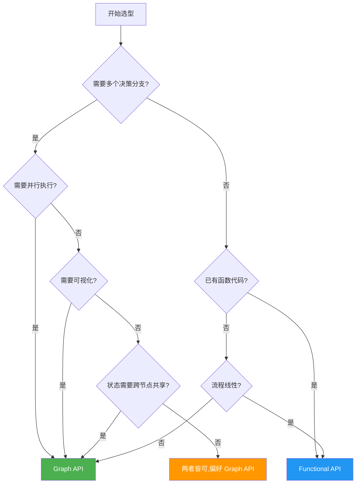
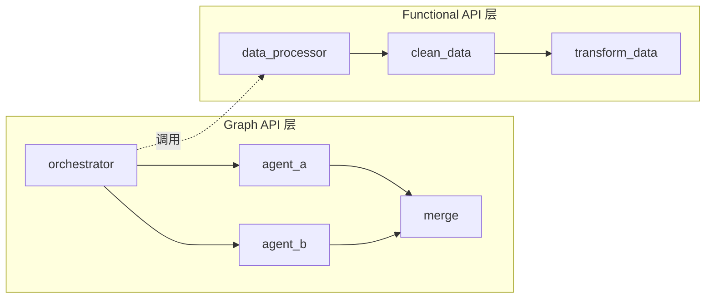

# API 选型指南

> LangGraph 提供两套 API 来构建 Agent 工作流：**Graph API** 和 **Functional API**。二者共享同一个底层运行时（Pregel），可以在同一个应用中混合使用。本篇帮你搞清楚"什么场景选哪个"。

## 前端类比：先建立直觉

如果你是前端开发者，可以这样快速建立映射：

| 前端概念 | LangGraph 对应 |
|---------|---------------|
| React 声明式组件树 | **Graph API** — 声明式定义节点、边、状态 |
| jQuery 命令式操作 | **Functional API** — 命令式的函数调用链 |
| React Router 路由表 | Graph API 的 `add_conditional_edges` |
| Express 中间件链 | Functional API 的 `@task` 链式调用 |
| Redux Store + Reducer | Graph API 的 `State` + `Annotated[..., reducer]` |
| 函数作用域局部变量 | Functional API 的函数内部状态 |

> **LangGraph 原生语义说明**：Graph API 使用 `StateGraph` 构建有向图，通过 `add_node` / `add_edge` / `add_conditional_edges` 声明工作流拓扑结构。Functional API 使用 `@entrypoint` 和 `@task` 装饰器，在普通 Python 函数中嵌入 LangGraph 的持久化、中断和流式功能。

## 快速决策指南

### 选 Graph API 的场景

- **复杂工作流可视化**：需要用图结构来调试和文档化
- **显式状态管理**：多个节点共享状态，需要 reducers 来控制状态合并
- **条件分支**：多个决策分叉点，运行时动态选择路径
- **并行执行**：多路并行后需要同步汇合
- **团队协作**：图的可视化表示方便团队理解和沟通

### 选 Functional API 的场景

- **最小代码改动**：已有的函数式代码只想加上持久化和人机协作
- **标准控制流**：if/else、for 循环、函数调用就够了
- **函数作用域状态**：状态不需要在函数间共享
- **快速原型**：少写样板代码，快速验证想法
- **线性工作流**：流程基本是顺序的，分支逻辑简单

### 决策流程图



## 详细对比

### 1. 控制流

**Graph API** — 声明式图结构：

```python
from langgraph.graph import StateGraph, START, END
from typing import TypedDict


class AgentState(TypedDict):
    messages: list
    current_tool: str
    retry_count: int


def should_continue(state: AgentState) -> str:
    """条件边函数：根据状态决定下一步"""
    if state["retry_count"] > 3:
        return "end"
    elif state["current_tool"] == "search":
        return "process_search"
    else:
        return "call_llm"


workflow = StateGraph(AgentState)
workflow.add_node("call_llm", call_llm_node)
workflow.add_node("process_search", search_node)
# 条件分支 — 像 React Router 的路由表
workflow.add_conditional_edges("call_llm", should_continue)
```

**Functional API** — 命令式控制流：

```python
from langgraph.func import entrypoint, task
from langgraph.checkpoint.memory import InMemorySaver


@task
def call_llm(messages: list) -> dict:
    # 模拟 LLM 调用
    return {"role": "ai", "content": "response"}


@task
def search(query: str) -> list:
    # 模拟搜索
    return [{"title": "result", "url": "https://..."}]


@entrypoint(checkpointer=InMemorySaver())
def agent(input_data: dict) -> dict:
    messages = input_data["messages"]
    retry_count = 0

    # 标准 Python 控制流 — 像写普通函数一样
    while retry_count < 3:
        result = call_llm(messages).result()
        if result.get("tool") == "search":
            search_results = search(result["query"]).result()
            messages.append({"role": "tool", "content": str(search_results)})
            retry_count += 1
        else:
            return {"messages": messages + [result]}

    return {"messages": messages, "error": "max retries exceeded"}
```

### 2. 状态管理

| 维度 | Graph API | Functional API |
|------|-----------|----------------|
| 状态定义 | `TypedDict` 或 `Pydantic` 显式 Schema | 函数参数 + 局部变量 |
| 状态共享 | 所有节点共享同一个 State | 函数作用域内，不跨函数共享 |
| 状态合并 | 需要 Reducers（`Annotated[list, operator.add]`） | 无需 Reducers |
| 短期记忆 | 通过 State 自动管理 | 通过 `previous` 参数访问上次返回值 |

### 3. 检查点（Checkpointing）

| 维度 | Graph API | Functional API |
|------|-----------|----------------|
| 粒度 | 每个 superstep 后生成新 checkpoint | 每个 entrypoint 调用生成一个 checkpoint |
| task 结果 | 节点执行后自动保存 | task 执行后更新到当前 checkpoint |
| Time Travel | 更细粒度，支持回退到任意 superstep | 粒度较粗，仅支持 entrypoint 级别 |

### 4. 可视化

| 维度 | Graph API | Functional API |
|------|-----------|----------------|
| Mermaid 图 | 支持，编译后可导出 | 不支持（执行流是运行时动态生成的） |
| PNG 导出 | 支持 | 不支持 |
| 调试友好度 | 图结构直观 | 需要看日志/LangSmith trace |

## 混合使用两种 API

两种 API 共享同一个 Pregel 运行时，可以在同一个应用中自由组合。

```python
from langgraph.graph import StateGraph, START, END
from langgraph.func import entrypoint, task
from typing import TypedDict


# === Functional API：简单的数据处理 ===
@task
def clean_data(raw: dict) -> dict:
    """清洗数据"""
    return {k: v.strip() if isinstance(v, str) else v for k, v in raw.items()}


@task
def transform_data(cleaned: dict) -> dict:
    """转换数据"""
    return {"transformed": True, **cleaned}


@entrypoint()
def data_processor(raw_data: dict) -> dict:
    """用 Functional API 实现简单的线性数据处理"""
    cleaned = clean_data(raw_data).result()
    transformed = transform_data(cleaned).result()
    return transformed


# === Graph API：复杂的多 Agent 协调 ===
class CoordinationState(TypedDict):
    raw_data: dict
    processed_data: dict
    agent_a_result: str
    agent_b_result: str
    final_result: str


def orchestrator_node(state: CoordinationState) -> dict:
    # 在 Graph 节点中调用 Functional API 入口
    processed = data_processor.invoke(state["raw_data"])
    return {"processed_data": processed}


def agent_a_node(state: CoordinationState) -> dict:
    return {"agent_a_result": f"A processed: {state['processed_data']}"}


def agent_b_node(state: CoordinationState) -> dict:
    return {"agent_b_result": f"B processed: {state['processed_data']}"}


def merge_node(state: CoordinationState) -> dict:
    return {
        "final_result": f"{state['agent_a_result']} + {state['agent_b_result']}"
    }


builder = StateGraph(CoordinationState)
builder.add_node("orchestrator", orchestrator_node)
builder.add_node("agent_a", agent_a_node)
builder.add_node("agent_b", agent_b_node)
builder.add_node("merge", merge_node)

builder.add_edge(START, "orchestrator")
builder.add_edge("orchestrator", "agent_a")
builder.add_edge("orchestrator", "agent_b")
builder.add_edge("agent_a", "merge")
builder.add_edge("agent_b", "merge")
builder.add_edge("merge", END)

graph = builder.compile()
```



## 迁移策略

### Functional → Graph API

当你的 Functional 工作流变得复杂（多层嵌套 if/else、需要并行、需要可视化），就该考虑迁移到 Graph API。

**迁移前（Functional API）**：

```python
@entrypoint(checkpointer=checkpointer)
def complex_workflow(input_data: dict) -> dict:
    step1 = process_step1(input_data).result()

    if step1["needs_analysis"]:
        analysis = analyze_data(step1).result()
        if analysis["confidence"] > 0.8:
            result = high_confidence_path(analysis).result()
        else:
            result = low_confidence_path(analysis).result()
    else:
        result = simple_path(step1).result()

    return result
```

**迁移后（Graph API）**：

```python
from langgraph.graph import StateGraph, START, END
from typing import TypedDict


class WorkflowState(TypedDict):
    input_data: dict
    step1_result: dict
    analysis: dict
    final_result: dict


def should_analyze(state: WorkflowState) -> str:
    if state["step1_result"]["needs_analysis"]:
        return "analyze"
    return "simple_path"


def confidence_check(state: WorkflowState) -> str:
    if state["analysis"]["confidence"] > 0.8:
        return "high_confidence"
    return "low_confidence"


workflow = StateGraph(WorkflowState)
workflow.add_node("step1", process_step1_node)
workflow.add_node("analyze", analyze_data_node)
workflow.add_node("simple_path", simple_path_node)
workflow.add_node("high_confidence", high_confidence_node)
workflow.add_node("low_confidence", low_confidence_node)

workflow.add_edge(START, "step1")
workflow.add_conditional_edges("step1", should_analyze)
workflow.add_conditional_edges("analyze", confidence_check)
workflow.add_edge("simple_path", END)
workflow.add_edge("high_confidence", END)
workflow.add_edge("low_confidence", END)
```

### Graph → Functional API

当你的 Graph 过度工程化（线性流程却用了一堆节点和边），可以简化为 Functional API。

**迁移前（过度工程化的 Graph API）**：

```python
class SimpleState(TypedDict):
    input: str
    step1: str
    step2: str
    result: str

workflow = StateGraph(SimpleState)
workflow.add_node("step1", step1_fn)
workflow.add_node("step2", step2_fn)
workflow.add_node("finalize", finalize_fn)
workflow.add_edge(START, "step1")
workflow.add_edge("step1", "step2")
workflow.add_edge("step2", "finalize")
workflow.add_edge("finalize", END)
```

**迁移后（简化的 Functional API）**：

```python
@task
def step1(data: str) -> str:
    return f"processed: {data}"

@task
def step2(data: str) -> str:
    return f"enriched: {data}"

@task
def finalize(data: str) -> str:
    return f"final: {data}"

@entrypoint(checkpointer=checkpointer)
def simple_workflow(input_data: str) -> str:
    s1 = step1(input_data).result()
    s2 = step2(s1).result()
    return finalize(s2).result()
```

## 核心特性支持对比总览

| 特性 | Graph API | Functional API |
|------|-----------|----------------|
| 持久化 (Persistence) | 支持 | 支持 |
| 流式 (Streaming) | 支持 | 支持 |
| 人机交互 (HITL) | 支持 | 支持 |
| 短期记忆 | State 自动管理 | `previous` 参数 |
| 长期记忆 | Store | Store |
| Time Travel | 细粒度 | 粗粒度 |
| 可视化 | 支持 | 不支持 |
| 子图 (Subgraphs) | 支持 | 不适用 |
| 并行执行 | 多边自动并行 | task 并发 |
| 条件分支 | `add_conditional_edges` | 标准 if/else |

## 一句话总结

> **Graph API** 是"画地图"——先画好路线图再走。
> **Functional API** 是"直接走"——写代码就是走路本身。
> 二者共享同一个运行时引擎（Pregel），选错了随时可以迁移。

---

**先修内容**：[LangGraph 思维方式](./thinking-in-langgraph) | [工作流与 Agent 模式](./workflows-agents)

**下一步**：[Graph API 概念详解](./graph-api) | [Functional API 概念详解](./functional-api)
