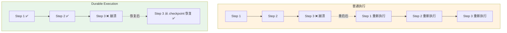
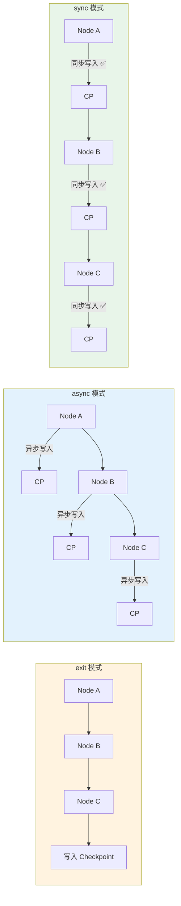
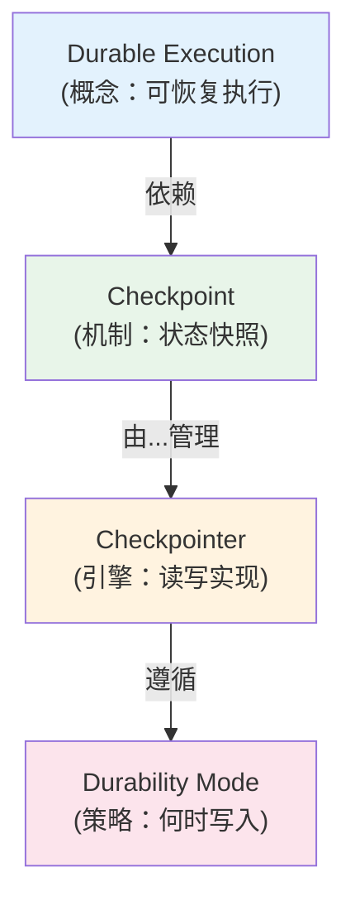

# Durable Execution（持久化执行）

> 你写的前端应用，如果浏览器突然关闭，Service Worker 可以把离线请求存下来，网络恢复后继续发送。Durable Execution 做的是同一件事，但对象换成了后端 Agent 工作流。

## 前端类比：先建立直觉

| 前端概念 | LangGraph 概念 | 说明 |
|---------|---------------|------|
| Service Worker 离线队列 | Durable Execution | 中断后从断点恢复 |
| `navigator.onLine` + retry | durability mode | 决定何时持久化 |
| IndexedDB 暂存请求体 | Checkpoint | 保存每一步的执行状态 |
| `BackgroundSync` API | 自动恢复 | 条件满足时继续执行 |

**LangGraph 原生语义**：Durable Execution 是 LangGraph 的内置能力，通过 **Checkpointer** 在每个 superstep 保存执行进度。当流程因任何原因中断（进程崩溃、LLM 超时、人工审批等待），只要 checkpoint 还在，就能从最后一个成功步骤恢复执行。

---

## 1. 什么是 Durable Execution

### 普通程序执行 vs Durable Execution



| 特性 | 普通执行 | Durable Execution |
|------|---------|-------------------|
| 崩溃后行为 | 从头开始 | 从最后 checkpoint 恢复 |
| 已完成步骤 | 全部重做 | 跳过，直接复用结果 |
| 外部副作用 | 可能重复执行 | 需要幂等设计，但不重复 |
| 长等待（如人工审批） | 阻塞进程或丢失上下文 | 暂停释放资源，随时恢复 |

### 核心价值

在 Agent 工作流中，一个完整流程可能包括：

1. 调用 LLM 生成方案
2. 调用外部 API 获取数据
3. 等待人工审批
4. 执行最终操作

任何一步都可能失败或需要等待。没有 Durable Execution，你需要自己实现复杂的状态管理和恢复逻辑。LangGraph 把这件事内置了。

---

## 2. 三种 Durability 模式

LangGraph 提供三种持久化写入策略，权衡的是**吞吐量**和**可靠性**。

### 模式概览



### `exit` 模式 — 只在流程结束时持久化

```python
from langgraph.graph import StateGraph, START, END, MessagesState
from langgraph.checkpoint.memory import InMemorySaver

builder = StateGraph(MessagesState)
# ... 添加节点和边 ...

checkpointer = InMemorySaver()
# exit 模式：只在图执行完毕后写入 checkpoint
graph = builder.compile(
    checkpointer=checkpointer,
    checkpoint_during="exit"  # 默认值取决于版本
)
```

**特点**：
- 吞吐量最高（减少 I/O 次数）
- 中间步骤崩溃无法恢复，需要重跑整个流程
- 适合低风险的批处理任务

**前端类比**：类似于只在用户点击"保存"时才写入数据库，中间编辑过程不做持久化。

### `async` 模式 — 异步持久化

```python
graph = builder.compile(
    checkpointer=checkpointer,
    checkpoint_during="async"
)
```

**特点**：
- 每个 superstep 后异步写入 checkpoint
- 不阻塞主执行流，性能接近 exit 模式
- 极端场景（写入未完成就崩溃）可能丢失最后一步
- 大多数生产场景的默认合理选择

**前端类比**：类似于 `navigator.sendBeacon()` — 发出去就继续执行，不等响应。

### `sync` 模式 — 同步持久化

```python
graph = builder.compile(
    checkpointer=checkpointer,
    checkpoint_during="sync"
)
```

**特点**：
- 每个 superstep 后同步写入 checkpoint，确认成功后才继续
- 可靠性最高，任何时刻崩溃都能精确恢复
- 性能开销最大（每步都等 I/O）
- 适合高价值事务链路（如涉及资金、不可逆操作）

**前端类比**：类似于每次 state 变更都调用 `await fetch('/api/save', { body: state })` 等待返回后才继续。

### 模式选型指南

| 场景 | 推荐模式 | 理由 |
|------|---------|------|
| 本地开发/测试 | `exit` | 快速迭代，不需要中间恢复 |
| 一般生产工作流 | `async` | 性能和可靠性均衡 |
| 涉及资金/不可逆操作 | `sync` | 任何一步都不能丢失 |
| 批量数据处理 | `exit` | 失败重跑代价低，追求吞吐 |
| 人工审批流程 | `sync` | 中断恢复必须精确 |

---

## 3. 失败恢复与重试语义

### 自动恢复机制

当使用 Durable Execution 时，恢复流程如下：

```python
from langgraph.graph import StateGraph, START, END, MessagesState
from langgraph.checkpoint.memory import InMemorySaver
from langchain.chat_models import init_chat_model

model = init_chat_model("gpt-4.1-mini")

def call_llm(state: MessagesState):
    """这个节点可能因为 LLM 超时而失败"""
    response = model.invoke(state["messages"])
    return {"messages": [response]}

def process_result(state: MessagesState):
    """后处理节点"""
    return {"messages": [{"role": "assistant", "content": "处理完成"}]}

builder = StateGraph(MessagesState)
builder.add_node("llm", call_llm)
builder.add_node("process", process_result)
builder.add_edge(START, "llm")
builder.add_edge("llm", "process")
builder.add_edge("process", END)

checkpointer = InMemorySaver()
graph = builder.compile(checkpointer=checkpointer)

config = {"configurable": {"thread_id": "task-001"}}

# 第一次执行 — 假设在 "process" 节点崩溃了
try:
    result = graph.invoke(
        {"messages": [{"role": "user", "content": "帮我分析这段代码"}]},
        config
    )
except Exception:
    print("执行失败，但 checkpoint 已保存到 'llm' 节点完成后")

# 恢复执行 — 传入 None 表示从 checkpoint 继续
# LangGraph 会自动跳过已完成的 "llm" 节点，直接从 "process" 开始
result = graph.invoke(None, config)
```

### 幂等性设计原则

Durable Execution 的一个关键要求是**节点操作的幂等性**。因为恢复时，正在执行的那个节点会被重新执行。

```python
# ❌ 非幂等 — 恢复时会重复发送邮件
def send_email_bad(state):
    send_email(to=state["email"], body=state["content"])
    return {"email_sent": True}

# ✅ 幂等 — 先检查是否已发送
def send_email_good(state):
    if not state.get("email_sent"):
        send_email(to=state["email"], body=state["content"])
    return {"email_sent": True}

# ✅ 更好的做法 — 使用幂等键
def send_email_best(state):
    idempotency_key = f"email-{state['thread_id']}-{state['step']}"
    send_email_with_idempotency(
        to=state["email"],
        body=state["content"],
        idempotency_key=idempotency_key
    )
    return {"email_sent": True}
```

**前端类比**：这类似于前端处理表单提交时的防重复逻辑——按钮点击后 disable，或者给请求加上幂等 token。

---

## 4. 与 Checkpoint 的关系

Durable Execution 是**概念**，Checkpoint 是**实现机制**。



关系链：
1. **Durable Execution** 需要在关键点保存进度 → 使用 **Checkpoint**
2. **Checkpoint** 需要读写存储 → 使用 **Checkpointer**（InMemory/SQLite/Postgres）
3. **Checkpointer** 需要知道何时写入 → 遵循 **Durability Mode**（exit/async/sync）

---

## 5. 完整示例：带容错的多步工作流

```python
from langgraph.graph import StateGraph, START, END
from langgraph.checkpoint.memory import InMemorySaver
from typing import TypedDict

class WorkflowState(TypedDict):
    task: str
    research_result: str
    draft: str
    final_output: str

def research(state: WorkflowState):
    """步骤 1：研究调查（可能因 API 超时失败）"""
    # 模拟外部 API 调用
    result = f"关于'{state['task']}'的研究结果：..."
    return {"research_result": result}

def draft(state: WorkflowState):
    """步骤 2：撰写草稿"""
    content = f"基于研究 [{state['research_result'][:20]}...] 撰写的草稿"
    return {"draft": content}

def finalize(state: WorkflowState):
    """步骤 3：最终输出"""
    return {"final_output": f"最终版本：{state['draft']}"}

builder = StateGraph(WorkflowState)
builder.add_node("research", research)
builder.add_node("draft", draft)
builder.add_node("finalize", finalize)

builder.add_edge(START, "research")
builder.add_edge("research", "draft")
builder.add_edge("draft", "finalize")
builder.add_edge("finalize", END)

# 使用 sync 模式确保每步都持久化
checkpointer = InMemorySaver()
graph = builder.compile(checkpointer=checkpointer)

config = {"configurable": {"thread_id": "report-task-42"}}

# 执行（如果中间失败，重新 invoke 同一个 thread_id 即可恢复）
result = graph.invoke({"task": "分析 LangGraph 架构"}, config)
print(result["final_output"])

# 查看执行历史，验证每步都有 checkpoint
for state in graph.get_state_history(config):
    step = state.metadata.get("step", "?")
    source = state.metadata.get("source", "?")
    print(f"  Step {step} ({source}): next={state.next}")
```

---

## 6. 生产环境注意事项

### Checkpoint 清理策略

长期运行的系统会积累大量 checkpoint，需要定期清理：

```python
# 策略 1：只保留每个 thread 的最近 N 个 checkpoint
# 策略 2：超过一定时间的 checkpoint 自动归档
# 策略 3：已成功完成的 thread 只保留最终 checkpoint

# 注意：LangGraph 本身不提供自动清理，需要你在 Checkpointer 层实现
# PostgresSaver 可以通过 SQL 定时任务来清理
```

### 状态体积控制

Checkpoint 保存的是完整状态，如果状态里包含大量文本（如长消息历史），会显著增加存储开销：

```python
# ❌ 状态中存储大量原始数据
class BadState(TypedDict):
    raw_documents: list[str]  # 可能有几 MB

# ✅ 状态中只存储引用，大数据放在外部
class GoodState(TypedDict):
    document_ids: list[str]  # 只存 ID
    summary: str             # 只存摘要
```

### 监控建议

- 监控 checkpoint 写入延迟（尤其是 sync 模式）
- 监控 checkpoint 存储体积增长
- 对 failed thread 设置告警，定期检查需要恢复的任务

---

## 要点回顾

| 概念 | 一句话 |
|------|--------|
| Durable Execution | 保存执行进度，中断后从断点恢复，不从头开始 |
| `exit` 模式 | 只在流程结束时保存，吞吐高但不能中间恢复 |
| `async` 模式 | 异步保存，性能与可靠性平衡 |
| `sync` 模式 | 同步保存，可靠性最高但有性能开销 |
| 幂等性 | 节点操作必须设计为可重复执行而无副作用 |

---

## 先修与下一步

- **先修**：[持久化](/ai/langgraph/guide/persistence)
- **下一步**：[Streaming 流式处理](/ai/langgraph/guide/streaming) | [Interrupts (HITL)](/ai/langgraph/guide/interrupts)
