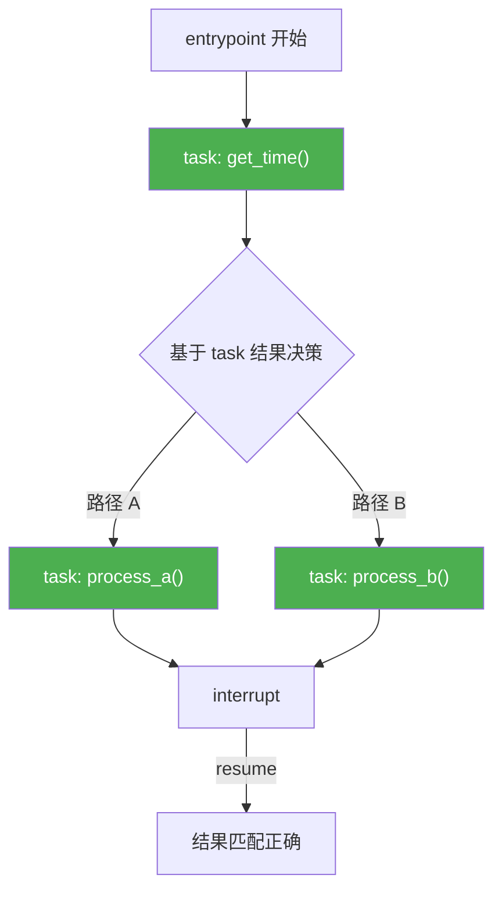
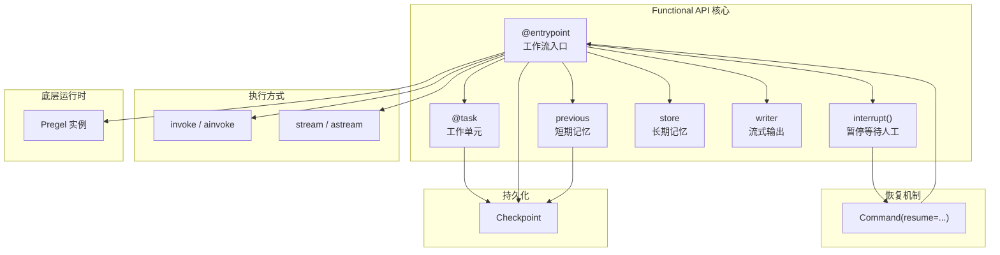

# Functional API 概念详解

> Functional API 让你用**最少的代码改动**把 LangGraph 的核心能力（持久化、人机交互、流式、记忆）集成到现有代码中。不需要定义图结构，不需要管理显式状态，用标准的 Python 控制流（if/else、for 循环、函数调用）就够了。

## 两个核心构建块

Functional API 只有两个装饰器：

| 构建块 | 作用 | 前端类比 |
|--------|------|---------|
| `@entrypoint` | 工作流入口，管理执行流程、中断和检查点 | Next.js 的 `page.tsx` — 页面入口 |
| `@task` | 离散的工作单元，可异步执行，结果可持久化 | React Query 的 `useQuery` — 封装异步操作 |

> **LangGraph 原生语义说明**：`@entrypoint` 装饰器将函数转化为一个 `Pregel` 实例，它获得 `invoke` / `stream` / `ainvoke` / `astream` 等执行方法。`@task` 将函数标记为可检查点化的工作单元，调用时返回一个 future 对象。

```python
from langgraph.func import entrypoint, task
from langgraph.checkpoint.memory import InMemorySaver


@task
def fetch_data(url: str) -> dict:
    """离散工作单元：获取数据"""
    # 模拟 API 调用
    return {"data": f"来自 {url} 的数据"}


@entrypoint(checkpointer=InMemorySaver())
def my_workflow(input_data: dict) -> dict:
    """工作流入口：编排多个 task"""
    result = fetch_data(input_data["url"]).result()
    return {"output": result}
```

## 与 Graph API 的对比

### 控制流

- **Graph API**：需要思考图结构，用 `add_node` / `add_edge` / `add_conditional_edges` 声明拓扑
- **Functional API**：用标准 Python 语法。`if/else` 就是条件分支，`for` 循环就是迭代，函数调用就是子流程

```python
# Functional API：标准 Python 控制流
@entrypoint(checkpointer=checkpointer)
def process_order(order: dict) -> dict:
    validated = validate_order(order).result()

    if validated["is_valid"]:
        if validated["total"] > 1000:
            result = vip_processing(validated).result()
        else:
            result = standard_processing(validated).result()
    else:
        result = reject_order(validated).result()

    return result
```

### 状态管理

- **Graph API**：需要声明 State（`TypedDict` / `Pydantic`），可能需要定义 Reducers
- **Functional API**：状态就是函数的局部变量和参数，不需要显式 schema

### Checkpointing

- **Graph API**：每个 superstep 后生成新的 checkpoint，粒度更细
- **Functional API**：每个 entrypoint 调用对应一个 checkpoint，task 结果保存到当前 checkpoint 中而不是创建新 checkpoint

### 可视化

- **Graph API**：编译后可导出 Mermaid / PNG 图
- **Functional API**：**不支持**可视化，因为执行流是运行时动态生成的

```mermaid
flowchart LR
    subgraph "Graph API"
        direction TB
        A1[声明式定义] --> A2[compile 编译]
        A2 --> A3[静态图结构]
        A3 --> A4[每 superstep 一个 checkpoint]
    end

    subgraph "Functional API"
        direction TB
        B1[命令式代码] --> B2[@entrypoint 装饰]
        B2 --> B3[运行时动态流]
        B3 --> B4[每 entrypoint 一个 checkpoint]
    end
```

## 完整示例：Essay Writer + HITL Review

```python
import time
import uuid
from langgraph.func import entrypoint, task
from langgraph.types import interrupt, Command
from langgraph.checkpoint.memory import InMemorySaver


@task
def write_essay(topic: str) -> str:
    """写一篇关于指定主题的文章"""
    time.sleep(1)  # 模拟耗时操作
    return f"关于 {topic} 的深度文章：\n\n{topic} 是当代最重要的议题之一..."


@entrypoint(checkpointer=InMemorySaver())
def essay_workflow(topic: str) -> dict:
    """写文章 → 人工审核 → 返回结果"""

    # Step 1: 写文章（结果会被持久化）
    essay = write_essay(topic).result()

    # Step 2: 中断，等待人工审核
    review = interrupt({
        "essay": essay,
        "action": "请审核这篇文章。回复 'approve' 或修改意见。",
    })

    # Step 3: 根据审核结果处理
    return {
        "essay": essay,
        "review": review,
        "status": "approved" if review == "approve" else "revised",
    }


# === 执行流程 ===

# 1. 启动工作流
thread_id = str(uuid.uuid4())
config = {"configurable": {"thread_id": thread_id}}

for chunk in essay_workflow.stream("人工智能的未来", config):
    print(chunk)
# 输出:
# {'write_essay': '关于 人工智能的未来 的深度文章：...'}
# {'__interrupt__': (Interrupt(value={'essay': '...', 'action': '...'}),)}

# 2. 恢复工作流（传入人工审核结果）
for chunk in essay_workflow.stream(Command(resume="approve"), config):
    print(chunk)
# 输出:
# {'essay_workflow': {'essay': '...', 'review': 'approve', 'status': 'approved'}}
```

**关键点**：当工作流恢复时，它从头开始执行。但由于 `write_essay` 的结果已经保存在 checkpoint 中，task 不会被重新执行，而是直接从 checkpoint 加载之前的结果。

## Entrypoint 详解

### 定义

`@entrypoint` 将普通函数转换为 LangGraph 工作流。函数**必须接受单个位置参数**作为输入。

```python
from langgraph.func import entrypoint

# 同步版本
@entrypoint(checkpointer=checkpointer)
def my_workflow(input_data: dict) -> dict:
    # 工作流逻辑
    return {"result": "done"}


# 异步版本
@entrypoint(checkpointer=checkpointer)
async def async_workflow(input_data: dict) -> dict:
    # 异步工作流逻辑
    return {"result": "done"}
```

> **重要**：输入参数必须是单个参数。如果需要传多个值，用字典包装。

### 可注入参数

`@entrypoint` 函数可以声明额外的参数，运行时自动注入：

```python
from typing import Any
from langchain_core.runnables import RunnableConfig
from langgraph.func import entrypoint
from langgraph.store.base import BaseStore
from langgraph.store.memory import InMemoryStore
from langgraph.checkpoint.memory import InMemorySaver
from langgraph.types import StreamWriter


checkpointer = InMemorySaver()
store = InMemoryStore()


@entrypoint(checkpointer=checkpointer, store=store)
def full_workflow(
    input_data: dict,           # 必须：工作流输入
    *,
    previous: Any = None,       # 可选：上次调用的返回值（短期记忆）
    store: BaseStore,           # 可选：长期记忆存储
    writer: StreamWriter,       # 可选：自定义流式输出
    config: RunnableConfig,     # 可选：运行时配置
) -> dict:
    # previous 包含上次同 thread_id 的返回值
    print(f"上次结果: {previous}")

    # store 可以跨线程持久化数据
    store.put(("user", "preferences"), "theme", {"value": "dark"})

    # writer 可以发送自定义流式数据
    writer({"progress": "50%"})

    # config 包含运行时配置
    thread_id = config["configurable"]["thread_id"]

    return {"result": "processed", "thread": thread_id}
```

| 参数 | 类型 | 用途 |
|------|------|------|
| `previous` | `Any` | 同一 thread_id 上次调用的返回值，实现短期记忆 |
| `store` | `BaseStore` | 长期记忆存储，支持跨线程持久化和语义搜索 |
| `writer` | `StreamWriter` | 自定义流式输出（Python < 3.11 的 async 场景必须用） |
| `config` | `RunnableConfig` | 访问运行时配置（thread_id 等） |

### 执行

`@entrypoint` 装饰后的函数变成 `Pregel` 实例，支持四种执行方式：

```python
config = {"configurable": {"thread_id": "my-thread"}}

# 1. 同步完整返回
result = my_workflow.invoke(input_data, config)

# 2. 异步完整返回
result = await my_workflow.ainvoke(input_data, config)

# 3. 同步流式
for chunk in my_workflow.stream(input_data, config):
    print(chunk)

# 4. 异步流式
async for chunk in my_workflow.astream(input_data, config):
    print(chunk)
```

### 恢复（interrupt 后 resume）

当工作流被 `interrupt` 暂停后，使用 `Command(resume=...)` 恢复：

```python
from langgraph.types import Command

# 传入恢复值
result = my_workflow.invoke(Command(resume="user_response"), config)

# 流式恢复
for chunk in my_workflow.stream(Command(resume="user_response"), config):
    print(chunk)

# 从错误中恢复（传 None 表示重试）
result = my_workflow.invoke(None, config)
```

### 短期记忆（previous 参数）

`previous` 参数让你访问同一 thread 上次调用的返回值，实现跨调用的状态累积：

```python
@entrypoint(checkpointer=InMemorySaver())
def counter(number: int, *, previous: Any = None) -> int:
    """每次调用累加"""
    previous = previous or 0
    return number + previous


config = {"configurable": {"thread_id": "counter-thread"}}

counter.invoke(1, config)   # 返回 1（previous 是 None）
counter.invoke(2, config)   # 返回 3（previous 是 1）
counter.invoke(10, config)  # 返回 13（previous 是 3）
```

> **前端类比**：`previous` 类似 React 的 `useRef` 或 `useState` 的 prevState。它让函数在无状态的调用模型中保持跨调用的状态。
>
> **LangGraph 原生语义**：`previous` 的值来自 checkpoint。每次 entrypoint 执行完毕，返回值会被保存到 checkpoint。下次同 thread_id 调用时，从 checkpoint 加载作为 `previous`。

### entrypoint.final（解耦返回值与 checkpoint）

默认情况下，`previous` 等于上次的返回值。但有时你想返回给调用者的值和保存到 checkpoint 的值不同：

```python
from typing import Any


@entrypoint(checkpointer=InMemorySaver())
def smart_counter(
    number: int,
    *,
    previous: Any = None,
) -> entrypoint.final[int, int]:
    """
    返回值类型: entrypoint.final[返回类型, 保存类型]
    """
    previous = previous or 0

    # value: 返回给调用者的值
    # save: 保存到 checkpoint 的值（下次作为 previous）
    return entrypoint.final(
        value=previous,          # 返回上次保存的值
        save=2 * number,         # 保存 2 * number 到 checkpoint
    )


config = {"configurable": {"thread_id": "smart-thread"}}

smart_counter.invoke(3, config)   # 返回 0（previous 是 None），保存 6
smart_counter.invoke(1, config)   # 返回 6（previous 是 6），保存 2
smart_counter.invoke(5, config)   # 返回 2（previous 是 2），保存 10
```

> **前端类比**：这类似 React 的 `useReducer` 返回 state 但 dispatch 的 action 可以不同。或者类比 Redux 的 selector — 你暴露给组件的状态切片和存储在 store 中的完整状态可以不同。

## Task 详解

### 定义

`@task` 将函数标记为可检查点化的工作单元：

```python
from langgraph.func import task


@task
def process_data(data: dict) -> dict:
    """同步 task"""
    return {"processed": True, **data}


@task
async def async_fetch(url: str) -> str:
    """异步 task"""
    # 模拟异步 HTTP 请求
    import asyncio
    await asyncio.sleep(0.1)
    return f"Response from {url}"


@task(name="custom_name", retry=RetryPolicy(max_attempts=3))
def robust_task(input_val: str) -> str:
    """带自定义名称和重试策略的 task"""
    return f"processed: {input_val}"
```

### 执行

Task **只能在 entrypoint 或 StateGraph 节点中调用**，不能直接在主代码中调用。调用时立即返回一个 future 对象：

```python
# 同步：使用 .result() 获取结果
@entrypoint(checkpointer=checkpointer)
def sync_workflow(data: dict) -> dict:
    future = process_data(data)        # 立即返回 future
    result = future.result()           # 阻塞等待结果
    return result


# 异步：使用 await
@entrypoint(checkpointer=checkpointer)
async def async_workflow(data: dict) -> dict:
    result = await process_data(data)  # 异步等待结果
    return result


# 并行执行多个 task
@entrypoint(checkpointer=checkpointer)
def parallel_workflow(urls: list[str]) -> list[str]:
    # 同时启动所有 task
    futures = [async_fetch(url) for url in urls]
    # 等待所有结果
    results = [f.result() for f in futures]
    return results
```

### 何时使用 task

| 场景 | 是否需要 @task | 原因 |
|------|--------------|------|
| **耗时 API 调用** | 是 | 结果持久化，恢复时不重复调用 |
| **人机交互前的操作** | 是 | 确保 interrupt 恢复后的确定性 |
| **并行 I/O** | 是 | task 支持并行执行 |
| **可观测性** | 是 | task 执行会被 LangSmith 追踪 |
| **可重试的操作** | 是 | task 支持重试策略 |
| **纯计算（无副作用）** | 可选 | 简单计算不一定需要 task |
| **快速的同步操作** | 可选 | 开销太大可能不值得 |

## 序列化要求

**entrypoint 的输入和输出**、**task 的输出**都必须是 JSON 可序列化的，因为它们需要保存到 checkpoint。

```python
# 可以的类型：
# - dict, list, str, int, float, bool, None
# - 嵌套组合

# 不行的类型：
# - 自定义类实例（除非实现了序列化）
# - 函数、lambda
# - 文件对象、数据库连接

@task
def good_task(data: dict) -> dict:
    return {"result": "serializable"}  # OK

@task
def bad_task(data: dict) -> object:
    return SomeCustomClass()  # RuntimeError!
```

## 确定性（Determinism）

为了正确支持人机交互（interrupt/resume），工作流的执行路径必须是**确定性的**。

**核心规则**：所有随机性（如 API 调用、随机数、当前时间）都应该封装在 `@task` 中。



**为什么？** 当工作流从 interrupt 恢复时，它会从头开始执行，但已完成的 task 结果会从 checkpoint 加载。如果控制流不确定（比如基于 `time.time()` 的判断），恢复后可能走不同的路径，导致 interrupt 和 resume 值的索引错位。

```python
# 错误示范：非确定性控制流
@entrypoint(checkpointer=checkpointer)
def bad_workflow(inputs: dict) -> dict:
    t = time.time()  # 每次执行都不同！
    if t % 2 > 1:
        result = task_a(inputs).result()
    else:
        result = task_b(inputs).result()
    value = interrupt("question")  # 可能匹配到错误的 resume 值
    return {"result": result, "value": value}


# 正确做法：把非确定性操作放入 task
@task
def get_current_time() -> float:
    return time.time()

@entrypoint(checkpointer=checkpointer)
def good_workflow(inputs: dict) -> dict:
    t = get_current_time().result()  # 结果被持久化
    if t % 2 > 1:
        result = task_a(inputs).result()
    else:
        result = task_b(inputs).result()
    value = interrupt("question")  # 恢复时路径相同
    return {"result": result, "value": value}
```

## 幂等性（Idempotency）

Task 可能因为故障被重新执行。设计 task 时要确保多次执行产生相同结果：

```python
@task
def create_order(order_data: dict) -> dict:
    """幂等的订单创建"""
    order_id = order_data["order_id"]

    # 先检查是否已存在
    existing = db.get_order(order_id)
    if existing:
        return existing  # 已存在就直接返回

    # 不存在才创建
    return db.create_order(order_data)
```

## 常见陷阱

### 副作用处理

副作用（写文件、发邮件、调 API）必须封装在 `@task` 中，否则恢复时会重复执行：

```python
# 错误：副作用直接写在 entrypoint 中
@entrypoint(checkpointer=checkpointer)
def bad_workflow(inputs: dict) -> int:
    # 这行代码在 resume 时会再次执行！
    with open("output.txt", "w") as f:
        f.write("Side effect executed")

    value = interrupt("question")
    return value


# 正确：副作用封装在 task 中
@task
def write_to_file(content: str) -> str:
    with open("output.txt", "w") as f:
        f.write(content)
    return "written"

@entrypoint(checkpointer=checkpointer)
def good_workflow(inputs: dict) -> int:
    write_to_file("Side effect executed").result()  # 结果被缓存
    value = interrupt("question")
    return value
```

### 非确定性控制流

避免在 entrypoint 的顶层使用非确定性表达式来控制流程：

```python
import random

# 错误：random 在 entrypoint 中，每次恢复可能走不同路径
@entrypoint(checkpointer=checkpointer)
def bad_workflow(inputs: dict) -> dict:
    if random.random() > 0.5:  # 非确定性！
        a = task_a(inputs).result()
        interrupt("review a")
    else:
        b = task_b(inputs).result()
        interrupt("review b")


# 正确：把 random 放进 task
@task
def make_decision() -> bool:
    return random.random() > 0.5

@entrypoint(checkpointer=checkpointer)
def good_workflow(inputs: dict) -> dict:
    decision = make_decision().result()  # 结果被缓存
    if decision:
        a = task_a(inputs).result()
        interrupt("review a")
    else:
        b = task_b(inputs).result()
        interrupt("review b")
```

## 概念全景图



---

**先修内容**：[API 选型指南](./choosing-apis) | [Graph API 概念详解](./graph-api)

**下一步**：[Functional API 实战指南](./use-functional-api) | [Runtime (Pregel)](./runtime)
