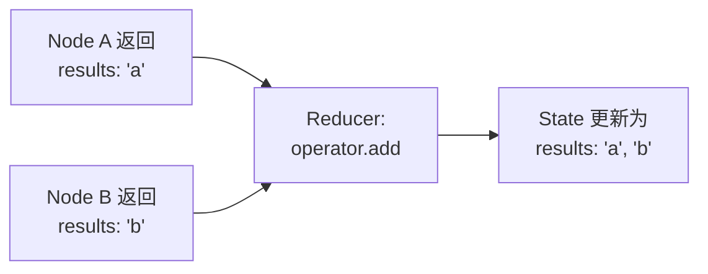
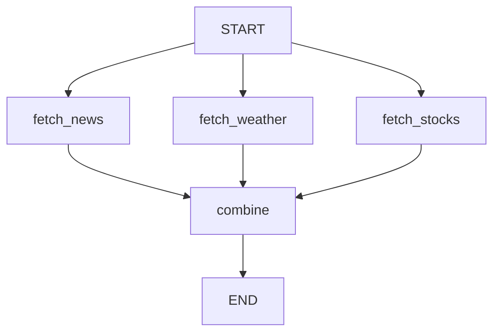
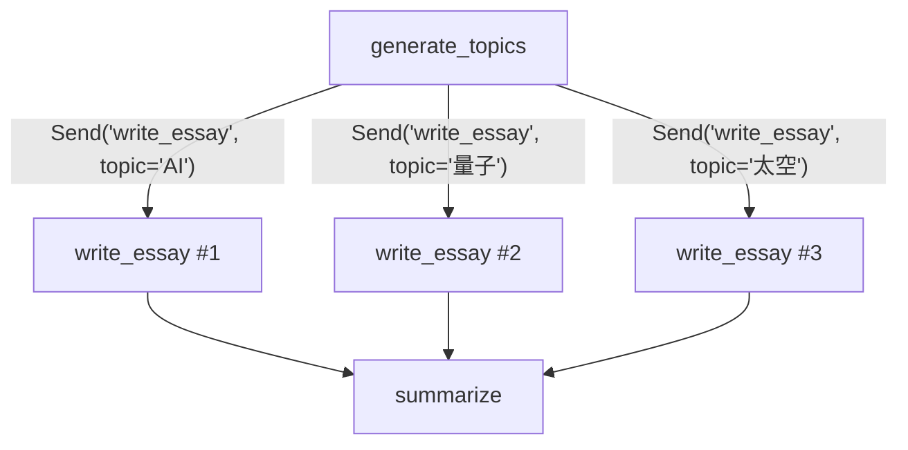
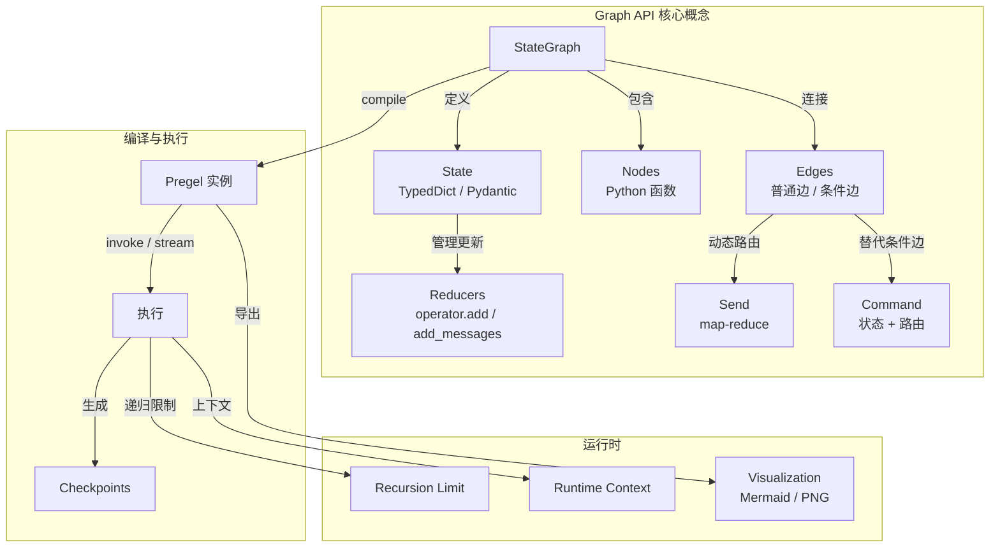

# Graph API 概念详解

> Graph API 是 LangGraph 的声明式工作流构建方式。你通过定义节点（Nodes）、边（Edges）和共享状态（State）来描述一个有向图，然后编译执行。本篇完整拆解 Graph API 的每一个核心概念。

## 前端类比总览

在深入之前，先建立一个完整的概念映射：

| Graph API 概念 | 前端类比 | 相似度 |
|---------------|---------|-------|
| **State** | Redux Store | 高 — 都是集中式状态容器 |
| **Node** | Express Middleware | 高 — 接收状态 → 处理 → 返回更新 |
| **Edge** | React Router | 中 — 决定下一步去哪个节点 |
| **Reducer** | Redux Reducer | 高 — 决定状态如何合并更新 |
| **START/END** | 路由的入口和 404 页面 | 低 — 只是图的边界标记 |
| **Compile** | Webpack Build | 中 — 把声明式定义编译为可执行实例 |

> **LangGraph 原生语义说明**：Graph API 的核心抽象是 `StateGraph`。它把工作流建模为一个有向图，其中节点是计算单元（Python 函数），边决定执行顺序，状态是所有节点共享的数据结构。编译（`compile()`）后生成一个 `Pregel` 实例，负责实际执行。

[🔗 StateGraph API 参考](https://langchain-ai.github.io/langgraph/reference/graphs/#langgraph.graph.StateGraph){target="_blank" rel="noopener"}

## Graphs

### StateGraph

`StateGraph` 是 Graph API 的入口。你用它来定义图的结构，然后编译成可执行的 Pregel 实例。

```python
from langgraph.graph import StateGraph, START, END
from typing import TypedDict


class MyState(TypedDict):
    user_input: str
    result: str


# 创建图构建器
builder = StateGraph(MyState)

# 添加节点和边...
builder.add_node("process", process_fn)
builder.add_edge(START, "process")
builder.add_edge("process", END)

# 编译 — 生成 Pregel 实例
graph = builder.compile()
```

### 编译

`compile()` 做了什么？

1. 验证图结构的完整性（所有节点都可达、没有悬空边）
2. 将声明式的图定义转换为 Pregel 运行时的 actors 和 channels
3. 返回一个 `CompiledGraph`（Pregel 实例），支持 `invoke` / `stream` / `ainvoke` / `astream`

```python
# 编译时可以挂载 checkpointer
from langgraph.checkpoint.memory import InMemorySaver

graph = builder.compile(checkpointer=InMemorySaver())

# 也可以指定中断点
graph = builder.compile(
    checkpointer=InMemorySaver(),
    interrupt_before=["human_review"],  # 在 human_review 节点前中断
)
```

## State

### Schema 定义

State 是图中所有节点共享的数据结构。推荐用 `TypedDict` 或 Pydantic `BaseModel` 定义。

```python
from typing import TypedDict, Annotated
from langgraph.graph import MessagesState


# 方式 1：TypedDict（最常用）
class TicketState(TypedDict):
    user_input: str
    category: str
    priority: int
    draft_reply: str
    final_reply: str


# 方式 2：继承 MessagesState（聊天场景）
class ChatState(MessagesState):
    """自动包含 messages 字段和 add_messages reducer"""
    session_tag: str
    user_id: str


# 方式 3：Pydantic BaseModel
from pydantic import BaseModel

class StrictState(BaseModel):
    """Pydantic 提供运行时类型验证"""
    query: str
    results: list[str] = []
    score: float = 0.0
```

> **前端类比**：`TypedDict` 像 TypeScript 的 `interface`，只做类型提示不做运行时校验。`BaseModel` 像 `zod.object()`，运行时会校验数据类型。

### Reducers

Reducer 决定了"当多个节点同时更新同一个字段时，该怎么合并"。

```python
import operator
from typing import Annotated, TypedDict
from langgraph.graph import add_messages


class ParallelState(TypedDict):
    # 默认行为：后写覆盖（last-write-wins）
    current_step: str

    # operator.add：列表拼接（适合并行节点汇总结果）
    results: Annotated[list[str], operator.add]

    # add_messages：消息列表的智能合并
    # 会处理消息 ID 去重、格式转换等
    messages: Annotated[list, add_messages]
```

> **前端类比**：这和 Redux 的 reducer 概念几乎一模一样。Redux 中你写 `case 'ADD_TODO': return [...state, action.payload]`，在 LangGraph 中你用 `Annotated[list, operator.add]` 达到同样效果。区别在于 LangGraph 的 reducer 是声明式的，不用写 switch-case。

**Reducer 工作流程**：



### 使用 Messages

对于聊天/对话类应用，LangGraph 提供了内置的 `MessagesState`：

```python
from langgraph.graph import MessagesState, StateGraph, START, END


def chatbot(state: MessagesState) -> dict:
    # state["messages"] 是消息列表
    last_message = state["messages"][-1]
    return {
        "messages": [
            {"role": "ai", "content": f"你说了: {last_message['content']}"}
        ]
    }


builder = StateGraph(MessagesState)
builder.add_node("chatbot", chatbot)
builder.add_edge(START, "chatbot")
builder.add_edge("chatbot", END)
graph = builder.compile()

result = graph.invoke({
    "messages": [{"role": "user", "content": "你好"}]
})
```

`MessagesState` 内置了 `add_messages` reducer，它会：
- 自动处理消息格式转换（dict → Message 对象）
- 按消息 ID 去重
- 支持消息更新（同 ID 覆盖）

## Nodes

### 节点函数

节点是普通的 Python 函数，接收当前 State，返回状态更新（部分更新即可）。

```python
def classify(state: TicketState) -> dict:
    """节点函数：接收完整 state，返回部分更新"""
    text = state["user_input"]
    category = "billing" if "发票" in text else "general"
    # 只返回需要更新的字段
    return {"category": category}


def draft_reply(state: TicketState) -> dict:
    return {
        "draft_reply": f"关于您的{state['category']}问题，我们已收到。"
    }
```

> **前端类比**：节点函数就像 Express 的中间件。`(req, res, next)` 对应 `(state) -> partial_update`。每个中间件只关心自己的职责，处理完后把结果传给下一个。

### START 和 END 节点

`START` 和 `END` 是特殊的虚拟节点：

- `START`：图的入口，不执行任何逻辑
- `END`：图的出口，标记流程结束

```python
from langgraph.graph import START, END

builder.add_edge(START, "first_node")    # 入口 → 第一个节点
builder.add_edge("last_node", END)       # 最后一个节点 → 出口
```

### 节点缓存

节点可以配置缓存策略，避免重复计算：

```python
from langgraph.types import CachePolicy

builder.add_node(
    "expensive_computation",
    expensive_fn,
    cache_policy=CachePolicy(ttl=300),  # 缓存 5 分钟
)
```

## Edges

### 普通边

普通边定义固定的执行顺序：

```python
# 线性流程
builder.add_edge(START, "step1")
builder.add_edge("step1", "step2")
builder.add_edge("step2", "step3")
builder.add_edge("step3", END)

# 快捷方式：add_sequence（v0.3+）
builder.add_sequence(["step1", "step2", "step3"])
```

### 条件边

条件边根据当前状态动态决定下一步去哪个节点：

```python
def route_by_category(state: TicketState) -> str:
    """路由函数：返回目标节点名称"""
    if state["category"] == "billing":
        return "billing_handler"
    elif state["category"] == "technical":
        return "tech_handler"
    else:
        return "general_handler"


builder.add_conditional_edges(
    "classify",               # 源节点
    route_by_category,        # 路由函数
    {                         # 可选：显式映射（用于可视化）
        "billing_handler": "billing_handler",
        "tech_handler": "tech_handler",
        "general_handler": "general_handler",
    }
)
```

> **前端类比**：条件边就像 React Router 的动态路由。`route_by_category` 相当于 `<Route>` 的 `match` 逻辑，根据当前 URL（状态）决定渲染哪个组件（节点）。

### 入口点和条件入口点

你可以定义多个入口点，让图从不同节点开始执行：

```python
# 固定入口：所有请求都走 step1
builder.add_edge(START, "step1")

# 条件入口：根据输入决定从哪个节点开始
def route_entry(state: TicketState) -> str:
    if state.get("is_vip"):
        return "vip_handler"
    return "normal_handler"

builder.add_conditional_edges(START, route_entry)
```

### 并行边

从一个节点出发定义多条边，目标节点会并行执行：

```python
# fetch_news、fetch_weather、fetch_stocks 并行执行
builder.add_edge(START, "fetch_news")
builder.add_edge(START, "fetch_weather")
builder.add_edge(START, "fetch_stocks")

# 三者都完成后再执行 combine
builder.add_edge("fetch_news", "combine")
builder.add_edge("fetch_weather", "combine")
builder.add_edge("fetch_stocks", "combine")
builder.add_edge("combine", END)
```



## Send

`Send` 用于实现 **map-reduce** 模式：动态地将不同的输入发送到同一个节点的多个实例。[🔗 Send API 与 map-reduce 模式](https://langchain-ai.github.io/langgraph/how-tos/map-reduce/){target="_blank" rel="noopener"}

```python
from langgraph.types import Send
from typing import Annotated
import operator


class OverallState(TypedDict):
    topics: list[str]
    essays: Annotated[list[str], operator.add]


class EssayState(TypedDict):
    topic: str


def generate_topics(state: OverallState) -> dict:
    return {"topics": ["AI 的未来", "量子计算", "太空探索"]}


def continue_to_essays(state: OverallState) -> list[Send]:
    """为每个 topic 动态创建一个 Send，发送到 write_essay 节点"""
    return [
        Send("write_essay", {"topic": topic})
        for topic in state["topics"]
    ]


def write_essay(state: EssayState) -> dict:
    return {"essays": [f"关于 {state['topic']} 的文章..."]}


builder = StateGraph(OverallState)
builder.add_node("generate_topics", generate_topics)
builder.add_node("write_essay", write_essay)
builder.add_node("summarize", summarize_fn)

builder.add_edge(START, "generate_topics")
# 条件边返回 Send 列表，实现动态 fan-out
builder.add_conditional_edges("generate_topics", continue_to_essays)
builder.add_edge("write_essay", "summarize")
builder.add_edge("summarize", END)
```



> **前端类比**：`Send` 类似 `Promise.all(items.map(item => fetch(item)))`。你把一个列表展开成多个并行任务，每个任务独立处理，最后通过 reducer 汇总结果。

## Command

`Command` 是一个强大的原语，可以**同时**完成状态更新和路由控制。它可以替代某些条件边的场景。

### 替代条件边

```python
from langgraph.types import Command


def classify_and_route(state: TicketState) -> Command:
    category = "billing" if "发票" in state["user_input"] else "general"

    # Command 同时做两件事：更新状态 + 决定下一步
    if category == "billing":
        return Command(
            update={"category": category},
            goto="billing_handler",
        )
    else:
        return Command(
            update={"category": category},
            goto="general_handler",
        )
```

### 导航到父图节点

在子图中使用 `Command` 可以将控制权交还给父图：

```python
def subgraph_node(state: SubState) -> Command:
    return Command(
        update={"result": "done"},
        goto="parent_node_name",  # 跳转到父图中的节点
        graph=Command.PARENT,     # 指定目标是父图
    )
```

### 在工具中使用 Command

当 LLM 调用工具时，工具函数可以返回 Command 来同时更新状态和路由：

```python
from langchain_core.tools import tool


@tool
def search_tool(query: str) -> Command:
    """搜索工具"""
    results = perform_search(query)
    return Command(
        update={"search_results": results},
        goto="process_results",
    )
```

### 人机交互（HITL）中的 Command

`Command` 的 `resume` 参数用于恢复被 `interrupt` 暂停的工作流：

```python
from langgraph.types import Command

# 恢复执行，传入人工审批结果
for chunk in graph.stream(
    Command(resume={"approved": True, "comment": "看起来不错"}),
    config
):
    print(chunk)
```

## 图迁移（Graph Migrations）

当你修改了 State schema（比如新增、删除或重命名字段），需要处理旧 checkpoint 的兼容性。

```python
# 旧版本 State
class OldState(TypedDict):
    user_input: str
    result: str

# 新版本 State（新增 priority 字段）
class NewState(TypedDict):
    user_input: str
    result: str
    priority: int  # 新增字段
```

处理策略：
1. 给新字段设置默认值
2. 在节点函数中做防御性编程：`state.get("priority", 0)`
3. 如果是破坏性变更，考虑清除旧 checkpoint

## Runtime Context

### 递归限制

LangGraph 默认限制图的最大执行步数为 25，防止无限循环：

```python
# 执行时设置递归限制
result = graph.invoke(
    {"messages": [{"role": "user", "content": "hi"}]},
    config={"recursion_limit": 50},  # 增大到 50 步
)
```

### 访问递归计数器

在节点中可以通过 config 访问当前的递归信息：

```python
from langchain_core.runnables import RunnableConfig


def my_node(state: MyState, config: RunnableConfig) -> dict:
    # 获取当前递归限制
    limit = config.get("recursion_limit", 25)
    return {"step_info": f"递归限制: {limit}"}
```

### Runtime Context (context_schema)

可以通过 `context_schema` 传递运行时上下文：

```python
from dataclasses import dataclass
from langgraph.runtime import Runtime


@dataclass
class AppContext:
    model_provider: str = "openai"
    debug: bool = False


def my_node(state: MyState, runtime: Runtime[AppContext]) -> dict:
    provider = runtime.context.model_provider
    return {"result": f"使用 {provider} 处理"}


builder = StateGraph(MyState, context_schema=AppContext)
builder.add_node("process", my_node)
# ...

graph = builder.compile()
result = graph.invoke(
    input_data,
    context=AppContext(model_provider="anthropic", debug=True),
)
```

## Visualization（可视化）

编译后的图可以导出为 Mermaid 或 PNG 格式，方便文档化和调试。

### 导出 Mermaid

```python
graph = builder.compile()

# 打印 Mermaid 图定义
print(graph.get_graph().draw_mermaid())
```

### 导出 PNG

```python
# 需要安装 pygraphviz 或 grandalf
from IPython.display import Image, display

display(
    Image(graph.get_graph().draw_mermaid_png())
)
```

### 在 LangSmith Studio 中可视化

编译后的图可以直接在 LangSmith Studio 中打开，提供交互式的可视化调试体验。

## 概念全景图



---

**先修内容**：[API 选型指南](./choosing-apis) | [快速上手](./quickstart)

**下一步**：[Graph API 实战指南](./use-graph-api) | [Functional API 概念详解](./functional-api)
